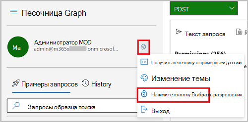

# <a name="configure-application-proxy-using-the-microsoft-graph-api"></a><span data-ttu-id="17c0f-103">Настройка прокси-сервера приложения с помощью API Microsoft Graph</span><span class="sxs-lookup"><span data-stu-id="17c0f-103">Configure Application Proxy using the Microsoft Graph API</span></span>

<span data-ttu-id="17c0f-104">В этой статье вы узнаете, как настроить прокси-сервер приложения Azure Active Directory (Azure AD).</span><span class="sxs-lookup"><span data-stu-id="17c0f-104">In this article, you'll learn how to configure Azure Active Directory (Azure AD) Application Proxy for an application.</span></span> <span data-ttu-id="17c0f-105">Прокси-сервер приложения обеспечивает безопасный удаленный доступ и один вход в локальное веб-приложение.</span><span class="sxs-lookup"><span data-stu-id="17c0f-105">Application Proxy provides secure remote access and single sign-on to on-premises web applications.</span></span> <span data-ttu-id="17c0f-106">После настройки прокси-сервера приложений для приложения пользователи могут получать доступ к своим внутренним приложениям с помощью внешнего URL-адреса, портала "Мои приложения" или других внутренних порталов приложений.</span><span class="sxs-lookup"><span data-stu-id="17c0f-106">After configuring Application Proxy for an application, users can access their on-premises applications through an external URL, the My Apps portal, or other internal application portals.</span></span>

## <a name="prerequisites"></a><span data-ttu-id="17c0f-107">Необходимые условия</span><span class="sxs-lookup"><span data-stu-id="17c0f-107">Prerequisites</span></span>

- <span data-ttu-id="17c0f-108">В этом руководстве предполагается, что вы [](/azure/active-directory/manage-apps/application-proxy-add-on-premises-application#before-you-begin) уже установили соединители и выполнили необходимые условия для прокси-сервера приложений, чтобы соединители могли взаимодействовать с службами Azure AD.</span><span class="sxs-lookup"><span data-stu-id="17c0f-108">This tutorial assumes you have already installed a connector and completed the [prerequisites](/azure/active-directory/manage-apps/application-proxy-add-on-premises-application#before-you-begin) for Application Proxy so that connectors can communicate with Azure AD services.</span></span>
- <span data-ttu-id="17c0f-109">В этом руководстве предполагается, что вы используете песочницу Microsoft Graph, но вы можете использовать Postman или создать собственное клиентское приложение, чтобы вызывать Microsoft Graph.</span><span class="sxs-lookup"><span data-stu-id="17c0f-109">This tutorial assumes that you are using Microsoft Graph Explorer, but you can use Postman, or create your own client app to call Microsoft Graph.</span></span> <span data-ttu-id="17c0f-110">Чтобы вызвать API Microsoft Graph в этом руководстве, используйте учетную запись с ролью глобального администратора и соответствующими разрешениями.</span><span class="sxs-lookup"><span data-stu-id="17c0f-110">To call the Microsoft Graph APIs in this tutorial, you need to use an account with the global administrator role and the appropriate permissions.</span></span> <span data-ttu-id="17c0f-111">Чтобы настроить разрешения в песочнице Microsoft Graph, выполните следующие действия.</span><span class="sxs-lookup"><span data-stu-id="17c0f-111">Complete the following steps to set permissions in Microsoft Graph Explorer:</span></span>
    1. <span data-ttu-id="17c0f-112">Запустите [песочницу Microsoft Graph](https://developer.microsoft.com/graph/graph-explorer).</span><span class="sxs-lookup"><span data-stu-id="17c0f-112">Start [Microsoft Graph Explorer](https://developer.microsoft.com/graph/graph-explorer).</span></span>
    2. <span data-ttu-id="17c0f-113">Выберите вариант **Вход с помощью учетной записи Майкрософт** и войдите, используя учетную запись глобального администратора Azure AD.</span><span class="sxs-lookup"><span data-stu-id="17c0f-113">Select **Sign-In with Microsoft** and sign in using an Azure AD global administrator account.</span></span> <span data-ttu-id="17c0f-114">После успешного входа вы увидите данные учетной записи пользователя на панели слева.</span><span class="sxs-lookup"><span data-stu-id="17c0f-114">After you successfully sign in, you can see the user account details in the left-hand pane.</span></span>
    3. <span data-ttu-id="17c0f-115">Щелкните значок параметров справа от сведений об учетной записи пользователя и нажмите **Выбор разрешений**.</span><span class="sxs-lookup"><span data-stu-id="17c0f-115">Select the settings icon to the right of the user account details, and then select **Select permissions**.</span></span>

        
        
    4. <span data-ttu-id="17c0f-117">Прокрутите список разрешений **в Каталог (3),** разйдите и выберите `Directory.ReadWrite.All` .</span><span class="sxs-lookup"><span data-stu-id="17c0f-117">Scroll through the list of permissions to **Directory (3)**, expand and then select `Directory.ReadWrite.All`.</span></span>

        
    
    5. <span data-ttu-id="17c0f-119">Нажмите **Согласие** и выберите **Принять**, чтобы согласиться принять разрешения.</span><span class="sxs-lookup"><span data-stu-id="17c0f-119">Select **Consent**, and then select **Accept** to accept the consent of the permissions.</span></span> <span data-ttu-id="17c0f-120">Вам не нужно предоставлять согласие от имени организации для этих разрешений.</span><span class="sxs-lookup"><span data-stu-id="17c0f-120">You do not need to consent on behalf of your organization for these permissions.</span></span>

        

> [!NOTE]
> <span data-ttu-id="17c0f-122">Показанные объекты отклика могут быть сокращены для читаемости.</span><span class="sxs-lookup"><span data-stu-id="17c0f-122">The response objects shown might be shortened for readability.</span></span> 

## <a name="step-1-create-a-custom-application"></a><span data-ttu-id="17c0f-123">Шаг 1. Создание настраиваемой программы</span><span class="sxs-lookup"><span data-stu-id="17c0f-123">Step 1: Create a custom application</span></span>

<span data-ttu-id="17c0f-124">Чтобы настроить прокси-сервер приложения для приложения с помощью API, сначала создайте настраиваемое приложение, а затем обновим свойство **приложения onPremisesPublishing** для настройки параметров прокси-сервера приложения.</span><span class="sxs-lookup"><span data-stu-id="17c0f-124">To configure Application Proxy for an app using the API, you first create a custom application, and then update the application's **onPremisesPublishing** property to configure the App Proxy settings.</span></span> <span data-ttu-id="17c0f-125">В этом руководстве используется шаблон приложения для создания экземпляра настраиваемого приложения и основного клиента для управления.</span><span class="sxs-lookup"><span data-stu-id="17c0f-125">In this tutorial, you use an application template to create an instance of a custom application and service principal in your tenant for management.</span></span> <span data-ttu-id="17c0f-126">ID шаблона для настраиваемой заявки `8adf8e6e-67b2-4cf2-a259-e3dc5476c621` .</span><span class="sxs-lookup"><span data-stu-id="17c0f-126">The template ID for a custom application is `8adf8e6e-67b2-4cf2-a259-e3dc5476c621`.</span></span>

<span data-ttu-id="17c0f-127">Запись **id,** **appId**, **servicePrincipalId** приложения для использования позже в учебнике.</span><span class="sxs-lookup"><span data-stu-id="17c0f-127">Record the **id**, **appId**, **servicePrincipalId** of the application to use later in the tutorial.</span></span>

#### <a name="request"></a><span data-ttu-id="17c0f-128">Запрос</span><span class="sxs-lookup"><span data-stu-id="17c0f-128">Request</span></span>

```http
POST https://graph.microsoft.com/v1.0/applicationTemplates/8adf8e6e-67b2-4cf2-a259-e3dc5476c621/instantiate
Content-type: application/json

{
  "displayName": "Contoso IWA App"
}
```

#### <a name="response"></a><span data-ttu-id="17c0f-129">Отклик</span><span class="sxs-lookup"><span data-stu-id="17c0f-129">Response</span></span>

```http
HTTP/1.1 201 Created
Content-type: application/json

{
  "@odata.context": "https://graph.microsoft.com/beta/$metadata#applications/$entity",
  "id": "bf21f7e9-9d25-4da2-82ab-7fdd85049f83",
  "deletedDateTime": null,
  "addIns": [],
  "appId": "d7fbfe28-c60e-46d2-8335-841923950d3b",
  "applicationTemplateId": null,
  "identifierUris": [],
  "createdDateTime": "2020-08-11T21:07:47.5919755Z",
  "description": null,
  "displayName": "Contoso IWA App",
  "isAuthorizationServiceEnabled": false,
  "isDeviceOnlyAuthSupported": null,
  "isFallbackPublicClient": null,
  "groupMembershipClaims": null,
  "notes": null,
  "optionalClaims": null,
  "orgRestrictions": [],
  "publisherDomain": "f128.info",
  "signInAudience": "AzureADandPersonalMicrosoftAccount",
  "tags": [],
  "tokenEncryptionKeyId": null,
  "uniqueName": null,
  "verifiedPublisher": {
      "displayName": null,
      "verifiedPublisherId": null,
      "addedDateTime": null
  },
}
```

## <a name="step-2-configure-application-proxy"></a><span data-ttu-id="17c0f-130">Шаг 2. Настройка прокси-сервера приложения</span><span class="sxs-lookup"><span data-stu-id="17c0f-130">Step 2: Configure Application Proxy</span></span>

<span data-ttu-id="17c0f-131">Чтобы запустить конфигурацию прокси-приложения, используйте **id,** записанный для приложения.</span><span class="sxs-lookup"><span data-stu-id="17c0f-131">Use the **id** that you recorded for the application to start the configuration of Application Proxy.</span></span> <span data-ttu-id="17c0f-132">Обновление следующих свойств:</span><span class="sxs-lookup"><span data-stu-id="17c0f-132">Update the following properties:</span></span>

- <span data-ttu-id="17c0f-133">**onPremisesPublishing** . В этом примере вы используете приложение с внутренним URL-адресом: `https://contosoiwaapp.com` .</span><span class="sxs-lookup"><span data-stu-id="17c0f-133">**onPremisesPublishing** - In this example, you're using an app with the internal URL: `https://contosoiwaapp.com`.</span></span> <span data-ttu-id="17c0f-134">Вы также используете домен по умолчанию для внешнего URL-адреса: `https://contosoiwaapp-contoso.msappproxy.net` .</span><span class="sxs-lookup"><span data-stu-id="17c0f-134">You also use the default domain for the external URL: `https://contosoiwaapp-contoso.msappproxy.net`.</span></span> 
- <span data-ttu-id="17c0f-135">**redirectUri,** **identifierUri** и **homepageUrl** — установите тот же внешний URL-адрес, настроенный в **свойстве onPremisesPublishing.**</span><span class="sxs-lookup"><span data-stu-id="17c0f-135">**redirectUri**, **identifierUri**, and **homepageUrl** - Set to the same external URL configured in the **onPremisesPublishing** property.</span></span>
- <span data-ttu-id="17c0f-136">**implicitGrantSettings** - Set to `true` for **enabledTokenIssuance** and `false` for **enabledAccessTokenIssuance.**</span><span class="sxs-lookup"><span data-stu-id="17c0f-136">**implicitGrantSettings** - Set to `true` for **enabledTokenIssuance** and `false` for **enabledAccessTokenIssuance**.</span></span>

#### <a name="request"></a><span data-ttu-id="17c0f-137">Запрос</span><span class="sxs-lookup"><span data-stu-id="17c0f-137">Request</span></span>

```http
PATCH https://graph.microsoft.com/beta/applications/bf21f7e9-9d25-4da2-82ab-7fdd85049f83
Content-type: application/json

{
  "onPremisesPublishing": {
    "externalAuthenticationType": "aadPreAuthentication",
    "internalUrl": "https://contosoiwaapp.com",
    "externalUrl": "https://contosoiwaapp-contoso.msappproxy.net"
  }
  "identifierUris": ["https://contosoiwaapp-contoso.msappproxy.net"],
  "web": {
    "redirectUris": ["https://contosoiwaapp-contoso.msappproxy.net"],
    "homePageUrl": "https://contosoiwaapp-contoso.msappproxy.net",
    "implicitGrantSettings": {
      "enableIdTokenIssuance": true,
      "enableAccessTokenIssuance": false
    }
  }
}
```

#### <a name="response"></a><span data-ttu-id="17c0f-138">Отклик</span><span class="sxs-lookup"><span data-stu-id="17c0f-138">Response</span></span>

```http
HTTP/1.1 204 No content
```

## <a name="step-3-assign-a-connector-group-to-the-application"></a><span data-ttu-id="17c0f-139">Шаг 3. Назначение группы соединители для приложения</span><span class="sxs-lookup"><span data-stu-id="17c0f-139">Step 3: Assign a connector group to the application</span></span>

### <a name="get-connectors"></a><span data-ttu-id="17c0f-140">Получить соединители</span><span class="sxs-lookup"><span data-stu-id="17c0f-140">Get connectors</span></span>

<span data-ttu-id="17c0f-141">Список доступных соединитений.</span><span class="sxs-lookup"><span data-stu-id="17c0f-141">List the connectors that are available.</span></span> <span data-ttu-id="17c0f-142">**Записываю id** соединитетеля, который необходимо назначить группе соединители.</span><span class="sxs-lookup"><span data-stu-id="17c0f-142">Record the **id** of the connector that you want to assign to a connector group.</span></span>

#### <a name="request"></a><span data-ttu-id="17c0f-143">Запрос</span><span class="sxs-lookup"><span data-stu-id="17c0f-143">Request</span></span>

```http
GET https://graph.microsoft.com/beta/onPremisesPublishingProfiles/applicationProxy/connectors
```

#### <a name="response"></a><span data-ttu-id="17c0f-144">Отклик</span><span class="sxs-lookup"><span data-stu-id="17c0f-144">Response</span></span>

```http
HTTP/1.1 200 OK
Content-type: application/json

{
  "@odata.context": "https://graph.microsoft.com/beta/$metadata#connectors",
  "value": [
    {
      "id": "d2b1e8e8-8511-49d6-a4ba-323cb083fbb0",
      "machineName": "connectorA.redmond.contoso.com"",
      "externalIp": "131.137.147.164",
      "status": "active"
    },
    {
      "id": "f2cab422-a1c8-4d70-a47e-2cb297a2e051",
      "machineName": "connectorB.contoso.com"",
      "externalIp": "68.0.191.210",
      "status": "active"
    }
  ]
}
```

### <a name="create-a-connectorgroup"></a><span data-ttu-id="17c0f-145">Создание соединителиГруп</span><span class="sxs-lookup"><span data-stu-id="17c0f-145">Create a connectorGroup</span></span>

<span data-ttu-id="17c0f-146">В этом примере создается новый соединитекторGroup, `IWA Demo Connector Group` который используется для приложения.</span><span class="sxs-lookup"><span data-stu-id="17c0f-146">For this example, a new connectorGroup is created named `IWA Demo Connector Group` that is used for the application.</span></span> <span data-ttu-id="17c0f-147">Запись **возвращенного для** использования id на следующем шаге.</span><span class="sxs-lookup"><span data-stu-id="17c0f-147">Record the **id** that is returned to use in the next step.</span></span>

#### <a name="request"></a><span data-ttu-id="17c0f-148">Запрос</span><span class="sxs-lookup"><span data-stu-id="17c0f-148">Request</span></span>

```http
POST https://graph.microsoft.com/beta/onPremisesPublishingProfiles/applicationProxy/connectorGroups

Content-type: application/json
{
  "name": "IWA Demo Connector Group"
}
```

#### <a name="response"></a><span data-ttu-id="17c0f-149">Отклик</span><span class="sxs-lookup"><span data-stu-id="17c0f-149">Response</span></span>

```http
HTTP/1.1 201
Content-type: connectorGroup/json

{
  "@odata.context": "https://graph.microsoft.com/beta/$metadata#connectorGroups/$entity",
  "id": "3e6f4c35-a04b-4d03-b98a-66fff89b72e6",
  "name": "IWA Demo Connector Group",
  "connectorGroupType": "applicationProxy",
  "isDefault": false
}
```

### <a name="assign-a-connector-to-the-connectorgroup"></a><span data-ttu-id="17c0f-150">Назначение соединитетеля соединитетелем connectorGroup</span><span class="sxs-lookup"><span data-stu-id="17c0f-150">Assign a connector to the connectorGroup</span></span>

#### <a name="request"></a><span data-ttu-id="17c0f-151">Запрос</span><span class="sxs-lookup"><span data-stu-id="17c0f-151">Request</span></span>

```http
POST https://graph.microsoft.com/beta/onPremisesPublishingProfiles/applicationProxy/connectors/f2cab422-a1c8-4d70-a47e-2cb297a2e051/memberOf/$ref
Content-type: application/json

{
  "@odata.id":"https://graph.microsoft.com/beta/onPremisesPublishingProfiles/applicationProxy/connectorGroups/3e6f4c35-a04b-4d03-b98a-66fff89b72e6"
}
```

#### <a name="response"></a><span data-ttu-id="17c0f-152">Отклик</span><span class="sxs-lookup"><span data-stu-id="17c0f-152">Response</span></span>

```http
HTTP/1.1 204 No content
```

### <a name="assign-the-application-to-the-connectorgroup"></a><span data-ttu-id="17c0f-153">Назначение приложения в connectorGroup</span><span class="sxs-lookup"><span data-stu-id="17c0f-153">Assign the application to the connectorGroup</span></span>

#### <a name="request"></a><span data-ttu-id="17c0f-154">Запрос</span><span class="sxs-lookup"><span data-stu-id="17c0f-154">Request</span></span>

```http
PUT https://graph.microsoft.com/beta/applications/bf21f7e9-9d25-4da2-82ab-7fdd85049f83/connectorGroup/$ref
Content-type: application/json

{
"@odata.id":"https://graph.microsoft.com/onPremisesPublishingProfiles/applicationproxy/connectorGroups/3e6f4c35-a04b-4d03-b98a-66fff89b72e6"
}
```

#### <a name="response"></a><span data-ttu-id="17c0f-155">Отклик</span><span class="sxs-lookup"><span data-stu-id="17c0f-155">Response</span></span>

```http
HTTP/1.1 204 No content
```

## <a name="step-4-configure-single-sign-on"></a><span data-ttu-id="17c0f-156">Шаг 4. Настройка единого входного</span><span class="sxs-lookup"><span data-stu-id="17c0f-156">Step 4: Configure single sign-on</span></span>

<span data-ttu-id="17c0f-157">В этом приложении используется интегрированная проверка подлинности Windows (IWA).</span><span class="sxs-lookup"><span data-stu-id="17c0f-157">This application uses Integrated Windows Authentication (IWA).</span></span> <span data-ttu-id="17c0f-158">Чтобы настроить IWA, установите свойства единого входного знака **для onPremisesPublishing**.</span><span class="sxs-lookup"><span data-stu-id="17c0f-158">To configure IWA, set the single sign-on properties for **onPremisesPublishing**.</span></span>

#### <a name="request"></a><span data-ttu-id="17c0f-159">Запрос</span><span class="sxs-lookup"><span data-stu-id="17c0f-159">Request</span></span>

```http
PATCH https://graph.microsoft.com/beta/applications/bf21f7e9-9d25-4da2-82ab-7fdd85049f83
Content-type: appplication/json

{
  "onPremisesPublishing": {
    "singleSignOnSettings": {
      "kerberosSignOnSettings": {
        "kerberosServicePrincipalName": "HTTP/iwademo.contoso.com",
        "kerberosSignOnMappingAttributeType": "userPrincipalName"
      },
      "singleSignOnMode": "onPremisesKerberos"
    }
  } 
}
```

#### <a name="response"></a><span data-ttu-id="17c0f-160">Отклик</span><span class="sxs-lookup"><span data-stu-id="17c0f-160">Response</span></span>

```http
HTTP/1.1 204 No content
```

## <a name="step-5-assign-a-user"></a><span data-ttu-id="17c0f-161">Шаг 5. Назначение пользователя</span><span class="sxs-lookup"><span data-stu-id="17c0f-161">Step 5: Assign a user</span></span>

### <a name="retrieve-the-approle-for-the-application"></a><span data-ttu-id="17c0f-162">Получение appRole для приложения</span><span class="sxs-lookup"><span data-stu-id="17c0f-162">Retrieve the appRole for the application</span></span>

<span data-ttu-id="17c0f-163">Получение ролей приложения для приложения с помощью **id** директора службы.</span><span class="sxs-lookup"><span data-stu-id="17c0f-163">Get the app roles for the application using the **id** of the service principal.</span></span> <span data-ttu-id="17c0f-164">Запись **id** роли **приложения пользователя,** которая будет использоваться на следующем шаге.</span><span class="sxs-lookup"><span data-stu-id="17c0f-164">Record the **id** of the **User** app role to be used in the next step.</span></span>

#### <a name="request"></a><span data-ttu-id="17c0f-165">Запрос</span><span class="sxs-lookup"><span data-stu-id="17c0f-165">Request</span></span>

```http
GET https://graph.microsoft.com/beta/servicePrincipals/a8cac399-cde5-4516-a674-819503c61313/appRoles
```

#### <a name="response"></a><span data-ttu-id="17c0f-166">Отклик</span><span class="sxs-lookup"><span data-stu-id="17c0f-166">Response</span></span>

```http
HTTP/1.1 200
Content-type: application/json

{
  "@odata.context": "https://graph.microsoft.com/beta/$metadata#servicePrincipals('a8cac399-cde5-4516-a674-819503c61313')/appRoles",
  "value": [
    {
      "allowedMemberTypes": [
        "User"
      ],
      "description": "User",
      "displayName": "User",
      "id": "18d14569-c3bd-439b-9a66-3a2aee01d14f",
      "isEnabled": true,
      "origin": "Application",
      "value": null
    },
  ]
}
```

### <a name="create-a-user-account"></a><span data-ttu-id="17c0f-167">Создание учетной записи пользователя</span><span class="sxs-lookup"><span data-stu-id="17c0f-167">Create a user account</span></span>

<span data-ttu-id="17c0f-168">В этом руководстве создается учетная запись пользователя, назначенная роли приложения.</span><span class="sxs-lookup"><span data-stu-id="17c0f-168">For this tutorial, you create a user account that is assigned to the app role.</span></span> <span data-ttu-id="17c0f-169">В теле запроса `contoso.com` измените доменное имя клиента.</span><span class="sxs-lookup"><span data-stu-id="17c0f-169">In the request body, change `contoso.com` to the domain name of your tenant.</span></span> <span data-ttu-id="17c0f-170">Информацию о клиенте можно найти на странице обзора в Azure Active Directory.</span><span class="sxs-lookup"><span data-stu-id="17c0f-170">You can find tenant information on the Azure Active Directory overview page.</span></span> <span data-ttu-id="17c0f-171">Запись **id** учетной записи пользователя, которая будет использоваться на следующем шаге.</span><span class="sxs-lookup"><span data-stu-id="17c0f-171">Record the **id** of the user account to be used in the next step.</span></span>

#### <a name="request"></a><span data-ttu-id="17c0f-172">Запрос</span><span class="sxs-lookup"><span data-stu-id="17c0f-172">Request</span></span>

```http
POST https://graph.microsoft.com/v1.0/users
Content-type: application/json

{
  "accountEnabled":true,
  "displayName":"MyTestUser1",
  "mailNickname":"MyTestUser1",
  "userPrincipalName":"MyTestUser1@contoso.com",
  "passwordProfile": {
    "forceChangePasswordNextSignIn":true,
    "password":"Contoso1234"
  }
}
```

#### <a name="response"></a><span data-ttu-id="17c0f-173">Отклик</span><span class="sxs-lookup"><span data-stu-id="17c0f-173">Response</span></span>

```http
{
  "@odata.context": "https://graph.microsoft.com/v1.0/$metadata#users/$entity",
  "id": "4628e7df-dff3-407c-a08f-75f08c0806dc",
  "businessPhones": [],
  "displayName": "MyTestUser1",
  "givenName": null,
  "jobTitle": null,
  "mail": null,
  "mobilePhone": null,
  "officeLocation": null,
  "preferredLanguage": null,
  "surname": null,
  "userPrincipalName": "MyTestUser1@contoso.com"
}
```

### <a name="assign-the-user-to-the-application"></a><span data-ttu-id="17c0f-174">Назначение пользователя приложению</span><span class="sxs-lookup"><span data-stu-id="17c0f-174">Assign the user to the application</span></span>

<span data-ttu-id="17c0f-175">В следующем примере замените значения этих свойств:</span><span class="sxs-lookup"><span data-stu-id="17c0f-175">In the following example, replace the values of these properties:</span></span>

- <span data-ttu-id="17c0f-176">**principalId** с **id** пользователя</span><span class="sxs-lookup"><span data-stu-id="17c0f-176">**principalId** with the **id** of the user</span></span>
- <span data-ttu-id="17c0f-177">**appRoleId** с **id** роли приложения</span><span class="sxs-lookup"><span data-stu-id="17c0f-177">**appRoleId** with the **id** of the app role</span></span>
- <span data-ttu-id="17c0f-178">**resourceId** с **id** директора службы</span><span class="sxs-lookup"><span data-stu-id="17c0f-178">**resourceId** with the **id** of the service principal</span></span>

#### <a name="request"></a><span data-ttu-id="17c0f-179">Запрос</span><span class="sxs-lookup"><span data-stu-id="17c0f-179">Request</span></span>

```http
POST https://graph.microsoft.com/beta/servicePrincipals/b00c693f-9658-4c06-bd1b-c402c4653dea/appRoleAssignments
Content-type: appRoleAssignments/json

{
  "principalId": "4628e7df-dff3-407c-a08f-75f08c0806dc",
  "principalType": "User",
  "appRoleId":"18d14569-c3bd-439b-9a66-3a2aee01d14f",
  "resourceId":"a8cac399-cde5-4516-a674-819503c61313"
}
```

#### <a name="response"></a><span data-ttu-id="17c0f-180">Отклик</span><span class="sxs-lookup"><span data-stu-id="17c0f-180">Response</span></span>

```http
HTTP/1.1 200
Content-type: application/json

{
  "@odata.context": "https://graph.microsoft.com/beta/$metadata#appRoleAssignments/$entity",
  "id": "I23pL8ZdNU-CIgQmqMEVyLJ0E6fx0ixEo92az8MnhtU",
  "creationTimestamp": "2020-06-09T00:06:07.5129268Z",
  "appRoleId": "18d14569-c3bd-439b-9a66-3a2aee01d14f",
  "principalDisplayName": "MyTestUser1",
  "principalId": "2fe96d23-5dc6-4f35-8222-0426a8c115c8",
  "principalType": "User",
  "resourceDisplayName": "Contoso IWA App",
  "resourceId": "a8cac399-cde5-4516-a674-819503c61313"
}
```
## <a name="step-6-test-access-to-the-application"></a><span data-ttu-id="17c0f-181">Шаг 6. Тестовый доступ к приложению</span><span class="sxs-lookup"><span data-stu-id="17c0f-181">Step 6: Test access to the application</span></span>

<span data-ttu-id="17c0f-182">Проверьте приложение, посетив внешний **URL-адрес,** настроенный для приложения в браузере, а затем во входе с тестируемым пользователем.</span><span class="sxs-lookup"><span data-stu-id="17c0f-182">Test the application by visiting the **External URL** configured for the app on your browser and then sign in with your test user.</span></span> <span data-ttu-id="17c0f-183">Вы должны иметь возможность войти в приложение и получить доступ к приложению.</span><span class="sxs-lookup"><span data-stu-id="17c0f-183">You should be able to log into the app and access the application.</span></span>

## <a name="step-7-clean-up-resources"></a><span data-ttu-id="17c0f-184">Шаг 7. Очистка ресурсов</span><span class="sxs-lookup"><span data-stu-id="17c0f-184">Step 7: Clean up resources</span></span>

<span data-ttu-id="17c0f-185">Созданные в этом руководстве ресурсы не предназначены для использования в производственной среде.</span><span class="sxs-lookup"><span data-stu-id="17c0f-185">The resources that you created in this tutorial are not intended to be used in a production environment.</span></span> <span data-ttu-id="17c0f-186">На этом шаге вы удаляете созданные ресурсы.</span><span class="sxs-lookup"><span data-stu-id="17c0f-186">In this step, you remove the resources that you created.</span></span>

### <a name="delete-the-user-account"></a><span data-ttu-id="17c0f-187">Удаление учетной записи пользователя</span><span class="sxs-lookup"><span data-stu-id="17c0f-187">Delete the user account</span></span>

<span data-ttu-id="17c0f-188">Удалите учетную запись пользователя MyTestUser1.</span><span class="sxs-lookup"><span data-stu-id="17c0f-188">Delete the MyTestUser1 user account.</span></span>

#### <a name="request"></a><span data-ttu-id="17c0f-189">Запрос</span><span class="sxs-lookup"><span data-stu-id="17c0f-189">Request</span></span>

```http
DELETE https://graph.microsoft.com/v1.0/users/4628e7df-dff3-407c-a08f-75f08c0806dc
```

#### <a name="response"></a><span data-ttu-id="17c0f-190">Отклик</span><span class="sxs-lookup"><span data-stu-id="17c0f-190">Response</span></span>

```http
No Content - 204
```

### <a name="delete-the-application"></a><span data-ttu-id="17c0f-191">Удаление приложения</span><span class="sxs-lookup"><span data-stu-id="17c0f-191">Delete the application</span></span>

#### <a name="request"></a><span data-ttu-id="17c0f-192">Запрос</span><span class="sxs-lookup"><span data-stu-id="17c0f-192">Request</span></span>

```http
DELETE https://graph.microsoft.com/v1.0/applications/bf21f7e9-9d25-4da2-82ab-7fdd85049f83
```

#### <a name="response"></a><span data-ttu-id="17c0f-193">Отклик</span><span class="sxs-lookup"><span data-stu-id="17c0f-193">Response</span></span>

```http
No Content - 204
```

### <a name="delete-the-connector-group"></a><span data-ttu-id="17c0f-194">Удаление группы соединители</span><span class="sxs-lookup"><span data-stu-id="17c0f-194">Delete the connector group</span></span>

#### <a name="request"></a><span data-ttu-id="17c0f-195">Запрос</span><span class="sxs-lookup"><span data-stu-id="17c0f-195">Request</span></span>

```http
DELETE https://graph.microsoft.com/beta/onPremisesPublishingProfiles/applicationProxy/connectorGroups/3e6f4c35-a04b-4d03-b98a-66fff89b72e6
```

#### <a name="response"></a><span data-ttu-id="17c0f-196">Отклик</span><span class="sxs-lookup"><span data-stu-id="17c0f-196">Response</span></span>

```http
No Content - 204
```

## <a name="see-also"></a><span data-ttu-id="17c0f-197">См. также</span><span class="sxs-lookup"><span data-stu-id="17c0f-197">See also</span></span>

- [<span data-ttu-id="17c0f-198">Прокси-сервер приложения</span><span class="sxs-lookup"><span data-stu-id="17c0f-198">Application Proxy</span></span>](/azure/active-directory/manage-apps/what-is-application-proxy)
- [<span data-ttu-id="17c0f-199">application</span><span class="sxs-lookup"><span data-stu-id="17c0f-199">application</span></span>](/graph/api/resources/application?view=graph-rest-1.0)
- [<span data-ttu-id="17c0f-200">applicationTemplate: instantiate</span><span class="sxs-lookup"><span data-stu-id="17c0f-200">applicationTemplate: instantiate</span></span>](/graph/api/applicationtemplate-instantiate?view=graph-rest-1.0)
- [<span data-ttu-id="17c0f-201">appRoleAssignment</span><span class="sxs-lookup"><span data-stu-id="17c0f-201">appRoleAssignment</span></span>](/graph/api/resources/approleassignment?view=graph-rest-beta)
- [<span data-ttu-id="17c0f-202">connector</span><span class="sxs-lookup"><span data-stu-id="17c0f-202">connector</span></span>](/graph/api/resources/connector?view=graph-rest-beta)
- [<span data-ttu-id="17c0f-203">connectorGroup</span><span class="sxs-lookup"><span data-stu-id="17c0f-203">connectorGroup</span></span>](/graph/api/resources/connectorGroup?view=graph-rest-beta)
- [<span data-ttu-id="17c0f-204">implicitGrantSettings</span><span class="sxs-lookup"><span data-stu-id="17c0f-204">implicitGrantSettings</span></span>](/graph/api/resources/implicitgrantsettings?view=graph-rest-1.0)
- [<span data-ttu-id="17c0f-205">локальной публикации профилей</span><span class="sxs-lookup"><span data-stu-id="17c0f-205">on-premises publishing profiles</span></span>](/graph/api/resources/onpremisespublishingprofile-root?view=graph-rest-beta)
- [<span data-ttu-id="17c0f-206">servicePrincipal</span><span class="sxs-lookup"><span data-stu-id="17c0f-206">servicePrincipal</span></span>](/graph/api/resources/serviceprincipal?view=graph-rest-1.0)
- [<span data-ttu-id="17c0f-207">singleSignOnSettings</span><span class="sxs-lookup"><span data-stu-id="17c0f-207">singleSignOnSettings</span></span>](/graph/api/resources/onpremisespublishingsinglesignon?view=graph-rest-beta)
- [<span data-ttu-id="17c0f-208">user</span><span class="sxs-lookup"><span data-stu-id="17c0f-208">user</span></span>](/graph/api/resources/user?view=graph-rest-1.0)
