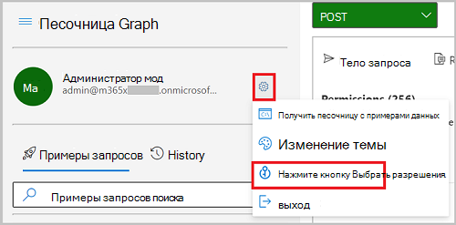

# <a name="configure-saml-based-single-sign-on-for-your-application-using-the-microsoft-graph-api"></a><span data-ttu-id="c816b-103">Настройка единого входа на основе SAML для приложения с помощью API Microsoft Graph</span><span class="sxs-lookup"><span data-stu-id="c816b-103">Configure SAML-based single sign-on for your application using the Microsoft Graph API</span></span>

<span data-ttu-id="c816b-104">В этой статье вы узнаете, как создать и настроить единый вход на основе SAML для приложения в Azure Active Directory (Azure AD) с помощью API Microsoft Graph.</span><span class="sxs-lookup"><span data-stu-id="c816b-104">In this article, you'll learn how to create and configure a SAML-based single sign-on (SSO) for your application in Azure Active Directory (Azure AD) using the Microsoft Graph API.</span></span> <span data-ttu-id="c816b-105">Конфигурация приложения включает основные URL-адреса SAML, политику сопоставления утверждений и использование сертификата для добавления пользовательского ключа подписи.</span><span class="sxs-lookup"><span data-stu-id="c816b-105">The application configuration includes basic SAML URLs, a claims mapping policy, and using a certificate to add a custom signing key.</span></span> <span data-ttu-id="c816b-106">После создания приложения назначьте для него пользователя, который будет администратором.</span><span class="sxs-lookup"><span data-stu-id="c816b-106">After the application is created, you assign a user to it to be an administrator.</span></span> <span data-ttu-id="c816b-107">После этого вы сможете использовать URL-адрес, чтобы получить метаданные SAML AD Azure для дополнительной настройки приложения.</span><span class="sxs-lookup"><span data-stu-id="c816b-107">You then can use a URL to obtain Azure AD SAML metadata for additional configuration of the application.</span></span> 

<span data-ttu-id="c816b-108">В этой статье в качестве примера используется шаблон приложения Azure AD AWS, но описанные здесь шаги можно применить для любого другого приложения на основе SAML, включенного в коллекцию Azure AD.</span><span class="sxs-lookup"><span data-stu-id="c816b-108">This article uses an AWS Azure AD application template as an example, but you can use the steps in this article for any SAML-based app in the Azure AD Gallery.</span></span>

## <a name="prerequisites"></a><span data-ttu-id="c816b-109">Предварительные требования</span><span class="sxs-lookup"><span data-stu-id="c816b-109">Prerequisites</span></span>

<span data-ttu-id="c816b-110">В этом руководстве предполагается, что вы используете песочницу Microsoft Graph, но вы можете использовать Postman или создать собственное клиентское приложение, чтобы вызывать Microsoft Graph.</span><span class="sxs-lookup"><span data-stu-id="c816b-110">This tutorial assumes that you are using Microsoft Graph Explorer, but you can use Postman, or create your own client app to call Microsoft Graph.</span></span> <span data-ttu-id="c816b-111">Чтобы вызвать API Microsoft Graph в этом руководстве, используйте учетную запись с ролью глобального администратора и соответствующими разрешениями.</span><span class="sxs-lookup"><span data-stu-id="c816b-111">To call the Microsoft Graph APIs in this tutorial, you need to use an account with the global administrator role and the appropriate permissions.</span></span> <span data-ttu-id="c816b-112">Для этого руководства требуются делегированные разрешения `Application.ReadWrite.All`, `AppRoleAssignment.ReadWrite.All`, `Policy.Read.All`, `Policy.ReadWrite.ApplicationConfiguration`, и `User.ReadWrite.All`.</span><span class="sxs-lookup"><span data-stu-id="c816b-112">For this tutorial, the `Application.ReadWrite.All`, `AppRoleAssignment.ReadWrite.All`, `Policy.Read.All`, `Policy.ReadWrite.ApplicationConfiguration`, and `User.ReadWrite.All` delegated permissions are needed.</span></span> <span data-ttu-id="c816b-113">Чтобы настроить разрешения в песочнице Microsoft Graph, выполните следующие действия.</span><span class="sxs-lookup"><span data-stu-id="c816b-113">Complete the following steps to set permissions in Microsoft Graph Explorer:</span></span>

1. <span data-ttu-id="c816b-114">Перейдите в [песочницу Microsoft Graph](https://developer.microsoft.com/graph/graph-explorer).</span><span class="sxs-lookup"><span data-stu-id="c816b-114">Go to [Microsoft Graph Explorer](https://developer.microsoft.com/graph/graph-explorer).</span></span>
2. <span data-ttu-id="c816b-115">Выберите вариант **Вход с помощью учетной записи Майкрософт** и войдите, используя учетную запись глобального администратора Azure AD.</span><span class="sxs-lookup"><span data-stu-id="c816b-115">Select **Sign-In with Microsoft** and sign in using an Azure AD global administrator account.</span></span> <span data-ttu-id="c816b-116">После успешного входа вы увидите данные учетной записи пользователя на панели слева.</span><span class="sxs-lookup"><span data-stu-id="c816b-116">After you successfully sign in, you can see the user account details in the left-hand pane.</span></span>
3. <span data-ttu-id="c816b-117">Щелкните значок параметров справа от сведений об учетной записи пользователя и нажмите **Выбор разрешений**.</span><span class="sxs-lookup"><span data-stu-id="c816b-117">Select the settings icon to the right of the user account details, and then select **Select permissions**.</span></span>

    
        
4. <span data-ttu-id="c816b-119">В списоке разрешений проокрутите и разверните **AppRoleAssignment (1)** и выберите разрешение **AppRoleAssignment.ReadWrite.All**.</span><span class="sxs-lookup"><span data-stu-id="c816b-119">In the list of permissions, scroll to and expand **AppRoleAssignment (1)**, and then select the **AppRoleAssignment.ReadWrite.All** permission.</span></span> <span data-ttu-id="c816b-120">Прокрутите список разрешений дальше и разверните **Application (2)**, и выберите разрешение **Application.ReadWrite.All**.</span><span class="sxs-lookup"><span data-stu-id="c816b-120">Scroll further down and expand **Application (2)**, and then select the **Application.ReadWrite.All** permission.</span></span> <span data-ttu-id="c816b-121">Перейдите к и разверните **Policy (13)** и затем выберите разрешения **Policy.Read.All** и **Policy.ReadWrite.ApplicationConfiguration**.</span><span class="sxs-lookup"><span data-stu-id="c816b-121">Continue to and expand **Policy (13)**, and then select the **Policy.Read.All**  and **Policy.ReadWrite.ApplicationConfiguration** permissions.</span></span> <span data-ttu-id="c816b-122">Наконец, выделите и разверните пункт **Users (8)**, а затем выберите **User.ReadWrite.All**.</span><span class="sxs-lookup"><span data-stu-id="c816b-122">Finally, scroll to and expand **Users (8)**, and then select **User.ReadWrite.All**.</span></span>

    

5. <span data-ttu-id="c816b-124">Нажмите **Согласие** и выберите **Принять**, чтобы согласиться принять разрешения.</span><span class="sxs-lookup"><span data-stu-id="c816b-124">Select **Consent**, and then select **Accept** to accept the consent of the permissions.</span></span> <span data-ttu-id="c816b-125">Вам не нужно предоставлять согласие от имени организации для этих разрешений.</span><span class="sxs-lookup"><span data-stu-id="c816b-125">You do not need to consent on behalf of your organization for these permissions.</span></span>

    

## <a name="step-1-create-the-application"></a><span data-ttu-id="c816b-127">Шаг 1. Создание приложения</span><span class="sxs-lookup"><span data-stu-id="c816b-127">Step 1: Create the application</span></span>

<span data-ttu-id="c816b-128">В Azure AD есть коллекция, содержащая тысячи предварительно интегрированных приложений, которые можно использовать в качестве шаблонов для приложения.</span><span class="sxs-lookup"><span data-stu-id="c816b-128">Azure AD has a gallery that contains thousands of pre-integrated applications that you can use as a template for your application.</span></span> <span data-ttu-id="c816b-129">В шаблоне приложения описаны метаданные для этого приложения.</span><span class="sxs-lookup"><span data-stu-id="c816b-129">The application template describes the metadata for that application.</span></span> <span data-ttu-id="c816b-130">По этому шаблону вы можете создать экземпляр приложения и субъект-службу в клиенте для управления им.</span><span class="sxs-lookup"><span data-stu-id="c816b-130">Using this template, you can create an instance of the application and service principal in your tenant for management.</span></span> 

<span data-ttu-id="c816b-131">Чтобы создать приложение из коллекции, сначала получите идентификатор шаблона приложения и используйте его для создания приложения.</span><span class="sxs-lookup"><span data-stu-id="c816b-131">To create the application from the gallery, you first get the identifier of the application template and then use that identifier to create the application.</span></span>

### <a name="retrieve-the-gallery-application-template-identifier"></a><span data-ttu-id="c816b-132">Получение идентификатора шаблона для приложения из коллекции</span><span class="sxs-lookup"><span data-stu-id="c816b-132">Retrieve the gallery application template identifier</span></span>

 <span data-ttu-id="c816b-133">В этом руководстве вы получаете идентификатор шаблона приложения для `AWS Single Sign-on`.</span><span class="sxs-lookup"><span data-stu-id="c816b-133">In this tutorial, you retrieve the identifier of the application template for `AWS Single Sign-on`.</span></span> <span data-ttu-id="c816b-134">Запишите значение свойства **id**, которое понадобится позже в этом руководстве.</span><span class="sxs-lookup"><span data-stu-id="c816b-134">Record the value of the **id** property to use later in this tutorial.</span></span>

#### <a name="request"></a><span data-ttu-id="c816b-135">Запрос</span><span class="sxs-lookup"><span data-stu-id="c816b-135">Request</span></span>

```http
GET https://graph.microsoft.com/v1.0/applicationTemplates?$filter=displayName eq 'AWS Single Sign-on'
```

#### <a name="response"></a><span data-ttu-id="c816b-136">Ответ</span><span class="sxs-lookup"><span data-stu-id="c816b-136">Response</span></span>

```http
HTTP/1.1 200 OK
Content-type: application/json

{
  "@odata.context": "https://graph.microsoft.com/v1.0/$metadata#applicationTemplates",
  "value": [
    {
      "id": "21ed01d2-ec13-4e9e-86c1-cd546719ebc4",
      "displayName": "AWS Single Sign-on",
      "homePageUrl": "https://aws.amazon.com/",
      "supportedSingleSignOnModes": [
        "saml",
        "external"
      ],
      "supportedProvisioningTypes": [
        "sync"
      ],
      "logoUrl": "https://az495088.vo.msecnd.net/app-logo/awssinglesignon_215.png",
      "categories": [
        "developerServices",
        "itInfrastructure",
        "security",
        "New"
      ],
      "publisher": "Amazon Web Services, Inc.",
      "description": "Federate once to AWS SSO & use it to manage access centrally to multiple AWS accounts. Provision users via SCIM & get Azure AD single sign-in access to the AWS Console, CLI, & AWS SSO integrated apps."
    }
  ]
}
```

### <a name="create-the-application"></a><span data-ttu-id="c816b-137">Создание приложения</span><span class="sxs-lookup"><span data-stu-id="c816b-137">Create the application</span></span>

<span data-ttu-id="c816b-138">Используя значение **id**, записанное для шаблона приложения, создайте экземпляр приложения и субъект-службу в клиенте.</span><span class="sxs-lookup"><span data-stu-id="c816b-138">Using the **id** value that you recorded for the application template, create an instance of the application and service principal in your tenant.</span></span> <span data-ttu-id="c816b-139">Запишите значение свойства **id** приложения и значение свойства **id** для субъект-службы, чтобы применить их позже в этом руководстве.</span><span class="sxs-lookup"><span data-stu-id="c816b-139">Record the value of the **id** property of the application and the value of the **id** property for the service principal to use later in this tutorial.</span></span>

#### <a name="request"></a><span data-ttu-id="c816b-140">Запрос</span><span class="sxs-lookup"><span data-stu-id="c816b-140">Request</span></span>

```http
POST https://graph.microsoft.com/v1.0/applicationTemplates/21ed01d2-ec13-4e9e-86c1-cd546719ebc4/instantiate
Content-type: application/json

{
  "displayName": "AWS Contoso"
}
```

> [!NOTE]
> <span data-ttu-id="c816b-141">Подождите некоторое время, пока приложение будет подготовлено в клиенте Azure AD.</span><span class="sxs-lookup"><span data-stu-id="c816b-141">Allow some time for the app to be provisioned into your Azure AD tenant.</span></span> <span data-ttu-id="c816b-142">Это не происходит сразу.</span><span class="sxs-lookup"><span data-stu-id="c816b-142">It is not instant.</span></span> <span data-ttu-id="c816b-143">Одной из стратегий является выполнение запроса GET для объекта приложения или субъекта-службы каждые 5–10 секунд до тех пор, пока запрос не будет успешным.</span><span class="sxs-lookup"><span data-stu-id="c816b-143">One strategy is to do a GET query on the application or service principal object every 5-10 seconds until the query is successful.</span></span>

#### <a name="response"></a><span data-ttu-id="c816b-144">Отклик</span><span class="sxs-lookup"><span data-stu-id="c816b-144">Response</span></span>

```http
HTTP/1.1 201 OK
Content-type: application/json

{
  "@odata.context": "https://graph.microsoft.com/v1.0/$metadata#microsoft.graph.applicationServicePrincipal",
  "application": {
    "id": "a9be408a-6c31-4141-8cea-52fcd4a61be8",
    "appId": "17cad0e7-cd2b-4e51-a75d-ba810f3e4045",
    "applicationTemplateId": "21ed01d2-ec13-4e9e-86c1-cd546719ebc4",
    "createdDateTime": "2021-05-10T20:12:03Z",
    "deletedDateTime": null,
    "displayName": "AWS Contoso",
    "groupMembershipClaims": null,
    "identifierUris": [],
    "isFallbackPublicClient": false,
    "signInAudience": "AzureADMyOrg",
    "tags": [],
    "tokenEncryptionKeyId": null,
    "defaultRedirectUri": null,
    "optionalClaims": null,
    "verifiedPublisher": {
      "displayName": null,
      "verifiedPublisherId": null,
      "addedDateTime": null
    },
    "addIns": [],
    "api": {
      "acceptMappedClaims": null,
      "knownClientApplications": [],
      "requestedAccessTokenVersion": null,
      "oauth2PermissionScopes": [
        {
          "adminConsentDescription": "Allow the application to access AWS Contoso on behalf of the signed-in user.",
          "adminConsentDisplayName": "Access AWS Contoso",
          "id": "6f891cd3-c132-4822-930b-f343b4515d19",
          "isEnabled": true,
          "type": "User",
          "userConsentDescription": "Allow the application to access AWS Contoso on your behalf.",
          "userConsentDisplayName": "Access AWS Contoso",
          "value": "user_impersonation"
        }
      ],
      "preAuthorizedApplications": []
    },
    "appRoles": [
      {
        "allowedMemberTypes": [
          "User"
        ],
        "displayName": "User",
        "id": "8774f594-1d59-4279-b9d9-59ef09a23530",
        "isEnabled": true,
        "description": "User",
        "value": null,
        "origin": "Application"
      },
      {
        "allowedMemberTypes": [
          "User"
        ],
        "displayName": "msiam_access",
        "id": "e7f1a7f3-9eda-48e0-9963-bd67bf531afd",
        "isEnabled": true,
        "description": "msiam_access",
        "value": null,
        "origin": "Application"
      }
    ],
    "info": {
      "logoUrl": null,
      "marketingUrl": null,
      "privacyStatementUrl": null,
      "supportUrl": null,
      "termsOfServiceUrl": null
    },
    "keyCredentials": [],
    "parentalControlSettings": {
      "countriesBlockedForMinors": [],
      "legalAgeGroupRule": "Allow"
    },
    "passwordCredentials": [],
    "publicClient": {
      "redirectUris": []
    },
    "requiredResourceAccess": [],
    "web": {
      "homePageUrl": "https://*.signin.aws.amazon.com/platform/saml/acs/*?metadata=awssinglesignon|ISV9.1|primary|z",
      "redirectUris": []
    }
  },
  "servicePrincipal": {
    "id": "a750f6cf-2319-464a-bcc3-456926736a91",
    "deletedDateTime": null,
    "accountEnabled": true,
    "appId": "17cad0e7-cd2b-4e51-a75d-ba810f3e4045",
    "applicationTemplateId": "21ed01d2-ec13-4e9e-86c1-cd546719ebc4",
    "appDisplayName": "AWS Contoso",
    "alternativeNames": [],
    "appOwnerOrganizationId": "8500cad3-193d-48a6-8d00-c129b114dc10",
    "displayName": "AWS Contoso",
    "appRoleAssignmentRequired": true,
    "loginUrl": null,
    "logoutUrl": null,
    "homepage": "https://*.signin.aws.amazon.com/platform/saml/acs/*?metadata=awssinglesignon|ISV9.1|primary|z",
    "notificationEmailAddresses": [],
    "preferredSingleSignOnMode": null,
    "preferredTokenSigningKeyThumbprint": null,
    "replyUrls": [],
    "servicePrincipalNames": [
      "17cad0e7-cd2b-4e51-a75d-ba810f3e4045"
    ],
    "servicePrincipalType": "Application",
    "tags": [
      "WindowsAzureActiveDirectoryIntegratedApp"
    ],
    "tokenEncryptionKeyId": null,
    "samlSingleSignOnSettings": null,
    "verifiedPublisher": {
      "displayName": null,
      "verifiedPublisherId": null,
      "addedDateTime": null
    },
    "addIns": [],
    "appRoles": [
      {
        "allowedMemberTypes": [
          "User"
        ],
        "displayName": "User",
        "id": "8774f594-1d59-4279-b9d9-59ef09a23530",
        "isEnabled": true,
        "description": "User",
        "value": null,
        "origin": "Application"
      },
      {
        "allowedMemberTypes": [
          "User"
        ],
        "displayName": "msiam_access",
        "id": "e7f1a7f3-9eda-48e0-9963-bd67bf531afd",
        "isEnabled": true,
        "description": "msiam_access",
        "value": null,
        "origin": "Application"
      }
    ],
    "info": {
      "logoUrl": null,
      "marketingUrl": null,
      "privacyStatementUrl": null,
      "supportUrl": null,
      "termsOfServiceUrl": null
    },
    "keyCredentials": [],
    "oauth2PermissionScopes": [
      {
        "adminConsentDescription": "Allow the application to access AWS Contoso on behalf of the signed-in user.",
        "adminConsentDisplayName": "Access AWS Contoso",
        "id": "6f891cd3-c132-4822-930b-f343b4515d19",
        "isEnabled": true,
        "type": "User",
        "userConsentDescription": "Allow the application to access AWS Contoso on your behalf.",
        "userConsentDisplayName": "Access AWS Contoso",
        "value": "user_impersonation"
      }
    ],
    "passwordCredentials": []
  }
}
```

## <a name="step-2-configure-single-sign-on"></a><span data-ttu-id="c816b-145">Шаг 2. Настройка единого входа</span><span class="sxs-lookup"><span data-stu-id="c816b-145">Step 2: Configure single sign-on</span></span>

<span data-ttu-id="c816b-146">В этом руководстве вы настраиваете `saml` в качестве режима единого входа для субъекта-службы.</span><span class="sxs-lookup"><span data-stu-id="c816b-146">In this tutorial, you set `saml` as the single sign-on mode in the service principal.</span></span> <span data-ttu-id="c816b-147">Используйте значение **id** для субъект-службы, записанное ранее.</span><span class="sxs-lookup"><span data-stu-id="c816b-147">Use the **id** for the service principal that you recorded earlier.</span></span>

#### <a name="request"></a><span data-ttu-id="c816b-148">Запрос</span><span class="sxs-lookup"><span data-stu-id="c816b-148">Request</span></span>

```http
PATCH https://graph.microsoft.com/v1.0/servicePrincipals/a750f6cf-2319-464a-bcc3-456926736a91
Content-type: servicePrincipal/json

{
  "preferredSingleSignOnMode": "saml"
}
```

#### <a name="response"></a><span data-ttu-id="c816b-149">Ответ</span><span class="sxs-lookup"><span data-stu-id="c816b-149">Response</span></span>

```http
HTTP/1.1 204
```

### <a name="set-basic-saml-urls"></a><span data-ttu-id="c816b-150">Настройка основных URL-адресов SAML</span><span class="sxs-lookup"><span data-stu-id="c816b-150">Set basic SAML URLs</span></span>

<span data-ttu-id="c816b-151">Используя значение **id** для приложения, записанное ранее, настройте URI идентификатора и URI перенаправления для AWS в объекте приложения.</span><span class="sxs-lookup"><span data-stu-id="c816b-151">Using the **id** for the application that you recorded earlier, set the identifier URI and redirect URI for AWS in the application object.</span></span>

#### <a name="request"></a><span data-ttu-id="c816b-152">Запрос</span><span class="sxs-lookup"><span data-stu-id="c816b-152">Request</span></span>

```http
PATCH https://graph.microsoft.com/v1.0/applications/a9be408a-6c31-4141-8cea-52fcd4a61be8
Content-type: applications/json

{
  "web": {
    "redirectUris": [
      "https://signin.aws.amazon.com/saml"
    ] 
  },
  "identifierUris": [
    "https://signin.aws.amazon.com/saml"
  ]    
}
```

#### <a name="response"></a><span data-ttu-id="c816b-153">Отклик</span><span class="sxs-lookup"><span data-stu-id="c816b-153">Response</span></span>

```http
HTTP/1.1 204
```

### <a name="add-app-roles-optional"></a><span data-ttu-id="c816b-154">Добавление ролей приложения (необязательно)</span><span class="sxs-lookup"><span data-stu-id="c816b-154">Add app roles (Optional)</span></span>

<span data-ttu-id="c816b-155">Если приложение ожидает получить сведения о роли в маркере, добавьте определение ролей в объект приложения.</span><span class="sxs-lookup"><span data-stu-id="c816b-155">If the application requires the role information in the token, add the definition of the roles in the application object.</span></span> 

> [!NOTE] 
> <span data-ttu-id="c816b-156">При добавлении ролей приложения не изменяйте стандартные роли приложения `msiam_access`.</span><span class="sxs-lookup"><span data-stu-id="c816b-156">When adding app roles, don't modify the default app roles `msiam_access`.</span></span> 

<span data-ttu-id="c816b-157">Используйте значение **id** для субъект-службы, записанное ранее.</span><span class="sxs-lookup"><span data-stu-id="c816b-157">Use the **id** for the service principal that you recorded earlier.</span></span>

#### <a name="request"></a><span data-ttu-id="c816b-158">Запрос</span><span class="sxs-lookup"><span data-stu-id="c816b-158">Request</span></span>

```http
PATCH https://graph.microsoft.com/v1.0/serviceprincipals/a9be408a-6c31-4141-8cea-52fcd4a61be8
Content-type: serviceprincipals/json

{
  "appRoles": [
    {
      "allowedMemberTypes": [
        "User"
      ],
      "displayName": "User",
      "id": "8774f594-1d59-4279-b9d9-59ef09a23530",
      "isEnabled": true,
      "description": "User",
      "value": null,
      "origin": "Application"
    },
    {
      "allowedMemberTypes": [
        "User"
      ],
      "displayName": "msiam_access",
      "id": "e7f1a7f3-9eda-48e0-9963-bd67bf531afd",
      "isEnabled": true,
      "description": "msiam_access",
      "value": null,
      "origin": "Application"
    },
    {
      "allowedMemberTypes": [
        "User"
      ],
      "description": "Admin,WAAD",
      "displayName": "Admin,WAAD",
      "id": "3a84e31e-bffa-470f-b9e6-754a61e4dc63",
      "isEnabled": true,
      "value": "arn:aws:iam::212743507312:role/accountname-aws-admin,arn:aws:iam::212743507312:saml-provider/WAAD"
    },
    {
      "allowedMemberTypes": [
        "User"
      ],
      "description": "Finance,WAAD",
      "displayName": "Finance,WAAD",
      "id": "7a960000-ded3-455b-8c04-4f2ace00319b",
      "isEnabled": true,
      "value": "arn:aws:iam::212743507312:role/accountname-aws-finance,arn:aws:iam::212743507312:saml-provider/WAAD"
    }
  ]
}
```

#### <a name="response"></a><span data-ttu-id="c816b-159">Отклик</span><span class="sxs-lookup"><span data-stu-id="c816b-159">Response</span></span>

```http
HTTP/1.1 204
```

## <a name="step-3-configure-claims-mapping"></a><span data-ttu-id="c816b-160">Шаг 3. Настройка сопоставления утверждений</span><span class="sxs-lookup"><span data-stu-id="c816b-160">Step 3: Configure claims mapping</span></span>

### <a name="create-a-claims-mapping-policy"></a><span data-ttu-id="c816b-161">Создание политики сопоставления утверждений</span><span class="sxs-lookup"><span data-stu-id="c816b-161">Create a claims mapping policy</span></span>

<span data-ttu-id="c816b-162">В дополнение к основным утверждениям настройте следующие, чтобы служба Azure AD включала их в маркер SAML.</span><span class="sxs-lookup"><span data-stu-id="c816b-162">In addition to the basic claims, configure the following claims for Azure AD to emit in the SAML token:</span></span>

| <span data-ttu-id="c816b-163">Имя утверждения</span><span class="sxs-lookup"><span data-stu-id="c816b-163">Claim name</span></span> | <span data-ttu-id="c816b-164">Источник</span><span class="sxs-lookup"><span data-stu-id="c816b-164">Source</span></span>  |
|---------|---------|
| `https://aws.amazon.com/SAML/Attributes/Role` | <span data-ttu-id="c816b-165">assignedroles</span><span class="sxs-lookup"><span data-stu-id="c816b-165">assignedroles</span></span>| 
| `https://aws.amazon.com/SAML/Attributes/RoleSessionName` | <span data-ttu-id="c816b-166">userprincipalname</span><span class="sxs-lookup"><span data-stu-id="c816b-166">userprincipalname</span></span> |
| `https://aws.amazon.com/SAML/Attributes/SessionDuration` | <span data-ttu-id="c816b-167">"900"</span><span class="sxs-lookup"><span data-stu-id="c816b-167">"900"</span></span> |
| <span data-ttu-id="c816b-168">roles</span><span class="sxs-lookup"><span data-stu-id="c816b-168">roles</span></span> | <span data-ttu-id="c816b-169">assignedroles</span><span class="sxs-lookup"><span data-stu-id="c816b-169">assignedroles</span></span> |
| `http://schemas.xmlsoap.org/ws/2005/05/identity/claims/nameidentifier` | <span data-ttu-id="c816b-170">userprincipalname</span><span class="sxs-lookup"><span data-stu-id="c816b-170">userprincipalname</span></span> |

> [!NOTE]
> <span data-ttu-id="c816b-171">Некоторые ключи в политике сопоставления утверждений чувствительны к регистру (например, "Version").</span><span class="sxs-lookup"><span data-stu-id="c816b-171">Some keys in the claims mapping policy are case sensitive (for example, "Version").</span></span> <span data-ttu-id="c816b-172">Если появляется сообщение об ошибке "Свойство имеет недопустимое значение", это может быть проблема, связанная с регистром.</span><span class="sxs-lookup"><span data-stu-id="c816b-172">If you receive an error message such as "Property has an invalid value", it might be a case sensitive issue.</span></span>

<span data-ttu-id="c816b-173">Создайте политику сопоставления утверждений и запишите значение свойства **id**, которое понадобится позже в этом руководстве.</span><span class="sxs-lookup"><span data-stu-id="c816b-173">Create the claims mapping policy and record the value of the **id** property to use later in this tutorial.</span></span>

#### <a name="request"></a><span data-ttu-id="c816b-174">Запрос</span><span class="sxs-lookup"><span data-stu-id="c816b-174">Request</span></span>

```http
POST https://graph.microsoft.com/v1.0/policies/claimsMappingPolicies
Content-type: claimsMappingPolicies/json

{
  "definition": [
    "{\"ClaimsMappingPolicy\":{\"Version\":1,\"IncludeBasicClaimSet\":\"true\", \"ClaimsSchema\": [{\"Source\":\"user\",\"ID\":\"assignedroles\",\"SamlClaimType\": \"https://aws.amazon.com/SAML/Attributes/Role\"}, {\"Source\":\"user\",\"ID\":\"userprincipalname\",\"SamlClaimType\": \"https://aws.amazon.com/SAML/Attributes/RoleSessionName\"}, {\"Source\":\"user\",\"ID\":\"900\",\"SamlClaimType\": \"https://aws.amazon.com/SAML/Attributes/SessionDuration\"}, {\"Source\":\"user\",\"ID\":\"assignedroles\",\"SamlClaimType\": \"appRoles\"}, {\"Source\":\"user\",\"ID\":\"userprincipalname\",\"SamlClaimType\": \"https://aws.amazon.com/SAML/Attributes/nameidentifier\"}]}}"
    ],
  "displayName": "AWS Claims Policy",
  "isOrganizationDefault": false
}
```

#### <a name="response"></a><span data-ttu-id="c816b-175">Ответ</span><span class="sxs-lookup"><span data-stu-id="c816b-175">Response</span></span>

```http
HTTP/1.1 201 OK
Content-type: claimsMappingPolicies/json

{
  "@odata.context": "https://graph.microsoft.com/v1.0/$metadata#policies/claimsMappingPolicies/$entity",
  "id": "a4b35718-fd5e-4ca8-8248-a3c9934b1b78",
  "deletedDateTime": null,
  "definition": [
    "{\"ClaimsMappingPolicy\":{\"Version\":1,\"IncludeBasicClaimSet\":\"true\", \"ClaimsSchema\": [{\"Source\":\"user\",\"ID\":\"assignedroles\",\"SamlClaimType\": \"https://aws.amazon.com/SAML/Attributes/Role\"}, {\"Source\":\"user\",\"ID\":\"userprincipalname\",\"SamlClaimType\": \"https://aws.amazon.com/SAML/Attributes/RoleSessionName\"}, {\"Source\":\"user\",\"ID\":\"900\",\"SamlClaimType\": \"https://aws.amazon.com/SAML/Attributes/SessionDuration\"}, {\"Source\":\"user\",\"ID\":\"assignedroles\",\"SamlClaimType\": \"appRoles\"}, {\"Source\":\"user\",\"ID\":\"userprincipalname\",\"SamlClaimType\": \"https://aws.amazon.com/SAML/Attributes/nameidentifier\"}]}}"
  ],
  "displayName": "AWS Claims Policy",
  "isOrganizationDefault": false
}
```

### <a name="assign-a-claims-mapping-policy-to-a-service-principal"></a><span data-ttu-id="c816b-176">Назначение политики сопоставления утверждений субъекту-службе</span><span class="sxs-lookup"><span data-stu-id="c816b-176">Assign a claims mapping policy to a service principal</span></span>

<span data-ttu-id="c816b-177">Используйте значение **id** для субъект-службы, записанное ранее, чтобы назначить ему политику сопоставления утверждений.</span><span class="sxs-lookup"><span data-stu-id="c816b-177">Use the **id** for the service principal that you recorded earlier to assign a claims mapping policy to it.</span></span> <span data-ttu-id="c816b-178">В тексте запроса используйте значение свойства **id** для политики сопоставления утверждений.</span><span class="sxs-lookup"><span data-stu-id="c816b-178">Use the value of the **id** property for the claims mapping policy in the body of the request.</span></span>

#### <a name="request"></a><span data-ttu-id="c816b-179">Запрос</span><span class="sxs-lookup"><span data-stu-id="c816b-179">Request</span></span>

```http
POST https://graph.microsoft.com/v1.0/servicePrincipals/a750f6cf-2319-464a-bcc3-456926736a91/claimsMappingPolicies/$ref
Content-type: claimsMappingPolicies/json

{
  "@odata.id":"https://graph.microsoft.com/v1.0/policies/claimsMappingPolicies/a4b35718-fd5e-4ca8-8248-a3c9934b1b78"
}
```

#### <a name="response"></a><span data-ttu-id="c816b-180">Ответ</span><span class="sxs-lookup"><span data-stu-id="c816b-180">Response</span></span>

```http
HTTP/1.1 204
```

## <a name="step-4-configure-a-signing-certificate"></a><span data-ttu-id="c816b-181">Шаг 4. Настройка сертификата для подписи</span><span class="sxs-lookup"><span data-stu-id="c816b-181">Step 4: Configure a signing certificate</span></span>

<span data-ttu-id="c816b-182">Вам потребуется самозаверяющий сертификат, с помощью которого Azure AD может подписать отклик SAML.</span><span class="sxs-lookup"><span data-stu-id="c816b-182">You need a self-signed certificate that Azure AD can use to sign a SAML response.</span></span> <span data-ttu-id="c816b-183">Вы можете использовать свой собственный сертификат или использовать пример ниже.</span><span class="sxs-lookup"><span data-stu-id="c816b-183">You can use your own certificate or you can use the following example.</span></span> 

### <a name="create-a-signing-certificate"></a><span data-ttu-id="c816b-184">Создание сертификата подписи</span><span class="sxs-lookup"><span data-stu-id="c816b-184">Create a signing certificate</span></span>

<span data-ttu-id="c816b-185">Используя **id** созданной вами субъект-службы, создайте новый сертификат и добавьте его к субъект-службе.</span><span class="sxs-lookup"><span data-stu-id="c816b-185">Using the **id** of the service principal that you created, create a new certificate and add it to the service principal.</span></span>

#### <a name="request"></a><span data-ttu-id="c816b-186">Запрос</span><span class="sxs-lookup"><span data-stu-id="c816b-186">Request</span></span>

```http
POST https://graph.microsoft.com/beta/servicePrincipals/a750f6cf-2319-464a-bcc3-456926736a91/addTokenSigningCertificate
Content-type: application/json

{
    "displayName":"CN=AWSContoso",
    "endDateTime":"2024-01-25T00:00:00Z"
}
```

#### <a name="response"></a><span data-ttu-id="c816b-187">Отклик</span><span class="sxs-lookup"><span data-stu-id="c816b-187">Response</span></span>

```http
HTTP/1.1 201 OK
Content-type: application/json

{
  "@odata.context": "https://graph.microsoft.com/beta/$metadata#microsoft.graph.selfSignedCertificate",
  "customKeyIdentifier": "p9PEYmuKhP2oaMzGfSdNQC/9ChA=",
  "displayName": "CN=AWSContoso",
  "endDateTime": "2024-01-25T00:00:00Z",
  "key": "MIICqjCCAZKgAwIBAgIId....4rnrk43wp75yqjRbOhAZ1ExAxVqW+o2JslhjUeltUMNQW+ynOfs9oHu1ZdnGmxrE=",
  "keyId": "70883316-50be-4016-ba80-19d9fbad873d",
  "startDateTime": "2021-05-10T20:35:37.5754318Z",
  "thumbprint": "A7D3C4626B8A84FDA868CCC67D274D402FFD0A10",
  "type": "AsymmetricX509Cert",
  "usage": "Verify"
}
```

### <a name="activate-the-custom-signing-key"></a><span data-ttu-id="c816b-188">Активация пользовательского ключа подписывания</span><span class="sxs-lookup"><span data-stu-id="c816b-188">Activate the custom signing key</span></span>

<span data-ttu-id="c816b-189">Присвойте свойству **preferredTokenSigningKeyThumbprint** субъекта-службы значение отпечатка сертификата, который должен использоваться в Azure AD для подписи отклика SAML.</span><span class="sxs-lookup"><span data-stu-id="c816b-189">You need to set the **preferredTokenSigningKeyThumbprint** property of the service principal to the thumbprint of the certificate that you want Azure AD to use to sign the SAML response.</span></span> 

#### <a name="request"></a><span data-ttu-id="c816b-190">Запрос</span><span class="sxs-lookup"><span data-stu-id="c816b-190">Request</span></span>

```http
PATCH https://graph.microsoft.com/v1.0/servicePrincipals/a750f6cf-2319-464a-bcc3-456926736a91
Content-type: servicePrincipals/json

{
  "preferredTokenSigningKeyThumbprint": "A7D3C4626B8A84FDA868CCC67D274D402FFD0A10"
}
```

#### <a name="response"></a><span data-ttu-id="c816b-191">Отклик</span><span class="sxs-lookup"><span data-stu-id="c816b-191">Response</span></span>

```http
HTTP/1.1 204
```

## <a name="step-5-assign-users"></a><span data-ttu-id="c816b-192">Шаг 5. Назначение пользователей</span><span class="sxs-lookup"><span data-stu-id="c816b-192">Step 5: Assign users</span></span>

### <a name="create-a-user-account"></a><span data-ttu-id="c816b-193">Создание учетной записи пользователя</span><span class="sxs-lookup"><span data-stu-id="c816b-193">Create a user account</span></span>

<span data-ttu-id="c816b-194">В этом руководстве создается учетная запись пользователя, которая добавляется в приложение.</span><span class="sxs-lookup"><span data-stu-id="c816b-194">For this tutorial, you create a user account that is added to the application.</span></span> <span data-ttu-id="c816b-195">В тексте запроса измените contoso.com на доменное имя своего клиента.</span><span class="sxs-lookup"><span data-stu-id="c816b-195">In the request body, change contoso.com to the domain name of your tenant.</span></span> <span data-ttu-id="c816b-196">Информацию о клиенте можно найти на странице обзора в Azure Active Directory.</span><span class="sxs-lookup"><span data-stu-id="c816b-196">You can find tenant information on the Azure Active Directory overview page.</span></span> <span data-ttu-id="c816b-197">Запишите **id** пользователя, чтобы применить его позднее в этом руководстве.</span><span class="sxs-lookup"><span data-stu-id="c816b-197">Record the **id** of the user to be used later in this tutorial.</span></span>

#### <a name="request"></a><span data-ttu-id="c816b-198">Запрос</span><span class="sxs-lookup"><span data-stu-id="c816b-198">Request</span></span>

```http
POST https://graph.microsoft.com/v1.0/users
Content-type: application/json

{
  "accountEnabled":true,
  "displayName":"MyTestUser1",
  "mailNickname":"MyTestUser1",
  "userPrincipalName":"MyTestUser1@contoso.com",
  "passwordProfile": {
    "forceChangePasswordNextSignIn":true,
    "password":"Contoso1234"
  }
}
```

#### <a name="response"></a><span data-ttu-id="c816b-199">Ответ</span><span class="sxs-lookup"><span data-stu-id="c816b-199">Response</span></span>

```http
{
  "@odata.context": "https://graph.microsoft.com/v1.0/$metadata#users/$entity",
  "id": "040f9599-7c0f-4f94-aa75-8394c4c6ea9b",
  "businessPhones": [],
  "displayName": "MyTestUser1",
  "givenName": null,
  "jobTitle": null,
  "mail": null,
  "mobilePhone": null,
  "officeLocation": null,
  "preferredLanguage": null,
  "surname": null,
  "userPrincipalName": "MyTestUser1@contoso.com"
}
```

### <a name="assign-a-user-to-the-application"></a><span data-ttu-id="c816b-200">Назначение пользователя приложению</span><span class="sxs-lookup"><span data-stu-id="c816b-200">Assign a user to the application</span></span>

<span data-ttu-id="c816b-201">Назначьте субъекту-службе созданного пользователя и роль приложения `Admin,WAAD`.</span><span class="sxs-lookup"><span data-stu-id="c816b-201">Assign the user that you created to the service principal and assign the `Admin,WAAD` app role.</span></span> 

<span data-ttu-id="c816b-202">В тексте запроса введите следующие значения.</span><span class="sxs-lookup"><span data-stu-id="c816b-202">In the request body, provide these values:</span></span>

- <span data-ttu-id="c816b-203">**principalId** — **идентификатор** созданной учетной записи пользователя.</span><span class="sxs-lookup"><span data-stu-id="c816b-203">**principalId** - The **id** of the user account that you created.</span></span>
- <span data-ttu-id="c816b-204">**appRoleId** — **идентификатор** добавленной роли приложения `Admin,WAAD`.</span><span class="sxs-lookup"><span data-stu-id="c816b-204">**appRoleId** - The **id** of the `Admin,WAAD` app role that you added.</span></span>
- <span data-ttu-id="c816b-205">**resourceId** — **идентификатор** субъекта-службы.</span><span class="sxs-lookup"><span data-stu-id="c816b-205">**resourceId** - The **id** of the service principal.</span></span>

#### <a name="request"></a><span data-ttu-id="c816b-206">Запрос</span><span class="sxs-lookup"><span data-stu-id="c816b-206">Request</span></span>

```http
POST https://graph.microsoft.com/v1.0/servicePrincipals/a750f6cf-2319-464a-bcc3-456926736a91/appRoleAssignments
Content-type: appRoleAssignments/json

{
  "principalId": "040f9599-7c0f-4f94-aa75-8394c4c6ea9b",
  "principalType": "User",
  "appRoleId":"3a84e31e-bffa-470f-b9e6-754a61e4dc63",
  "resourceId":"a750f6cf-2319-464a-bcc3-456926736a91"
}
```

#### <a name="response"></a><span data-ttu-id="c816b-207">Ответ</span><span class="sxs-lookup"><span data-stu-id="c816b-207">Response</span></span>

```http
HTTP/1.1 201 
Content-type: appRoleAssignments/json

{
  "@odata.context": "https://graph.microsoft.com/v1.0/$metadata#servicePrincipals('a750f6cf-2319-464a-bcc3-456926736a91')/appRoleAssignments/$entity",
  "id": "mZUPBA98lE-qdYOUxMbqm2qY3odGRGdFtpYJkAfUC0Q",
  "deletedDateTime": null,
  "appRoleId": "3a84e31e-bffa-470f-b9e6-754a61e4dc63",
  "createdDateTime": "2021-05-10T21:04:11.0480851Z",
  "principalDisplayName": "MyTestUser1",
  "principalId": "040f9599-7c0f-4f94-aa75-8394c4c6ea9b",
  "principalType": "User",
  "resourceDisplayName": "AWS Contoso",
  "resourceId": "a750f6cf-2319-464a-bcc3-456926736a91"
}
```

## <a name="step-6-get-azure-ad-saml-metadata"></a><span data-ttu-id="c816b-208">Шаг 6. Получение метаданных SAML из Azure AD</span><span class="sxs-lookup"><span data-stu-id="c816b-208">Step 6: Get Azure AD SAML metadata</span></span>

<span data-ttu-id="c816b-209">Используйте следующий URL-адрес, чтобы получить метаданные SAML из Azure AD для конкретного настроенного приложения.</span><span class="sxs-lookup"><span data-stu-id="c816b-209">Use the following URL to get the Azure AD SAML metadata for the specific configured application.</span></span> <span data-ttu-id="c816b-210">Эти метаданные содержат такие сведения, как сертификат для подписи, идентификатор сущности Azure AD (entityID), служба единого входа Azure AD (SingleSignOnService) и т. д.</span><span class="sxs-lookup"><span data-stu-id="c816b-210">The metadata contains information such as the signing certificate, Azure AD entityID, and Azure AD SingleSignOnService, among others.</span></span>

`https://login.microsoftonline.com/{tenant-id}/federationmetadata/2007-06/federationmetadata.xml?appid={app-id}`

<span data-ttu-id="c816b-211">Ниже показан пример того, что можно увидеть в приложении.</span><span class="sxs-lookup"><span data-stu-id="c816b-211">The following shows an example of what you might see for your application:</span></span>

```
<EntityDescriptor xmlns="urn:oasis:names:tc:SAML:2.0:metadata" ID="_05fbbf53-e892-43c9-9300-1f6738ace02c" entityID="https://sts.windows.net/2f82f566-5953-43f4-9251-79c6009bdf24/">
<Signature xmlns="http://www.w3.org/2000/09/xmldsig#">

...

<SingleLogoutService Binding="urn:oasis:names:tc:SAML:2.0:bindings:HTTP-Redirect" Location="https://login.microsoftonline.com/2f82f566-5953-43f4-9251-79c6009bdf24/saml2"/>
<SingleSignOnService Binding="urn:oasis:names:tc:SAML:2.0:bindings:HTTP-Redirect" Location="https://login.microsoftonline.com/2f82f566-5953-43f4-9251-79c6009bdf24/saml2"/>
<SingleSignOnService Binding="urn:oasis:names:tc:SAML:2.0:bindings:HTTP-POST" Location="https://login.microsoftonline.com/2f82f566-5953-43f4-9251-79c6009bdf24/saml2"/>
</IDPSSODescriptor>
</EntityDescriptor>
```

## <a name="step-7-clean-up-resources"></a><span data-ttu-id="c816b-212">Шаг 7. Очистка ресурсов</span><span class="sxs-lookup"><span data-stu-id="c816b-212">Step 7: Clean up resources</span></span>

<span data-ttu-id="c816b-213">На этом шаге вы удаляете созданные ресурсы.</span><span class="sxs-lookup"><span data-stu-id="c816b-213">In this step, you remove the resources that you created.</span></span>


### <a name="delete-the-application"></a><span data-ttu-id="c816b-214">Удаление приложения</span><span class="sxs-lookup"><span data-stu-id="c816b-214">Delete the application</span></span>

<span data-ttu-id="c816b-215">Удалите созданное приложение.</span><span class="sxs-lookup"><span data-stu-id="c816b-215">Delete the application that you created.</span></span>

#### <a name="request"></a><span data-ttu-id="c816b-216">Запрос</span><span class="sxs-lookup"><span data-stu-id="c816b-216">Request</span></span>

```http
DELETE https://graph.microsoft.com/v1.0/applications/a9be408a-6c31-4141-8cea-52fcd4a61be8
```

#### <a name="response"></a><span data-ttu-id="c816b-217">Ответ</span><span class="sxs-lookup"><span data-stu-id="c816b-217">Response</span></span>

```http
No Content - 204
```

### <a name="delete-the-user-account"></a><span data-ttu-id="c816b-218">Удаление учетной записи пользователя</span><span class="sxs-lookup"><span data-stu-id="c816b-218">Delete the user account</span></span>

<span data-ttu-id="c816b-219">Удалите учетную запись пользователя MyTestUser1.</span><span class="sxs-lookup"><span data-stu-id="c816b-219">Delete the MyTestUser1 user account.</span></span>

#### <a name="request"></a><span data-ttu-id="c816b-220">Запрос</span><span class="sxs-lookup"><span data-stu-id="c816b-220">Request</span></span>

```http
DELETE https://graph.microsoft.com/v1.0/users/040f9599-7c0f-4f94-aa75-8394c4c6ea9b
```

#### <a name="response"></a><span data-ttu-id="c816b-221">Ответ</span><span class="sxs-lookup"><span data-stu-id="c816b-221">Response</span></span>

```http
No Content - 204
```

### <a name="delete-the-claims-mapping-policy"></a><span data-ttu-id="c816b-222">Удаление политики сопоставления утверждений</span><span class="sxs-lookup"><span data-stu-id="c816b-222">Delete the claims mapping policy</span></span>

<span data-ttu-id="c816b-223">Удалите политику сопоставления утверждений.</span><span class="sxs-lookup"><span data-stu-id="c816b-223">Delete the claims mapping policy.</span></span>

#### <a name="request"></a><span data-ttu-id="c816b-224">Запрос</span><span class="sxs-lookup"><span data-stu-id="c816b-224">Request</span></span>

```http
DELETE https://graph.microsoft.com/v1.0/policies/claimsMappingPolicies/a4b35718-fd5e-4ca8-8248-a3c9934b1b78
```

#### <a name="response"></a><span data-ttu-id="c816b-225">Отклик</span><span class="sxs-lookup"><span data-stu-id="c816b-225">Response</span></span>

```http
No Content - 204
```

## <a name="see-also"></a><span data-ttu-id="c816b-226">См. также</span><span class="sxs-lookup"><span data-stu-id="c816b-226">See also</span></span>

- <span data-ttu-id="c816b-227">Для AWS вы можете [включить подготовку пользователя](/azure/active-directory/app-provisioning/application-provisioning-configure-api), чтобы автоматически получать все роли из учетной записи AWS.</span><span class="sxs-lookup"><span data-stu-id="c816b-227">For AWS, you can [enable user provisioning](/azure/active-directory/app-provisioning/application-provisioning-configure-api) to fetch all the roles from that AWS account.</span></span> <span data-ttu-id="c816b-228">Дополнительные сведения см. в статье [Настройка утверждения роли, выдаваемого в маркере SAML](/azure/active-directory/develop/active-directory-enterprise-app-role-management).</span><span class="sxs-lookup"><span data-stu-id="c816b-228">For more information, see [Configure the role claim issued in the SAML token](/azure/active-directory/develop/active-directory-enterprise-app-role-management).</span></span>
- <span data-ttu-id="c816b-229">[Настройка утверждений, выпущенных в маркерах для конкретного приложения в клиенте](/azure/active-directory/develop/active-directory-claims-mapping).</span><span class="sxs-lookup"><span data-stu-id="c816b-229">[Customize claims emitted in tokens for a specific app in a tenant](/azure/active-directory/develop/active-directory-claims-mapping).</span></span>
- <span data-ttu-id="c816b-230">Вы можете использовать API applicationTemplate для создания экземпляров [приложений не из коллекции](/azure/active-directory/manage-apps/view-applications-portal).</span><span class="sxs-lookup"><span data-stu-id="c816b-230">You can use the applicationTemplate API to instantiate [Non-Gallery apps](/azure/active-directory/manage-apps/view-applications-portal).</span></span> <span data-ttu-id="c816b-231">Используйте applicationTemplateId `8adf8e6e-67b2-4cf2-a259-e3dc5476c621`.</span><span class="sxs-lookup"><span data-stu-id="c816b-231">Use applicationTemplateId `8adf8e6e-67b2-4cf2-a259-e3dc5476c621`.</span></span>
- [<span data-ttu-id="c816b-232">applicationTemplate</span><span class="sxs-lookup"><span data-stu-id="c816b-232">applicationTemplate</span></span>](/graph/api/resources/applicationtemplate)
- [<span data-ttu-id="c816b-233">appRoleAssignment</span><span class="sxs-lookup"><span data-stu-id="c816b-233">appRoleAssignment</span></span>](/graph/api/resources/approleassignment)
- [<span data-ttu-id="c816b-234">servicePrincipal</span><span class="sxs-lookup"><span data-stu-id="c816b-234">servicePrincipal</span></span>](/graph/api/resources/serviceprincipal)
- [<span data-ttu-id="c816b-235">application</span><span class="sxs-lookup"><span data-stu-id="c816b-235">application</span></span>](/graph/api/resources/application)
- [<span data-ttu-id="c816b-236">claimsMappingPolicy</span><span class="sxs-lookup"><span data-stu-id="c816b-236">claimsMappingPolicy</span></span>](/graph/api/resources/claimsmappingpolicy)
- [<span data-ttu-id="c816b-237">keyCredential</span><span class="sxs-lookup"><span data-stu-id="c816b-237">keyCredential</span></span>](/graph/api/resources/keycredential)
- [<span data-ttu-id="c816b-238">addTokenSigningCertificate</span><span class="sxs-lookup"><span data-stu-id="c816b-238">addTokenSigningCertificate</span></span>](/graph/api/serviceprincipal-addtokensigningcertificate?view=graph-rest-beta&preserve-view=true)
