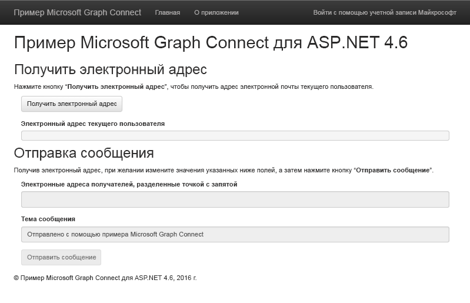

# Начало работы с Microsoft Graph в приложении ASP.NET 4.6 MVCGet started with Microsoft Graph in an ASP.NET 4.6 MVC app

В этой статье описываются задачи, которые необходимо выполнить, чтобы получить маркер доступа из конечной точки Azure AD версии 2.0 и вызвать Microsoft Graph. В ней рассматривается создание [примера приложения Microsoft Graph Connect для ASP.NET 4.6](https://github.com/microsoftgraph/aspnet-connect-sample) и объясняются основные понятия, которые необходимо реализовать для использования Microsoft Graph.This article describes the tasks required to get an access token from the Azure AD v2.0 endpoint and call Microsoft Graph. It walks you through building the [Microsoft Graph Connect Sample for ASP.NET 4.6](https://github.com/microsoftgraph/aspnet-connect-sample) and explains the main concepts that you implement to use Microsoft Graph.

На приведенном ниже рисунке показано создаваемое приложение.The following image shows the app you'll create. 

[Конечная точка Azure AD версии 2.0](https://azure.microsoft.com/ru-RU/documentation/articles/active-directory-appmodel-v2-overview) позволяет пользователям входить с учетной записью Майкрософт (MSA), с рабочей или учебной учетной записью. Приложение использует [ПО промежуточного слоя OpenID Connect OWIN для ASP.Net](https://www.nuget.org/packages/Microsoft.Owin.Security.OpenIdConnect/) и [библиотеку проверки подлинности Майкрософт (MSAL) для .NET](https://www.nuget.org/packages/Microsoft.Identity.Client) для входа в систему и управления маркером.The [Azure AD v2.0 endpoint](https://azure.microsoft.com/ru-RU/documentation/articles/active-directory-appmodel-v2-overview) lets users sign in with a Microsoft account (MSA) or a work or school account. The app uses the [ASP.Net OpenID Connect OWIN middleware](https://www.nuget.org/packages/Microsoft.Owin.Security.OpenIdConnect/) and the [Microsoft Authentication Library (MSAL) for .NET](https://www.nuget.org/packages/Microsoft.Identity.Client) for sign in and token management.

**Не хотите создавать приложение?** Воспользуйтесь [кратким руководством по Microsoft Graph](https://developer.microsoft.com/ru-RU/graph/quick-start) для быстрого начала работы. Обратите внимание, что у нас также есть [REST-версия этого приложения](https://github.com/microsoftgraph/aspnet-connect-rest-sample).**Don't feel like building an app?** Use the [Microsoft Graph quick start](https://developer.microsoft.com/ru-RU/graph/quick-start) to get up and running fast. Also note that we have a [REST version of this sample](https://github.com/microsoftgraph/aspnet-connect-rest-sample).

## Необходимые условияPrerequisites

Чтобы приступить к работе, вам понадобится следующее:To get started, you'll need: 

- [Учетная запись Майкрософт](https://www.outlook.com/) либо [рабочая или учебная учетная запись](https://docs.microsoft.com/ru-RU/office/developer-program/office-365-developer-program-faq#account-types).A [Microsoft account](https://www.outlook.com/) or a [work or school account](https://docs.microsoft.com/ru-RU/office/developer-program/office-365-developer-program-faq#account-types)
- Visual Studio 2015Visual Studio 2015 
- [Пример приложения, подключающегося с использованием Microsoft Graph, для ASP.NET 4.6](https://github.com/microsoftgraph/aspnet-connect-sample). Используйте папку **starter-project** с файлами примера.The [Microsoft Graph Connect Sample for ASP.NET 4.6](https://github.com/microsoftgraph/aspnet-connect-sample). You'll use the **starter-project** folder in the sample files.

## Регистрация приложенияRegister the application

На этом этапе зарегистрируйте приложение на портале регистрации приложений Майкрософт. При этом будут созданы идентификатор и пароль приложения, которые понадобятся при его настройке в Visual Studio.In this step, you'll register an app on the Microsoft App Registration Portal. This generates the app ID and password that you'll use to configure the app in Visual Studio.

1. Войдите на [портал регистрации приложений Майкрософт](https://apps.dev.microsoft.com/) с помощью личной, рабочей или учебной учетной записи.Sign into the [Microsoft App Registration Portal](https://apps.dev.microsoft.com/) using either your personal or work or school account.

2. Нажмите кнопку **Добавить приложение**.Choose **Add an app**.

3. Введите имя приложения и нажмите кнопку **Создать приложение**.Enter a name for the app, and choose **Create application**. 
    
    Откроется страница регистрации со свойствами приложения.The registration page displays, listing the properties of your app.

4. Скопируйте идентификатор приложения. Это уникальный идентификатор приложения.Copy the application ID. This is the unique identifier for your app. 

5. В разделе **Секреты приложения** нажмите кнопку **Создать новый пароль**. Скопируйте пароль из диалогового окна **Новый пароль создан**.Under **Application Secrets**, choose **Generate New Password**. Copy the password from the **New password generated** dialog.

    Идентификатор и пароль приложения используются для его настройки.You'll use the application ID and password to configure the app. 

6. В разделе **Платформы** выберите **Добавление платформы** > **Веб**.Under **Platforms**, choose **Add platform** > **Web**.

7. Убедитесь, что установлен флажок **Разрешить неявный поток**, и введите *http://localhost:55065/* в качестве URI перенаправления.Make sure the **Allow Implicit Flow** check box is selected, and enter *http://localhost:55065/* as the Redirect URI. 

    Параметр **Разрешить неявный поток** включает гибридный поток OpenID Connect. Благодаря этому при проверке подлинности приложение может получить данные для входа (**id_token**) и артефакты (в данном случае — код авторизации), с помощью которых оно может получить маркер доступа.The **Allow Implicit Flow** option enables the OpenID Connect hybrid flow. During authentication, this enables the app to receive both sign-in info (the **id_token**) and artifacts (in this case, an authorization code) that the app uses to obtain an access token.

8. Нажмите кнопку **Сохранить**.Choose **Save**.

### Настройка проектаConfigure the project

1. Откройте файл решения для начального проекта в Visual Studio.Open the solution file for the starter project in Visual Studio.

2. Откройте файл web.config проекта.Open the project's Web.config file.

3. Найдите клавиши настройки приложения в элементе **appSettings**. Замените значения заполнителей ENTER_YOUR_CLIENT_ID и ENTER_YOUR_SECRET значениями, которые вы только что скопировали.Locate the app configuration keys in the **appSettings** element. Replace the ENTER_YOUR_CLIENT_ID and ENTER_YOUR_SECRET placeholder values with the values you just copied.

URI перенаправления выступает в роли URL-адреса зарегистрированного проекта. Запрошенные [области разрешений](https://developer.microsoft.com/ru-RU/graph/docs/concepts/permission_scopes) позволяют приложению получить данные профилей пользователей и отправить сообщение электронной почты.The redirect URI is the URL of the project that you registered. The requested [permission scopes](https://developer.microsoft.com/ru-RU/graph/docs/concepts/permission_scopes) allow the app to get user profile information and send an email.

## Вызов Microsoft GraphCall Microsoft Graph

На этом шаге вы рассмотрите классы **SDKHelper**, **GraphService** и **HomeController**.In this step, you'll focus on the **SDKHelper**, **GraphService**, and **HomeController** classes. 

 - Класс **SDKHelper** инициализирует экземпляр **GraphServiceClient** из библиотеки перед каждым вызовом Microsoft Graph. В этом случае маркер доступа добавляется в запрос.**SDKHelper** intializes an instance of the **GraphServiceClient** from the library before each call to the Microsoft Graph. This is when the access token is added to the request. 
 - Класс **GraphService** создает и отправляет запросы в Microsoft Graph с помощью библиотеки и обрабатывает ответы.**GraphService** builds and sends requests to the Microsoft Graph using the library, and processes the responses.
 - Класс **HomeController** содержит действия, которые отправляют вызовы в библиотеку в ответ на события пользовательского интерфейса.**HomeController** contains actions that initiate the calls to the library in response to UI events.

В начальном проекте уже объявлена зависимость для пакета NuGet клиентской библиотеки .NET для Microsoft Graph:  *Microsoft.Graph*.The starter project already declares a dependency for the Microsoft Graph .NET Client Library NuGet package:  *Microsoft.Graph*.

1. Щелкните правой кнопкой мыши папку **Helpers** и выберите пункт **Add** > **Class**.Right-click the **Helpers** folder and choose **Add** > **Class**. 

1. Присвойте имя новому классу *SDKHelper* и нажмите кнопку **Добавить**.Name the new class *SDKHelper* and choose **Add**.

1. Замените содержимое приведенным ниже кодом.Replace the contents with the following code.

        using System.Net.Http.Headers;
        using Microsoft.Graph;

        namespace Microsoft_Graph_SDK_ASPNET_Connect.Helpers
        {
            public class SDKHelper
            {   
                private static GraphServiceClient graphClient = null;

                // Get an authenticated Microsoft Graph Service client.
                public static GraphServiceClient GetAuthenticatedClient()
                {
                    GraphServiceClient graphClient = new GraphServiceClient(
                        new DelegateAuthenticationProvider(
                            async (requestMessage) =>
                            {
                                string accessToken = await SampleAuthProvider.Instance.GetUserAccessTokenAsync();

                                // Append the access token to the request.
                                requestMessage.Headers.Authorization = new AuthenticationHeaderValue("bearer", accessToken);
                            }));
                    return graphClient;
                }

                public static void SignOutClient()
                {
                    graphClient = null;
                }
            }
        }

  Обратите внимание на вызов поставщика **SampleAuthProvider** для получения маркера при инициализации клиента.Note the call to **SampleAuthProvider** to get the token when the client is initialized.

1. В папке **Models** откройте файл GraphService.cs. Служба использует библиотеку для взаимодействия с Microsoft Graph.In the **Models** folder, open GraphService.cs. The service uses the library to interact with the Microsoft Graph.

1. Добавьте следующий оператор **using**.Add the following **using** statement.

        using Microsoft.Graph;

1. Замените часть кода *// GetMyEmailAddress* следующим методом. Таким образом будет получен электронный адрес текущего пользователя.Replace *// GetMyEmailAddress* with the following method. This gets the current user's email address. 

        // Get the current user's email address from their profile.
        public async Task<string> GetMyEmailAddress(GraphServiceClient graphClient)
        {

            // Get the current user. 
            // The app only needs the user's email address, so select the mail and userPrincipalName properties.
            // If the mail property isn't defined, userPrincipalName should map to the email for all account types. 
            User me = await graphClient.Me.Request().Select("mail,userPrincipalName").GetAsync();
            return me.Mail ?? me.UserPrincipalName;
        }

  Обратите внимание на сегмент **Select**, который требует, чтобы возвращались только элементы **mail** и **userPrinicipalName**. Можно использовать сегменты **Select** и **Filter**, чтобы уменьшить размер полезных данных отклика.Note the **Select** segment, which requests only the **mail** and **userPrinicipalName** to be returned. You can use **Select** and **Filter** to reduce the size of the response data payload.

1. Замените часть кода *// SendEmail* следующими методами для создания и отправки сообщения электронной почты.Replace *// SendEmail* with the following methods to build and send the email.

        // Send an email message from the current user.
        public async Task SendEmail(GraphServiceClient graphClient, Message message)
        {
            await graphClient.Me.SendMail(message, true).Request().PostAsync();
        }

        public async Task<Message> BuildEmailMessage(GraphServiceClient graphClient, string recipients, string subject)
        {

            // Get current user photo
            Stream photoStream = await GetCurrentUserPhotoStreamAsync(graphClient);

            // If the user doesn't have a photo, or if the user account is MSA, we use a default photo

            if ( photoStream == null)
            {
                photoStream = System.IO.File.OpenRead(System.Web.Hosting.HostingEnvironment.MapPath("/Content/test.jpg"));
            }

            MemoryStream photoStreamMS = new MemoryStream();
            // Copy stream to MemoryStream object so that it can be converted to byte array.
            photoStream.CopyTo(photoStreamMS);

            DriveItem photoFile = await UploadFileToOneDrive(graphClient, photoStreamMS.ToArray());

            MessageAttachmentsCollectionPage attachments = new MessageAttachmentsCollectionPage();
            attachments.Add(new FileAttachment
            {
                ODataType = "#microsoft.graph.fileAttachment",
                ContentBytes = photoStreamMS.ToArray(),
                ContentType = "image/png",
                Name = "me.png"
            });

            Permission sharingLink = await GetSharingLinkAsync(graphClient, photoFile.Id);

            // Add the sharing link to the email body.
            string bodyContent = string.Format(Resource.Graph_SendMail_Body_Content, sharingLink.Link.WebUrl);

            // Prepare the recipient list.
            string[] splitter = { ";" };
            string[] splitRecipientsString = recipients.Split(splitter, StringSplitOptions.RemoveEmptyEntries);
            List<Recipient> recipientList = new List<Recipient>();
            foreach (string recipient in splitRecipientsString)
            {
                recipientList.Add(new Recipient
                {
                    EmailAddress = new EmailAddress
                    {
                        Address = recipient.Trim()
                    }
                });
            }

            // Build the email message.
            Message email = new Message
            {
                Body = new ItemBody
                {
                    Content = bodyContent,
                    ContentType = BodyType.Html,
                },
                Subject = subject,
                ToRecipients = recipientList,
                Attachments = attachments
            };
            return email;
        }

        // Gets the stream content of the signed-in user's photo. 
        // This snippet doesn't work with consumer accounts.
        public async Task<Stream> GetCurrentUserPhotoStreamAsync(GraphServiceClient graphClient)
        {
            Stream currentUserPhotoStream = null;

            try
            {
                currentUserPhotoStream = await graphClient.Me.Photo.Content.Request().GetAsync();

            }

            // If the user account is MSA (not work or school), the service will throw an exception.
            catch (ServiceException)
            {
                return null;
            }

            return currentUserPhotoStream;

        }

        // Uploads the specified file to the user's root OneDrive directory.
        public async Task<DriveItem> UploadFileToOneDrive(GraphServiceClient graphClient, byte[] file)
        {
            DriveItem uploadedFile = null;

            try
            {
                MemoryStream fileStream = new MemoryStream(file);
                uploadedFile = await graphClient.Me.Drive.Root.ItemWithPath("me.png").Content.Request().PutAsync<DriveItem>(fileStream);

            }

            catch (ServiceException)
            {
                return null;
            }

            return uploadedFile;
        }

        public static async Task<Permission> GetSharingLinkAsync(GraphServiceClient graphClient, string Id)
        {
            Permission permission = null;

            try
            {
                permission = await graphClient.Me.Drive.Items[Id].CreateLink("view").Request().PostAsync();
            }

            catch (ServiceException)
            {
                return null;
            }

            return permission;
        }

1. В папке **Controllers** откройте файл HomeController.cs.In the **Controllers** folder, open HomeController.cs.

1. Добавьте следующий оператор **using**.Add the following **using** statement.

        using Microsoft.Graph;
  
1. Замените часть кода *// Controller actions* указанными ниже действиями.Replace *// Controller actions* with the following actions.

        [Authorize]
        // Get the current user's email address from their profile.
        public async Task<ActionResult> GetMyEmailAddress()
        {
            try
            {

                // Initialize the GraphServiceClient.
                GraphServiceClient graphClient = SDKHelper.GetAuthenticatedClient();

                // Get the current user's email address. 
                ViewBag.Email = await graphService.GetMyEmailAddress(graphClient);
                return View("Graph");
            }
            catch (ServiceException se)
            {
                if (se.Error.Message == Resource.Error_AuthChallengeNeeded) return new EmptyResult();
                return RedirectToAction("Index", "Error", new { message = Resource.Error_Message + Request.RawUrl + ": " + se.Error.Message });
            }
        }

        [Authorize]
        // Send mail on behalf of the current user.
        public async Task<ActionResult> SendEmail()
        {
            if (string.IsNullOrEmpty(Request.Form["email-address"]))
            {
                ViewBag.Message = Resource.Graph_SendMail_Message_GetEmailFirst;
                return View("Graph");
            }

            try
            {

                // Initialize the GraphServiceClient.
                GraphServiceClient graphClient = SDKHelper.GetAuthenticatedClient();

                // Build the email message.
                Message message = await graphService.BuildEmailMessage(graphClient, Request.Form["recipients"], Request.Form["subject"]);

                // Send the email.
                await graphService.SendEmail(graphClient, message);

                // Reset the current user's email address and the status to display when the page reloads.
                ViewBag.Email = Request.Form["email-address"];
                ViewBag.Message = Resource.Graph_SendMail_Success_Result;
                return View("Graph");
            }
            catch (ServiceException se)
            {
                if (se.Error.Code == Resource.Error_AuthChallengeNeeded) return new EmptyResult();
                return RedirectToAction("Index", "Error", new { message = Resource.Error_Message + Request.RawUrl + ": " + se.Error.Message });
            }
        }

Теперь вы готовы к [запуску приложения](#run-the-app).Now you're ready to [run the app](#run-the-app).

## Запуск приложенияRun the app
1. Нажмите клавишу F5 для сборки и запуска приложения.Press F5 to build and run the app. 

2. Войдите с помощью личной, рабочей или учебной учетной записи и предоставьте необходимые разрешения.Sign in with your personal or work or school account and grant the requested permissions.

3. Нажмите кнопку **Получить адрес электронной почты**. После завершения операции на странице отобразится адрес электронной почты пользователя, который вошел в систему.Choose the **Get email address** button. When the operation completes, the email address of the signed-in user is displayed on the page.

4. При необходимости измените список получателей и тему сообщения электронной почты, а затем нажмите кнопку **Отправить сообщение**. Под кнопкой отобразится сообщение об успешной отправке почты.Optionally edit the recipient list and email subject, and then choose the **Send email** button. When the mail is sent, a Success message is displayed below the button.

## Дальнейшие действияNext steps
- Попробуйте REST API, используя [песочницу Graph](https://developer.microsoft.com/graph/graph-explorer).Try out the REST API using the [Graph explorer](https://developer.microsoft.com/graph/graph-explorer).
- Вы можете найти примеры распространенных операций в [примере приложения Snippets Microsoft Graph для ASP.NET 4.6](https://github.com/microsoftgraph/aspnet-snippets-sample) и других [примерах ASP.NET](http://aka.ms/aspnetgraphsamples) на сайте GitHub.Find examples of common operations in the [Microsoft Graph Snippets Sample for ASP.NET 4.6](https://github.com/microsoftgraph/aspnet-snippets-sample), or explore our other [ASP.NET samples](http://aka.ms/aspnetgraphsamples) on GitHub.

## См. такжеSee also
- [Клиентская библиотека .NET Microsoft GraphMicrosoft Graph .NET Client Library](https://github.com/microsoftgraph/msgraph-sdk-dotnet)
- [Сценарий проверки подлинности веб-приложения для веб-APIWeb application to web API authentication scenario](https://azure.microsoft.com/ru-RU/documentation/articles/active-directory-authentication-scenarios/#web-application-to-web-api)
- [Интеграция идентификатора Майкрософт и Microsoft Graph в веб-приложении с помощью OpenID ConnectIntegrate Microsoft identity and the Microsoft Graph into a web application using OpenID Connect](https://azure.microsoft.com/ru-RU/documentation/samples/active-directory-dotnet-webapp-openidconnect-v2/)
- [Протоколы Azure AD версии 2.0Azure AD v2.0 protocols](https://azure.microsoft.com/ru-RU/documentation/articles/active-directory-v2-protocols/)
- [Маркеры Azure AD версии 2.0Azure AD v2.0 tokens](https://azure.microsoft.com/ru-RU/documentation/articles/active-directory-v2-tokens/)
