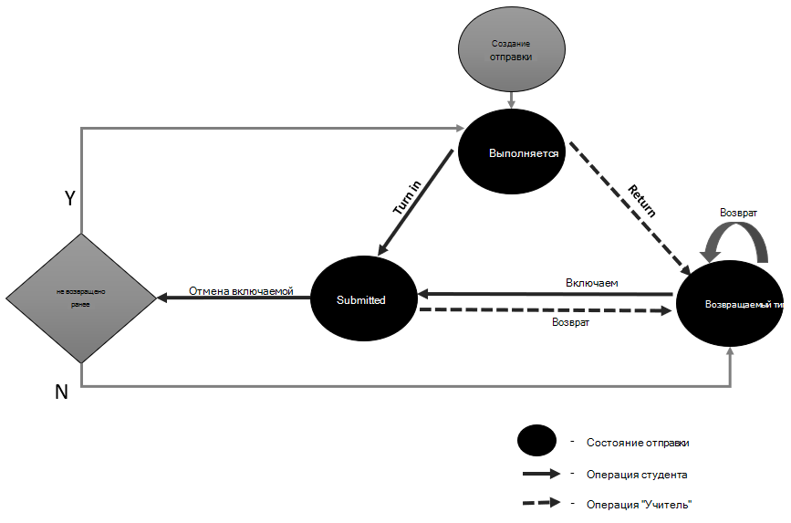

# Состояния, переходы и ограничения для назначений и отправок в Microsoft Graph

Задания и отправки являются важной частью взаимодействия между преподавателями и действиями учащихся. В этой статье описываются изменения в состояниях назначения и отправки во время процесса, а также то, какие API-интерфейсы для образовательных учреждений в Microsoft Graph задействованы.

## Состояния назначения и переходы

Задание представляет задачу или единицу работы, назначенную учащемуся или участникам команды в классе в рамках обучения. Создавать, копировать или планировать задания могут только преподаватели или владельцы команды. Эти действия влияют на состояния назначения. В следующей таблице перечислены состояния назначения и API, доступные для изменения состояния. 

| Состояние | Описание | Вызов REST API | Функции, доступные для редактирования |
|:--|:--|:--|:--|
| Draft | Начальное состояние при создании или копировании нового назначения из существующего назначения. | `POST /education/classes/{id}/assignments` | Ресурсы, категории, rubrics |
| Published | Фоновое состояние обработки, когда задание распространяется на каждого назначенного учащегося. | `POST /education/classes/{id}/assignments/{id}/publish` | |
| Scheduled | Состояние, когда преподаватель запланал публикацию задания в будущем. | `PATCH /education/classes/{id}/assignments/{id}` `POST /education/classes/{id}/assignments/{id}/publish` | Ресурсы, категории, rubrics |
| Назначенное | После завершения публикации задание перемещается в назначенное состояние и доступно для учащихся. | `POST /education/classes/{id}/assignments/{id}/publish` | Сданные работы |
| Pending | Состояние фоновой обработки при копировании нового назначения из существующего. | `POST /education/classes/{id}/assignments/{id}/copy` `PATCH /education/classes/{id}/assignments/{id}` | |

На следующей схеме показаны переходы состояния, которые могут произойти для назначений.

### Проверка публикации назначения

Вызывающий объект должен использовать операцию [назначения GET](/graph/api/educationassignment-get.md) , чтобы проверить текущее состояние назначения и убедиться, что процесс публикации выполнен успешно.

### Переходы состояния назначения на основе разрешенных действий

| Текущее состояние назначения | Новое действие | Новое состояние |
|:--|:--|:--|
| Draft | Преподаватель планирует задание | Scheduled |
| Draft | Публикация | Published |
| Draft | Отредактированы | Draft |
| Draft | Отбрасываются | |
| Published | Публикация завершена | Назначенное |
| Published | Сбой публикации | Draft |
| Published | Отбрасываются | |
| Scheduled | Дата выполнения | Published |
| Scheduled | Отмена расписания | Draft |
| Scheduled | Перенести | Scheduled |
| Назначенное | Отбрасываются | |
| Pending | Копирование завершено | Draft |
| Pending | Отбрасываются | |

> [!NOTE]
> Любые действия и переходы состояния, не перечисленные в таблице, не допускаются.

### Синхронизация и асинхронные операции с вызовами API назначений

В следующей таблице упоминаются вызовы API, влияющие на состояние назначения и тип операции.

Синхронные операции выполняются по одному, и только после завершения одной операции можно запустить следующую операцию, и результат возвращается до завершения последней операции. При асинхронных операциях операция запускается, а другая операция может выполняться до завершения предыдущей. Асинхронная операция выполняет некоторое фоновое действие, и вызывающий объект должен выполнить опрос, чтобы получить результат.

| API | Синхронизация или асинхронная синхронизация | Механизм получения последнего состояния |
|:--|:--|:--|
| `DELETE /education/classes/{id}/assignments/{id}` | Async | Опрос |
| `POST /education/classes/{id}/assignments/{id}/publish` | Async | Опрос |
| `PATCH /education/classes/{id}/assignments/{id}` | Async | Опрос |
| `POST /education/classes/{id}/assignments` | Async | Опрос |

## Состояния отправки и переходы

Отправка представляет ресурсы, которые пользователь (или группа) совмещая для назначения. Отправки принадлежат назначению и автоматически создаются при публикации назначения.

Состояние является свойством только для чтения в отправке и изменяется в зависимости от действий учащихся и преподавателей.

| Состояние | Описание | Вызов REST API |
|:--|:--|:--|
| Выполняется | Начальное состояние после создания отправки. | `POST /education/classes/{id}/assignments` `POST /education/classes/{id}/assignments/{id}/submissions/{id}/unsubmit` |
| Submitted | Это происходит после того, как учащийся сключил задание. | `POST /education/classes/{id}/assignments/{id}/submissions/{id}/submit` |
| Возвращены | После того как преподаватель вернул задание учащемуся. | `POST /education/classes/{id}/assignments/{id}/submissions/{id}/return` |
| Переназначить | После того как преподаватель вернул задание учащемуся для редакции. | `POST /education/classes/{id}/assignments/{id}/submissions/{id}/reassign` |

На следующей схеме показан поток перехода состояния.

### Переходы состояния отправки на основе разрешенных действий

| Текущее состояние отправки | Новое действие | Новое состояние |
|:--|:--|:--|
| Выполняется | Включите | Submitted |
| Выполняется | Возврат для редакции | Переназначить |
| Выполняется | Возврат | Возвращены |
| Submitted | Отменить включение | Выполняется |
| Submitted | Возврат | Возвращены |
| Submitted | Возврат для редакции | Переназначить |
| Возвращены | Включите | Submitted |
| Возвращены | Возврат | Возвращены |
| Возвращены | Возврат для редакции | Переназначить |
| Переназначить | Включите | Submitted |
| Переназначить | Возврат | Возвращены |
| Переназначить | Возврат для редакции | Переназначить |

> [!NOTE]
> Любые действия и переходы состояния, не перечисленные в таблице, не допускаются.

### Синхронизация и асинхронные операции через вызовы API отправки

В следующей таблице перечислены вызовы API, влияющие на состояние отправки и тип операции.

В этом случае все вызовы являются асинхронными. Это означает, что операция начинается, а другая операция может начаться до завершения первой. Асинхронная операция выполняет некоторое фоновое действие, и вызывающий объект должен выполнить опрос, чтобы получить результат.  

| API | Синхронизация или асинхронная синхронизация | Механизм получения последнего состояния |
|:--|:--|:--|
| `POST /education/classes/{id}/assignments/{id}/submissions/{id}/submit` | Async | Опрос |
| `POST /education/classes/{id}/assignments/{id}/submissions/{id}/unsubmit` | Async | Опрос |
| `POST /education/classes/{id}/assignments/{id}/submissions/{id}/return` | Async | Опрос |
| `POST /education/classes/{id}/assignments/{id}/submissions/{id}/reassign` | Async | Опрос |

### Ограничения

Следующие ограничения применяются ко всем вызовам API:

* Максимальное количество заданий и ресурсов отправки составляет 10 для преподавателя и плюс 10 для учащегося.
* Максимальный размер ресурсов составляет 50 МБ в целом или 10 ресурсов.
* Применяются ограничения регулирования; Дополнительные сведения см. в [руководстве по регулированию Microsoft Graph](/graph/throttling).
