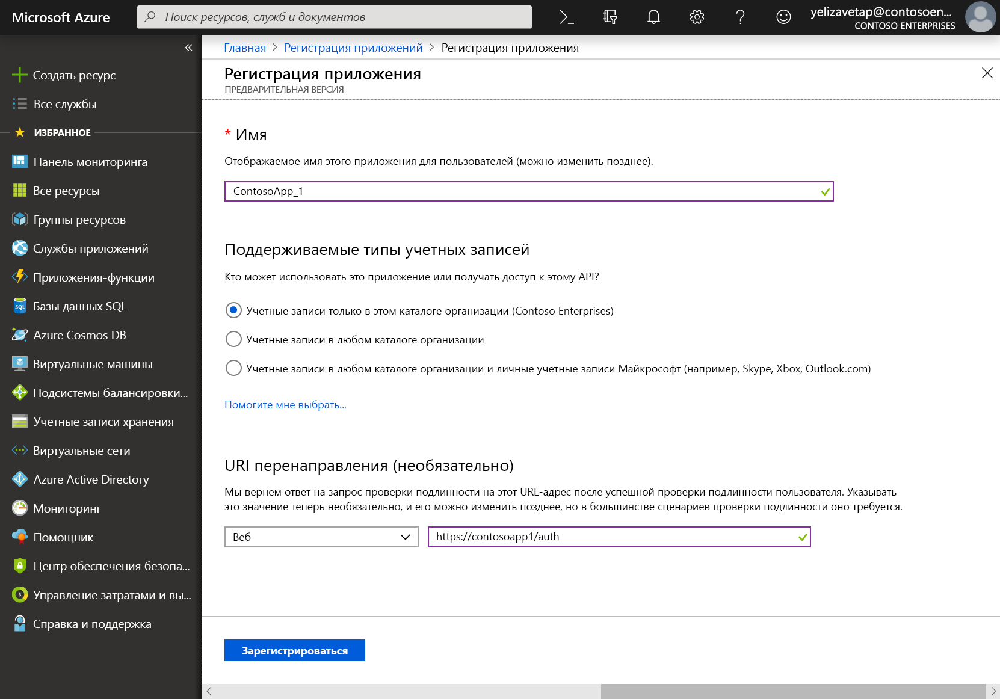
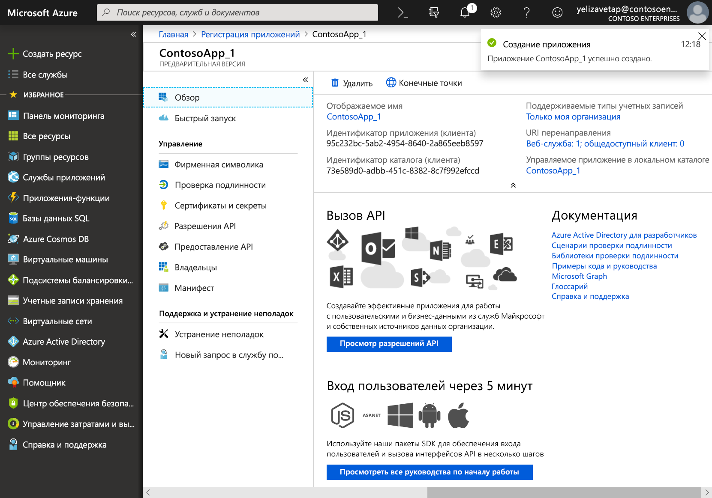

# Регистрация приложения с помощью платформы удостоверений Майкрософт

На этой странице показано, как добавить и зарегистрировать приложение с помощью функции **регистрации приложений** на портале Azure, чтобы приложение поддерживало интеграцию с платформой удостоверений Майкрософт и могло вызывать Microsoft Graph. 

> [!VIDEO https://www.youtube-nocookie.com/embed/93j0MmRruFo]

## Регистрация нового приложения с помощью портала Azure

1. Войдите на [портал Azure](https://portal.azure.com) с помощью личной учетной записи Майкрософт либо рабочей или учебной учетной записи.
1. Если ваша учетная запись предоставляет доступ к нескольким клиентам, в правом верхнем углу щелкните свою учетную запись и выберите для текущего сеанса работы нужный клиент Azure AD.
1. В области навигации слева выберите службу **Azure Active Directory**, а затем выберите **Регистрация приложений > Новая регистрация**.
1. После появления страницы **Регистрация приложения** введите сведения о регистрации приложения:

   - **Имя** — введите информативное имя приложения, которое будет отображаться пользователям приложения.
   - **Поддерживаемые типы учетных записей** — выберите учетные записи, которые должно поддерживать приложение.

       | Поддерживаемые типы учетных записей | Описание |
       |-------------------------|-------------|
       | **Учетные записи только в этом каталоге организации** | Этот вариант подходит для создания бизнес-приложений. Он будет недоступен, если приложение не регистрируется в каталоге.  Этот параметр сопоставляется с Azure AD только одного клиента.  Этот параметр используется по умолчанию, если только приложение не регистрируется за пределами каталога. Если приложение зарегистрировано за пределами каталога, по умолчанию используются личные учетные записи Майкрософт и учетные записи с несколькими клиентами Azure AD. |
       | **Учетные записи в любом каталоге организации** | Выберите этот параметр, если вы хотите выбрать в качестве целевой аудитории предприятия и учебные заведения.  Этот параметр сопоставляется с Azure AD только для нескольких клиентов.  Если вы зарегистрировали приложение как приложение AAD с одним клиентом, можно обновить его до AAD с несколькими клиентами, а затем вернуться к отдельному клиенту с помощью колонки **Проверка подлинности**. |
       | **Учетные записи в любом каталоге организации и личные учетные записи Майкрософт** | Выберите этот параметр для широкого круга пользователей.  Этот параметр сопоставляется с Azure AD с несколькими клиентами и личными учетными записями Майкрософт.  Если вы зарегистрировали приложение как личные учетные записи Майкрософт и Azure AD с несколькими клиентами, это нельзя изменить в пользовательском интерфейсе. Вместо этого необходимо использовать редактор манифеста приложения для изменения типов поддерживаемых учетных записей. |

   - **URI перенаправления (необязательно)** — выберите тип приложения, которое вы создаете — **Веб** или **Общедоступный клиент (мобильный и классический)**, а затем введите универсальный код ресурса (URI) перенаправления (или URL-адрес ответа) приложения.
       - Для веб-приложений укажите основной URL-адрес приложения. Например, `http://localhost:31544` может быть URL-адресом веб-приложения, выполняемого на локальном компьютере. Пользователи будут использовать этот URL-адрес для входа в приложение веб-клиента.
       - Для общедоступных клиентских приложений укажите универсальный код ресурса (URI), который использует AAD для возвращения ответов маркера. Укажите значение, специфичное для вашего приложения, например `myapp://auth`.

     Конкретные примеры для веб-приложений или собственных приложений см. в наших [кратких руководствах](/azure/active-directory/develop/#quickstarts).

1. По завершении щелкните **Зарегистрировать**.

    

AAD присвоит вашему приложению уникальный идентификатор, после чего откроется страница приложения **Обзор**. Чтобы добавить дополнительные возможности в свое приложение, вы можете выбрать другие параметры конфигурации, включая фирменную символику, сертификаты и секреты, разрешения API и прочее.

## Свойства, характерные для платформы

В приведенной ниже таблице показаны свойства, которые необходимо настроить и скопировать для приложений различных типов. _Назначенное_ означает, что следует использовать значение, назначенное службой Azure AD.

| Тип приложения | Платформа | Идентификатор приложения (клиента) | Секрет клиента | URI/URL-адрес перенаправления | Неявный поток 
| --- | --- | --- | --- | --- | --- |
| Нативное или мобильное | Нативное | Назначенное  | Нет | Назначенное | Нет |
| Веб-приложение | Веб | Назначенное | Да | Да | При необходимости  По умолчанию ПО промежуточного слоя Open ID Connect использует гибридный поток (да) | 
| Одностраничное приложение (SPA) | Веб | Назначенное | Да | Да | Да   Одностраничные приложения используют неявный поток Open ID Connect |
| Служба или управляющая программа | Веб | Назначенное | Да | Да | Нет |

## Дальнейшие действия

- Узнайте больше о [разрешениях и согласии](/azure/active-directory/develop/v2-permissions-and-consent) или просмотрите [справочник по разрешениям](permissions-reference.md) Microsoft Graph.
- Сведения о том, как включить дополнительные функции настройки при регистрации приложения (учетные данные, разрешения) и включить вход для пользователей из других клиентов, см. в руководствах ниже:
  - [Настройка клиентского приложения для доступа к веб-API](/azure/active-directory/develop/quickstart-configure-app-access-web-apis)
  - [Настройка приложения для доступа к веб-API](/azure/active-directory/develop/quickstart-configure-app-expose-web-apis)
  - [Изменение учетных записей, поддерживаемых приложением](/azure/active-directory/develop/quickstart-modify-supported-accounts)
- Следуя этим [кратким руководствам](/azure/active-directory/develop/#quickstarts), можно быстро создать приложение и добавить в него такие функциональные возможности, как получение и обновление маркеров, выполнение входа пользователя, отображение некоторых сведений о пользователе и многое другое.
- Дополнительные сведения о двух объектах Azure AD, представляющих зарегистрированное приложение, и о взаимосвязи между ними: [Объекты приложения и субъекта-службы](/azure/active-directory/develop/app-objects-and-service-principals).
- Дополнительные сведения о фирменной символике, которой следует пользоваться при разработке приложений, см. в [рекомендациях по использованию фирменной символики для приложений](/azure/active-directory/develop/howto-add-branding-in-azure-ad-apps).
