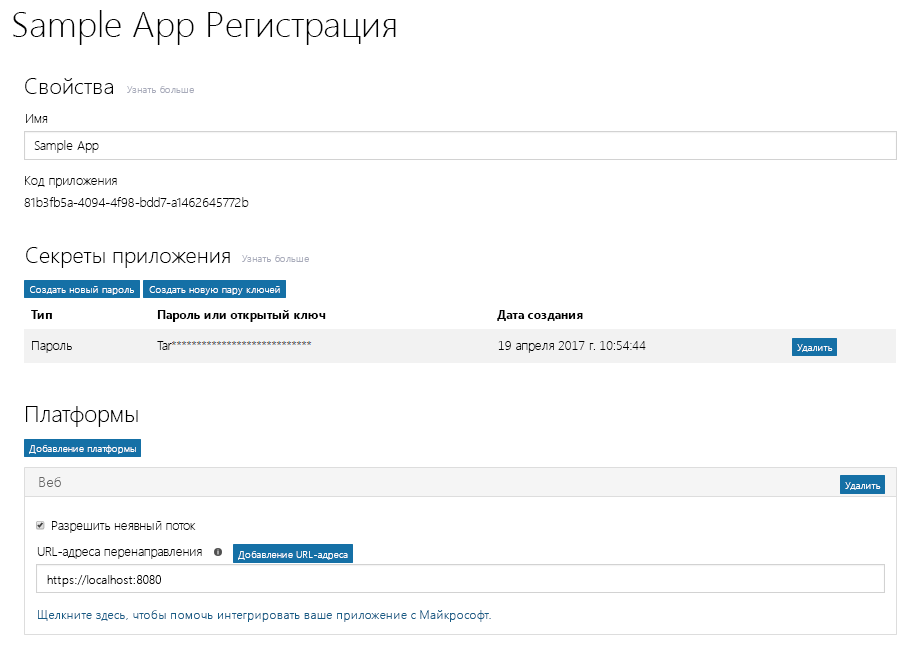

# Регистрация приложения с помощью конечной точки Azure AD версии 2.0Register your app with the Azure AD v2.0 endpoint

Приложение должно быть зарегистрировано в Azure AD. При регистрации приложения создается уникальный идентификатор и другие значения, используемые приложением для проверки подлинности в Azure AD и получения маркеров. Для конечной точки Azure AD версии 2.0 приложение регистрируется на [портале Майкрософт для регистрации приложений](https://apps.dev.microsoft.com). Для регистрации приложения можно использовать либо учетную запись Майкрософт, либо рабочую или учебную учетную запись. В зависимости от типа создаваемого приложения, во время регистрации вам может потребоваться скопировать одно или несколько свойств, чтобы использовать их при настройке проверки подлинности и авторизации для приложения.Your app must be registered with Azure AD. Registering your app establishes a unique application ID and other values that your app uses to authenticate with Azure AD and get tokens. For the Azure AD v2.0 endpoint, you register your app with the [Microsoft App Registration Portal](https://apps.dev.microsoft.com). You can use either a Microsoft account or a work or school account to register your app. Depending on the type of app you are developing, you will need to copy one or more properties during registration to use when you configure authentication and authorization for your app. 

> **Примечание.** В этой статье основное внимание уделяется регистрации приложений с помощью конечной точки Azure AD версии 2.0. Сведения о регистрации приложения с помощью конечной точки Azure AD см. в разделе [Рекомендации, связанные с конечной точкой Azure AD](#azure-ad-endpoint-considerations) далее в этой статье.**Note:** This article primarily covers registering apps with the Azure AD v2.0 endpoint. For information about registering your app with the Azure AD endpoint, see [Azure AD endpoint considerations](#azure-ad-endpoint-considerations) below.
> 
> Кроме того, помните, что если ранее вы регистрировали приложения на портале Microsoft Azure, то они не будут отображаться на портале регистрации приложений.Also, be aware that if you've previously registered apps in the Microsoft Azure portal, those apps will not be listed in the App Registration Portal. Управляйте этими приложениями на портале Azure.Manage those apps in the Azure portal. 

На приведенном ниже снимке экрана показан пример регистрации веб-приложения, настроенной с использованием пароля и неявного потока. The following screenshot shows an example web app registration that has been configured with a password and implicit flow. 

Чтобы зарегистрировать приложение, выполните указанные ниже действия. Обязательно скопируйте указанные значения — они потребуются при настройке авторизации для приложения.To register your app, follow these steps; be sure to copy the indicated values to use when configuring authorization for your app:

1. Войдите на [портал Майкрософт для регистрации приложений](https://apps.dev.microsoft.com/).Sign into the [Microsoft App Registration Portal](https://apps.dev.microsoft.com/).
   
    Вы можете войти с помощью учетной записи Майкрософт либо рабочей или учебной учетной записи.You can sign in with either a Microsoft account or a work or school account. 

2. Нажмите кнопку **Добавить приложение**.Choose **Add an app**.
    > Примечание. Если вход выполнен с помощью рабочей или учебной учетной записи, нажмите кнопку **Добавить приложение** для **конвергированных приложений**.Note: If you signed in with a work or school account, select the **Add an app** button for **Converged applications**. 

3. Введите имя приложения и нажмите кнопку **Создать приложение**.Enter a name for the app and choose **Create application**.

    Откроется страница регистрации со свойствами приложения.The registration page displays, listing the properties of your app.

4. Скопируйте идентификатор приложения. Это уникальный идентификатор приложения.Copy the application ID. This is the unique identifier for your app.

    Идентификатор приложения используется для его настройки.You'll use the application ID to configure the app.

5. В разделе **Платформы** нажмите кнопку **Добавление платформы** и выберите подходящую платформу для вашего приложения:Under **Platforms**, choose **Add Platform**, and select the appropriate platform for your app:
    
    **Для нативных и мобильных приложений**:**For native or mobile apps**:

    1. Выберите **Собственное приложение**.Select **Native Application**.

    2. Скопируйте значение **встроенного URI перенаправления**. Оно потребуется вам для настройки приложения.Copy the **Built-in redirect URI** value. You'll need this to configure your app.

        URI перенаправления — это уникальный URI, предоставляемый приложению, чтобы сообщения, отправляемые на этот URI, отправлялись только этому приложению.The redirect URI is a unique URI provided for your application to ensure that messages sent to that URI are only sent to that application. 

    **Для веб-приложений**:**For web apps**:

    1. Выберите платформу **Веб**.Select **Web**.

    2. В зависимости от используемого потока аутентификации, возможно, потребуется установить флажок **Разрешить неявный поток**.Depending on the type of authentication flow you're using, you may have to make sure the **Allow Implicit Flow** check box is selected. 
        
        Параметр **Разрешить неявный поток** позволяет использовать неявный поток и гибридный поток OpenID Connect. Гибридный поток позволяет приложению получить данные для входа (маркер идентификатора) и артефакты (в данном случае — код авторизации), с помощью которых оно может получить маркер доступа. Гибридный поток используется по умолчанию в ПО промежуточного слоя OWIN OpenID Connect. Неявный поток позволяет одностраничным приложениям (SPA) получать данные для входа и маркер доступа.The **Allow Implicit Flow** option enables the OpenID Connect hybrid and implicit flows. The hybrid flow enables the app to receive both sign-in info (the id token) and artifacts (in this case, an authorization code) that the app uses to obtain an access token. The hybrid flow is the default flow used by the OWIN OpenID Connect middleware. For single page apps (SPA), the implicit flow enables the app to receive sign-in info and the access token. 

    3. Укажите URL-адрес перенаправления.Specify a Redirect URL.
        
        URL-адрес перенаправления — это расположение в приложении, которое конечная точка Azure AD версии 2.0 вызывает после обработки запроса на проверку подлинности.The redirect URL is the location in your app that the Azure AD v2.0 endpoint calls when it has processed the authentication request.

    4. В разделе **Секреты приложения** нажмите кнопку **Создать новый пароль**. Скопируйте секрет приложения из диалогового окна **Новый пароль создан**.Under **Application Secrets**, choose **Generate New Password**. Copy the app secret from the **New password generated** dialog box.
        > **Важно!** Необходимо скопировать секрет приложения, прежде чем закрывать диалоговое окно **Новый пароль создан**. После закрытия окна получить секрет будет невозможно.**Important** You must copy the app secret before you close the **New password generated** dialog. After you close the dialog, you cannot retrieve the secret. 
            
6. Нажмите кнопку **Сохранить**.Choose **Save**.

В приведенной ниже таблице показаны свойства, которые необходимо настроить и скопировать для приложений различных типов. _Назначенное_ означает, что следует использовать значение, назначенное службой Azure AD.The following table shows the properties that you need to configure and copy for different kinds of apps. _Assigned_ means that you should use the value assigned by Azure AD.

| Тип приложенияApp type | ПлатформаPlatform | Идентификатор приложенияApplication ID | Секрет приложенияApplication Secret | URI/URL-адрес перенаправленияRedirect URI/URL | Неявный потокImplicit Flow 
| --- | --- | --- | --- | --- | --- |
| Нативное или мобильноеNative/Mobile | НативноеNative | НазначенноеAssigned  | НетNo | НазначенноеAssigned | НетNo |
| Веб-приложениеWeb App | ВебWeb | НазначенноеAssigned | ДаYes | ДаYes | При необходимостиOptional  По умолчанию ПО промежуточного слоя Open ID Connect использует гибридный поток (да)Open ID Connect middleware uses hybrid flow by default (Yes) | 
| Одностраничное приложение (SPA)Single Page App (SPA) | ВебWeb | НазначенноеAssigned | ДаYes | ДаYes | ДаYes   Одностраничные приложения используют неявный поток Open ID ConnectSPAs use Open ID Connect implicit Flow |
| Служба или управляющая программаService/Daemon | ВебWeb | НазначенноеAssigned | ДаYes | ДаYes | НетNo |

Приложениям, предусматривающим предоставление согласия администратора, может потребоваться дополнительный URL-адрес перенаправления для Azure AD, на который будет возвращаться отклик.Apps that provide an administrator consent experience may need an additional Redirect URL for Azure AD to return the response to.

Дополнительные сведения о портале регистрации приложений и свойствах, которые можно настраивать для приложения, см. в статье [Справка по регистрации приложений](https://docs.microsoft.com/ru-RU/azure/active-directory/develop/active-directory-v2-registration-portal).For more detail about the App Registration Portal and the properties you can configure for your App, see [App registration reference](https://docs.microsoft.com/ru-RU/azure/active-directory/develop/active-directory-v2-registration-portal).  

## Рекомендации, связанные с конечной точкой Azure ADAzure AD endpoint considerations

Зарегистрировать приложение для конечной точки Azure AD можно на [портале Azure](https://aka.ms/aadapplist). При этом настраиваются те же основные свойства (например, идентификатор приложения, секрет приложения и URI/URL-адрес перенаправления), что и для конечной точки версии 2.0. Однако следует учитывать некоторые важные различия:You use the [Azure portal](https://aka.ms/aadapplist) to register your app for the Azure AD endpoint. You configure the same basic properties like Application ID, Application Secret, and Redirect URI/URL, as you would for the v2.0 endpoint; however, there are some important differences to be aware of: 

- Для регистрации приложения можно использовать только рабочую или учебную учетную запись.You can only use a work or school account to register an app.
- Для каждой платформы приложению потребуется отдельный идентификатор.Your app will require a different Application ID for each platform.
- Если приложение является мультитенантным, необходимо в явной форме настроить его как таковое на портале.If your app is a multi-tenant app, you must explicitly configure it to be multi-tenant at the portal.
- Все необходимые приложению разрешения (включая разрешения Microsoft Graph) необходимо заранее настроить на портале.You must pre-configure all the permissions (including Microsoft Graph permissions) that your app needs at the portal. 

Рекомендации по добавлению приложения на портале Azure см. в разделе [Интеграция приложений с Azure Active Directory: добавление приложения](https://docs.microsoft.com/azure/active-directory/develop/active-directory-integrating-applications#adding-an-application).For guidance on using the Azure portal to add an app, see [Integrating applications with Azure Active Directory: Adding an application](https://docs.microsoft.com/azure/active-directory/develop/active-directory-integrating-applications#adding-an-application).
