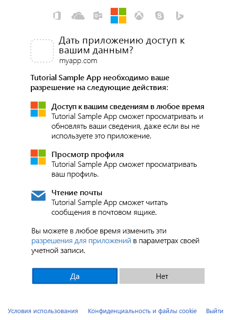

# <a name="get-access-on-behalf-of-a-user"></a><span data-ttu-id="3808b-103">Получение доступа от имени пользователя</span><span class="sxs-lookup"><span data-stu-id="3808b-103">Get access on behalf of a user</span></span>

<span data-ttu-id="3808b-p101">Для чтения и записи ресурсов от имени пользователя с помощью Microsoft Graph приложение должно получать маркер доступа из платформы удостоверений Майкрософт и вкладывать этот маркер в запросы для Microsoft Graph. Поток проверки подлинности, который будет использоваться для получения маркеров доступа, зависит от типа разрабатываемого приложения и от того, хотите ли вы использовать OpenID Connect для обеспечения входа пользователя в приложение. В нативных и мобильных приложениях, а также в некоторых веб-приложениях часто используется поток предоставления кода авторизации OAuth 2.0. В этой статье рассматривается пример использования такого потока.</span><span class="sxs-lookup"><span data-stu-id="3808b-p101">To use Microsoft Graph to read and write resources on behalf of a user, your app must get an access token from the Microsoft identity platform and attach the token to requests that it sends to Microsoft Graph. The exact authentication flow that you will use to get access tokens will depend on the kind of app you are developing and whether you want to use OpenID Connect to sign the user in to your app. One common flow used by native and mobile apps and also by some Web apps is the OAuth 2.0 authorization code grant flow. This topic  walks through an example using this flow.</span></span>

## <a name="authentication-and-authorization-steps"></a><span data-ttu-id="3808b-108">Этапы проверки подлинности и авторизации</span><span class="sxs-lookup"><span data-stu-id="3808b-108">Authentication and Authorization steps</span></span>

<span data-ttu-id="3808b-109">Ниже перечислены основные действия, необходимые для получения маркера доступа из конечной точки платформы удостоверений Майкрософт с помощью потока предоставления кода авторизации OAuth 2.0.</span><span class="sxs-lookup"><span data-stu-id="3808b-109">The basic steps required to use the OAuth 2.0 authorization code grant flow to get an access token from the Microsoft identity platform endpoint are:</span></span>

1. <span data-ttu-id="3808b-110">Регистрация приложения в Azure AD.</span><span class="sxs-lookup"><span data-stu-id="3808b-110">Register your app with Azure AD.</span></span>
2. <span data-ttu-id="3808b-111">Получение авторизации.</span><span class="sxs-lookup"><span data-stu-id="3808b-111">Get authorization.</span></span>
3. <span data-ttu-id="3808b-112">Получение маркера доступа.</span><span class="sxs-lookup"><span data-stu-id="3808b-112">Get an access token.</span></span>
4. <span data-ttu-id="3808b-113">Вызовы Microsoft Graph с помощью маркера доступа.</span><span class="sxs-lookup"><span data-stu-id="3808b-113">Call Microsoft Graph with the access token.</span></span>
5. <span data-ttu-id="3808b-114">Получение нового маркера доступа с помощью маркера обновления.</span><span class="sxs-lookup"><span data-stu-id="3808b-114">Use a refresh token to get a new access token.</span></span>

## <a name="1-register-your-app"></a><span data-ttu-id="3808b-115">1. Регистрация приложения</span><span class="sxs-lookup"><span data-stu-id="3808b-115">1. Register your app</span></span>

<span data-ttu-id="3808b-p102">Чтобы использовать конечную точку платформы удостоверений Майкрософт, необходимо зарегистрировать приложение с помощью [портала для регистрации приложений](https://go.microsoft.com/fwlink/?linkid=2083908) Azure. Для регистрации приложения можно использовать либо учетную запись Майкрософт, либо рабочую или учебную учетную запись.</span><span class="sxs-lookup"><span data-stu-id="3808b-p102">To use the Microsoft identity platform endpoint, you must register your app using the Azure [app registration portal](https://go.microsoft.com/fwlink/?linkid=2083908). You can use either a Microsoft account or a work or school account to register an app.</span></span>

<span data-ttu-id="3808b-118">Чтобы настроить приложение на использование потока предоставления кода авторизации OAuth 2.0, во время регистрации приложения необходимо сохранить следующие значения:</span><span class="sxs-lookup"><span data-stu-id="3808b-118">To configure an app to use the OAuth 2.0 authorization code grant flow, you'll need to save the following values when registering the app:</span></span>

- <span data-ttu-id="3808b-119">идентификатор приложения (клиента), назначенный порталом регистрации;</span><span class="sxs-lookup"><span data-stu-id="3808b-119">The Application (client) ID assigned by the app registration portal.</span></span>
- <span data-ttu-id="3808b-p103">Секрет клиента (приложения) — пароль либо открытый и закрытый ключ (сертификат). Это необязательно для нативных приложений.</span><span class="sxs-lookup"><span data-stu-id="3808b-p103">A Client (application) Secret, either a password or a public/private key pair (certificate). This is not required for native apps.</span></span>
- <span data-ttu-id="3808b-122">URI перенаправления (или URL-адрес ответа), с помощью которого приложение будет получать отклики от Azure AD.</span><span class="sxs-lookup"><span data-stu-id="3808b-122">A Redirect URI (or reply URL) for your app to receive responses from Azure AD.</span></span>

<span data-ttu-id="3808b-123">Инструкции по настройке приложения на портале Azure см. в статье [Регистрация приложения](./auth-register-app-v2.md).</span><span class="sxs-lookup"><span data-stu-id="3808b-123">For steps on how to configure an app in the Azure portal, see [Register your app](./auth-register-app-v2.md).</span></span>

## <a name="2-get-authorization"></a><span data-ttu-id="3808b-124">2. Получение авторизации</span><span class="sxs-lookup"><span data-stu-id="3808b-124">2. Get authorization</span></span>

<span data-ttu-id="3808b-p104">Чтобы получить маркер доступа для многих потоков OpenID Connect (OIDC) и OAuth 2.0, сначала необходимо перенаправить пользователя к конечной точке `/authorize` платформы удостоверений Майкрософт. Azure AD выполнит вход пользователя и обеспечит его согласие на предоставление приложению запрашиваемых разрешений. В потоке предоставления кода авторизации после получения согласия Azure AD возвращает приложению код авторизации, который оно может передать конечной точке `/token` платформы удостоверений Майкрософт, чтобы получить маркер доступа.</span><span class="sxs-lookup"><span data-stu-id="3808b-p104">The first step to getting an access token for many OpenID Connect (OIDC) and OAuth 2.0 flows is to redirect the user to the Microsoft identity platform `/authorize` endpoint. Azure AD will sign the user in and ensure their consent for the permissions your app requests. In the authorization code grant flow, after consent is obtained, Azure AD will return an authorization_code to your app that it can redeem at the Microsoft identity platform `/token` endpoint for an access token.</span></span>

### <a name="authorization-request"></a><span data-ttu-id="3808b-128">Запрос авторизации</span><span class="sxs-lookup"><span data-stu-id="3808b-128">Authorization request</span></span>

<span data-ttu-id="3808b-129">Ниже представлен пример запроса для конечной точки `/authorize`.</span><span class="sxs-lookup"><span data-stu-id="3808b-129">The following shows an example request to the `/authorize` endpoint.</span></span>

<span data-ttu-id="3808b-p105">При использовании конечной точки платформы удостоверений Майкрософт разрешения запрашиваются с помощью параметра `scope`. В этом примере запрашиваются разрешения Microsoft Graph _User.Read_ и _Mail.Read_, которые позволяют приложению просматривать профиль и почту вошедшего пользователя. Разрешение _offline\_access_ является стандартной областью OIDC, которая запрашивается, чтобы приложение могло получить маркер обновления, с помощью которого оно сможет получить новый маркер доступа, когда истечет срок действия текущего.</span><span class="sxs-lookup"><span data-stu-id="3808b-p105">With the Microsoft identity platform endpoint, permissions are requested using the `scope` parameter. In this example, the Microsoft Graph permissions requested are for _User.Read_ and _Mail.Read_, which will allow the app to read the profile and mail of the signed-in user. The _offline\_access_ permission is a standard OIDC scope that is requested so that the app can get a refresh token, which it can use to get a new access token when the current one expires.</span></span>

```
// Line breaks for legibility only

https://login.microsoftonline.com/{tenant}/oauth2/v2.0/authorize?
client_id=6731de76-14a6-49ae-97bc-6eba6914391e
&response_type=code
&redirect_uri=http%3A%2F%2Flocalhost%2Fmyapp%2F
&response_mode=query
&scope=offline_access%20user.read%20mail.read
&state=12345
```

| <span data-ttu-id="3808b-133">Параметр</span><span class="sxs-lookup"><span data-stu-id="3808b-133">Parameter</span></span>     | <span data-ttu-id="3808b-134">Обязательный</span><span class="sxs-lookup"><span data-stu-id="3808b-134">Required</span></span>    | <span data-ttu-id="3808b-135">Описание</span><span class="sxs-lookup"><span data-stu-id="3808b-135">Description</span></span>                                                                                                                                                                                                                                                                                                                                                                                                                                                                                             |
|---------------|-------------|---------------------------------------------------------------------------------------------------------------------------------------------------------------------------------------------------------------------------------------------------------------------------------------------------------------------------------------------------------------------------------------------------------------------------------------------------------------------------------------------------------|
| <span data-ttu-id="3808b-136">tenant</span><span class="sxs-lookup"><span data-stu-id="3808b-136">tenant</span></span>        | <span data-ttu-id="3808b-137">обязательно</span><span class="sxs-lookup"><span data-stu-id="3808b-137">required</span></span>    | <span data-ttu-id="3808b-p106">С помощью значения `{tenant}` в пути запроса можно указывать, кто может входить в приложение.  Допустимые значения: `common` (для учетных записей Майкрософт, а также рабочих и учебных учетных записей), `organizations` (только для рабочих и учебных учетных записей), `consumers` (только для учетных записей Майкрософт), а также идентификаторы клиентов или доменные имена.  Дополнительные сведения см. в статье, содержащей [основные сведения о протоколах](/azure/active-directory/develop/active-directory-v2-protocols#endpoints).</span><span class="sxs-lookup"><span data-stu-id="3808b-p106">The `{tenant}` value in the path of the request can be used to control who can sign into the application.  The allowed values are `common` for both Microsoft accounts and work or school accounts, `organizations` for work or school accounts only, `consumers` for Microsoft accounts only, and tenant identifiers such as the tenant ID or domain name.  For more detail, see [protocol basics](/azure/active-directory/develop/active-directory-v2-protocols#endpoints).</span></span> |
| <span data-ttu-id="3808b-141">client_id</span><span class="sxs-lookup"><span data-stu-id="3808b-141">client_id</span></span>     | <span data-ttu-id="3808b-142">обязательно</span><span class="sxs-lookup"><span data-stu-id="3808b-142">required</span></span>    | <span data-ttu-id="3808b-143">Идентификатор приложения, назначенный [порталом регистрации](https://go.microsoft.com/fwlink/?linkid=2083908) для приложения.</span><span class="sxs-lookup"><span data-stu-id="3808b-143">The Application ID that the [registration portal](https://go.microsoft.com/fwlink/?linkid=2083908) assigned your app.</span></span>                                                                                                                                                                                                                                                                                                                                                                                   |
| <span data-ttu-id="3808b-144">response_type</span><span class="sxs-lookup"><span data-stu-id="3808b-144">response_type</span></span> | <span data-ttu-id="3808b-145">Обязательный</span><span class="sxs-lookup"><span data-stu-id="3808b-145">required</span></span>    | <span data-ttu-id="3808b-146">Должен включать значение `code` для потока кода авторизации.</span><span class="sxs-lookup"><span data-stu-id="3808b-146">Must include `code` for the authorization code flow.</span></span>                                                                                                                                                                                                                                                                                                                                                                                                                                                    |
| <span data-ttu-id="3808b-147">redirect_uri</span><span class="sxs-lookup"><span data-stu-id="3808b-147">redirect_uri</span></span>  | <span data-ttu-id="3808b-148">Рекомендуемый</span><span class="sxs-lookup"><span data-stu-id="3808b-148">recommended</span></span> | <span data-ttu-id="3808b-p107">URI перенаправления приложения, с помощью которого приложение может отправлять и получать отклики на проверку подлинности.  Он должен в точности совпадать с одним из URI перенаправления, указанных вами на портале регистрации приложений, и быть закодирован как URL-адрес.  Для собственных и мобильных приложений следует использовать значение по умолчанию (`https://login.microsoftonline.com/common/oauth2/nativeclient`).</span><span class="sxs-lookup"><span data-stu-id="3808b-p107">The redirect_uri of your app, where authentication responses can be sent and received by your app.  It must exactly match one of the redirect_uris you registered in the app registration portal, except it must be URL encoded.  For native and mobile apps, you should use the default value of `https://login.microsoftonline.com/common/oauth2/nativeclient`.</span></span>                                                                                                                                       |
| <span data-ttu-id="3808b-152">область</span><span class="sxs-lookup"><span data-stu-id="3808b-152">scope</span></span>         | <span data-ttu-id="3808b-153">обязательно</span><span class="sxs-lookup"><span data-stu-id="3808b-153">required</span></span>    | <span data-ttu-id="3808b-154">Разделенный пробелами список разрешений Microsoft Graph, на предоставление которых должен согласиться пользователь.</span><span class="sxs-lookup"><span data-stu-id="3808b-154">A space-separated list of the Microsoft Graph permissions that you want the user to consent to.</span></span> <span data-ttu-id="3808b-155">Они могут включать разрешения ресурсов, например _User.Read_ и _Mail.Read_, а также области OIDC, например `offline_access`, означающие, что приложению требуется маркер обновления для долгосрочного доступа к ресурсам.</span><span class="sxs-lookup"><span data-stu-id="3808b-155">These can include resource permissions, such as _User.Read_ and _Mail.Read_, and OIDC scopes, such as `offline_access`, which indicates that your app needs a refresh token for long-lived access to resources.</span></span>                                                                                                                                                                                                                                                                                                                                                                  |
| <span data-ttu-id="3808b-156">response_mode</span><span class="sxs-lookup"><span data-stu-id="3808b-156">response_mode</span></span> | <span data-ttu-id="3808b-157">Рекомендуемый</span><span class="sxs-lookup"><span data-stu-id="3808b-157">recommended</span></span> | <span data-ttu-id="3808b-p109">Указывает метод, с помощью которого полученный маркер будет возвращаться приложению.  Допустимые значения: `query` и `form_post`.</span><span class="sxs-lookup"><span data-stu-id="3808b-p109">Specifies the method that should be used to send the resulting token back to your app.  Can be `query` or `form_post`.</span></span>                                                                                                                                                                                                                                                                                                                                                                                  |
| <span data-ttu-id="3808b-160">состояние</span><span class="sxs-lookup"><span data-stu-id="3808b-160">state</span></span>         | <span data-ttu-id="3808b-161">Рекомендуемый</span><span class="sxs-lookup"><span data-stu-id="3808b-161">recommended</span></span> | <span data-ttu-id="3808b-p110">Включенное в запрос значение, которое также будет возвращаться в отклике с маркером.  Это может быть строка с любым содержимым.  Как правило, используется случайное уникальное значение для [предотвращения атак путем подделки межсайтовых запросов](https://tools.ietf.org/html/rfc6749#section-10.12).  Параметр state также используется для кодирования сведений о состоянии пользователя в приложении до запроса проверки подлинности, например о просматриваемых странице и представлении.</span><span class="sxs-lookup"><span data-stu-id="3808b-p110">A value included in the request that will also be returned in the token response.  It can be a string of any content that you wish.  A randomly generated unique value is typically used for [preventing cross-site request forgery attacks](https://tools.ietf.org/html/rfc6749#section-10.12).  The state is also used to encode information about the user's state in the app before the authentication request occurred, such as the page or view they were on.</span></span>                                     |

> [!NOTE]
> <span data-ttu-id="3808b-p111">Microsoft Graph предоставляет разрешения двух типов: разрешения приложения и делегированные разрешения. Для приложений, предусматривающих вход пользователя, с помощью параметра `scope` запрашиваются делегированные разрешения. Эти разрешения передают приложению привилегии вошедшего пользователя, позволяя вызывать Microsoft Graph от имени этого пользователя. Дополнительные сведения о разрешениях, доступных в Microsoft Graph, см. в [справочнике по разрешениям](./permissions-reference.md).</span><span class="sxs-lookup"><span data-stu-id="3808b-p111">Microsoft Graph exposes two kinds of permissions: application and delegated. For apps that run with a signed-in user, you request delegated permissions in the `scope` parameter. These permissions delegate the privileges of the signed-in user to your app, allowing it to act as the signed-in user when making calls to Microsoft Graph. For more detailed information about the permissions available through Microsoft Graph, see the [Permissions reference](./permissions-reference.md).</span></span>
>
> <span data-ttu-id="3808b-170">Microsoft Graph также предоставляет следующие четко определенные области OIDC: `openid`, `email`, `profile` и `offline_access`.</span><span class="sxs-lookup"><span data-stu-id="3808b-170">Microsoft Graph also exposes the following well-defined OIDC scopes: `openid`, `email`, `profile`, and `offline_access`.</span></span> <span data-ttu-id="3808b-171">Области OIDC `address` и `phone` не поддерживаются.</span><span class="sxs-lookup"><span data-stu-id="3808b-171">The `address` and `phone` OIDC scopes aren't supported.</span></span> <span data-ttu-id="3808b-172">Дополнительные сведения о каждой области OIDC см. в статье [Разрешения и согласие](/azure/active-directory/develop/v2-permissions-and-consent#openid-connect-scopes).</span><span class="sxs-lookup"><span data-stu-id="3808b-172">For more details about each OIDC scope, see [Permissions and consent](/azure/active-directory/develop/v2-permissions-and-consent#openid-connect-scopes).</span></span>

### <a name="consent-experience"></a><span data-ttu-id="3808b-173">Предоставление согласия</span><span class="sxs-lookup"><span data-stu-id="3808b-173">Consent experience</span></span>

<span data-ttu-id="3808b-p113">На этом этапе пользователю предлагается указать свои учетные данные для проверки подлинности с помощью Майкрософт. Конечная точка платформы удостоверений Майкрософт версии 2.0 также обеспечивает согласие пользователя на предоставление указанных разрешений с помощью параметра запроса `scope`. Если пользователь не согласился предоставить какое-либо из этих разрешений, а администратор не давал предварительного согласия от имени всех пользователей в организации, пользователям будет предложено согласиться предоставить необходимые разрешения.</span><span class="sxs-lookup"><span data-stu-id="3808b-p113">At this point, the user will be asked to enter their credentials to authenticate with Microsoft. The Microsoft identity platform v2.0 endpoint will also ensure that the user has consented to the permissions indicated in the `scope` query parameter.  If the user has not consented to any of those permissions and if an administrator has not previously consented on behalf of all users in the organization, they will be asked to consent to the required permissions.</span></span>

<span data-ttu-id="3808b-177">Ниже представлен пример диалогового окна согласия для учетной записи Майкрософт.</span><span class="sxs-lookup"><span data-stu-id="3808b-177">The following is an example of the consent dialog box presented for a Microsoft account user.</span></span>



> <span data-ttu-id="3808b-p114">**Попробуйте сами.** Если у вас есть учетная запись Майкрософт либо рабочая или учебная учетная запись Azure AD, вы можете попробовать это самостоятельно, щелкнув следующую ссылку. После входа браузер должен быть перенаправлен по адресу `https://localhost/myapp/` со значением `code` в адресной строке.</span><span class="sxs-lookup"><span data-stu-id="3808b-p114">**Try** If you have a Microsoft account or an Azure AD work or school account, you can try this for yourself by clicking the following link. After signing in, your browser should be redirected to `https://localhost/myapp/` with a `code` in the address bar.</span></span>
>
> <span data-ttu-id="3808b-181"><a href="https://login.microsoftonline.com/common/oauth2/v2.0/authorize?client_id=6731de76-14a6-49ae-97bc-6eba6914391e&response_type=code&redirect_uri=http%3A%2F%2Flocalhost%2Fmyapp%2F&response_mode=query&scope=offline_access%20user.read%20mail.read&state=12345" target="_blank">https://login.microsoftonline.com/common/oauth2/v2.0/authorize...</a></span><span class="sxs-lookup"><span data-stu-id="3808b-181"><a href="https://login.microsoftonline.com/common/oauth2/v2.0/authorize?client_id=6731de76-14a6-49ae-97bc-6eba6914391e&response_type=code&redirect_uri=http%3A%2F%2Flocalhost%2Fmyapp%2F&response_mode=query&scope=offline_access%20user.read%20mail.read&state=12345" target="_blank">https://login.microsoftonline.com/common/oauth2/v2.0/authorize...</a></span></span>

### <a name="authorization-response"></a><span data-ttu-id="3808b-182">Отклик на авторизацию</span><span class="sxs-lookup"><span data-stu-id="3808b-182">Authorization response</span></span>

<span data-ttu-id="3808b-p115">Если пользователь соглашается предоставить запрашиваемые приложением разрешения, отклик будет содержать код авторизации в параметре `code`. Ниже представлен пример успешного отклика на предыдущий запрос. Так как для параметра `response_mode` запроса задано значение `query`, отклик возвращается в строке запроса URL-адреса перенаправления.</span><span class="sxs-lookup"><span data-stu-id="3808b-p115">If the user consents to the permissions your app requested, the response will contain the authorization code in the `code` parameter. Here is an example of a successful response to the previous request. Because the `response_mode` parameter in the request was set to `query`, the response is returned in the query string of the redirect URL.</span></span>

```
GET https://localhost/myapp/?
code=M0ab92efe-b6fd-df08-87dc-2c6500a7f84d
&state=12345
```

| <span data-ttu-id="3808b-186">Параметр</span><span class="sxs-lookup"><span data-stu-id="3808b-186">Parameter</span></span> | <span data-ttu-id="3808b-187">Описание</span><span class="sxs-lookup"><span data-stu-id="3808b-187">Description</span></span>                                                                                                                                                                                                                        |
|-----------|------------------------------------------------------------------------------------------------------------------------------------------------------------------------------------------------------------------------------------|
| <span data-ttu-id="3808b-188">code</span><span class="sxs-lookup"><span data-stu-id="3808b-188">code</span></span>      | <span data-ttu-id="3808b-p116">Код авторизации, запрашиваемый приложением. Приложение может использовать код авторизации, чтобы запрашивать маркер доступа для целевого ресурса.  Коды авторизации имеют очень короткий срок действия: как правило, он составляет около 10 минут.</span><span class="sxs-lookup"><span data-stu-id="3808b-p116">The authorization_code that the app requested. The app can use the authorization code to request an access token for the target resource.  Authorization_codes are very short lived, typically they expire after about 10 minutes.</span></span> |
| <span data-ttu-id="3808b-192">состояние</span><span class="sxs-lookup"><span data-stu-id="3808b-192">state</span></span>     | <span data-ttu-id="3808b-p117">Если в запрос включен параметр state, то же самое значение должно отображаться в отклике. Приложение должно убедиться, что значения параметра state в запросе и отклике совпадают.</span><span class="sxs-lookup"><span data-stu-id="3808b-p117">If a state parameter is included in the request, the same value should appear in the response. The app should verify that the state values in the request and response are identical.</span></span>                                              |

## <a name="3-get-a-token"></a><span data-ttu-id="3808b-195">3. Получение маркера</span><span class="sxs-lookup"><span data-stu-id="3808b-195">3. Get a token</span></span>

<span data-ttu-id="3808b-196">Приложение использует значение `code` (код авторизации), полученное на предыдущем этапе, чтобы запрашивать маркер доступа путем отправки запроса `POST` конечной точке `/token`.</span><span class="sxs-lookup"><span data-stu-id="3808b-196">Your app uses the authorization `code` received in the previous step to request an access token by sending a `POST` request to the `/token` endpoint.</span></span>

### <a name="token-request"></a><span data-ttu-id="3808b-197">Запрос на получение маркера</span><span class="sxs-lookup"><span data-stu-id="3808b-197">Token request</span></span>

```
// Line breaks for legibility only

POST /{tenant}/oauth2/v2.0/token HTTP/1.1
Host: https://login.microsoftonline.com
Content-Type: application/x-www-form-urlencoded

client_id=6731de76-14a6-49ae-97bc-6eba6914391e
&scope=user.read%20mail.read
&code=OAAABAAAAiL9Kn2Z27UubvWFPbm0gLWQJVzCTE9UkP3pSx1aXxUjq3n8b2JRLk4OxVXr...
&redirect_uri=http%3A%2F%2Flocalhost%2Fmyapp%2F
&grant_type=authorization_code
&client_secret=JqQX2PNo9bpM0uEihUPzyrh    // NOTE: Only required for web apps
```

| <span data-ttu-id="3808b-198">Параметр</span><span class="sxs-lookup"><span data-stu-id="3808b-198">Parameter</span></span>     | <span data-ttu-id="3808b-199">Обязательный</span><span class="sxs-lookup"><span data-stu-id="3808b-199">Required</span></span>              | <span data-ttu-id="3808b-200">Описание</span><span class="sxs-lookup"><span data-stu-id="3808b-200">Description</span></span>                                                                                                                                                                                                                                                                                                                                                                                                                                                                                             |
|---------------|-----------------------|---------------------------------------------------------------------------------------------------------------------------------------------------------------------------------------------------------------------------------------------------------------------------------------------------------------------------------------------------------------------------------------------------------------------------------------------------------------------------------------------------------|
| <span data-ttu-id="3808b-201">tenant</span><span class="sxs-lookup"><span data-stu-id="3808b-201">tenant</span></span>        | <span data-ttu-id="3808b-202">обязательно</span><span class="sxs-lookup"><span data-stu-id="3808b-202">required</span></span>              | <span data-ttu-id="3808b-p118">С помощью значения `{tenant}` в пути запроса можно указывать, кто может входить в приложение.  Допустимые значения: `common` (для учетных записей Майкрософт, а также рабочих и учебных учетных записей), `organizations` (только для рабочих и учебных учетных записей), `consumers` (только для учетных записей Майкрософт), а также идентификаторы клиентов или доменные имена.  Дополнительные сведения см. в статье, содержащей [основные сведения о протоколах](/azure/active-directory/develop/active-directory-v2-protocols#endpoints).</span><span class="sxs-lookup"><span data-stu-id="3808b-p118">The `{tenant}` value in the path of the request can be used to control who can sign into the application.  The allowed values are `common` for both Microsoft accounts and work or school accounts, `organizations` for work or school accounts only, `consumers` for Microsoft accounts only, and tenant identifiers such as the tenant ID or domain name.  For more detail, see [protocol basics](/azure/active-directory/develop/active-directory-v2-protocols#endpoints).</span></span> |
| <span data-ttu-id="3808b-206">client_id</span><span class="sxs-lookup"><span data-stu-id="3808b-206">client_id</span></span>     | <span data-ttu-id="3808b-207">обязательно</span><span class="sxs-lookup"><span data-stu-id="3808b-207">required</span></span>              | <span data-ttu-id="3808b-208">Идентификатор приложения, назначенный [порталом регистрации](https://go.microsoft.com/fwlink/?linkid=2083908) для приложения.</span><span class="sxs-lookup"><span data-stu-id="3808b-208">The Application ID that the [registration portal](https://go.microsoft.com/fwlink/?linkid=2083908)) assigned your app.</span></span>                                                                                                                                                                                                                                                                                                                                                                                  |
| <span data-ttu-id="3808b-209">grant_type</span><span class="sxs-lookup"><span data-stu-id="3808b-209">grant_type</span></span>    | <span data-ttu-id="3808b-210">Обязательный</span><span class="sxs-lookup"><span data-stu-id="3808b-210">required</span></span>              | <span data-ttu-id="3808b-211">Должно быть задано значение `authorization_code` для потока кода авторизации.</span><span class="sxs-lookup"><span data-stu-id="3808b-211">Must be `authorization_code` for the authorization code flow.</span></span>                                                                                                                                                                                                                                                                                                                                                                                                                                           |
| <span data-ttu-id="3808b-212">scope</span><span class="sxs-lookup"><span data-stu-id="3808b-212">scope</span></span>         | <span data-ttu-id="3808b-213">обязательно</span><span class="sxs-lookup"><span data-stu-id="3808b-213">required</span></span>              | <span data-ttu-id="3808b-p119">Разделенный пробелами список областей.  Области, запрашиваемые на этом этапе, должны быть эквивалентны областям, запрашиваемым на первом этапе (во время авторизации), или представлять собой их подмножество.  Если указанные в этом запросе области относятся к нескольким серверам ресурсов, то конечная точка версии 2.0 возвращает маркер ресурсу, указанному в первой области.</span><span class="sxs-lookup"><span data-stu-id="3808b-p119">A space-separated list of scopes.  The scopes requested in this leg must be equivalent to or a subset of the scopes requested in the first (authorization) leg.  If the scopes specified in this request span multiple resource servers, then the v2.0 endpoint will return a token for the resource specified in the first scope.</span></span>                                                                                                                                                                      |
| <span data-ttu-id="3808b-217">code</span><span class="sxs-lookup"><span data-stu-id="3808b-217">code</span></span>          | <span data-ttu-id="3808b-218">Обязательный</span><span class="sxs-lookup"><span data-stu-id="3808b-218">required</span></span>              | <span data-ttu-id="3808b-219">Код авторизации, полученный на первом этапе потока.</span><span class="sxs-lookup"><span data-stu-id="3808b-219">The authorization_code that you acquired in the first leg of the flow.</span></span>                                                                                                                                                                                                                                                                                                                                                                                                                                  |
| <span data-ttu-id="3808b-220">redirect_uri</span><span class="sxs-lookup"><span data-stu-id="3808b-220">redirect_uri</span></span>  | <span data-ttu-id="3808b-221">Обязательный</span><span class="sxs-lookup"><span data-stu-id="3808b-221">required</span></span>              | <span data-ttu-id="3808b-222">То же значение URI перенаправления, которое использовалось для получения кода авторизации.</span><span class="sxs-lookup"><span data-stu-id="3808b-222">The same redirect_uri value that was used to acquire the authorization_code.</span></span>                                                                                                                                                                                                                                                                                                                                                                                                                            |
| <span data-ttu-id="3808b-223">client_secret</span><span class="sxs-lookup"><span data-stu-id="3808b-223">client_secret</span></span> | <span data-ttu-id="3808b-224">Обязательный для веб-приложений</span><span class="sxs-lookup"><span data-stu-id="3808b-224">required for web apps</span></span> | <span data-ttu-id="3808b-p120">Секрет приложения, созданный на портале регистрации приложений.  Его не следует использовать в нативном приложении, так как секреты клиентов невозможно безопасно хранить на устройствах.  Он необходим для веб-приложений и веб-API, которые могут безопасно хранить секрет клиента на стороне сервера.</span><span class="sxs-lookup"><span data-stu-id="3808b-p120">The application secret that you created in the app registration portal for your app.  It should not be used in a native app, because client_secrets cannot be reliably stored on devices.  It is required for web apps and web APIs, which have the ability to store the client_secret securely on the server side.</span></span>                                                                                                                                                                                     |

### <a name="token-response"></a><span data-ttu-id="3808b-228">Ответ с маркером</span><span class="sxs-lookup"><span data-stu-id="3808b-228">Token response</span></span>

<span data-ttu-id="3808b-229">Несмотря на то что маркер доступа непрозрачен для приложения, отклик содержит список разрешений, для которых подходит маркер, в параметре `scope`.</span><span class="sxs-lookup"><span data-stu-id="3808b-229">Although the access token is opaque to your app, the response contains a list of the permissions that the access token is good for in the `scope` parameter.</span></span>

```json
{
    "token_type": "Bearer",
    "scope": "user.read%20Fmail.read",
    "expires_in": 3600,
    "access_token": "eyJ0eXAiOiJKV1QiLCJhbGciOiJSUzI1NiIsIng1dCI6Ik5HVEZ2ZEstZnl0aEV1Q...",
    "refresh_token": "AwABAAAAvPM1KaPlrEqdFSBzjqfTGAMxZGUTdM0t4B4..."
}
```

| <span data-ttu-id="3808b-230">Параметр</span><span class="sxs-lookup"><span data-stu-id="3808b-230">Parameter</span></span>     | <span data-ttu-id="3808b-231">Описание</span><span class="sxs-lookup"><span data-stu-id="3808b-231">Description</span></span>                                                                                                                                                                                                                                                                                                                                                                                  |
|---------------|----------------------------------------------------------------------------------------------------------------------------------------------------------------------------------------------------------------------------------------------------------------------------------------------------------------------------------------------------------------------------------------------|
| <span data-ttu-id="3808b-232">token_type</span><span class="sxs-lookup"><span data-stu-id="3808b-232">token_type</span></span>    | <span data-ttu-id="3808b-p121">Указывает значение типа маркера. Единственный тип, поддерживаемый Azure AD, — носитель.</span><span class="sxs-lookup"><span data-stu-id="3808b-p121">Indicates the token type value. The only type that Azure AD supports is Bearer.</span></span>                                                                                                                                                                                                                                                                                                              |
| <span data-ttu-id="3808b-235">область</span><span class="sxs-lookup"><span data-stu-id="3808b-235">scope</span></span>         | <span data-ttu-id="3808b-236">Разделенный пробелами список разрешений Microsoft Graph, для которых действителен маркер доступа.</span><span class="sxs-lookup"><span data-stu-id="3808b-236">A space separated list of the Microsoft Graph permissions that the access_token is valid for.</span></span>                                                                                                                                                                                                                                                                                                |
| <span data-ttu-id="3808b-237">expires_in</span><span class="sxs-lookup"><span data-stu-id="3808b-237">expires_in</span></span>    | <span data-ttu-id="3808b-238">Срок действия маркера доступа (в секундах).</span><span class="sxs-lookup"><span data-stu-id="3808b-238">How long the access token is valid (in seconds).</span></span>                                                                                                                                                                                                                                                                                                                                             |
| <span data-ttu-id="3808b-239">access_token</span><span class="sxs-lookup"><span data-stu-id="3808b-239">access_token</span></span>  | <span data-ttu-id="3808b-p122">Запрашиваемый маркер доступа. С его помощью приложение может вызывать Microsoft Graph.</span><span class="sxs-lookup"><span data-stu-id="3808b-p122">The requested access token. Your app can use this token to call Microsoft Graph.</span></span>                                                                                                                                                                                                                                                                                                             |
| <span data-ttu-id="3808b-242">refresh_token</span><span class="sxs-lookup"><span data-stu-id="3808b-242">refresh_token</span></span> | <span data-ttu-id="3808b-243">Маркер обновления OAuth 2.0.</span><span class="sxs-lookup"><span data-stu-id="3808b-243">An OAuth 2.0 refresh token.</span></span> <span data-ttu-id="3808b-244">С его помощью приложение сможет запрашивать дополнительные маркеры доступа, когда истечет срок действия текущего.</span><span class="sxs-lookup"><span data-stu-id="3808b-244">Your app can use this token to acquire additional access tokens after the current access token expires.</span></span>  <span data-ttu-id="3808b-245">Маркеры обновления имеют большие сроки действия, и с их помощью можно сохранять доступ к ресурсам в течение длительного времени.</span><span class="sxs-lookup"><span data-stu-id="3808b-245">Refresh tokens are long-lived, and can be used to retain access to resources for extended periods of time.</span></span>  <span data-ttu-id="3808b-246">Дополнительные сведения см. в [справочнике по маркерам версии 2.0](/azure/active-directory/develop/active-directory-v2-tokens).</span><span class="sxs-lookup"><span data-stu-id="3808b-246">For more detail, refer to the [v2.0 token reference](/azure/active-directory/develop/active-directory-v2-tokens).</span></span> |

## <a name="4-use-the-access-token-to-call-microsoft-graph"></a><span data-ttu-id="3808b-247">4. Вызов Microsoft Graph с помощью маркера доступа</span><span class="sxs-lookup"><span data-stu-id="3808b-247">4. Use the access token to call Microsoft Graph</span></span>

<span data-ttu-id="3808b-p124">Получив маркер доступа, вы можете вызвать Microsoft Graph, включив его в заголовок `Authorization` запроса. Приведенный ниже запрос получает профиль вошедшего пользователя.</span><span class="sxs-lookup"><span data-stu-id="3808b-p124">After you have an access token, you can use it to call Microsoft Graph by including it in the `Authorization` header of a request. The following request gets the profile of the signed-in user.</span></span>

```
GET https://graph.microsoft.com/v1.0/me
Authorization: Bearer eyJ0eXAiO ... 0X2tnSQLEANnSPHY0gKcgw
Host: graph.microsoft.com

```

<span data-ttu-id="3808b-250">Успешный ответ выглядит приблизительно следующим образом (некоторые заголовки были удалены).</span><span class="sxs-lookup"><span data-stu-id="3808b-250">A successful response will look similar to the following (some response headers have been removed).</span></span>

```
HTTP/1.1 200 OK
Content-Type: application/json;odata.metadata=minimal;odata.streaming=true;IEEE754Compatible=false;charset=utf-8
request-id: f45d08c0-6901-473a-90f5-7867287de97f
client-request-id: f45d08c0-6901-473a-90f5-7867287de97f
OData-Version: 4.0
Duration: 727.0022
Date: Thu, 20 Apr 2017 05:21:18 GMT
Content-Length: 407

{
    "@odata.context":"https://graph.microsoft.com/v1.0/$metadata#users/$entity",
    "id":"12345678-73a6-4952-a53a-e9916737ff7f",
    "businessPhones":[
        "+1 555555555"
    ],
    "displayName":"Chris Green",
    "givenName":"Chris",
    "jobTitle":"Software Engineer",
    "mail":null,
    "mobilePhone":"+1 5555555555",
    "officeLocation":"Seattle Office",
    "preferredLanguage":null,
    "surname":"Green",
    "userPrincipalName":"ChrisG@contoso.onmicrosoft.com"
}
```

## <a name="5-use-the-refresh-token-to-get-a-new-access-token"></a><span data-ttu-id="3808b-251">5. Получение нового маркера доступа с помощью маркера обновления</span><span class="sxs-lookup"><span data-stu-id="3808b-251">5. Use the refresh token to get a new access token</span></span>

<span data-ttu-id="3808b-p125">Маркеры доступа имеют короткие сроки действия, а по истечении этого срока их необходимо обновлять, чтобы сохранить доступ к ресурсам.  Для этого можно отправить еще один запрос `POST` конечной точке `/token`, на этот раз указав `refresh_token` вместо параметра `code`.</span><span class="sxs-lookup"><span data-stu-id="3808b-p125">Access tokens are short lived, and you must refresh them after they expire to continue accessing resources.  You can do so by submitting another `POST` request to the `/token` endpoint, this time providing the `refresh_token` instead of the `code`.</span></span>

### <a name="request"></a><span data-ttu-id="3808b-254">Запрос</span><span class="sxs-lookup"><span data-stu-id="3808b-254">Request</span></span>

```
// Line breaks for legibility only

POST /common/oauth2/v2.0/token HTTP/1.1
Host: https://login.microsoftonline.com
Content-Type: application/x-www-form-urlencoded

client_id=6731de76-14a6-49ae-97bc-6eba6914391e
&scope=user.read%20mail.read
&refresh_token=OAAABAAAAiL9Kn2Z27UubvWFPbm0gLWQJVzCTE9UkP3pSx1aXxUjq...
&redirect_uri=http%3A%2F%2Flocalhost%2Fmyapp%2F
&grant_type=refresh_token
&client_secret=JqQX2PNo9bpM0uEihUPzyrh      // NOTE: Only required for web apps
```

| <span data-ttu-id="3808b-255">Параметр</span><span class="sxs-lookup"><span data-stu-id="3808b-255">Parameter</span></span>     | <span data-ttu-id="3808b-256">Обязательный</span><span class="sxs-lookup"><span data-stu-id="3808b-256">Required</span></span>              | <span data-ttu-id="3808b-257">Описание</span><span class="sxs-lookup"><span data-stu-id="3808b-257">Description</span></span>                                                                                                                                                                                                                                                                                                         |
|---------------|-----------------------|---------------------------------------------------------------------------------------------------------------------------------------------------------------------------------------------------------------------------------------------------------------------------------------------------------------------|
| <span data-ttu-id="3808b-258">client_id</span><span class="sxs-lookup"><span data-stu-id="3808b-258">client_id</span></span>     | <span data-ttu-id="3808b-259">обязательно</span><span class="sxs-lookup"><span data-stu-id="3808b-259">required</span></span>              | <span data-ttu-id="3808b-260">Идентификатор приложения, назначенный [порталом регистрации](https://go.microsoft.com/fwlink/?linkid=2083908) для приложения.</span><span class="sxs-lookup"><span data-stu-id="3808b-260">The Application ID that the [registration portal](https://go.microsoft.com/fwlink/?linkid=2083908) assigned your app.</span></span>                                                                                                                                                                                               |
| <span data-ttu-id="3808b-261">grant_type</span><span class="sxs-lookup"><span data-stu-id="3808b-261">grant_type</span></span>    | <span data-ttu-id="3808b-262">Обязательный</span><span class="sxs-lookup"><span data-stu-id="3808b-262">required</span></span>              | <span data-ttu-id="3808b-263">Должно быть задано значение `refresh_token`.</span><span class="sxs-lookup"><span data-stu-id="3808b-263">Must be `refresh_token`.</span></span>                                                                                                                                                                                                                                                                                            |
| <span data-ttu-id="3808b-264">scope</span><span class="sxs-lookup"><span data-stu-id="3808b-264">scope</span></span>         | <span data-ttu-id="3808b-265">обязательно</span><span class="sxs-lookup"><span data-stu-id="3808b-265">required</span></span>              | <span data-ttu-id="3808b-p126">Разделенный пробелами список разрешений (областей).  Запрашиваемые разрешения должны быть эквивалентны подмножеству разрешений, указанных в первоначальном запросе кода авторизации, или представлять собой их подмножество.</span><span class="sxs-lookup"><span data-stu-id="3808b-p126">A space-separated list of permissions (scopes).  The permissions requested must be equivalent to or a subset of the permissions requested in the original authorization_code request.</span></span>                                                                                                                               |
| <span data-ttu-id="3808b-268">refresh_token</span><span class="sxs-lookup"><span data-stu-id="3808b-268">refresh_token</span></span> | <span data-ttu-id="3808b-269">Обязательный</span><span class="sxs-lookup"><span data-stu-id="3808b-269">required</span></span>              | <span data-ttu-id="3808b-270">Маркер обновления, полученный с помощью запроса на получение маркера.</span><span class="sxs-lookup"><span data-stu-id="3808b-270">The refresh_token that you acquired during the token request.</span></span>                                                                                                                                                                                                                                                       |
| <span data-ttu-id="3808b-271">redirect_uri</span><span class="sxs-lookup"><span data-stu-id="3808b-271">redirect_uri</span></span>  | <span data-ttu-id="3808b-272">Обязательный</span><span class="sxs-lookup"><span data-stu-id="3808b-272">required</span></span>              | <span data-ttu-id="3808b-273">То же значение URI перенаправления, которое использовалось для получения кода авторизации.</span><span class="sxs-lookup"><span data-stu-id="3808b-273">The same redirect_uri value that was used to acquire the authorization_code.</span></span>                                                                                                                                                                                                                                        |
| <span data-ttu-id="3808b-274">client_secret</span><span class="sxs-lookup"><span data-stu-id="3808b-274">client_secret</span></span> | <span data-ttu-id="3808b-275">Обязательный для веб-приложений</span><span class="sxs-lookup"><span data-stu-id="3808b-275">required for web apps</span></span> | <span data-ttu-id="3808b-p127">Секрет приложения, созданный на портале регистрации приложений.  Его не следует использовать в нативном приложении, так как секреты клиентов невозможно безопасно хранить на устройствах.  Он необходим для веб-приложений и веб-API, которые могут безопасно хранить секрет клиента на стороне сервера.</span><span class="sxs-lookup"><span data-stu-id="3808b-p127">The application secret that you created in the app registration portal for your app.  It should not be used in a native app, because client_secrets cannot be reliably stored on devices.  It is required for web apps and web APIs, which have the ability to store the client_secret securely on the server side.</span></span> |

### <a name="response"></a><span data-ttu-id="3808b-279">Отклик</span><span class="sxs-lookup"><span data-stu-id="3808b-279">Response</span></span>

<span data-ttu-id="3808b-280">Успешный отклик с маркером будет выглядеть примерно так:</span><span class="sxs-lookup"><span data-stu-id="3808b-280">A successful token response will look similar to the following.</span></span>

```
{
    "access_token": "eyJ0eXAiOiJKV1QiLCJhbGciOiJSUzI1NiIsIng1dCI6Ik5HVEZ2ZEstZnl0aEV1Q...",
    "token_type": "Bearer",
    "expires_in": 3599,
    "scope": "user.read%20mail.read",
    "refresh_token": "AwABAAAAvPM1KaPlrEqdFSBzjqfTGAMxZGUTdM0t4B4...",
}
```
| <span data-ttu-id="3808b-281">Параметр</span><span class="sxs-lookup"><span data-stu-id="3808b-281">Parameter</span></span>     | <span data-ttu-id="3808b-282">Описание</span><span class="sxs-lookup"><span data-stu-id="3808b-282">Description</span></span>                                                                                                                                                                        |
|---------------|------------------------------------------------------------------------------------------------------------------------------------------------------------------------------------|
| <span data-ttu-id="3808b-283">access_token</span><span class="sxs-lookup"><span data-stu-id="3808b-283">access_token</span></span>  | <span data-ttu-id="3808b-p128">Запрашиваемый маркер доступа. Приложение может использовать его в вызовах Microsoft Graph.</span><span class="sxs-lookup"><span data-stu-id="3808b-p128">The requested access token. The app can use this token in calls to Microsoft Graph.</span></span>                                                                                                |
| <span data-ttu-id="3808b-286">token_type</span><span class="sxs-lookup"><span data-stu-id="3808b-286">token_type</span></span>    | <span data-ttu-id="3808b-p129">Указывает значение типа маркера. Единственный тип, поддерживаемый Azure AD, — носитель.</span><span class="sxs-lookup"><span data-stu-id="3808b-p129">Indicates the token type value. The only type that Azure AD supports is Bearer</span></span>                                                                                                     |
| <span data-ttu-id="3808b-289">expires_in</span><span class="sxs-lookup"><span data-stu-id="3808b-289">expires_in</span></span>    | <span data-ttu-id="3808b-290">Срок действия маркера доступа (в секундах).</span><span class="sxs-lookup"><span data-stu-id="3808b-290">How long the access token is valid (in seconds).</span></span>                                                                                                                                   |
| <span data-ttu-id="3808b-291">scope</span><span class="sxs-lookup"><span data-stu-id="3808b-291">scope</span></span>         | <span data-ttu-id="3808b-292">Разрешения (области), для которых действителен маркер доступа.</span><span class="sxs-lookup"><span data-stu-id="3808b-292">The permissions (scopes) that the access_token is valid for.</span></span>                                                                                                                       |
| <span data-ttu-id="3808b-293">refresh_token</span><span class="sxs-lookup"><span data-stu-id="3808b-293">refresh_token</span></span> | <span data-ttu-id="3808b-p130">Новый маркер обновления OAuth 2.0. Старый маркер обновления следует заменить на новый, чтобы гарантировать, что он останется действительным как можно дольше.</span><span class="sxs-lookup"><span data-stu-id="3808b-p130">A new OAuth 2.0 refresh token. You should replace the old refresh token with this newly acquired refresh token to ensure your refresh tokens remain valid for as long as possible.</span></span> |

## <a name="supported-app-scenarios-and-additional-resources"></a><span data-ttu-id="3808b-296">Поддерживаемые сценарии приложений и дополнительные ресурсы</span><span class="sxs-lookup"><span data-stu-id="3808b-296">Supported app scenarios and additional resources</span></span>

<span data-ttu-id="3808b-297">Вы можете вызывать Microsoft Graph от имени пользователя из приложений следующих типов:</span><span class="sxs-lookup"><span data-stu-id="3808b-297">You can call Microsoft Graph on behalf of a user from the following kinds of apps:</span></span>

- [<span data-ttu-id="3808b-298">Нативные или мобильные приложения</span><span class="sxs-lookup"><span data-stu-id="3808b-298">Native/Mobile apps</span></span>](/azure/active-directory/develop/scenario-mobile-overview)
- [<span data-ttu-id="3808b-299">Веб-приложения</span><span class="sxs-lookup"><span data-stu-id="3808b-299">Web apps</span></span>](/azure/active-directory/develop/scenario-web-app-call-api-overview)
- [<span data-ttu-id="3808b-300">Одностраничные приложения (SPA)</span><span class="sxs-lookup"><span data-stu-id="3808b-300">Single page apps (SPA)</span></span>](/azure/active-directory/develop/scenario-spa-overview)
- <span data-ttu-id="3808b-p131">[Внутренние веб-API](/azure/active-directory/develop/scenario-web-app-call-api-overview) (к примеру, когда клиентское приложение, например нативное, реализует функции в серверной части веб-API). При использовании конечной точки платформы удостоверений Майкрософт у клиентского приложения и внутреннего веб-API должны быть одинаковые идентификаторы приложения.</span><span class="sxs-lookup"><span data-stu-id="3808b-p131">[Back-end Web APIs](/azure/active-directory/develop/scenario-web-app-call-api-overview): For example, in scenarios where a client app, like a native app, implements functionality in a Web API back end. With the Microsoft identity platform endpoint, both the client app and the back-end Web API must have the same Application ID.</span></span>

<span data-ttu-id="3808b-303">Дополнительные сведения о поддерживаемых сценариях приложений с конечной точкой платформы удостоверений Майкрософт см. в статье [Сценарии приложений и потоки проверки подлинности](/azure/active-directory/develop/authentication-flows-app-scenarios).</span><span class="sxs-lookup"><span data-stu-id="3808b-303">For more information about supported app scenarios with the Microsoft identity platform endpoint, see [App scenarios and authentication flows](/azure/active-directory/develop/authentication-flows-app-scenarios).</span></span>

> <span data-ttu-id="3808b-p132">**Примечание.** Вызов Microsoft Graph из отдельного веб- API в настоящее время не поддерживается конечной точкой платформы удостоверений Майкрософт. Для этого сценария необходимо использовать конечную точку Azure AD.</span><span class="sxs-lookup"><span data-stu-id="3808b-p132">**Note**: Calling Microsoft Graph from a standalone web API is not currently supported by the Microsoft identity platform endpoint. For this scenario, you need to use the Azure AD endpoint.</span></span>

<span data-ttu-id="3808b-306">Дополнительные сведения о получении доступа к Microsoft Graph от имени пользователя из конечной точки платформы удостоверений Майкрософт:</span><span class="sxs-lookup"><span data-stu-id="3808b-306">For more information about getting access to Microsoft Graph on behalf of a user from the Microsoft identity platform endpoint:</span></span>

- <span data-ttu-id="3808b-307">Ссылки на документацию по протоколам и руководства по началу работы для различных типов приложений см. в [документации по конечным точкам платформы удостоверений Майкрософт](/azure/active-directory/develop/active-directory-appmodel-v2-overview).</span><span class="sxs-lookup"><span data-stu-id="3808b-307">For links to protocol documentation and getting started articles for different kinds of apps, see the [Microsoft identity platform endpoint documentation](/azure/active-directory/develop/active-directory-appmodel-v2-overview).</span></span>
- <span data-ttu-id="3808b-308">Дополнительные сведения о поддерживаемых типах приложений и потоках проверки подлинности см. в статье [Типы приложений версии 2.0](/azure/active-directory/develop/v2-app-types).</span><span class="sxs-lookup"><span data-stu-id="3808b-308">For detailed explanations of supported application types and authentication flows, see [v2.0 app types](/azure/active-directory/develop/v2-app-types).</span></span>
- <span data-ttu-id="3808b-309">Дополнительные сведения о рекомендуемых библиотеках проверки подлинности и серверном ПО промежуточного слоя (как от корпорации Майкрософт, так и от сторонних разработчиков) для платформы удостоверений Майкрософт см. в статье [Библиотеки проверки подлинности Azure Active Directory версии 2.0](/azure/active-directory/develop/active-directory-v2-libraries).</span><span class="sxs-lookup"><span data-stu-id="3808b-309">For more information about recommended Microsoft and third-party authentication libraries and server middleware for the Microsoft identity platform, see [Azure Active Directory v2.0 authentication libraries](/azure/active-directory/develop/active-directory-v2-libraries).</span></span>

## <a name="endpoint-considerations"></a><span data-ttu-id="3808b-310">Рекомендации, связанные с конечной точкой</span><span class="sxs-lookup"><span data-stu-id="3808b-310">Endpoint considerations</span></span>

<span data-ttu-id="3808b-311">Корпорация Майкрософт продолжает поддерживать конечную точку Azure AD.</span><span class="sxs-lookup"><span data-stu-id="3808b-311">Microsoft continues to support the Azure AD endpoint.</span></span> <span data-ttu-id="3808b-312">Существует [ряд отличий](/azure/active-directory/develop/azure-ad-endpoint-comparison) между конечной точкой платформы удостоверений Майкрософт и конечной точкой Azure AD.</span><span class="sxs-lookup"><span data-stu-id="3808b-312">There are [several differences](/azure/active-directory/develop/azure-ad-endpoint-comparison) between using the Microsoft identity platform endpoint and the Azure AD endpoint.</span></span> <span data-ttu-id="3808b-313">При использовании конечной точки Azure AD:</span><span class="sxs-lookup"><span data-stu-id="3808b-313">When using the Azure AD endpoint:</span></span>

- <span data-ttu-id="3808b-314">Для каждой платформы приложению потребуется отдельный идентификатор (идентификатор клиента).</span><span class="sxs-lookup"><span data-stu-id="3808b-314">Your app will require a different application ID (client ID) for each platform.</span></span>
- <span data-ttu-id="3808b-315">Если приложение поддерживается несколькими клиентами, необходимо в явной форме настроить его в таком качестве на [портале Azure](https://portal.azure.com).</span><span class="sxs-lookup"><span data-stu-id="3808b-315">If your app is a multi-tenant app, you must explicitly configure it to be multi-tenant at the [Azure portal](https://portal.azure.com).</span></span>
- <span data-ttu-id="3808b-p134">Все разрешения, необходимые приложению, может настроить разработчик. Конечная точка Azure AD не поддерживает динамическое (добавочное) согласие.</span><span class="sxs-lookup"><span data-stu-id="3808b-p134">All permissions that your app needs must be configured by the developer. The Azure AD endpoint does not support dynamic (incremental) consent.</span></span>
- <span data-ttu-id="3808b-p135">Конечная точка Azure AD использует параметр `resource` при авторизации и в запросах на получение маркеров, чтобы указать ресурс (например, Microsoft Graph), для которого требуются разрешения. Конечная точка не поддерживает параметр `scope`.</span><span class="sxs-lookup"><span data-stu-id="3808b-p135">The Azure AD endpoint uses a `resource` parameter in authorization and token requests to specify the resource, such as Microsoft Graph, for which it wants permissions. The endpoint does not support the `scope` parameter.</span></span>
- <span data-ttu-id="3808b-p136">Конечная точка Azure AD не предоставляет отдельную конечную точку для согласия администратора. Вместо этого приложения используют параметр `prompt=admin_consent` в запросе на авторизацию, чтобы получить согласие администратора для организации. Дополнительные сведения см. в разделе **Активация инфраструктуры согласия Azure AD во время выполнения** статьи [Интеграция приложений с Azure Active Directory](/azure/active-directory/develop/active-directory-integrating-applications).</span><span class="sxs-lookup"><span data-stu-id="3808b-p136">The Azure AD endpoint does not expose a specific endpoint for administrator consent. Instead apps use the `prompt=admin_consent` parameter in the authorization request to obtain administrator consent for an organization. For more information, see **Triggering the Azure AD consent framework at runtime** in [Integrating applications with Azure Active Directory](/azure/active-directory/develop/active-directory-integrating-applications).</span></span>

<span data-ttu-id="3808b-323">Дополнительные сведения о получении доступа к Microsoft Graph от имени пользователя из конечной точки Azure AD:</span><span class="sxs-lookup"><span data-stu-id="3808b-323">For more information about getting access to Microsoft Graph on behalf of a user from the Azure AD endpoint:</span></span>

- <span data-ttu-id="3808b-324">Дополнительные сведения об использовании конечной точки платформы удостоверений Майкрософт для различных типов приложений см. по ссылкам **Начало работы** в [документации для разработчиков по платформе удостоверений Майкрософт](/azure/active-directory/develop/active-directory-developers-guide).</span><span class="sxs-lookup"><span data-stu-id="3808b-324">For information about using the Microsoft identity platform endpoint with different kinds of apps, see the **Get Started** links in the [Microsoft identity platform developer documentation](/azure/active-directory/develop/active-directory-developers-guide).</span></span> <span data-ttu-id="3808b-325">Документация содержит ссылки на обзорные статьи, краткие руководства, учебники, примеры кода и документацию по протоколам для различных типов приложений, поддерживаемых конечной точкой платформы удостоверений Майкрософт.</span><span class="sxs-lookup"><span data-stu-id="3808b-325">The documentation contains links to overview topics, quickstarts, tutorials, code samples and protocol documentation for different kinds of apps supported by the Microsoft identity platform endpoint.</span></span>
- <span data-ttu-id="3808b-326">Сведения о библиотеке проверки подлинности Майкрософт (MSAL) и серверном ПО промежуточного слоя, доступном для использования с конечной точкой платформы удостоверений Майкрософт, см. в статье [Библиотеки проверки подлинности Майкрософт](/azure/active-directory/develop/msal-overview).</span><span class="sxs-lookup"><span data-stu-id="3808b-326">For information about the Microsoft Authentication Library (MSAL) and server middleware available for use with the Microsoft identity platform endpoint, see [Microsoft Authentication Libraries](/azure/active-directory/develop/msal-overview).</span></span>

## <a name="see-also"></a><span data-ttu-id="3808b-327">См. также</span><span class="sxs-lookup"><span data-stu-id="3808b-327">See also</span></span>

- <span data-ttu-id="3808b-328">Пример веб-приложения, размещаемого в службе приложений Azure, которое вызывает Microsoft Graph в качестве пользователя, см. в разделе [Учебник. Доступ к Microsoft Graph из защищенного приложения в качестве пользователя](/azure/app-service/scenario-secure-app-access-microsoft-graph-as-user).</span><span class="sxs-lookup"><span data-stu-id="3808b-328">For an example of a web app hosted on Azure App Service calling Microsoft Graph as the user, see [Tutorial: Access Microsoft Graph from a secured app as the user](/azure/app-service/scenario-secure-app-access-microsoft-graph-as-user).</span></span> <span data-ttu-id="3808b-329">Узнайте, как предоставить делегированные разрешения веб-приложению, настроить службу приложений для получения маркера доступа и вызвать Microsoft Graph из веб-приложения для вошедшего в систему пользователя.</span><span class="sxs-lookup"><span data-stu-id="3808b-329">Learn how to grant delegated permissions to a web app, configure App Service to get an access token, and call Microsoft Graph from a web app for a signed-in user.</span></span>
- <span data-ttu-id="3808b-330">Примеры использования платформы удостоверений Майкрософт для защиты различных типов приложений см. в статье [Примеры кода платформы удостоверений Майкрософт (конечная точка 2.0)](/azure/active-directory/develop/sample-v2-code).</span><span class="sxs-lookup"><span data-stu-id="3808b-330">For samples using the Microsoft identity platform to secure different application types, see [Microsoft identity platform code samples (v2.0 endpoint)](/azure/active-directory/develop/sample-v2-code).</span></span>
