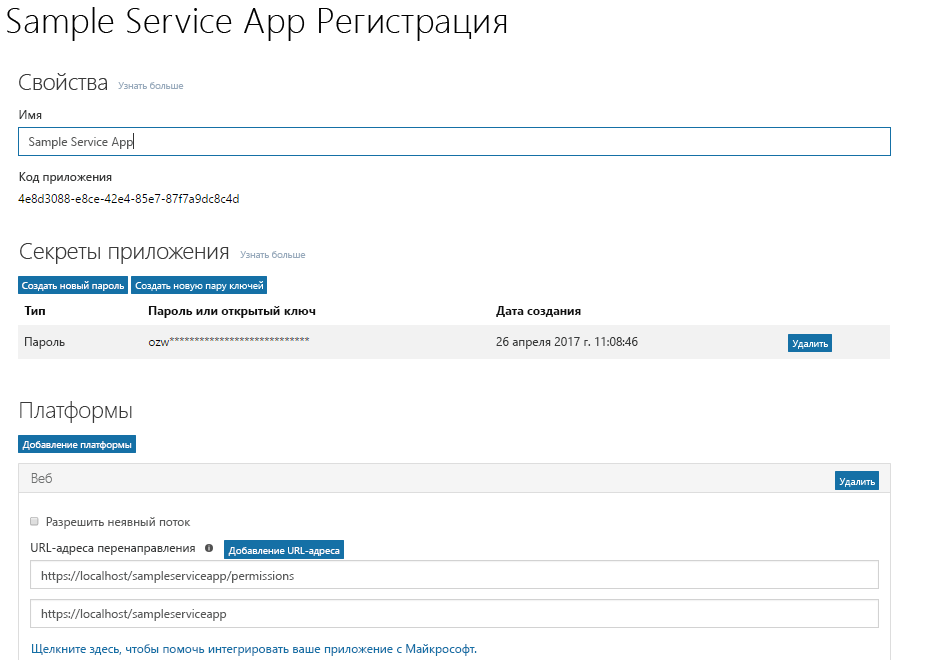
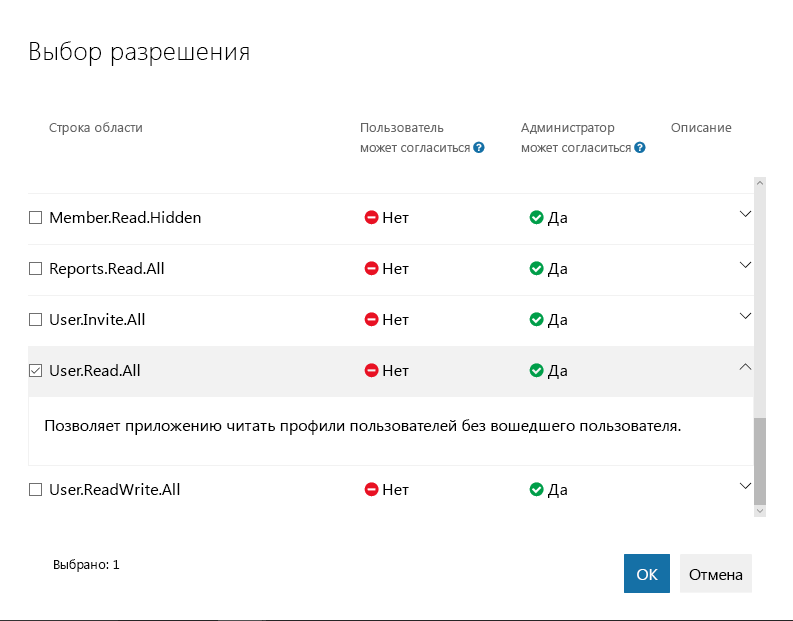

# <a name="get-access-without-a-user"></a><span data-ttu-id="b7e66-101">Получение доступа без пользователя</span><span class="sxs-lookup"><span data-stu-id="b7e66-101">Get access without a user</span></span>

<span data-ttu-id="b7e66-p101">Некоторые приложения вызывают Microsoft Graph от своего имени, а не от имени пользователя. Зачастую это фоновые службы и управляющие программы, которые работают на сервере без выполнившего вход пользователя. Примером таких приложений можно назвать службу архивации электронной почты, которая выходит из спящего режима и работает в течение ночи. В некоторых случаях приложения также могут вызывать Microsoft Graph от своего имени, когда пользователь выполнил вход. Например, приложению может потребоваться возможность, для использования которой нужны более высокие привилегии, чем те, которыми обладает пользователь.</span><span class="sxs-lookup"><span data-stu-id="b7e66-p101">Some apps call Microsoft Graph with their own identity and not on behalf of a user. In many cases, these are background services or daemons that run on a server without the presence of a signed-in user. An example of such an app might be an email archival service that wakes up and runs overnight. In some cases, apps that have a signed-in user present may also need to call Microsoft Graph under their own identity. For example, an app may need to use functionality that requires more elevated privileges in an organization than those carried by the signed-in user.</span></span>  

<span data-ttu-id="b7e66-p102">Приложения, которые вызывают Microsoft Graph от своего имени, используют поток предоставления учетных данных клиента OAuth 2.0 для получения токенов доступа из Azure AD. В этой статье мы расскажем, как настроить службу и использовать поток предоставления учетных данных клиента OAuth, чтобы получить токен доступа.</span><span class="sxs-lookup"><span data-stu-id="b7e66-p102">Apps that call Microsoft Graph with their own identity use the OAuth 2.0 client credentials grant flow to get access tokens from Azure AD. In this topic, we will walk through the basic steps to configure a service and use the OAuth client credentials grant flow to get an access token.</span></span> 

## <a name="authentication-and-authorization-steps"></a><span data-ttu-id="b7e66-109">Этапы аутентификации и авторизации</span><span class="sxs-lookup"><span data-stu-id="b7e66-109">Authentication and authorization steps</span></span>

<span data-ttu-id="b7e66-110">Чтобы настроить службу и получить токен из конечной точки Azure AD версии 2.0, необходимый службе для вызова Microsoft Graph от своего имени, нужно выполнить следующие действия:</span><span class="sxs-lookup"><span data-stu-id="b7e66-110">The basic steps required to configure a service and get a token from the Azure AD v2.0 endpoint that your service can use to call Microsoft Graph under its own identity are:</span></span>

1. <span data-ttu-id="b7e66-111">Регистрация приложения.</span><span class="sxs-lookup"><span data-stu-id="b7e66-111">Register your app.</span></span>
2. <span data-ttu-id="b7e66-112">Настройка разрешений для Microsoft Graph в приложении.</span><span class="sxs-lookup"><span data-stu-id="b7e66-112">Configure permissions for Microsoft Graph on your app.</span></span>
3. <span data-ttu-id="b7e66-113">Получение согласия администратора.</span><span class="sxs-lookup"><span data-stu-id="b7e66-113">Get administrator consent.</span></span>
4. <span data-ttu-id="b7e66-114">Получение маркера доступа.</span><span class="sxs-lookup"><span data-stu-id="b7e66-114">Get an access token.</span></span>
5. <span data-ttu-id="b7e66-115">Вызов Microsoft Graph с помощью маркера доступа.</span><span class="sxs-lookup"><span data-stu-id="b7e66-115">Use the access token to call Microsoft Graph.</span></span>

## <a name="1-register-your-app"></a><span data-ttu-id="b7e66-116">1. Регистрация приложения</span><span class="sxs-lookup"><span data-stu-id="b7e66-116">1. Register your app</span></span>

<span data-ttu-id="b7e66-p103">Чтобы обеспечить прохождение проверки подлинности в конечной точке Azure версии 2.0, необходимо сначала зарегистрировать приложение на [портале Майкрософт для регистрации приложений](https://apps.dev.microsoft.com/). Для регистрации приложения можно использовать либо учетную запись Майкрософт, либо рабочую или учебную учетную запись.</span><span class="sxs-lookup"><span data-stu-id="b7e66-p103">To authenticate with the Azure v2.0 endpoint, you must first register your app at the [Microsoft App Registration Portal](https://apps.dev.microsoft.com/). You can use either a Microsoft account or a work or school account to register your app.</span></span> 

<span data-ttu-id="b7e66-p104">На приведенном ниже рисунке показана регистрация веб-приложения, настроенного для фоновой службы. </span><span class="sxs-lookup"><span data-stu-id="b7e66-p104">The following screenshot shows a web app registration that has been configured for a background service. </span></span>

<span data-ttu-id="b7e66-121">Чтобы служба могла вызывать Microsoft Graph от своего имени, вам нужно зарегистрировать приложение для веб-платформы и скопировать следующие значения:</span><span class="sxs-lookup"><span data-stu-id="b7e66-121">For a service that will call Microsoft Graph under its own identity, you need to register your app for the Web platform and copy the following values:</span></span>

- <span data-ttu-id="b7e66-122">идентификатор приложения, назначенный порталом регистрации;</span><span class="sxs-lookup"><span data-stu-id="b7e66-122">The Application ID assigned by the app registration portal.</span></span>
- <span data-ttu-id="b7e66-123">секрет приложения — пароль либо открытый и закрытый ключ (сертификат);</span><span class="sxs-lookup"><span data-stu-id="b7e66-123">An Application Secret, either a password or a public/private key pair (certificate).</span></span>
- <span data-ttu-id="b7e66-124">URL-адрес перенаправления, с помощью которого служба будет получать ответы с маркерами от Azure AD;</span><span class="sxs-lookup"><span data-stu-id="b7e66-124">A Redirect URL for your service to receive token responses from Azure AD.</span></span>
- <span data-ttu-id="b7e66-125">URL-адрес перенаправления, с помощью которого служба будет получать ответы с согласием администратора, если в приложении реализованы функции для запроса согласия администратора.</span><span class="sxs-lookup"><span data-stu-id="b7e66-125">A Redirect URL for your service to receive admin consent responses if your app implements functionality to request administrator consent.</span></span>  

<span data-ttu-id="b7e66-126">Инструкции по настройке приложения на портале Майкрософт см. в статье [Регистрация приложения](./auth_register_app_v2.md).</span><span class="sxs-lookup"><span data-stu-id="b7e66-126">For steps on how to configure an app using the Microsoft App Registration Portal, see [Register your app](./auth_register_app_v2.md).</span></span>

<span data-ttu-id="b7e66-127">Когда используется поток предоставления учетных данных клиента OAuth 2.0, приложение проходит аутентификацию непосредственно в конечной точке `/token` Azure AD версии 2.0, используя идентификатор приложения, назначенный службой Azure AD, и секрет приложения, созданный вами на портале.</span><span class="sxs-lookup"><span data-stu-id="b7e66-127">With the OAuth 2.0 client credentials grant flow, your app authenticates directly at the Azure AD v2.0 `/token` endpoint using the Application ID assigned by Azure AD and the Application Secret that you create using the portal.</span></span> 

## <a name="2-configure-permissions-for-microsoft-graph"></a><span data-ttu-id="b7e66-128">2. Настройка разрешений для Microsoft Graph</span><span class="sxs-lookup"><span data-stu-id="b7e66-128">2. Configure permissions for Microsoft Graph</span></span>

<span data-ttu-id="b7e66-p105">Для приложений, вызывающих Microsoft Graph от своего имени, Microsoft Graph предоставляет специальные разрешения. (Microsoft Graph также предоставляет делегированные разрешения для приложений, вызывающих Microsoft Graph от имени пользователя.) Предварительная настройка разрешений приложения, необходимых вашему приложению, выполняется при его регистрации. Разрешения приложения всегда требуют согласия администратора. Администратор может согласиться предоставить эти разрешения на [портале Azure](https://portal.azure.com) во время установки приложения в организации. Вы также можете создать в приложении интерфейс регистрации, где администраторы могут соглашаться на предоставление заданных вами разрешений. Когда согласие администратора фиксируется в Azure AD, приложение может запрашивать маркеры, не требуя повторного согласия. Дополнительные сведения о разрешениях, доступных в Microsoft Graph, см. в [справочнике по разрешениям](./permissions_reference.md).</span><span class="sxs-lookup"><span data-stu-id="b7e66-p105">For apps that call Microsoft Graph under their own identity, Microsoft Graph exposes application permissions. (Microsoft Graph also exposes delegated permissions for apps that call Microsoft Graph on behalf of a user.) You pre-configure the application permissions your app needs when you register your app. Application permissions always require administrator consent. An administrator can either consent to these permissions using the [Azure portal](https://portal.azure.com) when your app is installed in their organization, or you can provide a sign-up experience in your app through which administrators can consent to the permissions you configured. Once administrator consent is recorded by Azure AD, your app can request tokens without having to request consent again. For more detailed information about the permissions available with Microsoft Graph, see the [Permissions reference](./permissions_reference.md)</span></span>

<span data-ttu-id="b7e66-135">Настроить разрешения приложения, необходимые вашему приложению, можно на [портале Майкрософт для регистрации приложений](https://apps.dev.microsoft.com/). Откройте раздел **Microsoft Graph**, выберите **Добавить** рядом с элементом **Разрешения приложения**, а затем выберите нужные разрешения в диалоговом окне **Выбор разрешений**.</span><span class="sxs-lookup"><span data-stu-id="b7e66-135">To configure application permissions for your app in the [Microsoft App Registration Portal](https://apps.dev.microsoft.com/): under **Microsoft Graph**, choose **Add** next to **Application Permissions** and then select the permissions your app requires in the **Select Permissions** dialog.</span></span>

<span data-ttu-id="b7e66-136">На приведенном ниже снимке экрана показано диалоговое окно **Выбор разрешений** с разрешениями приложения в Microsoft Graph.</span><span class="sxs-lookup"><span data-stu-id="b7e66-136">The following screenshot shows the **Select Permissions** dialog for Microsoft Graph application permissions.</span></span> 



> <span data-ttu-id="b7e66-p106">**Примечание.** Рекомендуем настроить минимальный набор разрешений, необходимый приложению. Это намного удобнее для администраторов, чем необходимость соглашаться на длинный список разрешений.</span><span class="sxs-lookup"><span data-stu-id="b7e66-p106">**Important**: We recommend configuring the least privileged set of permissions required by your app. This provides a much more comfortable experience for administrators than having to consent to a long list of permissions.</span></span>

## <a name="3-get-administrator-consent"></a><span data-ttu-id="b7e66-140">3. Получение согласия администратора</span><span class="sxs-lookup"><span data-stu-id="b7e66-140">3. Get administrator consent</span></span>

<span data-ttu-id="b7e66-141">Вы можете рассчитывать на то, что администратор предоставит разрешения, необходимые приложению, на [портале Azure](https://portal.azure.com). Однако зачастую лучший вариант — предоставить администраторам возможность регистрации с помощью конечной точки `/adminconsent` Azure AD версии 2.0.</span><span class="sxs-lookup"><span data-stu-id="b7e66-141">You can rely on an administrator to grant the permissions your app needs at the [Azure portal](https://portal.azure.com); however, often, a better option is to provide a sign-up experience for administrators by using the Azure AD v2.0 `/adminconsent` endpoint.</span></span> 

> <span data-ttu-id="b7e66-142">**Важно!** Когда вы вносите изменение в настроенные разрешения, их должен заново подтвердить администратор.</span><span class="sxs-lookup"><span data-stu-id="b7e66-142">**Important**: Any time you make a change to the configured permissions, you must also repeat the Admin Consent process.</span></span> <span data-ttu-id="b7e66-143">Изменения, внесенные на портале регистрации приложений, не вступят в силу, пока их не подтвердит администратор клиента.</span><span class="sxs-lookup"><span data-stu-id="b7e66-143">Changes made in the app registration portal will not be reflected until consent has been reapplied by the tenant's administrator.</span></span>

### <a name="request"></a><span data-ttu-id="b7e66-144">Запрос</span><span class="sxs-lookup"><span data-stu-id="b7e66-144">Request</span></span>

```
// Line breaks are for legibility only.

GET https://login.microsoftonline.com/{tenant}/adminconsent
?client_id=6731de76-14a6-49ae-97bc-6eba6914391e
&state=12345
&redirect_uri=http://localhost/myapp/permissions
```

| <span data-ttu-id="b7e66-145">Параметр</span><span class="sxs-lookup"><span data-stu-id="b7e66-145">Parameter</span></span>     | <span data-ttu-id="b7e66-146">Условие</span><span class="sxs-lookup"><span data-stu-id="b7e66-146">Condition</span></span>   | <span data-ttu-id="b7e66-147">Описание</span><span class="sxs-lookup"><span data-stu-id="b7e66-147">Description</span></span> 
|:--------------|:------------|:------------
| <span data-ttu-id="b7e66-148">tenant</span><span class="sxs-lookup"><span data-stu-id="b7e66-148">tenant</span></span>        | <span data-ttu-id="b7e66-149">Обязательный</span><span class="sxs-lookup"><span data-stu-id="b7e66-149">Required</span></span>    | <span data-ttu-id="b7e66-p108">Клиент каталога, у которого требуется запрашивать разрешения. Он может быть представлен в виде GUID или в формате понятного имени. Если вы не знаете, к какому клиенту относится пользователь, и хотите, чтобы он мог войти в любой клиент, используйте значение `common`.</span><span class="sxs-lookup"><span data-stu-id="b7e66-p108">The directory tenant that you want to request permission from. This can be in GUID or friendly name format. If you don't know which tenant the user belongs to and you want to let them sign in with any tenant, use `common`.</span></span> 
| <span data-ttu-id="b7e66-153">client_id</span><span class="sxs-lookup"><span data-stu-id="b7e66-153">client_id</span></span>     | <span data-ttu-id="b7e66-154">Обязательный</span><span class="sxs-lookup"><span data-stu-id="b7e66-154">Required</span></span>    | <span data-ttu-id="b7e66-155">Идентификатор приложения, назначенный [порталом регистрации приложений](https://apps.dev.microsoft.com/).</span><span class="sxs-lookup"><span data-stu-id="b7e66-155">The Application ID that the [Application Registration Portal](https://apps.dev.microsoft.com/) assigned to your app.</span></span> 
| <span data-ttu-id="b7e66-156">redirect_uri</span><span class="sxs-lookup"><span data-stu-id="b7e66-156">redirect_uri</span></span>  | <span data-ttu-id="b7e66-157">Обязательный</span><span class="sxs-lookup"><span data-stu-id="b7e66-157">Required</span></span>    | <span data-ttu-id="b7e66-p109">URI перенаправления, на который должен отправляться ответ для обработки приложением. Он должен в точности совпадать с одним из URI перенаправления, зарегистрированных на портале, и быть закодирован как URL-адрес. Может содержать дополнительные сегменты пути.</span><span class="sxs-lookup"><span data-stu-id="b7e66-p109">The redirect URI where you want the response to be sent for your app to handle. It must exactly match one of the redirect URIs that you registered in the portal, except that it must be URL encoded, and it can have additional path segments.</span></span> 
| <span data-ttu-id="b7e66-160">state</span><span class="sxs-lookup"><span data-stu-id="b7e66-160">state</span></span>         | <span data-ttu-id="b7e66-161">Рекомендуемый</span><span class="sxs-lookup"><span data-stu-id="b7e66-161">Recommended</span></span> | <span data-ttu-id="b7e66-p110">Значение, которое включается в запрос и возвращается в ответе с маркером. Это может быть строка с любым содержимым. Параметр state используется для кодирования сведений о состоянии пользователя в приложении до запрашивания проверки подлинности, например о просматриваемых странице и представлении.</span><span class="sxs-lookup"><span data-stu-id="b7e66-p110">A value that is included in the request that also is returned in the token response. It can be a string of any content that you want. The state is used to encode information about the user's state in the app before the authentication request occurred, such as the page or view they were on.</span></span> 

### <a name="administrator-consent-experience"></a><span data-ttu-id="b7e66-165">Предоставление согласия администратора</span><span class="sxs-lookup"><span data-stu-id="b7e66-165">Administrator consent experience</span></span>

<span data-ttu-id="b7e66-p111">В Azure AD действует правило, что только администратор клиента может подтвердить запрос к конечной точке `/adminconsent`. Администратору будет предложено утвердить все разрешения для приложения, запрошенные вами на портале регистрации.</span><span class="sxs-lookup"><span data-stu-id="b7e66-p111">With requests to the `/adminconsent` endpoint, Azure AD enforces that only a tenant administrator can sign in to complete the request. The administrator will be asked to approve all the application permissions that you have requested for your app in the app registration portal. The following is an example of the consent dialog that Azure AD presents to the administrator:</span></span> 

<span data-ttu-id="b7e66-168">Ниже представлен пример диалогового окна предоставления согласия, которое Azure AD отображает для администратора.</span><span class="sxs-lookup"><span data-stu-id="b7e66-168">The following is an example of the consent dialog that Azure AD presents to the administrator:</span></span>


### <a name="response"></a><span data-ttu-id="b7e66-170">Ответ</span><span class="sxs-lookup"><span data-stu-id="b7e66-170">Response</span></span>

<span data-ttu-id="b7e66-171">Если администратор утверждает разрешения для приложения, успешный ответ выглядит так:</span><span class="sxs-lookup"><span data-stu-id="b7e66-171">If the administrator approves the permissions for your application, the successful response looks like this:</span></span>

```
// Line breaks are for legibility only.

GET http://localhost/myapp/permissions
?tenant=a8990e1f-ff32-408a-9f8e-78d3b9139b95&state=state=12345
&admin_consent=True
```

| <span data-ttu-id="b7e66-172">Параметр</span><span class="sxs-lookup"><span data-stu-id="b7e66-172">Parameter</span></span>     | <span data-ttu-id="b7e66-173">Описание</span><span class="sxs-lookup"><span data-stu-id="b7e66-173">Description</span></span> 
|:--------------|:------------
| <span data-ttu-id="b7e66-174">tenant</span><span class="sxs-lookup"><span data-stu-id="b7e66-174">tenant</span></span>        | <span data-ttu-id="b7e66-175">Клиент каталога, который предоставил приложению запрашиваемые разрешения, в формате GUID.</span><span class="sxs-lookup"><span data-stu-id="b7e66-175">The directory tenant that granted your application the permissions that it requested, in GUID format.</span></span> 
| <span data-ttu-id="b7e66-176">state</span><span class="sxs-lookup"><span data-stu-id="b7e66-176">state</span></span>         | <span data-ttu-id="b7e66-p112">Значение, которое включается в запрос и возвращается в ответе с маркером. Это может быть строка с любым содержимым. Параметр state используется для кодирования сведений о состоянии пользователя в приложении до запрашивания проверки подлинности, например о просматриваемых странице и представлении.</span><span class="sxs-lookup"><span data-stu-id="b7e66-p112">A value that is included in the request that also is returned in the token response. It can be a string of any content that you want. The state is used to encode information about the user's state in the app before the authentication request occurred, such as the page or view they were on.</span></span> 
| <span data-ttu-id="b7e66-180">admin_consent</span><span class="sxs-lookup"><span data-stu-id="b7e66-180">admin_consent</span></span> | <span data-ttu-id="b7e66-181">Задано значение **true**.</span><span class="sxs-lookup"><span data-stu-id="b7e66-181">Set to **true**.</span></span> 


> <span data-ttu-id="b7e66-p113">**Попробуйте**. Вы можете проверить это самостоятельно, вставив приведенный ниже запрос в браузер. Если вы войдете как глобальный администратор клиента Azure AD, откроется диалоговое окно предоставления разрешений для приложения. Это будет другое приложение (не то, что показано на снимке экрана выше).</span><span class="sxs-lookup"><span data-stu-id="b7e66-p113">**Try** You can try this for yourself by pasting the request below in a browser. If you sign in as a Global administrator for an Azure AD tenant, you will be presented with the administrator consent dialog for the app. (This will be a different app than that in the consent dialog screenshot shown above.)</span></span>
> 
> <span data-ttu-id="b7e66-185">https://login.microsoftonline.com/common/adminconsent?client_id=6731de76-14a6-49ae-97bc-6eba6914391e&state=12345&redirect_uri=http://localhost/myapp/permissions</span><span class="sxs-lookup"><span data-stu-id="b7e66-185">https://login.microsoftonline.com/common/adminconsent?client_id=6731de76-14a6-49ae-97bc-6eba6914391e&state=12345&redirect_uri=http://localhost/myapp/permissions</span></span> 

## <a name="4-get-an-access-token"></a><span data-ttu-id="b7e66-186">4. Получение токена доступа</span><span class="sxs-lookup"><span data-stu-id="b7e66-186">4. Get an access token</span></span>

<span data-ttu-id="b7e66-187">В потоке предоставления учетных данных клиента OAuth 2.0 вы используете идентификатор и секрет приложения, сохраненные во время его регистрации, чтобы запросить токен доступа непосредственно из конечной точки `/token` Azure AD версии 2.0.</span><span class="sxs-lookup"><span data-stu-id="b7e66-187">In the OAuth 2.0 client credentials grant flow, you use the Application ID and Application Secret values that you saved when you registered your app to request an access token directly from the Azure AD v2.0 `/token` endpoint.</span></span>

<span data-ttu-id="b7e66-p114">Чтобы указать заранее настроенные разрешения, передайте значение `https://graph.microsoft.com/.default` для параметра `scope` в запросе на получение маркера. Дополнительные сведения см. в описании параметра `scope` в приведенном ниже запросе на получение маркера.</span><span class="sxs-lookup"><span data-stu-id="b7e66-p114">You specify the pre-configured permissions by passing `https://graph.microsoft.com/.default` as the value for the `scope` parameter in the token request. See the `scope` parameter description in the token request below for details.</span></span>

### <a name="token-request"></a><span data-ttu-id="b7e66-190">Запрос на получение маркера</span><span class="sxs-lookup"><span data-stu-id="b7e66-190">Token request</span></span>

<span data-ttu-id="b7e66-191">Чтобы получить маркер доступа, конечной точке `/token` версии 2.0 отправляется запрос POST.</span><span class="sxs-lookup"><span data-stu-id="b7e66-191">You send a POST request to the `/token` v2.0 endpoint to acquire an access token:</span></span>

```
// Line breaks are for legibility only.

POST /{tenant}/oauth2/v2.0/token HTTP/1.1
Host: login.microsoftonline.com
Content-Type: application/x-www-form-urlencoded

client_id=535fb089-9ff3-47b6-9bfb-4f1264799865
&scope=https%3A%2F%2Fgraph.microsoft.com%2F.default
&client_secret=qWgdYAmab0YSkuL1qKv5bPX
&grant_type=client_credentials
```

| <span data-ttu-id="b7e66-192">Параметр</span><span class="sxs-lookup"><span data-stu-id="b7e66-192">Parameter</span></span>     | <span data-ttu-id="b7e66-193">Условие</span><span class="sxs-lookup"><span data-stu-id="b7e66-193">Condition</span></span> | <span data-ttu-id="b7e66-194">Описание</span><span class="sxs-lookup"><span data-stu-id="b7e66-194">Description</span></span> 
|:--------------|:----------|:------------
| <span data-ttu-id="b7e66-195">tenant</span><span class="sxs-lookup"><span data-stu-id="b7e66-195">tenant</span></span>        | <span data-ttu-id="b7e66-196">Обязательный</span><span class="sxs-lookup"><span data-stu-id="b7e66-196">Required</span></span>  | <span data-ttu-id="b7e66-p115">Клиент каталога, у которого требуется запрашивать разрешения. Он может быть представлен в виде GUID или в формате понятного имени.</span><span class="sxs-lookup"><span data-stu-id="b7e66-p115">The directory tenant that you want to request permission from. This can be in GUID or friendly name format.</span></span> 
| <span data-ttu-id="b7e66-199">client_id</span><span class="sxs-lookup"><span data-stu-id="b7e66-199">client_id</span></span>     | <span data-ttu-id="b7e66-200">Обязательный</span><span class="sxs-lookup"><span data-stu-id="b7e66-200">Required</span></span>  | <span data-ttu-id="b7e66-201">Идентификатор приложения, назначенный [порталом Майкрософт для регистрации приложений](https://apps.dev.microsoft.com) при регистрации приложения.</span><span class="sxs-lookup"><span data-stu-id="b7e66-201">The Application ID that the [Microsoft App Registration Portal](https://apps.dev.microsoft.com) assigned when you registered your app.</span></span> 
| <span data-ttu-id="b7e66-202">scope</span><span class="sxs-lookup"><span data-stu-id="b7e66-202">scope</span></span>         | <span data-ttu-id="b7e66-203">Обязательный</span><span class="sxs-lookup"><span data-stu-id="b7e66-203">Required</span></span>  | <span data-ttu-id="b7e66-p116">Значение, передаваемое параметру `scope` этого запроса, должно представлять собой идентификатор (URI идентификатора приложения) нужного ресурса, дополненный суффиксом `.default`. Для Microsoft Graph используется значение `https://graph.microsoft.com/.default`. Это значение сообщает конечной точке 2.0, что из всех разрешений приложения, которые вы настроили для своего приложения, следует выдать токен для тех, которые связаны с нужным ресурсом.</span><span class="sxs-lookup"><span data-stu-id="b7e66-p116">The value passed for the `scope` parameter in this request should be the resource identifier (Application ID URI) of the resource you want, affixed with the `.default` suffix. For Microsoft Graph, the value is `https://graph.microsoft.com/.default`. This value informs the v2.0 endpoint that of all the application permissions you have configured for your app, it should issue a token for the ones associated with the resource you want to use.</span></span> 
| <span data-ttu-id="b7e66-207">client_secret</span><span class="sxs-lookup"><span data-stu-id="b7e66-207">client_secret</span></span> | <span data-ttu-id="b7e66-208">Обязательный</span><span class="sxs-lookup"><span data-stu-id="b7e66-208">Required</span></span>  | <span data-ttu-id="b7e66-209">Секрет приложения, созданный на портале регистрации приложений.</span><span class="sxs-lookup"><span data-stu-id="b7e66-209">The Application Secret that you generated for your app in the app registration portal.</span></span> 
| <span data-ttu-id="b7e66-210">grant_type</span><span class="sxs-lookup"><span data-stu-id="b7e66-210">grant_type</span></span>    | <span data-ttu-id="b7e66-211">Обязательный</span><span class="sxs-lookup"><span data-stu-id="b7e66-211">Required</span></span>  | <span data-ttu-id="b7e66-212">Должно быть задано значение `client_credentials`.</span><span class="sxs-lookup"><span data-stu-id="b7e66-212">Must be `client_credentials`.</span></span> 

#### <a name="token-response"></a><span data-ttu-id="b7e66-213">Ответ с маркером</span><span class="sxs-lookup"><span data-stu-id="b7e66-213">Token response</span></span>

<span data-ttu-id="b7e66-214">Успешный ответ выглядит так:</span><span class="sxs-lookup"><span data-stu-id="b7e66-214">A successful response looks like this:</span></span>

```json
{
  "token_type": "Bearer",
  "expires_in": 3599,
  "access_token": "eyJ0eXAiOiJKV1QiLCJhbGciOiJSUzI1NiIsIng1dCI6Ik1uQ19WWmNBVGZNNXBP..."
}
```

| <span data-ttu-id="b7e66-215">Параметр</span><span class="sxs-lookup"><span data-stu-id="b7e66-215">Parameter</span></span>     | <span data-ttu-id="b7e66-216">Описание</span><span class="sxs-lookup"><span data-stu-id="b7e66-216">Description</span></span> 
|:--------------|:------------
| <span data-ttu-id="b7e66-217">access_token</span><span class="sxs-lookup"><span data-stu-id="b7e66-217">access_token</span></span>  | <span data-ttu-id="b7e66-p117">Запрашиваемый маркер доступа. Приложение может использовать его в вызовах Microsoft Graph.</span><span class="sxs-lookup"><span data-stu-id="b7e66-p117">The requested access token. Your app can use this token in calls to Microsoft Graph.</span></span> 
| <span data-ttu-id="b7e66-220">token_type</span><span class="sxs-lookup"><span data-stu-id="b7e66-220">token_type</span></span>    | <span data-ttu-id="b7e66-p118">Указывает значение типа маркера. Azure AD поддерживает только тип `bearer`.</span><span class="sxs-lookup"><span data-stu-id="b7e66-p118">Indicates the token type value. The only type that Azure AD supports is `bearer`.</span></span> 
| <span data-ttu-id="b7e66-223">expires_in</span><span class="sxs-lookup"><span data-stu-id="b7e66-223">expires_in</span></span>    | <span data-ttu-id="b7e66-224">Срок действия маркера доступа (в секундах).</span><span class="sxs-lookup"><span data-stu-id="b7e66-224">How long the access token is valid (in seconds).</span></span> 

## <a name="5-use-the-access-token-to-call-microsoft-graph"></a><span data-ttu-id="b7e66-225">5. Вызов Microsoft Graph с помощью маркера доступа</span><span class="sxs-lookup"><span data-stu-id="b7e66-225">5. Use the access token to call Microsoft Graph</span></span>

<span data-ttu-id="b7e66-p119">Получив маркер доступа, вы можете вызвать Microsoft Graph, включив его в заголовок `Authorization` запроса. Приведенный ниже запрос получает профиль определенного пользователя. Для вызова этого API приложению необходимо разрешение _User.Read.All_.</span><span class="sxs-lookup"><span data-stu-id="b7e66-p119">Once you have an access token, you can use it to call Microsoft Graph by including it in the `Authorization` header of a request. The following request gets the profile of a specific user. Your app must have the _User.Read.All_ permission to call this API.</span></span>

```
GET https://graph.microsoft.com/v1.0/user/12345678-73a6-4952-a53a-e9916737ff7f 
Authorization: Bearer eyJ0eXAiO ... 0X2tnSQLEANnSPHY0gKcgw
Host: graph.microsoft.com
```
<span data-ttu-id="b7e66-229">Успешный отклик выглядит примерно так (некоторые заголовки были удалены):</span><span class="sxs-lookup"><span data-stu-id="b7e66-229">A successful response will look similar to this (some response headers have been removed):</span></span>

```http
HTTP/1.1 200 OK
Content-Type: application/json;odata.metadata=minimal;odata.streaming=true;IEEE754Compatible=false;charset=utf-8
request-id: f45d08c0-6901-473a-90f5-7867287de97f
client-request-id: f45d08c0-6901-473a-90f5-7867287de97f
OData-Version: 4.0
Duration: 309.0273
Date: Wed, 26 Apr 2017 19:53:49 GMT
Content-Length: 407
```

```json
{
    "@odata.context":"https://graph.microsoft.com/v1.0/$metadata#users/$entity",
    "id":"12345678-73a6-4952-a53a-e9916737ff7f",
    "businessPhones":[
        "+1 555555555"
    ],
    "displayName":"Chris Green",
    "givenName":"Chris",
    "jobTitle":"Software Engineer",
    "mail":null,
    "mobilePhone":"+1 5555555555",
    "officeLocation":"Seattle Office",
    "preferredLanguage":null,
    "surname":"Green",
    "userPrincipalName":"ChrisG@contoso.onmicrosoft.com"
}
```

## <a name="supported-app-scenarios-and-resources"></a><span data-ttu-id="b7e66-230">Поддерживаемые сценарии приложений и ресурсы</span><span class="sxs-lookup"><span data-stu-id="b7e66-230">Supported app scenarios and resources</span></span>

<span data-ttu-id="b7e66-231">Приложения, вызывающие Microsoft Graph от своего имени, делятся на две категории:</span><span class="sxs-lookup"><span data-stu-id="b7e66-231">Apps that call Microsoft Graph under their own identity fall into one of two categories:</span></span>

- <span data-ttu-id="b7e66-232">Фоновые службы (управляющие программы), которые работают на сервере без выполнившего вход пользователя.</span><span class="sxs-lookup"><span data-stu-id="b7e66-232">Background services (daemons) that run on a server without a signed-in user.</span></span>
- <span data-ttu-id="b7e66-233">Приложения также могут вызывать Microsoft Graph от своего имени, если пользователь выполнил вход, например для использования функций, требующих более высоких привилегий, чем те, которыми обладает пользователь.</span><span class="sxs-lookup"><span data-stu-id="b7e66-233">Apps that have a signed-in user but also call Microsoft Graph with their own identity; for example, to use functionality that requires more elevated privileges than those of the user.</span></span>

<span data-ttu-id="b7e66-p120">Приложения, которые вызывают Microsoft Graph от своего имени, используют поток предоставления учетных данных клиента OAuth 2.0, чтобы пройти аутентификацию в Azure AD и получить токен. Чтобы подробнее изучить этот сценарий, используйте следующие материалы по конечной точке версии 2.0:</span><span class="sxs-lookup"><span data-stu-id="b7e66-p120">Apps that call Microsoft Graph with their own identity use the OAuth 2.0 client credentials grant to authenticate with Azure AD and get a token. For the v2.0 endpoint, you can explore this scenario further with the following resources:</span></span>

- <span data-ttu-id="b7e66-236">Более полный вариант потока предоставления учетных данных клиента, который также включает отклики с сообщениями об ошибках, см. в статье [Azure Active Directory версии 2.0 и поток учетных данных клиента OAuth 2.0](https://docs.microsoft.com/azure/active-directory/develop/active-directory-v2-protocols-oauth-client-creds).</span><span class="sxs-lookup"><span data-stu-id="b7e66-236">For a more complete treatment of the client credentials grant flow that also includes error responses, see [Azure Active Directory v2.0 and the OAuth 2.0 client credentials flow](https://docs.microsoft.com/azure/active-directory/develop/active-directory-v2-protocols-oauth-client-creds).</span></span> 
- <span data-ttu-id="b7e66-237">Пример вызова Microsoft Graph из службы представлен в [образце управляющей программы версии 2.0](https://github.com/Azure-Samples/active-directory-dotnet-daemon-v2) на сайте GitHub.</span><span class="sxs-lookup"><span data-stu-id="b7e66-237">For a sample that calls Microsoft Graph from a service, see the [v2.0 daemon sample](https://github.com/Azure-Samples/active-directory-dotnet-daemon-v2) on GitHub.</span></span>
- <span data-ttu-id="b7e66-238">Дополнительные сведения о рекомендуемых библиотеках проверки подлинности (как от корпорации Майкрософт, так и от сторонних разработчиков) для Azure AD версии 2.0 см. в статье [Библиотеки проверки подлинности Azure Active Directory версии 2.0](https://docs.microsoft.com/azure/active-directory/develop/active-directory-v2-libraries).</span><span class="sxs-lookup"><span data-stu-id="b7e66-238">For more information about recommended Microsoft and third-party authentication libraries for Azure AD v2.0, see [Azure Active Directory v2.0 authentication libraries](https://docs.microsoft.com/azure/active-directory/develop/active-directory-v2-libraries).</span></span>

## <a name="azure-ad-endpoint-considerations"></a><span data-ttu-id="b7e66-239">Рекомендации, связанные с конечной точкой Azure AD</span><span class="sxs-lookup"><span data-stu-id="b7e66-239">Azure AD endpoint considerations</span></span>

<span data-ttu-id="b7e66-240">Если используется конечная точка Azure AD, настройка приложения и его вход в Azure AD выполняются немного по-другому:</span><span class="sxs-lookup"><span data-stu-id="b7e66-240">If you are using the Azure AD endpoint, there are some differences in the way that you configure your app and the way that it signs in to Azure AD:</span></span>

- <span data-ttu-id="b7e66-p121">Вы настраиваете приложение с помощью [портала Azure](https://portal.azure.com). Дополнительные сведения о настройке приложений на портале Azure см. в разделе [Интеграция приложений с Azure Active Directory: добавление приложения](https://docs.microsoft.com/azure/active-directory/develop/active-directory-integrating-applications#adding-an-application).</span><span class="sxs-lookup"><span data-stu-id="b7e66-p121">You use the [Azure portal](https://portal.azure.com) to configure your app. For more information about configuring apps with the Azure portal, see [Integrating applications with Azure Active Directory: Adding an application](https://docs.microsoft.com/azure/active-directory/develop/active-directory-integrating-applications#adding-an-application)</span></span>
- <span data-ttu-id="b7e66-243">Если приложение является мультитенантным, необходимо в явной форме настроить его как таковое на [портале Azure](https://portal.azure.com).</span><span class="sxs-lookup"><span data-stu-id="b7e66-243">If your app is a multi-tenant app, you must explicitly configure it to be multi-tenant at the [Azure portal](https://portal.azure.com).</span></span>
- <span data-ttu-id="b7e66-p122">Конечная точка согласия администратора (`/adminconsent`) отсутствует. Вместо этого приложение может запрашивать согласие администратора, добавляя параметр `prompt=admin_consent` к запросу на авторизацию. Дополнительные сведения см. в разделе **Активация инфраструктуры согласия Azure AD во время выполнения** статьи [Интеграция приложений с Azure Active Directory](https://docs.microsoft.com/azure/active-directory/develop/active-directory-integrating-applications).</span><span class="sxs-lookup"><span data-stu-id="b7e66-p122">There is no admin consent endpoint (`/adminconsent`), instead, your app can request administrator consent during runtime by adding the `prompt=admin_consent` parameter to an authorization request. For more information, see **Triggering the Azure AD consent framework at runtime** in [Integrating applications with Azure Active Directory](https://docs.microsoft.com/azure/active-directory/develop/active-directory-integrating-applications).</span></span>
- <span data-ttu-id="b7e66-p123">В запросах на авторизацию и получение маркеров используются другие параметры. Например, в запросах конечной точки Azure AD нет параметра `scope`. Вместо него используется параметр `resource`, чтобы указать URI ресурса (`resource=https://graph.microsoft.com`), для которого запрашивается маркер авторизации (для согласия администратора).</span><span class="sxs-lookup"><span data-stu-id="b7e66-p123">The parameters in authorization and token requests are different. For example, there is no `scope` parameter in Azure AD endpoint requests; instead, the `resource` parameter is used to specify the URI of the resource (`resource=https://graph.microsoft.com`) that authorization (for administrator consent) or a token is being requested for.</span></span>

<span data-ttu-id="b7e66-248">В случае конечной точки Azure AD вы можете подробнее исследовать этот сценарий с помощью указанных ниже ресурсов.</span><span class="sxs-lookup"><span data-stu-id="b7e66-248">For the Azure AD endpoint, you can explore this scenario further with the following resources:</span></span>

- <span data-ttu-id="b7e66-249">Быстрые ссылки на подробное описание, общие сведения и примеры, касающиеся потока предоставления учетных данных клиента, вы найдете в подразделе **Обмен между службами** раздела **Начало работы** в статье [Azure Active Directory для разработчиков](https://docs.microsoft.com/azure/active-directory/develop/active-directory-developers-guide).</span><span class="sxs-lookup"><span data-stu-id="b7e66-249">For quick links to an overview, samples, and a detailed treatment of the client credentials grant flow, see **Service-to-Service** in the **Getting Started section** in [Azure Active Directory for Developers](https://docs.microsoft.com/azure/active-directory/develop/active-directory-developers-guide).</span></span>
- <span data-ttu-id="b7e66-p124">Для конечной точки Azure AD можно использовать библиотеку проверки подлинности Azure Active Directory (ADAL), чтобы получать маркеры из Azure AD. Библиотека ADAL доступна на нескольких платформах, включая .NET, iOS, Android, JavaScript, Java и Node.js. Дополнительные сведения о библиотеке ADAL и других библиотеках проверки подлинности от корпорации Майкрософт для конечной точки Azure AD см. в статье [Библиотеки проверки подлинности Azure Active Directory](https://docs.microsoft.com/azure/active-directory/develop/active-directory-authentication-libraries).</span><span class="sxs-lookup"><span data-stu-id="b7e66-p124">For the Azure AD endpoint, you can use the Azure Active Directory Authentication Library (ADAL) to get tokens from Azure AD. ADAL is available for several platforms including .NET, iOS, Android, JavaScript, Java, and Node.js. For more information about ADAL and other Microsoft authentication libraries for the Azure AD endpoint, see [Azure Active Directory Authentication Libraries](https://docs.microsoft.com/azure/active-directory/develop/active-directory-authentication-libraries).</span></span> 

 
