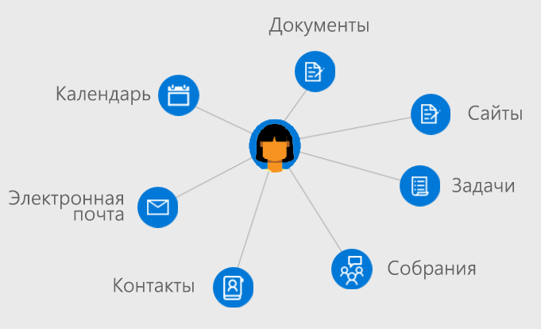

# Обзор пользователей в Microsoft GraphOverview of users in Microsoft Graph

Пользователи — это представления рабочих или учебных учетных записей Azure Active Directory (Azure AD) либо учетных записей Майкрософт в Microsoft Graph.Users are the representation of an Azure Active Directory (Azure AD) work or school user account or a Microsoft account in Microsoft Graph. Ресурс **user** в Microsoft Graph — это центр, из которого вы можете получить доступ к связям и ресурсам, релевантным для ваших пользователей.The **user** resource in Microsoft Graph is a hub from which you can access the relationships and resources that are relevant to your users.

## Разработка приложений, ориентированных на пользователейDevelop user-centric applications

С помощью Microsoft Graph вы можете получить доступ к связям, документам, контактам и настройкам, контекстно-релевантным для пользователя, вошедшего в систему.You can use Microsoft Graph to access the relationships, documents, contacts, and preferences that are contextually relevant to the signed-in user. Ресурс **user** обеспечивает простой способ доступа к ресурсам пользователя и работы с ними без необходимости совершать дополнительные вызовы, искать информацию о проверке подлинности и отправлять запросы непосредственно к другим ресурсам Microsoft Graph.The **user** resource provides straightforward way for you to access and manipulate user resources without having to perform additional calls, look up specific authentication information, and directly issue queries against other Microsoft Graph resources.

Чтобы получить доступ к информации и данным пользователя, вам потребуется [получить доступ к этим ресурсам от его имени](auth-v2-user.md).To access a user's information and data, you'll need to [get access on their behalf](auth-v2-user.md). Благодаря проверке подлинности приложения с помощью [согласия администратора](permissions-reference.md) вы можете работать с широким спектром объектов, сопоставленных с пользователем, и изменять их.Authenticating your application with [admin consent](permissions-reference.md) enables you to work with and update a wider range of entities associated with a user.

### Управление организациейManage your organization

Вы можете создавать пользователей в своей организации или изменять ресурсы и связи для существующих пользователей.Create new users in your organization or update the resources and relationships for existing users. С помощью Microsoft Graph вы можете выполнять указанные ниже задачи по управлению пользователями.You can use Microsoft Graph to perform the following user management tasks: 

- Создавать и удалять пользователей в вашей организации Azure AD.Create or delete users in your Azure AD organization.
- Составлять список членства пользователя в группах и определять, является ли пользователь участником какой-либо группы.List a user's group memberships and determine whether a user is a member of a group.
- Составлять список пользователей, подчиняющихся определенному пользователю и назначать менеджеров пользователю.List the users who report to a user and assign managers to a user.
- Отправлять или получать фотографию пользователя.Upload or retrieve a photo for the user.

### Работа с календарями и задачамиWork with calendars and tasks

Вы можете просматривать и изменять календарь и группы календарей, сопоставленные с пользователям, а также отправлять в них запросы. Кроме того, вы можете выполнять указанные ниже действия.You can view, query, and update user calendar and calendar groups associated with a user, including:

- Отображать списки событий и создавать события в календаре пользователя.List and create events on a users calendar.
- Просматривать задачи, назначенные пользователю.View tasks assigned to a user.
- Находить свободное время для собраний с участием нескольких пользователей.Find free meeting times for a set of users.
- Получать список напоминаний, установленных в календаре пользователя.Get a list of reminders set on a user's calendar.

### Администрирование почты и обработка контактовAdminister mail and handle contacts

Вы можете настраивать параметры почты и списки контактов пользователя, а также отправлять почту от имени пользователя. Кроме того, вы можете выполнять указанные ниже действия.You can configure user mail settings and contact lists and send mail on a user's behalf, including:

- Отображать почтовые сообщения и отправлять новые сообщения.List mail messages and send new mail.
- Создавать и отображать контакты пользователя и упорядочивать их в папках.Create and list user contacts and organize contacts in folders.
- Получать и изменять папки и параметры почтовых ящиков.Retrieve and update mailbox folders and settings.

### Дополнять возможности приложения аналитикой пользователяEnrich your app with user insights

Добиться максимальной релевантности в приложении, показывая недавно использованные или популярные документы и контакты, связанные с пользователем.Maximize relevance in your application by promoting recently used or trending documents and contacts associated with a user. С помощью Microsoft Graph вы можете выполнять указанные ниже действия.You can use Microsoft Graph to:

- Возвращать документы, недавно просмотренные и измененные каким-либо пользователем.Return documents recently viewed and modified by a user.
- Возвращать популярные документы и сайты, связанные с активностью пользователя.Return documents and sites trending around a user's activity.
- Отображать документы, доступ к которым предоставлен пользователю в электронных письмах или в OneDrive для бизнеса.List documents shared with a user through email or OneDrive for Business.

## Справочные материалы по APIAPI reference
Ищете справочные материалы по API для этой службы?Looking for the API reference for this service?

- [API пользователей в Microsoft Graph 1.0Users API in Microsoft Graph v1.0](/graph/api/resources/users?view=graph-rest-1.0)
- [API пользователей в бета-версии Microsoft GraphUsers API in Microsoft Graph beta](/graph/api/resources/users?view=graph-rest-beta)

## Дальнейшие действияNext steps

- Узнайте больше о том, как [работать с пользователями](/graph/api/resources/users?view=graph-rest-1.0).Learn more about how to [work with users](/graph/api/resources/users?view=graph-rest-1.0).
- Проанализируйте собственные данные из ресурса **user** в [песочнице Graph](https://developer.microsoft.com/graph/graph-explorer).Explore your own data from the **user** resource in the [Graph Explorer](https://developer.microsoft.com/graph/graph-explorer).
- Выполняйте аутентификацию с помощью Microsoft Graph [от имени пользователя](auth-v2-user.md) или [с использованием управляющей программы или службы с согласия администратора](auth-v2-service.md).Authenticate with Microsoft Graph [on behalf of a user](auth-v2-user.md) or [as a daemon or service by consent of an administator](auth-v2-service.md).
- Настройте управление доступом и политики доступа для пользователей с помощью [API Azure AD](/graph/api/resources/azure-ad-overview?view=graph-rest-1.0).Set access control and policies for users with the [Azure AD API](/graph/api/resources/azure-ad-overview?view=graph-rest-1.0).
- Просмотрите [разрешения](permissions-reference.md), которые потребуются вашему приложению для доступа к данным пользователей.Review the [permissions](permissions-reference.md) your app will need to access user data. 
<!-- This isn't really a next step; let's remove to keep the list of links concise.>
- Stay up to date with Microsoft Graph [changelog](changelog.md).
-->
