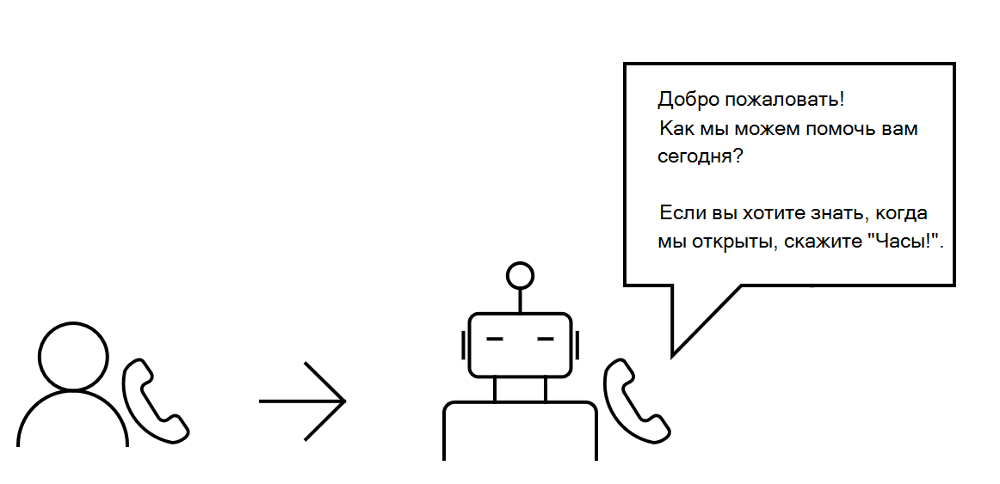

# Общие сведения об API облачных коммуникаций

API облачных коммуникаций в Microsoft Graph добавляет новое измерение взаимодействия приложений и служб с пользователями с помощью различных функций, связанных с коммуникацией, таких как звонки и собрания по сети. Развивайте свой бизнес, ускоряя реагирование на потребности клиентов и совместную работу сотрудников.

Сведения о преимуществах использования API облачных коммуникаций для создания приложений [службы (](https://microsoftgraph.github.io/microsoft-graph-comms-samples/docs/articles/calls/register-calling-bot.html?q=create%20bot)ботов) см. в следующих разделах.

## Обработка входящих вызовов

Иногда сотрудники получают много бизнес-звонков и не могут отвечать на все из них или продуктивно отвечать на них. Бот может выступать в качестве помощника по рескрипторам и обрабатывать эти вызовы, отклоняя такие вызовы, как спам, и перенаправляя (перенаправляя) определенные вызовы на другой номер.

API облачных коммуникаций можно использовать для выполнения следующих функций:

- Чтобы пользователь [вызывал бота через](/graph/api/application-post-calls) VoIP.
- При необходимости бот [перенаправляет входящий](/graph/api/call-redirect) вызов соответствующему агенту.
- Ответ [бота или](/graph/api/call-answer) [отклонение](/graph/api/call-reject) вызова.

## Упрощение взаимодействия с клиентами

Независимо от того, являетесь ли вы владельцем крупной службы технической поддержки или небольшого онлайн-магазина, может быть сложно обрабатывать несколько запросов клиентов, особенно если у вас нет контекста того, какую проблему они пытаются решить заранее. Обработка входящих звонков от клиентов **через систему** интерактивного голосового ответа (IVR), в которой бот изначально будет взаимодействовать с ними.

Когда клиенту будет предложено получить ответ от бота, он может нажать клавишу на клавиатуре, соответствующую выбранному пользователю. Затем бот может собрать от клиента многочастотную функцию DTMF.

API облачных коммуникаций можно использовать для создания бота, который:

- [Отвечает на звонок](/graph/api/call-answer) от клиента.
- [Воспроизводит запрос на](/graph/api/call-playprompt) информирование и запрос клиента на выбор.
- [Подписывается на тон,](/graph/api/call-subscribetotone) чтобы собрать DTMF от клиента.
- [Передает клиента](/graph/api/call-transfer) агенту.
- [Завершает звонок с](/graph/api/call-delete) клиентом.

Чтобы создать более интеллектуальное взаимодействие между клиентами и ботом, когда клиенту будет предложено получить ответ, он сможет напрямую говорить о том, с чем ему нужна помощь.

Интеграция со службой обработки естественного языка означает, что речь клиента может быть проанализирована на тональность. Затем бот может отвечать на запросы клиента соответствующим образом.

> [!NOTE]
> Вы не можете записывать или иным образом сохранять содержимое мультимедиа из звонков или собраний, к которые ваше приложение получает доступ, или данные, полученные из этого содержимого мультимедиа. Убедитесь, что вы соответствуете законам и нормативным требованиям вашей области в отношении защиты данных и конфиденциальности обмена данными. Дополнительные сведения можно узнать из [условий использования](/legal/microsoft-apis/terms-of-use) и обратившись за юридической помощью.

API облачных коммуникаций можно использовать для создания бота, который:

- [Отвечает на звонок](/graph/api/call-answer) от клиента.
- [Воспроизводит запрос на](/graph/api/call-playprompt) информирование и предложение клиенту говорить.
- [Записывает короткий аудиоклип](/graph/api/call-record) речи клиента.
- [Воспроизводит запрос](/graph/api/call-playprompt) с соответствующим ответом клиенту после анализа речи.

## Совместная работа с помощью групповых вызовов
Разрешите пользователям взаимодействовать с коллегами или клиентами, создав групповой звонок, чтобы все могли участвовать в беседе.

API облачных коммуникаций можно использовать для создания бота, который:

- [Создает групповой вызов с](/graph/api/application-post-calls#example-3-create-a-group-call-with-service-hosted-media) несколькими участниками.
- [Приглашает другого бота или пользователя](/graph/api/participant-invite) к существующему групповому вызову.
- [Присоединяет существующий групповой вызов](/graph/api/application-post-calls#example-5-join-scheduled-meeting-with-service-hosted-media) в качестве бота.
- [Выводит список участников](/graph/api/call-list-participants) группового вызова.
- [Отключает другого участника](/graph/api/participant-mute).

## Надежный отправка напоминаний
Чтобы пользователи могли отправлять клиентам напоминания о встрече или напоминания о приближении крайнего срока оплаты, вы можете автоматически вызвать клиента ботом. <!--If the customer misses the call, it will leave a voicemail with the automated message. (Add this back once bot to PSTN calling works)-->

API облачных коммуникаций можно использовать для создания бота, который:

- [Вызывает клиента в](/graph/api/application-post-calls) Teams.
- [Воспроизводит записанный запрос](/graph/api/call-playprompt) , который будет служить напоминанием.
- [Завершает вызов](/graph/api/call-delete).

## Организация собраний по сети
При планировании собрания между пациентом и пациентом или между пользователем и его прямыми отчетами можно создавать решения, которые создают собрания, на которые могут полагаться пользователи. Для дополнительной гибкости пользователи могут вызывать других пользователей и приглашать их на собрание во время его выполнения.

API облачных коммуникаций можно использовать для выполнения следующих функций:

- Пользователь должен [создать собрание по сети](/graph/api/application-post-onlinemeetings).
- Пользователь должен [получить сведения](/graph/api/onlinemeeting-get) о собрании по сети.
- Присоедините бота или пользователя [к собранию по сети](/graph/api/application-post-calls#example-5-join-scheduled-meeting-with-service-hosted-media).

## Справочные материалы по API

Ищете справочные материалы по API для этой службы?

- [API облачных коммуникаций в Microsoft Graph версии 1.0](/graph/api/resources/communications-api-overview?view=graph-rest-1.0&preserve-view=true)
- [API облачных коммуникаций в бета-версии Microsoft Graph](/graph/api/resources/communications-api-overview?view=graph-rest-beta&preserve-view=true)

## Дальнейшие действия

- Используйте боты, [чтобы приступить к работе](cloud-communications-get-started.md).
- Узнайте больше о [звонках](cloud-communications-calls.md), [мультимедиа](cloud-communications-media.md) и [собраниях по сети](cloud-communications-online-meetings.md).
- Просмотр ограничений на [использование](throttling-limits.md#cloud-communication-service-limits) API.
- Узнайте, как [управлять номерами телефонов](cloud-communications-phone-number.md) для ботов.

## См. также

- [Разрешения приложений и делегированные разрешения](/azure/active-directory/develop/v1-permissions-and-consent)
- [Разрешения звонков](./permissions-reference.md#calls-permissions)
- [Разрешения на собрания по сети](./permissions-reference.md#online-meetings-permissions)
- [Примеры API облачных коммуникаций](https://github.com/microsoftgraph/microsoft-graph-comms-samples)
