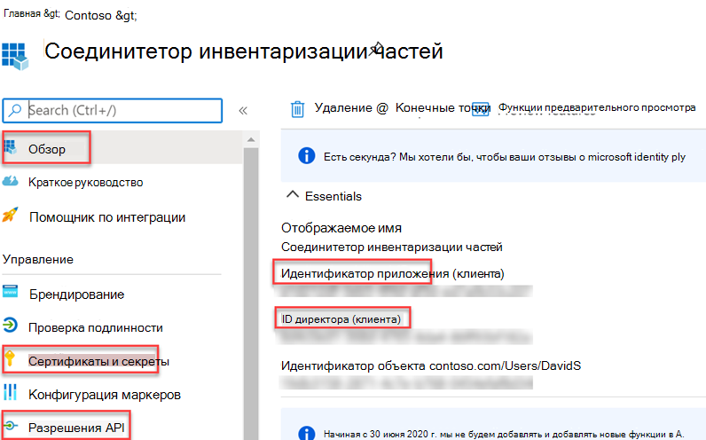
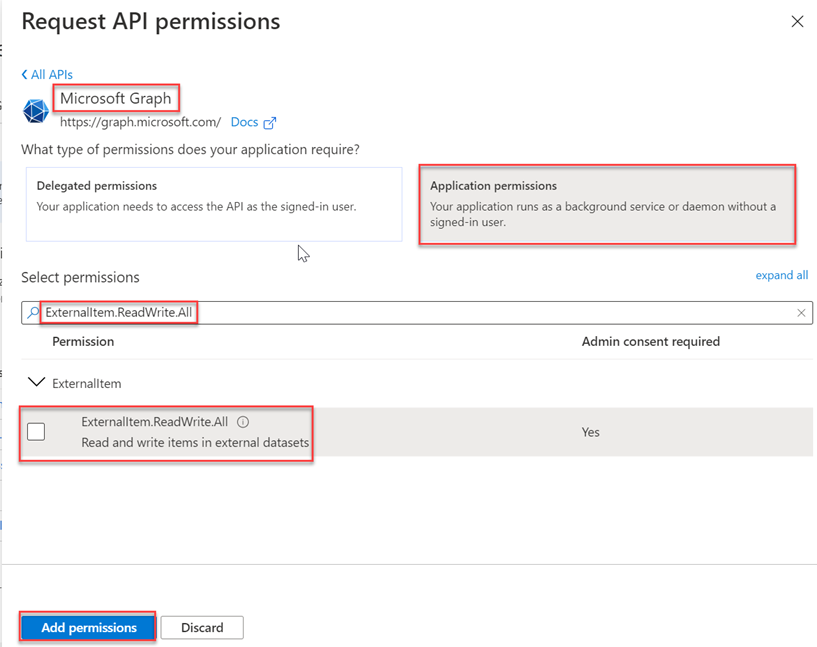

<!-- markdownlint-disable MD002 MD041 -->

После того как все необходимые условия будут созданы, вы сможете зарегистрировать приложение в центре администрирования Azure AD. Регистрация необходима для проверки подлинности приложения и его использования для звонков в API соединителов Microsoft Graph.

1. Перейдите в [центр Azure Active Directory администратора](https://aad.portal.azure.com/) и войдите в учетную запись администратора.
2. На левой области выберите **Azure Active Directory,** а в статье **Управление** выберите **регистрации приложений.**
3. Выберите **Новая регистрация**.

    

4. **Заполняем форму приложения Register** со следующими значениями, а затем выберите **Register**.

    А. **Имя:** Соединители запасов частей

    Б. **Поддерживаемые типы** учетных записей. Учетные записи только в этом организационном каталоге (только Microsoft — один клиент)

    c. **Перенаправление URI:** оставьте пустым

    

5. На странице обзор соединители запасов частей скопируйте значения **ID приложения (клиента) и directory (tenant) ID.** Вам потребуется и то, и другое в следующем разделе.

    

6. Выберите **разрешения API в** статье **Управление**.
7. Выберите **Добавить разрешение,** а затем выберите **Microsoft Graph.**
8. Выберите **разрешения приложения,** а затем выберите **разрешение ExternalItem.ReadWrite.All.** Выберите **Добавить разрешения**.

    

9. Выберите **согласие администратора гранта для {TENANT},** а затем выберите **Да** при запросе.

    

10. Выберите **секреты &amp; сертификатов в** статье **Управление,** а затем выберите новый секрет **клиента.**
11. Введите описание и выберите срок действия секрета, а затем выберите **Добавить**.

    

12. Скопируйте и сохраните новый секрет, он потребуется в следующем разделе.
