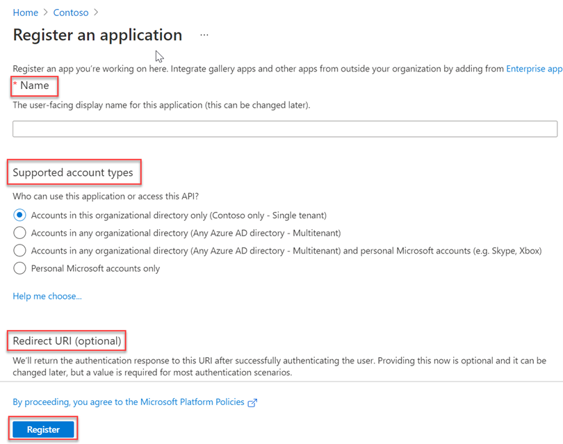
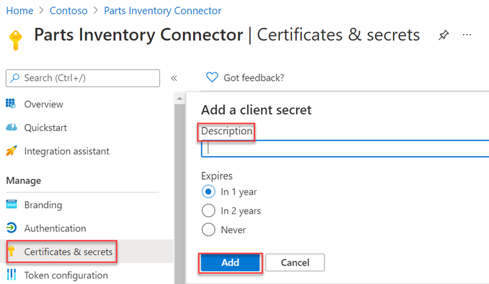

<!-- markdownlint-disable MD002 MD041 -->

После того как все необходимые условия будут созданы, вы сможете зарегистрировать приложение в центре администрирования Azure AD.After all the prerequisites are in place, you will be able to register an application in the Azure AD admin center. Регистрация необходима для проверки подлинности приложения и его использования для звонков в API соединителов Microsoft Graph.The registration is necessary in order to authenticate the application and use it to make calls to the Microsoft Graph connectors API.

1. Перейдите в [центр Azure Active Directory администратора](https://aad.portal.azure.com/) и войдите в учетную запись администратора.Go to the [Azure Active Directory admin center](https://aad.portal.azure.com/) and sign in with an administrator account.
2. На левой области выберите **Azure Active Directory,** а в статье **Управление** выберите **регистрации приложений.**On the left pane, select **Azure Active Directory**, and under **Manage**, select **App registrations**.
3. Выберите **Новая регистрация**.Select **New registration**.

    

4. **Заполняем форму приложения Register** со следующими значениями, а затем выберите **Register**.Complete the **Register an application** form with the following values, then select **Register**.

    а)a. **Имя:** Соединители запасов частей**Name**: Parts Inventory Connector

    б)b. **Поддерживаемые типы** учетных записей. Учетные записи только в этом организационном каталоге (только Microsoft — один клиент)**Supported account types**: Accounts in this organizational directory only (Microsoft only - Single tenant)

    В.c. **Перенаправление URI:** оставьте пустым**Redirect URI**: Leave blank

    

5. На странице обзор соединители запасов частей скопируйте значения **ID приложения (клиента) и directory (tenant) ID.**On the Parts Inventory Connector overview page, copy the values of **Application (client) ID and Directory (tenant) ID**. Вам потребуется и то, и другое в следующем разделе.You will need both in the following section.

    

6. Выберите **разрешения API в** статье **Управление**.Select **API Permissions** under **Manage**.
7. Выберите **Добавить разрешение,** а затем выберите **Microsoft Graph.**Select **Add a permission**, then select **Microsoft Graph**.
8. Выберите **разрешения приложения,** а затем выберите **разрешение ExternalItem.ReadWrite.All.**Select **Application permissions**, then select the **ExternalItem.ReadWrite.All** permission. Выберите **Добавить разрешения**.Select **Add permissions**.

    

9. Выберите **согласие администратора гранта для {TENANT},** а затем выберите **Да** при запросе.Select **Grant admin consent for {TENANT},** then select **Yes** when prompted.

    

10. Выберите **секреты &amp; сертификатов в** статье **Управление,** а затем выберите новый секрет **клиента.**Select **Certificates &amp; secrets** under **Manage** , then select **New client secret**.
11. Введите описание и выберите срок действия секрета, а затем выберите **Добавить**.Enter a description and choose an expiration time for the secret, then select **Add**.

    

12. Скопируйте и сохраните новый секрет, он потребуется в следующем разделе.Copy and save the new secret, you will need it in the following section.
