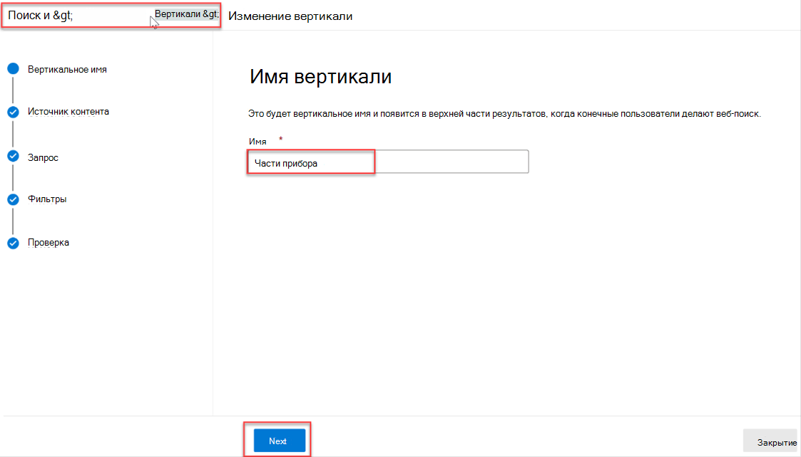
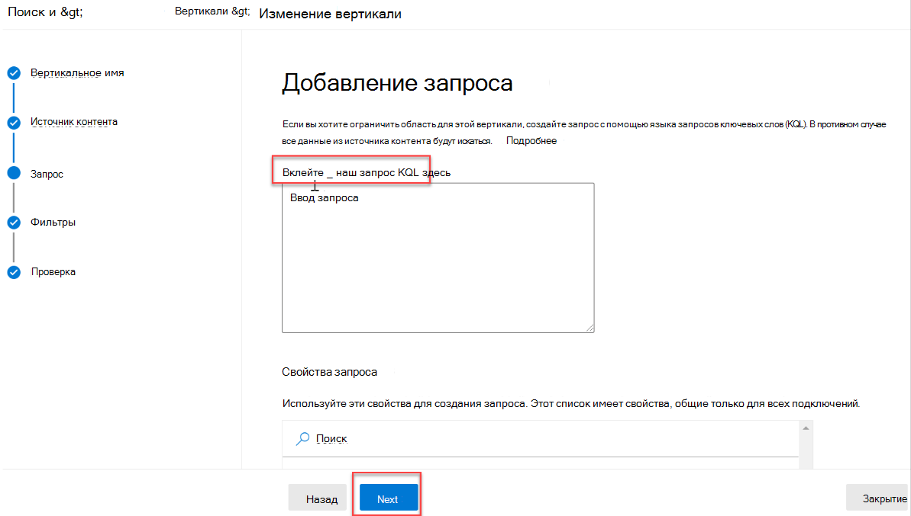
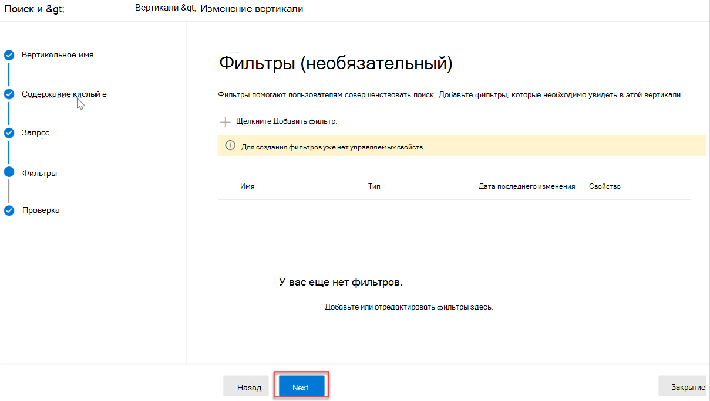
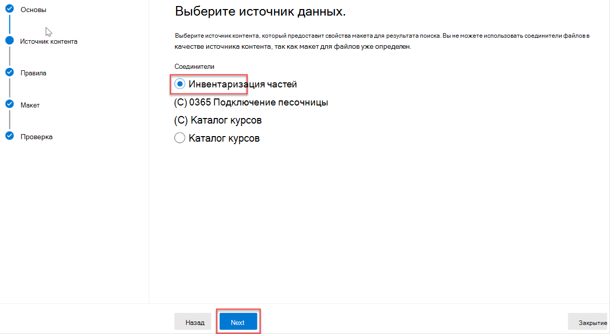
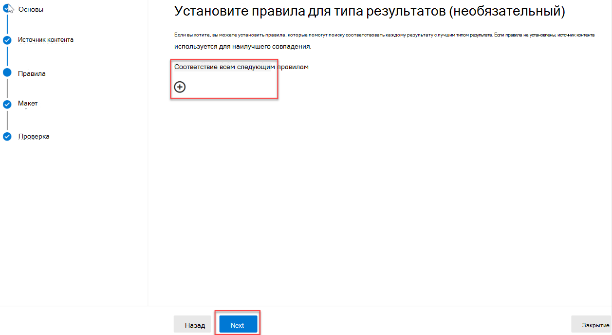
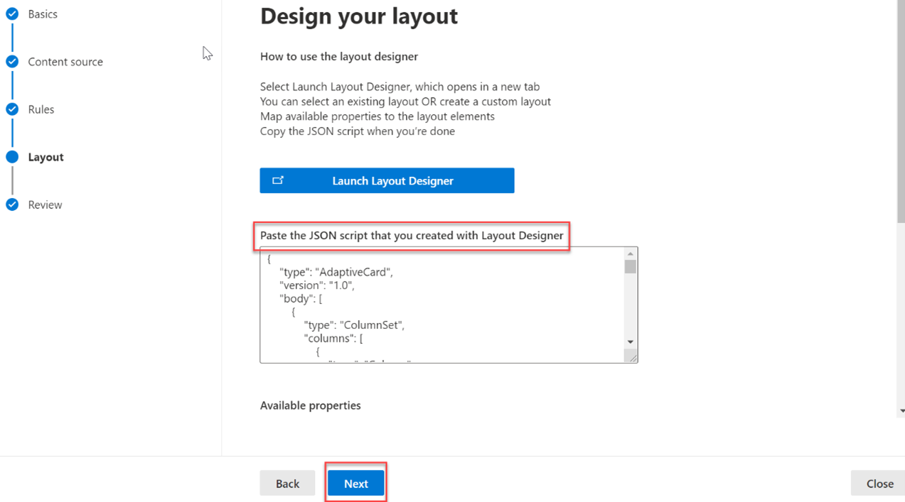

<!-- markdownlint-disable MD002 MD025 MD041 -->

Создайте вертикали поиска и типы результатов для настройки результатов поиска в Microsoft SharePoint, Microsoft Office и Поиск (Майкрософт) в Bing, чтобы пользователям было проще находить сведения, которые они могут видеть.

## Создание вертикали

Чтобы создать и включить вертикаль поиска на уровне организации, вопишитесь в  центр Microsoft 365 Admin с помощью роли глобального администратора и сделайте следующее:

1. Перейдите **Параметры** >  **Search &** **intelligenceCustomizations** > .
2. Перейдите **в Vertical** и нажмите **кнопку Добавить** .
3. Укай следующие сведения:
  * **Назови вертикаль:** Части прибора.

   

  * **Источник контента**. Соединитектор, созданный с помощью приложения. (Запас частей)

   

  * **Добавление запроса**. Оставьте пустым.

   

  * **Фильтры**. Оставьте пустым.

   

## Создание типа результатов

Чтобы создать тип результатов:

1. Перейдите **Параметры** >  **Search &** **intelligenceCustomizations** > .
2. Перейдите на **вкладку типа результатов** и нажмите **кнопку Добавить** .
3. Укай следующие сведения:

  * **Имя**: Бытовая часть

   

  * **Источник контента**. Соединитектор, созданный в приложении.

   

  * **Правила**: Нет

   

  * Введите содержимое [result-type.json в](https://github.com/microsoftgraph/msgraph-search-connector-sample/blob/master/result-type.json) текстовый ящик конструктора макета.

   
