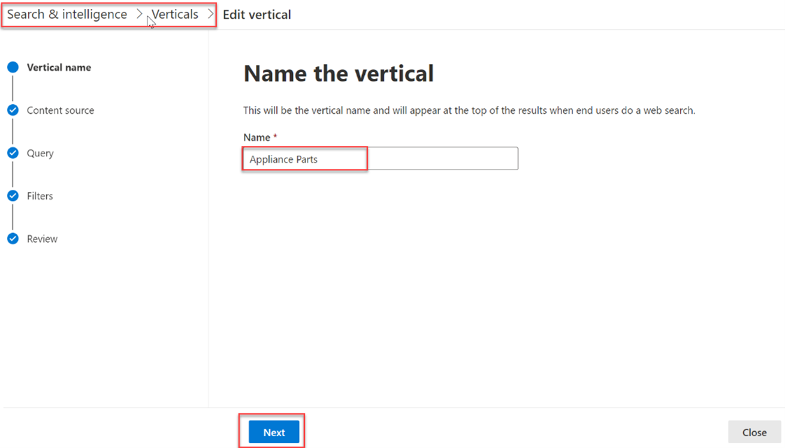
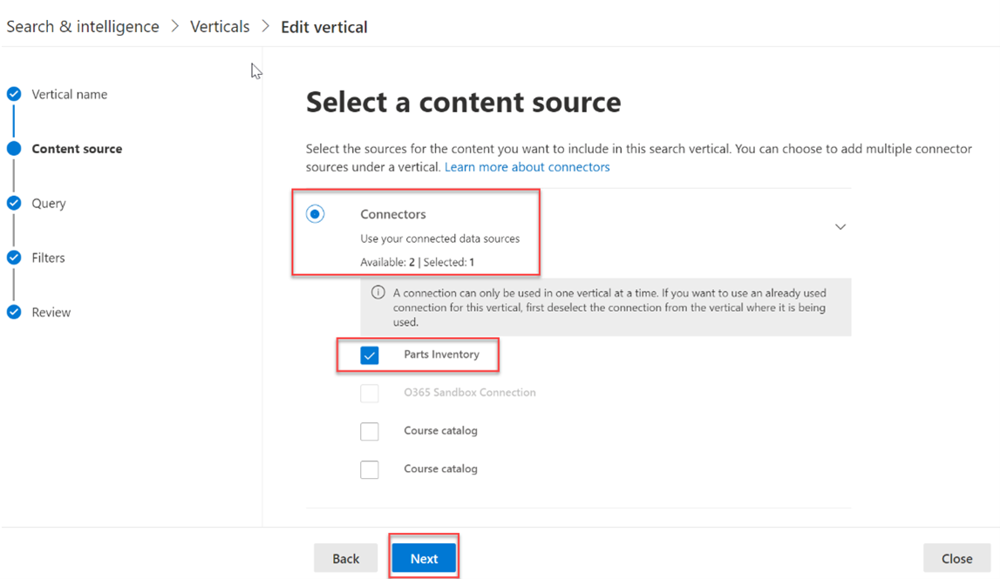
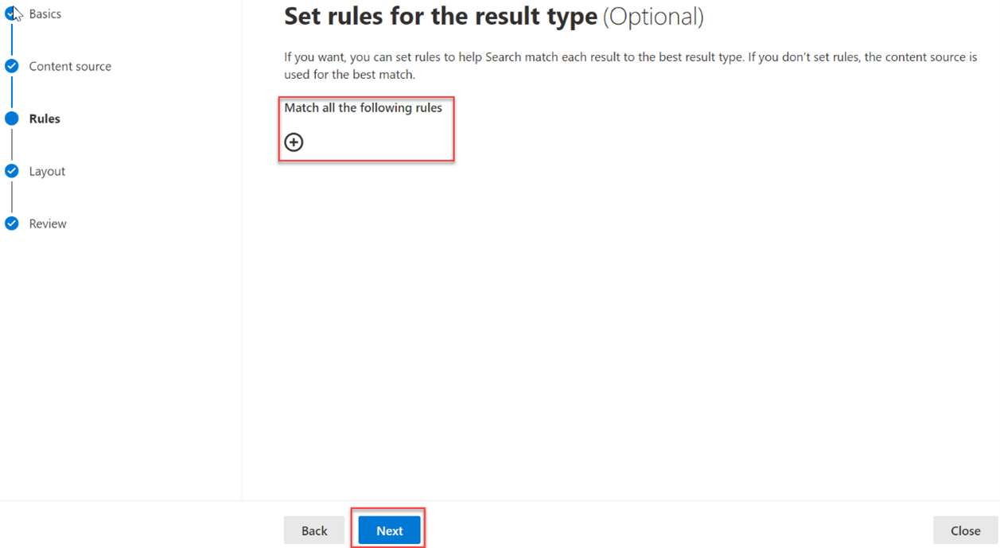

<!-- markdownlint-disable MD002 MD025 MD041 -->

Создайте вертикали поиска и типы результатов для настройки результатов поиска в Microsoft SharePoint, Microsoft Office и Microsoft Search в Bing, чтобы пользователям было проще находить сведения, которые они могут видеть.Create search verticals and result types to customize the search results in Microsoft SharePoint, Microsoft Office, and Microsoft Search in Bing, to make it easier for users to find the information that they have permission to see.

## Создание вертикалиCreate a vertical

Чтобы создать и включить вертикаль поиска на  уровне организации, вопишитесь в центр администрирования Microsoft 365 с помощью роли глобального администратора и сделайте следующее:To create and enable a search vertical at the organization level, sign in to the [Microsoft 365 Admin center](https://admin.microsoft.com/) using the global administrator role, and do the following:

1. Перейдите **Параметры**  >  **поиск &**  >  **настройки.**Go to **Settings** > **Search & intelligence** > **Customizations**.
2. Перейдите **в Vertical** и нажмите **кнопку Добавить.**Go to **Vertical** and click the **Add** button.
3. Укай следующие сведения:Provide the following details:
  * **Назови вертикаль:** Части прибора.**Name the vertical:** Appliance Parts.

   

  * **Источник контента.** Соединитектор, созданный с помощью приложения.**Content source**: The connector created with the app. (Запас частей)(Parts Inventory)

   

  * **Добавление запроса.** Оставьте пустым.**Add a query**: Leave blank.

   

  * **Фильтры.** Оставьте пустым.**Filters**: Leave blank.

   

## Создание типа результатовCreate a result type

Чтобы создать тип результатов:To create a result type:

1. Перейдите **Параметры**  >  **поиск &**  >  **настройки.**Go to **Settings** > **Search & intelligence** > **Customizations**.
2. Перейдите на **вкладку типа результатов** и нажмите **кнопку Добавить.**Go to the **result type** tab and click the **Add** button.
3. Укай следующие сведения:Provide the following details:

  * **Имя:** Часть прибора**Name**: Appliance Part

   

  * **Источник контента.** Соединитектор, созданный в приложении.**Content source**: The connector created in the app.

   

  * **Правила**: Нет**Rules**: None

   

  * Вклеить содержимое [result-type.jsв](https://github.com/microsoftgraph/msgraph-search-connector-sample/blob/master/result-type.json) текстовый ящик конструктора макета.Paste contents of [result-type.json](https://github.com/microsoftgraph/msgraph-search-connector-sample/blob/master/result-type.json) into the layout designer textbox.

   
