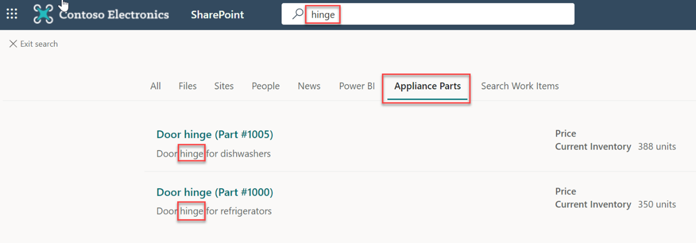

<!-- markdownlint-disable MD002 MD025 MD041 -->

На этом шаге вы будете искать части в SharePoint.

1. Перейдите на корневой SharePoint для клиента.
2. С помощью окна поиска в верхней части страницы ищите **петли.**

  

3. Когда поиск завершится с 0 результатами, выберите вкладку **Части прибора.**
4. Будут отображаться результаты соединители.

  
