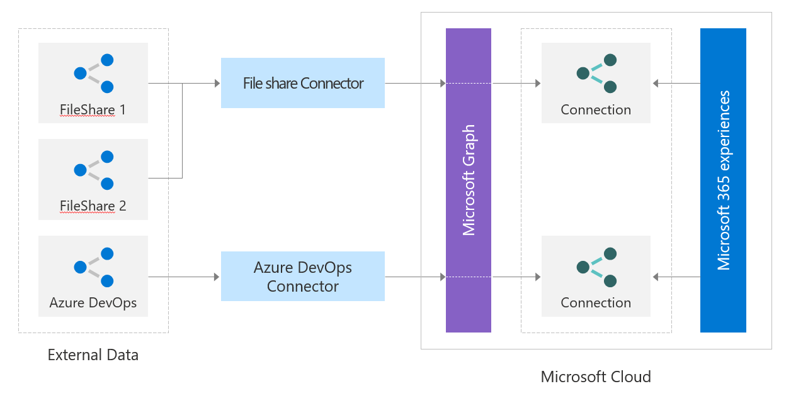

# Работа с API соединителей Microsoft Graph

Соединители Microsoft Graph добавляют внешние данные в Microsoft Graph и улучшают интеллектуальные возможности Microsoft 365. Для интеграции со службами, которые недоступны в роли соединителей, созданных корпорацией Майкрософт, необходимо создать настраиваемый соединитель. Для создания настраиваемых соединителей вы используете REST API соединителей Microsoft Graph.

Используйте API Microsoft Graph, чтобы выполнять следующие задачи:

1. Создание подключений к внешним данным и управление ими.
2. Определите и зарегистрируйте схему внешних типов данных.
3. Запись элементов внешних данных в Microsoft Graph.
4. Синхронизация внешних групп.

## Создание подключений к внешним данным и управление ими

Ресурс [externalConnection](/graph/api/resources/externalconnectors-externalconnection) (API внешнего подключения) — это логический контейнер для внешних данных, которым вы можете управлять как единым блоком.

Подробнее см. в статье [Создание, обновление и удаление подключений в Microsoft Graph](connecting-external-content-manage-connections.md).

## Определение и регистрация схем внешних типов данных

Подключение [schema](/graph/api/resources/externalconnectors-schema) (API схемы) определяет, как содержимое используется в различных возможностях Microsoft 365. Схема представляет собой простой список всех свойств, которые вы планируете добавить в соединение, вместе с их атрибутами, метками и псевдонимами. Перед добавлением элементов в Microsoft Graph вы должны зарегистрировать схему.

Подробнее см. в статье [Регистрация и обновление схемы для подключения Microsoft Graph](connecting-external-content-manage-schema.md).

## Запись элементов внешних данных в Microsoft Graph

Элементы, добавленные приложением в службу "Поиск (Майкрософт)", представлены ресурсом [externalItem](/graph/api/resources/externalconnectors-externalitem) (API внешнего элемента) в Microsoft Graph.

Подробнее см. в статье [Создание, обновление и удаление элементов, добавленных вашим приложением с помощью соединителей Microsoft Graph](connecting-external-content-manage-items.md).

## Синхронизация внешних групп

Элементам во внешней службе может предоставляться или отказываться в доступе через ACL к различным типам групп, отличных от Azure Active Directory. Например, элементы Salesforce могут иметь наборы разрешений и профили, а элементы ServiceNow могут иметь локальные группы. При записи этих элементов в Microsoft Graph необходимо соблюдать эти ACL.

Вы можете использовать API внешней группы для установки разрешений для внешних элементов, загружаемых в Microsoft Graph. [externalGroup](/graph/api/resources/externalconnectors-externalgroup) представляет собой группу или подобную группе структуру, не относящуюся к Azure Active Directory (например, бизнес-подразделения, команды и т. д.), и определяет разрешения на содержимое во внешнем источнике данных.

Дополнительные сведения см. в статье [Использование внешних групп для управления разрешениями на доступ к источникам данных соединителей Microsoft Graph](connecting-external-content-external-groups.md).

## Дальнейшие действия

- [Создание пользовательского соединителя](/graph/connecting-external-content-build-quickstart)