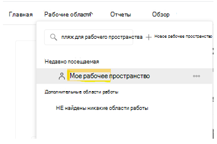
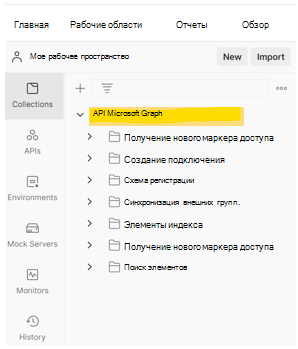
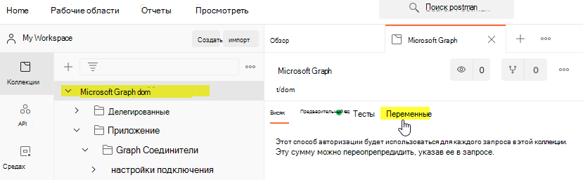

# <a name="use-postman-with-the-microsoft-graph-connectors-api"></a><span data-ttu-id="9fead-103">Использование Postman с API соединителей Microsoft Graph</span><span class="sxs-lookup"><span data-stu-id="9fead-103">Use Postman with the Microsoft Graph connectors API</span></span>

<span data-ttu-id="9fead-104">В этой статье описано, как использовать API соединителей Microsoft Graph с Postman.</span><span class="sxs-lookup"><span data-stu-id="9fead-104">This topic describes how you can use the Microsoft Graph connector APIs with Postman.</span></span>

## <a name="prerequisites"></a><span data-ttu-id="9fead-105">Предварительные требования</span><span class="sxs-lookup"><span data-stu-id="9fead-105">Prerequisites</span></span>

* <span data-ttu-id="9fead-106">Учетная запись Майкрософт либо рабочая или учебная учетная запись.</span><span class="sxs-lookup"><span data-stu-id="9fead-106">Either a Microsoft account or work or school account.</span></span>
* <span data-ttu-id="9fead-107">Доступ к клиенту разработчика Microsoft 365.</span><span class="sxs-lookup"><span data-stu-id="9fead-107">Access to a Microsoft 365 developer tenant.</span></span> <span data-ttu-id="9fead-108">Если у вас ее нет, вы можете зарегистрироваться в [программе для разработчиков Microsoft 365], чтобы получить бесплатную подписку разработчика.</span><span class="sxs-lookup"><span data-stu-id="9fead-108">If you don't have one, you can sign up for the [Microsoft 365 Developer Program] to get a free developer subscription.</span></span>

## <a name="step-1---import-the-microsoft-graph-postman-collection"></a><span data-ttu-id="9fead-109">Шаг 1. Импорт коллекции Microsoft Graph Postman</span><span class="sxs-lookup"><span data-stu-id="9fead-109">Step 1 - Import the Microsoft Graph Postman collection</span></span>

<span data-ttu-id="9fead-110">Чтобы использовать коллекцию Postman, необходимо импортировать ее в свою рабочую область Postman.</span><span class="sxs-lookup"><span data-stu-id="9fead-110">To use the Postman collection, you need to import it into your Postman workspace.</span></span> <span data-ttu-id="9fead-111">Сделайте это в веб-браузере.</span><span class="sxs-lookup"><span data-stu-id="9fead-111">Do this from a web browser.</span></span>

1. <span data-ttu-id="9fead-112">Откройте [Postman](https://identity.getpostman.com/signup) и зарегистрируйтесь.</span><span class="sxs-lookup"><span data-stu-id="9fead-112">Go to [Postman](https://identity.getpostman.com/signup) and sign up.</span></span> <span data-ttu-id="9fead-113">Если у вас уже есть учетная запись Postman, вы можете [войти](https://identity.getpostman.com/login).</span><span class="sxs-lookup"><span data-stu-id="9fead-113">If you already have a Postman account, you can [sign in](https://identity.getpostman.com/login).</span></span>

2. <span data-ttu-id="9fead-114">После входа перейдите в раздел **Моя рабочая область**.</span><span class="sxs-lookup"><span data-stu-id="9fead-114">After you sign in, go to **My workspace**.</span></span>



3. <span data-ttu-id="9fead-116">После перехода в раздел **Моя рабочая область** нажмите кнопку **Импорт**.</span><span class="sxs-lookup"><span data-stu-id="9fead-116">After you go into **My workspace**, select the **Import** button.</span></span>


4. <span data-ttu-id="9fead-118">В открывшемся диалоговом окне выберите вкладку **Ссылка** и введите следующий URL-адрес в текстовом поле: `https://www.postman.com/collections/61bfc772fe030514b062`.</span><span class="sxs-lookup"><span data-stu-id="9fead-118">In the dialog that opens, select **Link** tab and enter the following URL - in the textbox:  `https://www.postman.com/collections/61bfc772fe030514b062`.</span></span>


5. <span data-ttu-id="9fead-120">Нажмите **Продолжить**.</span><span class="sxs-lookup"><span data-stu-id="9fead-120">Select **Continue**.</span></span>
6. <span data-ttu-id="9fead-121">Нажмите **Импорт**.</span><span class="sxs-lookup"><span data-stu-id="9fead-121">Select **Import**.</span></span>


<span data-ttu-id="9fead-123">Вы увидите коллекцию API соединителей Microsoft Graph в Postman.</span><span class="sxs-lookup"><span data-stu-id="9fead-123">You should now see the Microsoft Graph connectors API collection inside Postman.</span></span>



> [!NOTE]
> <span data-ttu-id="9fead-125">API соединителя Microsoft Graph был недавно добавлен в коллекцию [Microsoft Graph Postman](https://www.postman.com/microsoftgraph/workspace/microsoft-graph/overview).</span><span class="sxs-lookup"><span data-stu-id="9fead-125">The Microsoft Graph connector API was recently added into the [Microsoft Graph postman collection](https://www.postman.com/microsoftgraph/workspace/microsoft-graph/overview).</span></span>
<span data-ttu-id="9fead-126">Этот документ скоро будет изменен, чтобы использовать эту коллекцию.</span><span class="sxs-lookup"><span data-stu-id="9fead-126">This document will be edited soon to use that collection instead.</span></span>

## <a name="step-2---download-the-postman-agent-optional---postman-web-browser-only"></a><span data-ttu-id="9fead-127">Шаг 2. Скачивание агента Postman (необязательно, только в веб-браузере Postman)</span><span class="sxs-lookup"><span data-stu-id="9fead-127">Step 2 - Download the Postman Agent (Optional - Postman Web browser only)</span></span>

<span data-ttu-id="9fead-128">Чтобы использовать эту коллекцию Postman в своем веб-браузере, скачайте [классический агент Postman](https://www.postman.com/downloads).</span><span class="sxs-lookup"><span data-stu-id="9fead-128">To use this Postman collection in your web browser, download the [Postman Desktop Agent](https://www.postman.com/downloads).</span></span> <span data-ttu-id="9fead-129">Без этого вы не можете использовать Postman для Интернета из-за ограничений CORS в веб-браузере.</span><span class="sxs-lookup"><span data-stu-id="9fead-129">You can't use Postman for the web without this due to CORS restrictions in the web browser.</span></span>
<span data-ttu-id="9fead-130">"Максимальное количество ресурсов [соединения](/graph/api-reference/resources/externalconnection?view=graph-rest-beta&preserve-view=true) на клиента Microsoft 365".</span><span class="sxs-lookup"><span data-stu-id="9fead-130">"The maximum number of [connection](/graph/api-reference/resources/externalconnection?view=graph-rest-beta&preserve-view=true) resources per Microsoft 365 tenant."</span></span>

> [!NOTE]
> <span data-ttu-id="9fead-131">Вам не требуется агент, если вы используете Postman для приложения Windows.</span><span class="sxs-lookup"><span data-stu-id="9fead-131">You don't need the agent if you're using the Postman for Windows app.</span></span> <span data-ttu-id="9fead-132">Если вы открываете Postman для Windows, вы увидите эту коллекцию в своей рабочей области.</span><span class="sxs-lookup"><span data-stu-id="9fead-132">If you open Postman for Windows, you will see this collection in your workspace.</span></span>

## <a name="step-3---create-an-azure-ad-application"></a><span data-ttu-id="9fead-133">Шаг 3. Создание приложения Azure AD</span><span class="sxs-lookup"><span data-stu-id="9fead-133">Step 3 - Create an Azure AD application</span></span>

<span data-ttu-id="9fead-134">Чтобы использовать эту коллекцию в своем клиенте разработчика, создайте приложение Azure AD и предоставьте ему соответствующие разрешения для запросов, которые нужно выполнять.</span><span class="sxs-lookup"><span data-stu-id="9fead-134">To use this collection in your own developer tenant, create an Azure AD application and give it the appropriate permissions for the requests you want to call.</span></span>

1. <span data-ttu-id="9fead-135">Перейдите на сайт [portal.azure.com](https://portal.azure.com/) и **войдите**, используя свою учетную запись администратора клиента разработчика.</span><span class="sxs-lookup"><span data-stu-id="9fead-135">Go to [portal.azure.com](https://portal.azure.com/) and **Sign in** with your developer tenant administrator account.</span></span>
2. <span data-ttu-id="9fead-136">В разделе "Службы Azure" выберите **Azure Active Directory**.</span><span class="sxs-lookup"><span data-stu-id="9fead-136">Under Azure Services, select **Azure Active Directory**.</span></span>
3. <span data-ttu-id="9fead-137">В меню слева выберите **Регистрация приложений**.</span><span class="sxs-lookup"><span data-stu-id="9fead-137">On the left menu, select **App registrations**.</span></span>
4. <span data-ttu-id="9fead-138">В горизонтальном меню выберите **Новая регистрация**.</span><span class="sxs-lookup"><span data-stu-id="9fead-138">On the horizontal menu, select **New registration**.</span></span>
5. <span data-ttu-id="9fead-139">В качестве имени приложения укажите "Перечень компонентов".</span><span class="sxs-lookup"><span data-stu-id="9fead-139">Set the Application name to "Parts Inventory".</span></span>
6. <span data-ttu-id="9fead-140">Присвойте параметру URI перенаправления значение https://oauth.pstmn.io/v1/browser-callback.</span><span class="sxs-lookup"><span data-stu-id="9fead-140">Set the Redirect URI to https://oauth.pstmn.io/v1/browser-callback.</span></span>
7. <span data-ttu-id="9fead-141">Нажмите **Зарегистрировать**.</span><span class="sxs-lookup"><span data-stu-id="9fead-141">Select **Register**.</span></span>
8. <span data-ttu-id="9fead-142">В меню слева выберите **Разрешения API**.</span><span class="sxs-lookup"><span data-stu-id="9fead-142">On the left menu, select **API Permissions**.</span></span>
9. <span data-ttu-id="9fead-143">В горизонтальном меню выберите **Добавить разрешение** > **Microsoft Graph** > **Делегированные разрешения**.</span><span class="sxs-lookup"><span data-stu-id="9fead-143">In the horizontal menu, select **Add a permission** > **Microsoft Graph** > **Delegated Permissions**.</span></span>
10. <span data-ttu-id="9fead-144">Начните вводить `ExternalItem.ReadWrite.All` и установите флажок `ExternalItem.ReadWrite.All`.</span><span class="sxs-lookup"><span data-stu-id="9fead-144">Start typing `ExternalItem.ReadWrite.All` and check `ExternalItem.ReadWrite.All`.</span></span>
11. <span data-ttu-id="9fead-145">Нажмите **Разрешения приложения**, введите "User" и выберите **Разрешения приложения**.</span><span class="sxs-lookup"><span data-stu-id="9fead-145">Select **Application permissions**, type "User"., and check **Application Permissions**.</span></span>
12. <span data-ttu-id="9fead-146">Разверните **параметры User** и установите флажок **`ExternalItem.ReadWrite.All`**.</span><span class="sxs-lookup"><span data-stu-id="9fead-146">Expand the **User options** and check **`ExternalItem.ReadWrite.All`**.</span></span>
13. <span data-ttu-id="9fead-147">Выберите **Добавить разрешения**.</span><span class="sxs-lookup"><span data-stu-id="9fead-147">Select **Add permissions**.</span></span>
14. <span data-ttu-id="9fead-148">В горизонтальном меню выберите **Предоставить согласие администратора для** и нажмите **Да**.</span><span class="sxs-lookup"><span data-stu-id="9fead-148">In the horizontal menu, select **Grant admin consent for**, and select **Yes**.</span></span>
15. <span data-ttu-id="9fead-149">В меню слева выберите **Обзор**.</span><span class="sxs-lookup"><span data-stu-id="9fead-149">In the left menu, select **Overview**.</span></span> <span data-ttu-id="9fead-150">Здесь можно узнать идентификатор приложения (клиент) и идентификатор каталога (клиент).</span><span class="sxs-lookup"><span data-stu-id="9fead-150">From here, you can get the Application (client) ID and Directory (tenant) ID.</span></span> <span data-ttu-id="9fead-151">Они понадобятся вам на шаге 4.</span><span class="sxs-lookup"><span data-stu-id="9fead-151">You will need these in step 4.</span></span>
16. <span data-ttu-id="9fead-152">В меню слева выберите **Сертификаты и секреты**.</span><span class="sxs-lookup"><span data-stu-id="9fead-152">In the left menu, select **Certificates and secrets**.</span></span>
17. <span data-ttu-id="9fead-153">Выберите **Новый секрет клиента**, введите описание и нажмите **Добавить**.</span><span class="sxs-lookup"><span data-stu-id="9fead-153">Select **New client secret**, enter a description, and select **Add**.</span></span> <span data-ttu-id="9fead-154">Скопируйте новое значение секрета клиента. Оно потребуется на шаге 4.</span><span class="sxs-lookup"><span data-stu-id="9fead-154">Copy the new client secret value, you will need this in step 4.</span></span>

<span data-ttu-id="9fead-155">У приложения Azure AD теперь есть разрешения на выполнение запросов от имени пользователя для вызова `ExternalItem.ReadWrite.All` и вызова `ExternalItem.ReadWrite.All` в качестве приложения.</span><span class="sxs-lookup"><span data-stu-id="9fead-155">The Azure AD application now has permissions to make requests on behalf of a user to call `ExternalItem.ReadWrite.All`, and as an application for `ExternalItem.ReadWrite.All`.</span></span>

## <a name="step-4--configure-authentication"></a><span data-ttu-id="9fead-156">Шаг 4. Настройка проверки подлинности</span><span class="sxs-lookup"><span data-stu-id="9fead-156">Step 4 – Configure authentication</span></span>

<span data-ttu-id="9fead-157">Настройте переменные в Postman.</span><span class="sxs-lookup"><span data-stu-id="9fead-157">Set up the variables in Postman.</span></span> <span data-ttu-id="9fead-158">Эта информация используется для создания маркера доступа.</span><span class="sxs-lookup"><span data-stu-id="9fead-158">This information is used to generate the access token.</span></span>

1. <span data-ttu-id="9fead-159">Выберите вкладку **API соединителей Microsoft Graph** и перейдите в раздел **Переменные**.</span><span class="sxs-lookup"><span data-stu-id="9fead-159">Select the **Microsoft Graph connectors API** tab and go to the **Variables** section.</span></span>



2. <span data-ttu-id="9fead-161">В разделе "Переменные" укажите необходимые сведения, используя информацию из шага 3.</span><span class="sxs-lookup"><span data-stu-id="9fead-161">In the Variables section, provide the required information using the information from step 3.</span></span>

- <span data-ttu-id="9fead-162">В качестве **текущего значения** **ИД\_клиента** установите значение ИД приложения (клиента) из шага 3.15.</span><span class="sxs-lookup"><span data-stu-id="9fead-162">Set the  **Current value**  of **client\_id** to the Application (client) ID value from step 3.15.</span></span>
- <span data-ttu-id="9fead-163">В качестве **текущего значения** **секрета\_клиента** установите значение секрета клиента из шага 3.17.</span><span class="sxs-lookup"><span data-stu-id="9fead-163">Set the  **Current value** of **client\_secret** to the Client Secret value from step 3.17.</span></span>
- <span data-ttu-id="9fead-164">В качестве **текущего значения** **клиента** установите значение ИД каталога (клиента) из шага 3.15.</span><span class="sxs-lookup"><span data-stu-id="9fead-164">Set the  **Current value**  of **tenant** to the Directory (tenant) ID value from step 3.15.</span></span>
- <span data-ttu-id="9fead-165">В качестве **текущего значения** **имени пользователя** установите значение `admin@xxxxxxx.onmicrosoft.com`</span><span class="sxs-lookup"><span data-stu-id="9fead-165">Set the  **Current value**  of **username** to `admin@xxxxxxx.onmicrosoft.com`</span></span>
- <span data-ttu-id="9fead-166">В качестве **текущего значения** **пароля** установите пароль администратора клиента.</span><span class="sxs-lookup"><span data-stu-id="9fead-166">Set the  **Current value**  of **password** to tenant admin password.</span></span>


3. <span data-ttu-id="9fead-168">Нажмите **Сохранить** / **Обновить**.</span><span class="sxs-lookup"><span data-stu-id="9fead-168">Select  **Save** / **Update**.</span></span>

## <a name="step-5---get-an-authentication-token"></a><span data-ttu-id="9fead-169">Шаг 5. Получение маркера проверки подлинности</span><span class="sxs-lookup"><span data-stu-id="9fead-169">Step 5 - Get an authentication token</span></span>

<span data-ttu-id="9fead-170">Вам потребуется получить маркер доступа, так как вы впервые выполняете запрос в виде потока проверки подлинности приложения.</span><span class="sxs-lookup"><span data-stu-id="9fead-170">You need to get an access token because this is the first time you are running a request as an application authentication flow.</span></span> <span data-ttu-id="9fead-171">Получите маркер доступа, выполнив следующий запрос POST.</span><span class="sxs-lookup"><span data-stu-id="9fead-171">Get the app access token by making the following POST request:</span></span>


<span data-ttu-id="9fead-173">В следующем примере показано, как получить маркер доступа с общим секретом.</span><span class="sxs-lookup"><span data-stu-id="9fead-173">The following example shows how to get an access token with a shared secret:</span></span>
```html
POST /{{tenant}}/oauth2/v2.0/token HTTP/1.1 //Line breaks for clarity
Host: login.microsoftonline.com
Content-Type: application/x-www-form-urlencoded

client_id={{client_id}} 
&scope=https%3A%2F%2Fgraph.microsoft.com%2F.default 
&client_secret={{client_secret}} 
&grant_type=client_credentials 
```
<span data-ttu-id="9fead-174">В следующем примере показан успешный отклик.</span><span class="sxs-lookup"><span data-stu-id="9fead-174">The following example shows a successful response:</span></span>
```html
{ 
    "token_type": "Bearer", 
    "expires_in": 3599, 
    "ext_expires_in": 3599, 
    "access_token": "eyJ0eXAiOiJKV1QiLCJu… " 
} 
```

<span data-ttu-id="9fead-175">Обратите внимание, что здесь вы используете [поток учетных данных клиента](/azure/active-directory/develop/v2-oauth2-client-creds-grant-flow).</span><span class="sxs-lookup"><span data-stu-id="9fead-175">Note that you are using the [client credential flow](/azure/active-directory/develop/v2-oauth2-client-creds-grant-flow) here.</span></span> <span data-ttu-id="9fead-176">Получите маркер доступа для приложения, а не маркер доступа для пользователя.</span><span class="sxs-lookup"><span data-stu-id="9fead-176">Be sure to get an app access token and not a user access token.</span></span>

## <a name="step-6--create-a-new-connection"></a><span data-ttu-id="9fead-177">Шаг 6. Создание соединения</span><span class="sxs-lookup"><span data-stu-id="9fead-177">Step 6 – Create a new connection</span></span>

<span data-ttu-id="9fead-178">[Соединение](/concepts/connecting-external-content-manage-connections.md) — это логический контейнер для внешних данных, которыми вы можете управлять как единым целым.</span><span class="sxs-lookup"><span data-stu-id="9fead-178">A [connection](/concepts/connecting-external-content-manage-connections.md) is a logical container for your external data that you can manage as a single unit.</span></span> <span data-ttu-id="9fead-179">Выберите имя, ИД и описание соединения.</span><span class="sxs-lookup"><span data-stu-id="9fead-179">Choose a connection name, id, and description.</span></span> <span data-ttu-id="9fead-180">Получите от администратора необходимые сведения для подключения к источнику данных и предоставьте механизм авторизации в источника контента при настройке соединения.</span><span class="sxs-lookup"><span data-stu-id="9fead-180">Get the necessary details from the admin to connect to the data source and provide a mechanism to authorize against the content source when setting up the connection.</span></span> <span data-ttu-id="9fead-181">Вы можете использовать [SDK Microsoft Graph](/graph/sdks/sdks-overview) API для программирования настройки соединителя.</span><span class="sxs-lookup"><span data-stu-id="9fead-181">You can use the [Microsoft Graph SDK](/graph/sdks/sdks-overview) and APIs to program your connector setup.</span></span> <span data-ttu-id="9fead-182">Если вы хотите сохранить учетные данные, можно использовать Azure Key Vault.</span><span class="sxs-lookup"><span data-stu-id="9fead-182">If you want to store credentials, you can use Azure Key Vault.</span></span>

```http
POST /external/connections
```

<span data-ttu-id="9fead-183">Ниже приведен пример запроса.</span><span class="sxs-lookup"><span data-stu-id="9fead-183">The following is an example of the request.</span></span>

```http
POST https://graph.microsoft.com/beta/external/connections 
Content-type: application/json 

{ 
  "id": "contosotasks", 
  "name": "Contoso Tasks", 
  "description": "Connection to index Contoso task management system" 
} 
```

<span data-ttu-id="9fead-184">Ниже приведен пример отклика.</span><span class="sxs-lookup"><span data-stu-id="9fead-184">The following is an example of the response.</span></span>

```http
HTTP/1.1 201 Created 
Content-type: application/json 
 
{ 
    "@odata.context": "https://graph.microsoft.com/beta/$metadata#connections/$entity", 
    "id": "contosotasks", 
    "name": "Contoso Tasks", 
    "description": "Connection to index Contoso task management system", 
    "state": null, 
    "configuration": { 
        "authorizedApps": [ 
            "a47b35b7-6271-4e6d-9e27-2450a8b9c6b6" 
        ] 
    } 
} 
```

<span data-ttu-id="9fead-185">Ниже приведен снимок экрана с разделом **Создание соединения**.</span><span class="sxs-lookup"><span data-stu-id="9fead-185">The following is a screenshot of the **Create connection** section.</span></span>

 

## <a name="step-7---register-connection-schema"></a><span data-ttu-id="9fead-187">Шаг 7. Регистрация схемы соединения</span><span class="sxs-lookup"><span data-stu-id="9fead-187">Step 7 - Register connection schema</span></span>

<span data-ttu-id="9fead-188">Схема соединения определяет, как ваше содержимое будет использоваться в различных интерфейсах Microsoft Graph.</span><span class="sxs-lookup"><span data-stu-id="9fead-188">The connection schema determines how your content will be used in various Microsoft Graph experiences.</span></span> <span data-ttu-id="9fead-189">Схема — это плоский список всех свойств, которые вы планируете добавить в соединение, а также их атрибуты, метки и псевдонимы.</span><span class="sxs-lookup"><span data-stu-id="9fead-189">Schema is a flat list of all the properties that you plan to add to the connection along with their attributes, labels, and aliases.</span></span> <span data-ttu-id="9fead-190">Перед добавлением элементов в соединение вы должны зарегистрировать схему.</span><span class="sxs-lookup"><span data-stu-id="9fead-190">You must register the schema before adding items into the connection.</span></span>

```http
POST /external/connections/{id}/schema 
```

<span data-ttu-id="9fead-191">Ниже приведен пример запроса.</span><span class="sxs-lookup"><span data-stu-id="9fead-191">The following is an example of the request.</span></span>

```http
POST https://graph.microsoft.com/beta/external/connections/contosotasks/schema 
Content-type: application/json 
Prefer: respond-async 

{ 
  "baseType": "microsoft.graph.externalItem", 
  "properties": [ 
    { 
"name": "title", 
      "type": "String", 
      "isSearchable": "true", 
"isQueryable": "true", 
      "isRetrievable": "true", 
      "labels": [ 
        "title" 
      ] 
    }, 
    { 
"aliases": "creator", 
      "name": "createdBy", 
      "type": "String", 
      "isSearchable": "true", 
"isQueryable": "true", 
      "isRetrievable": "false", 
"isRefinable": "false", 
      "labels": [ 
        "createdBy" 
      ] 
    }, 
    { 
"aliases": "editedDate", 
      "name": "lastEditedDate", 
      "type": "DateTime", 
      "isSearchable": "false", 
"isQueryable": "true", 
      "isRetrievable": "true", 
"isRefinable": "true", 
      "labels": [ 
   "lastModifiedDateTime" 
] 
    } 
  ] 
} 
```

<span data-ttu-id="9fead-192">Ниже приведен пример отклика.</span><span class="sxs-lookup"><span data-stu-id="9fead-192">The following is an example of the response.</span></span>

```http
HTTP/1.1 202 Accepted 
Location: https://graph.microsoft.com/beta/external/connections/contosotasks/operations/616bfeed-666f-4ce0-8cd9-058939010bfc 
```

> [!NOTE]
> <span data-ttu-id="9fead-193">Регистрация схемы соединения является асинхронной операцией, поэтому не принимайте элементы в соединение, пока схема соединения не достигнет состояния "Завершено".</span><span class="sxs-lookup"><span data-stu-id="9fead-193">Registering connection schema is an asynchronous operation, so do not ingest items into the connection until the connection schema is in the Completed state.</span></span> <span data-ttu-id="9fead-194">Чтобы проверить состояние схемы соединения, выполните следующий запрос.</span><span class="sxs-lookup"><span data-stu-id="9fead-194">To check connection schema status, execute the following request:</span></span>
> ```http
> GET /external/connections/contosotasks/operations/616bfeed-666f-4ce0-8cd9-058939010bfc 
> ```

<span data-ttu-id="9fead-195">Ниже приведен другой пример запроса.</span><span class="sxs-lookup"><span data-stu-id="9fead-195">The following is another example of request.</span></span>
```http
Request 
GET https://graph.microsoft.com/beta/external/connections/operations/616bfeed-666f-4ce0-8cd9-058939010bfc 
```

<span data-ttu-id="9fead-196">А затем — соответствующий пример отклика.</span><span class="sxs-lookup"><span data-stu-id="9fead-196">And next the respective example of response.</span></span>

```http
HTTP/1.1 200 OK 
Content-type: application/json 

{
    @odata.context":"https://graph.microsoft.com/beta/$metadata#external/connections('coursecatalog')/operations/$entity", 
    "id": "aa9186d2-893c-4361-ca51-431d88fa45d8", 
    "name": "Contoso Tasks", 
    "status": "inprogress", 
    "error": null  
}
```

<span data-ttu-id="9fead-197">Ниже приведен снимок экрана с разделом **Получение состояния операции**.</span><span class="sxs-lookup"><span data-stu-id="9fead-197">The following is a screenshot of the **Get operation status** section.</span></span>


<span data-ttu-id="9fead-199">После изменения состояния операции схемы соединения с **Выполняется** на **Завершено** можно принять элементы для соединения.</span><span class="sxs-lookup"><span data-stu-id="9fead-199">After the connection schema operation status changes from **InProgress** to **Completed,** you can ingest items for the connection.</span></span>

<span data-ttu-id="9fead-200">На снимке экрана ниже показано состояние "Завершено".</span><span class="sxs-lookup"><span data-stu-id="9fead-200">The following screenshot shows the status as "completed".</span></span>

 

<span data-ttu-id="9fead-202">На снимке экрана ниже показано состояние "Черновик".</span><span class="sxs-lookup"><span data-stu-id="9fead-202">The following screenshot shows the state as "draft".</span></span>

 

<span data-ttu-id="9fead-204">После изменения состояния соединения с **Черновик** на **Готово**, как показано на следующем снимке экрана, вы можете принять элементы в текущее соединение.</span><span class="sxs-lookup"><span data-stu-id="9fead-204">After the connection state changes from **draft** to **ready**, as showed in the next screenshot, you can ingest items into current connection.</span></span>


## <a name="step-8---add-external-group-member-optional"></a><span data-ttu-id="9fead-206">Шаг 8. Добавление внешнего участника группы (необязательно)</span><span class="sxs-lookup"><span data-stu-id="9fead-206">Step 8 - Add external group member (optional)</span></span>

<span data-ttu-id="9fead-207">Если внешняя служба использует ACL, не относящиеся к Azure AD, синхронизируйте эти разрешения.</span><span class="sxs-lookup"><span data-stu-id="9fead-207">If your external service uses non-Azure AD ACLs, sync those permissions.</span></span>  

<span data-ttu-id="9fead-208">Внешние группы (наряду с пользователями и группами Azure Active Directory) используются для настройки разрешений в объекте `externalItems`, добавляемом к соединению Microsoft Graph.</span><span class="sxs-lookup"><span data-stu-id="9fead-208">External groups (along with Azure Active Directory users and groups) are used to set permissions on `externalItems` added to a Microsoft Graph connection.</span></span> <span data-ttu-id="9fead-209">Подробные сведения см. разделе [externalGroups](/graph/api/resources/externalgroup?view=graph-rest-beta).</span><span class="sxs-lookup"><span data-stu-id="9fead-209">For details see [externalGroups](/graph/api/resources/externalgroup?view=graph-rest-beta).</span></span>

<span data-ttu-id="9fead-210">Это пример запроса.</span><span class="sxs-lookup"><span data-stu-id="9fead-210">This is an example of a request.</span></span>

```http
POST https://graph.microsoft.com/beta/external/connections/contosotasks/groups/31bea3d537902000/members 
Content-Type: application/json 
 
{ 
  "@odata.type": "#microsoft.graph.externalGroupMember", 
  "id": "1431b9c38ee647f6a", 
  "type": "group", 
  "identitySource": "external" 
} 
```

<span data-ttu-id="9fead-211">А ниже приведен пример отклика.</span><span class="sxs-lookup"><span data-stu-id="9fead-211">And next is an example of the response.</span></span>

```http
HTTP/1.1 201 Created 
Content-Type: application/json 

{ 
  "@odata.type": "#microsoft.graph.externalGroupMember", 
  "id": "14m1b9c38qe647f6a", 
  "type": "group", 
  "identitySource": "external" 
} 
```

<span data-ttu-id="9fead-212">На снимке экрана ниже показан раздел **Создание внешней группы**.</span><span class="sxs-lookup"><span data-stu-id="9fead-212">The following screenshot shows the **Create external group** section.</span></span>


## <a name="step-9---ingest-items"></a><span data-ttu-id="9fead-214">Шаг 9. Принятие элементов</span><span class="sxs-lookup"><span data-stu-id="9fead-214">Step 9 - Ingest Items</span></span>

<span data-ttu-id="9fead-215">После создания соединения вы можете добавить содержимое.</span><span class="sxs-lookup"><span data-stu-id="9fead-215">After you created a connection, you can add your content.</span></span> <span data-ttu-id="9fead-216">Каждый элемент из источника данных должен быть представлен в виде `externalItem` в Microsoft Graph с уникальным идентификатором элемента. Этот идентификатор используется для создания, обновления или удаления элемента в Microsoft Graph.</span><span class="sxs-lookup"><span data-stu-id="9fead-216">Each item from your data source must be represented as an `externalItem` in Microsoft Graph with a unique item id. This ID is used to create, update or delete the item from Microsoft Graph.</span></span> <span data-ttu-id="9fead-217">Вы можете использовать первичный ключ из источника данных в качестве `itemId` или получить его из одного или нескольких полей.</span><span class="sxs-lookup"><span data-stu-id="9fead-217">You can use the primary key from your data source as the `itemId` or derive it from one or more fields.</span></span> <span data-ttu-id="9fead-218">`externalItem` содержит три основных компонента: список управления доступом, свойства и содержимое.</span><span class="sxs-lookup"><span data-stu-id="9fead-218">An `externalItem` has three key components: access control list, properties, and content.</span></span>

<span data-ttu-id="9fead-219">Если у вас есть двоичные файлы, необходимо выполнить анализ, чтобы получить метаданные и текстовую версию содержимого.</span><span class="sxs-lookup"><span data-stu-id="9fead-219">If you have binary files, you must parse to get the metadata and a text version of the content.</span></span> <span data-ttu-id="9fead-220">Если у вас есть нетекстовое содержимое, например PDF- или BMP-файл, для преобразования содержимого в текст необходимо использовать распознавание символов объекта.</span><span class="sxs-lookup"><span data-stu-id="9fead-220">If you have non-text content such as a PDF or BMP file, you must use object character recognition to convert content to text.</span></span>  

<span data-ttu-id="9fead-221">Вы отвечаете за преобразование исходных разрешений для предоставления разрешения или запрета.</span><span class="sxs-lookup"><span data-stu-id="9fead-221">You are responsible for converting your source permissions to grant or deny.</span></span> <span data-ttu-id="9fead-222">Запрет имеет более высокий приоритет над предоставлением разрешения.</span><span class="sxs-lookup"><span data-stu-id="9fead-222">Deny takes higher precedence over grant.</span></span>

<span data-ttu-id="9fead-223">Ниже приведен пример запроса.</span><span class="sxs-lookup"><span data-stu-id="9fead-223">The following is an example of request.</span></span>

```http
PUT https://graph.microsoft.com/beta/connections/contosohr/items/TSP228082938 
Content-type: application/json 

{ 
  "@odata.type": "microsoft.graph.externalItem", 
  "acl": [ 
    { 
      "type": "user", 
      "value": "e811976d-83df-4cbd-8b9b-5215b18aa874", 
      "accessType": "grant", 
      "identitySource": "azureActiveDirectory" 
    }, 
    { 
      "type": "group", 
      "value": "14m1b9c38qe647f6a", 
      "accessType": "deny", 
      "identitySource": "external" 
    } 
  ], 
  "properties": { 
    "ticketID": "1158", 
    "priority": 1, 
    "title": "Filter design", 
  }, 
  "content": { 
    "value": "Build filtering capability by...", 
    "type": "text" 
  } 
} 
```

<span data-ttu-id="9fead-224">Ниже представлен пример успешного отклика.</span><span class="sxs-lookup"><span data-stu-id="9fead-224">The following is an example of a successful response.</span></span>

```http
HTTP/1.1 200 OK
```

## <a name="error-handling"></a><span data-ttu-id="9fead-225">Обработка ошибок</span><span class="sxs-lookup"><span data-stu-id="9fead-225">Error handling</span></span>

<span data-ttu-id="9fead-226">Сведения о том, как устранять ошибки, см. в статье [Ошибки авторизации Microsoft Graph](/graph/resolve-auth-errors).</span><span class="sxs-lookup"><span data-stu-id="9fead-226">For details about how to resolve errors, see [Microsoft Graph authorization errors](/graph/resolve-auth-errors).</span></span>
