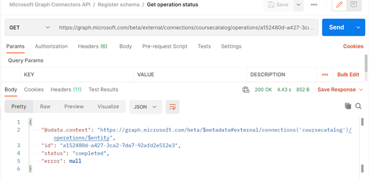

# <a name="use-postman-with-the-microsoft-graph-connectors-api"></a>Использование Postman с API соединителей Microsoft Graph

В этой статье описано, как использовать API соединителей Microsoft Graph с Postman.

## <a name="prerequisites"></a>Предварительные требования

* Учетная запись Майкрософт либо рабочая или учебная учетная запись.
* Доступ к клиенту разработчика Microsoft 365. Если у вас его нет, вы можете зарегистрироваться в [программе для разработчиков Microsoft 365], чтобы получить бесплатную подписку разработчика.

## <a name="step-1---import-the-microsoft-graph-postman-collection"></a>Шаг 1. Импорт коллекции Microsoft Graph Postman

Чтобы использовать коллекцию Postman, необходимо импортировать ее в свою рабочую область Postman. Сделайте это в веб-браузере.

1. Откройте [Postman](https://identity.getpostman.com/signup) и зарегистрируйтесь. Если у вас уже есть учетная запись Postman, вы можете [войти](https://identity.getpostman.com/login).

2. После входа перейдите в раздел **Моя рабочая область**.


3. После перехода в раздел **Моя рабочая область** нажмите кнопку **Импорт**.


4. В открывшемся диалоговом окне выберите вкладку **Ссылка** и введите следующий URL-адрес в текстовом поле: `https://www.postman.com/collections/61bfc772fe030514b062`.


5. Нажмите **Продолжить**.
6. Нажмите **Импорт**.


Вы увидите коллекцию API соединителей Microsoft Graph в Postman.


> [!NOTE]
> API соединителя Microsoft Graph был недавно добавлен в коллекцию [Microsoft Graph Postman](https://www.postman.com/microsoftgraph/workspace/microsoft-graph/overview).
Этот документ скоро будет изменен, чтобы использовать эту коллекцию.

## <a name="step-2---download-the-postman-agent-optional---postman-web-browser-only"></a>Шаг 2. Скачивание агента Postman (необязательно, только в веб-браузере Postman)

Чтобы использовать эту коллекцию Postman в своем веб-браузере, скачайте [классический агент Postman](https://www.postman.com/downloads). Без этого вы не можете использовать Postman для Интернета из-за ограничений CORS в веб-браузере.
"Максимальное количество ресурсов [соединения](/graph/api-reference/resources/externalconnection?view=graph-rest-beta&preserve-view=true) на клиента Microsoft 365".

> [!NOTE]
> Вам не требуется агент, если вы используете Postman для приложения Windows. Если вы открываете Postman для Windows, вы увидите эту коллекцию в своей рабочей области.

## <a name="step-3---create-an-azure-ad-application"></a>Шаг 3. Создание приложения Azure AD

Чтобы использовать эту коллекцию в своем клиенте разработчика, создайте приложение Azure AD и предоставьте ему соответствующие разрешения для запросов, которые нужно выполнять.

1. Перейдите на сайт [portal.azure.com](https://portal.azure.com/) и **войдите**, используя свою учетную запись администратора клиента разработчика.
2. В разделе "Службы Azure" выберите **Azure Active Directory**.
3. В меню слева выберите **Регистрация приложений**.
4. В горизонтальном меню выберите **Новая регистрация**.
5. В качестве имени приложения укажите "Перечень компонентов".
6. Присвойте параметру URI перенаправления значение https://oauth.pstmn.io/v1/browser-callback.
7. Нажмите **Зарегистрировать**.
8. В меню слева выберите **Разрешения API**.
9. В горизонтальном меню выберите **Добавить разрешение** > **Microsoft Graph** > **Делегированные разрешения**.
10. Начните вводить `ExternalItem.ReadWrite.All` и установите флажок `ExternalItem.ReadWrite.All`.
11. Нажмите **Разрешения приложения**, введите "User" и выберите **Разрешения приложения**.
12. Разверните **параметры User** и установите флажок **`ExternalItem.ReadWrite.All`**.
13. Выберите **Добавить разрешения**.
14. В горизонтальном меню выберите **Предоставить согласие администратора для** и нажмите **Да**.
15. В меню слева выберите **Обзор**. Здесь можно узнать идентификатор приложения (клиент) и идентификатор каталога (клиент). Они понадобятся вам на шаге 4.
16. В меню слева выберите **Сертификаты и секреты**.
17. Выберите **Новый секрет клиента**, введите описание и нажмите **Добавить**. Скопируйте новое значение секрета клиента. Оно потребуется на шаге 4.

У приложения Azure AD теперь есть разрешения на выполнение запросов от имени пользователя для вызова `ExternalItem.ReadWrite.All` и вызова `ExternalItem.ReadWrite.All` в качестве приложения.

## <a name="step-4--configure-authentication"></a>Шаг 4. Настройка проверки подлинности

Настройте переменные в Postman. Эта информация используется для создания маркера доступа.

1. Выберите вкладку **API соединителей Microsoft Graph** и перейдите в раздел **Переменные**.


2. В разделе "Переменные" укажите необходимые сведения, используя информацию из шага 3.

- В качестве **текущего значения** **ИД\_клиента** установите значение ИД приложения (клиента) из шага 3.15.
- В качестве **текущего значения** **секрета\_клиента** установите значение секрета клиента из шага 3.17.
- В качестве **текущего значения** **клиента** установите значение ИД каталога (клиента) из шага 3.15.
- В качестве **текущего значения** **имени пользователя** установите значение `admin@xxxxxxx.onmicrosoft.com`
- В качестве **текущего значения** **пароля** установите пароль администратора клиента.


3. Нажмите **Сохранить** / **Обновить**.

## <a name="step-5---get-an-authentication-token"></a>Шаг 5. Получение маркера проверки подлинности

Вам потребуется получить маркер доступа, так как вы впервые выполняете запрос в виде потока проверки подлинности приложения. Получите маркер доступа, выполнив следующий запрос POST.


В следующем примере показано, как получить маркер доступа с общим секретом.
```html
POST /{{tenant}}/oauth2/v2.0/token HTTP/1.1 //Line breaks for clarity
Host: login.microsoftonline.com
Content-Type: application/x-www-form-urlencoded

client_id={{client_id}} 
&scope=https%3A%2F%2Fgraph.microsoft.com%2F.default 
&client_secret={{client_secret}} 
&grant_type=client_credentials 
```
В следующем примере показан успешный отклик.
```html
{ 
    "token_type": "Bearer", 
    "expires_in": 3599, 
    "ext_expires_in": 3599, 
    "access_token": "eyJ0eXAiOiJKV1QiLCJu… " 
} 
```

Обратите внимание, что здесь вы используете [поток учетных данных клиента](/azure/active-directory/develop/v2-oauth2-client-creds-grant-flow). Получите маркер доступа для приложения, а не маркер доступа для пользователя.

## <a name="step-6--create-a-new-connection"></a>Шаг 6. Создание соединения

[Соединение](/concepts/connecting-external-content-manage-connections.md) — это логический контейнер для внешних данных, которыми вы можете управлять как единым целым. Выберите имя, ИД и описание соединения. Получите от администратора необходимые сведения для подключения к источнику данных и предоставьте механизм авторизации в источника контента при настройке соединения. Вы можете использовать [SDK Microsoft Graph](/graph/sdks/sdks-overview) API для программирования настройки соединителя. Если вы хотите сохранить учетные данные, можно использовать Azure Key Vault.

```http
POST /external/connections
```

Ниже приведен пример запроса.

```http
POST https://graph.microsoft.com/beta/external/connections 
Content-type: application/json 

{ 
  "id": "contosotasks", 
  "name": "Contoso Tasks", 
  "description": "Connection to index Contoso task management system" 
} 
```

Ниже приведен пример отклика.

```http
HTTP/1.1 201 Created 
Content-type: application/json 
 
{ 
    "@odata.context": "https://graph.microsoft.com/beta/$metadata#connections/$entity", 
    "id": "contosotasks", 
    "name": "Contoso Tasks", 
    "description": "Connection to index Contoso task management system", 
    "state": null, 
    "configuration": { 
        "authorizedApps": [ 
            "a47b35b7-6271-4e6d-9e27-2450a8b9c6b6" 
        ] 
    } 
} 
```

Ниже приведен снимок экрана с разделом **Создание соединения**.

 

## <a name="step-7---register-connection-schema"></a>Шаг 7. Регистрация схемы соединения

Схема соединения определяет, как ваше содержимое будет использоваться в различных интерфейсах Microsoft Graph. Схема — это плоский список всех свойств, которые вы планируете добавить в соединение, а также их атрибуты, метки и псевдонимы. Перед добавлением элементов в соединение вы должны зарегистрировать схему.

```http
POST /external/connections/{id}/schema 
```

Ниже приведен пример запроса.

```http
POST https://graph.microsoft.com/beta/external/connections/contosotasks/schema 
Content-type: application/json 
Prefer: respond-async 

{ 
  "baseType": "microsoft.graph.externalItem", 
  "properties": [ 
    { 
"name": "title", 
      "type": "String", 
      "isSearchable": "true", 
"isQueryable": "true", 
      "isRetrievable": "true", 
      "labels": [ 
        "title" 
      ] 
    }, 
    { 
"aliases": "creator", 
      "name": "createdBy", 
      "type": "String", 
      "isSearchable": "true", 
"isQueryable": "true", 
      "isRetrievable": "false", 
"isRefinable": "false", 
      "labels": [ 
        "createdBy" 
      ] 
    }, 
    { 
"aliases": "editedDate", 
      "name": "lastEditedDate", 
      "type": "DateTime", 
      "isSearchable": "false", 
"isQueryable": "true", 
      "isRetrievable": "true", 
"isRefinable": "true", 
      "labels": [ 
   "lastModifiedDateTime" 
] 
    } 
  ] 
} 
```

Ниже приведен пример отклика.

```http
HTTP/1.1 202 Accepted 
Location: https://graph.microsoft.com/beta/external/connections/contosotasks/operations/616bfeed-666f-4ce0-8cd9-058939010bfc 
```

> [!NOTE]
> Регистрация схемы соединения является асинхронной операцией, поэтому не принимайте элементы в соединение, пока схема соединения не достигнет состояния "Завершено". Чтобы проверить состояние схемы соединения, выполните следующий запрос.
> ```http
> GET /external/connections/contosotasks/operations/616bfeed-666f-4ce0-8cd9-058939010bfc 
> ```

Ниже приведен другой пример запроса.
```http
Request 
GET https://graph.microsoft.com/beta/external/connections/operations/616bfeed-666f-4ce0-8cd9-058939010bfc 
```

А затем — соответствующий пример отклика.

```http
HTTP/1.1 200 OK 
Content-type: application/json 

{
    @odata.context":"https://graph.microsoft.com/beta/$metadata#external/connections('coursecatalog')/operations/$entity", 
    "id": "aa9186d2-893c-4361-ca51-431d88fa45d8", 
    "name": "Contoso Tasks", 
    "status": "inprogress", 
    "error": null  
}
```

Ниже приведен снимок экрана с разделом **Получение состояния операции**.


После изменения состояния операции схемы соединения с **Выполняется** на **Завершено** можно принять элементы для соединения.

На снимке экрана ниже показано состояние "Завершено".

 

На снимке экрана ниже показано состояние "Черновик".

 

После изменения состояния соединения с **Черновик** на **Готово**, как показано на следующем снимке экрана, вы можете принять элементы в текущее соединение.


## <a name="step-8---add-external-group-member-optional"></a>Шаг 8. Добавление внешнего участника группы (необязательно)

Если внешняя служба использует ACL, не относящиеся к Azure AD, синхронизируйте эти разрешения.  

Внешние группы (наряду с пользователями и группами Azure Active Directory) используются для настройки разрешений в объекте `externalItems`, добавляемом к соединению Microsoft Graph. Подробные сведения см. разделе [externalGroups](/graph/api/resources/externalgroup?view=graph-rest-beta).

Это пример запроса.

```http
POST https://graph.microsoft.com/beta/external/connections/contosotasks/groups/31bea3d537902000/members 
Content-Type: application/json 
 
{ 
  "@odata.type": "#microsoft.graph.externalGroupMember", 
  "id": "1431b9c38ee647f6a", 
  "type": "group", 
  "identitySource": "external" 
} 
```

А ниже приведен пример отклика.

```http
HTTP/1.1 201 Created 
Content-Type: application/json 

{ 
  "@odata.type": "#microsoft.graph.externalGroupMember", 
  "id": "14m1b9c38qe647f6a", 
  "type": "group", 
  "identitySource": "external" 
} 
```

На снимке экрана ниже показан раздел **Создание внешней группы**.


## <a name="step-9---ingest-items"></a>Шаг 9. Принятие элементов

После создания соединения вы можете добавить содержимое. Каждый элемент из источника данных должен быть представлен в виде `externalItem` в Microsoft Graph с уникальным идентификатором элемента. Этот идентификатор используется для создания, обновления или удаления элемента в Microsoft Graph. Вы можете использовать первичный ключ из источника данных в качестве `itemId` или получить его из одного или нескольких полей. `externalItem` содержит три основных компонента: список управления доступом, свойства и содержимое.

Если у вас есть двоичные файлы, необходимо выполнить анализ, чтобы получить метаданные и текстовую версию содержимого. Если у вас есть нетекстовое содержимое, например PDF- или BMP-файл, для преобразования содержимого в текст необходимо использовать распознавание символов объекта.  

Вы отвечаете за преобразование исходных разрешений для предоставления разрешения или запрета. Запрет имеет более высокий приоритет над предоставлением разрешения.

Ниже приведен пример запроса.

```http
PUT https://graph.microsoft.com/beta/connections/contosohr/items/TSP228082938 
Content-type: application/json 

{ 
  "@odata.type": "microsoft.graph.externalItem", 
  "acl": [ 
    { 
      "type": "user", 
      "value": "e811976d-83df-4cbd-8b9b-5215b18aa874", 
      "accessType": "grant", 
      "identitySource": "azureActiveDirectory" 
    }, 
    { 
      "type": "group", 
      "value": "14m1b9c38qe647f6a", 
      "accessType": "deny", 
      "identitySource": "external" 
    } 
  ], 
  "properties": { 
    "ticketID": "1158", 
    "priority": 1, 
    "title": "Filter design", 
  }, 
  "content": { 
    "value": "Build filtering capability by...", 
    "type": "text" 
  } 
} 
```

Ниже представлен пример успешного отклика.

```http
HTTP/1.1 200 OK
```

## <a name="error-handling"></a>Обработка ошибок

Сведения о том, как устранять ошибки, см. в статье [Ошибки авторизации Microsoft Graph](/graph/resolve-auth-errors).
