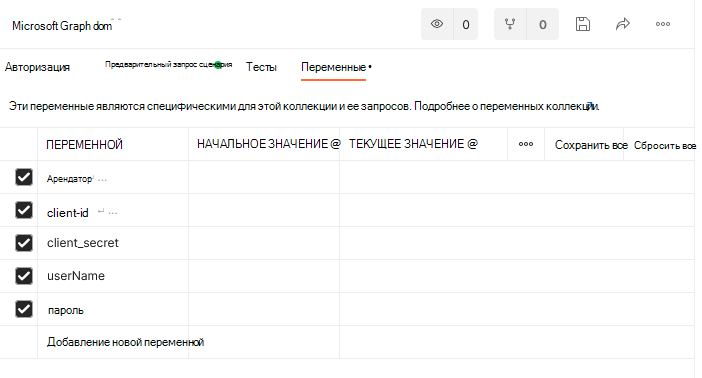

# <a name="use-postman-with-the-microsoft-graph-connectors-api"></a>Использование Postman с API соединителей Microsoft Graph

Postman — это платформа API для создания и использования API. Postman упрощает каждый этап жизненного цикла API, а также совместную работу, что позволяет быстрее создавать улучшенные API.

В этой статье описано, как использовать API соединители Microsoft Graph с Postman.

## <a name="prerequisites"></a>Предварительные требования

* Учетная запись Майкрософт либо рабочая или учебная учетная запись.
* Доступ к клиенту разработчика Microsoft 365. Если у вас его нет, вы можете зарегистрироваться в программе разработчиков [Microsoft 365](https://developer.microsoft.com/en-us/microsoft-365/dev-program), чтобы получить бесплатную подписку для разработчиков.

## <a name="step-1-fork-the-microsoft-graph-postman-collection"></a>Шаг 1. Разветвите коллекцию Microsoft Graph Postman.

Чтобы использовать коллекцию Postman, необходимо создать ее вилку в своей рабочей области Postman. Сделайте это из веб-браузера.

1. Откройте [Postman](https://identity.getpostman.com/signup) и зарегистрируйтесь. Если у вас уже есть учетная запись Postman, вы можете [войти](https://identity.getpostman.com/login).

2. После входа перейдите по следующему URL-адресу: `https://www.postman.com/microsoftgraph/workspace/microsoft-graph/collection/455214-085f7047-1bec-4570-9ed0-3a7253be148`, и выберите коллекцию Microsoft Graph.

3. Выберите три точки справа, а затем выберите **Создать развилку**.

   

4. В открываемом диалоговом окне введите метку для определения вилки. В раскрывающемся меню **Рабочая область** выберите пункт **Моя рабочая область** и выберите **Разветвление коллекции**.

   

3. Перейдите в **Рабочие области** > **Моя рабочая область**, чтобы увидеть созданную вами развилку. Папку соединителей Microsoft Graph можно найти в разделе **Приложение**.

   

## <a name="step-2-download-the-postman-agent-optional---postman-web-browser-only"></a>Шаг 2. Загрузите агент Postman (необязательно — только веб-браузер Postman)

Чтобы использовать эту коллекцию Postman в своем веб-браузере, скачайте [классический агент Postman](https://www.postman.com/downloads). 

Вы не можете использовать Postman для Интернета без этого из-за ограничений CORS в веб-браузере: Максимальное количество ресурсов [подключения](/graph/api/resources/externalconnectors-externalconnection) на клиент Microsoft 365.

Вам не требуется агент, если вы используете Postman для приложения Windows. Если вы откроете Postman для Windows, вы увидите эту коллекцию в своей рабочей области.

## <a name="step-3-create-an-azure-ad-application"></a>Шаг 3. Создайте приложение Azure AD.

Чтобы использовать эту коллекцию в своем клиенте разработчика, создайте приложение Azure Active Directory (Azure AD) и предоставьте ему соответствующие разрешения для запросов, которые вы хотите вызывать.

1. Перейдите на сайт [portal.azure.com](https://portal.azure.com/) и войдите, используя свою учетную запись администратора клиента разработчика.
2. В разделе **Службы Azure** выберите **Azure Active Directory**.
3. В меню слева выберите **Регистрация приложений**.
4. В горизонтальном меню выберите **Новая регистрация**.
5. В качестве **имени приложения** укажите `Parts Inventory`.
6. Присвойте параметру **URI перенаправления** значение `https://oauth.pstmn.io/v1/browser-callback`.
7. Нажмите **Зарегистрировать**.
8. В меню слева выберите **Разрешения API**.
9. В горизонтальном меню выберите **Добавить разрешение** > **Microsoft Graph** > **Делегированные разрешения**.
10. Начните вводить `ExternalItem.ReadWrite.All` и выберите `ExternalItem.ReadWrite.All`.
11. Щелкните **Разрешения приложений**, введите `ExternalItem` и просмотрите **Разрешения приложений**.
12. Разверните параметр **Внешний элемент** и выберите `ExternalItem.ReadWrite.All`.
13. Выберите **Добавить разрешения**.
14. В горизонтальном меню выберите **Предоставить согласие администратора для**, а затем выберите **Да**.
15. В меню слева выберите **Обзор**. Здесь вы можете получить **идентификатор приложения (клиента)** и **идентификатор каталога (клиента)**. Они понадобятся вам на шаге 4.
16. В меню слева выберите **Сертификаты и секреты**.
17. Выберите **Новый секрет клиента**, введите описание и нажмите **Добавить**. Скопируйте новое значение секрета клиента; оно вам понадобится на шаге 4.

Теперь приложение имеет два настроенных разрешения. `ExternalItem.ReadWrite.All` добавляется как делегированное разрешение, которое является разрешением, требующим авторизации пользователя. Приложение может читать/записывать внешние элементы от имени пользователя. `ExternalItem.ReadWrite.All` добавляется в качестве разрешения приложения, которое является разрешением, не требующим авторизации пользователя. Приложение может читать/записывать внешние элементы от своего имени.

## <a name="step-4-configure-authentication"></a>Действие 4. Настройка проверки подлинности

На этом шаге вы настроите переменные среды в Postman, используемые для получения маркера доступа.

1. Выберите вкладку **Microsoft Graph** и перейдите в раздел **Переменные**.

   

2. В разделе **Переменные** укажите необходимые сведения, используя информацию из шага 3:

   - В качестве текущего значения **клиента** установите значение идентификатора каталога (арендатора) из шага 3.15.
   - В качестве текущего значения **идентификатора\_клиента** установите значение идентификатора приложения (клиента) из шага 3.15.
   - В качестве текущего значения **секрета\_клиента** установите значение секрета клиента из шага 3.17.
   - Установите для текущего значения **userName** значение `admin@xxxxxxx.onmicrosoft.com`.
   - Установите текущее значение **пароля** на пароль администратора клиента.

   

3. Нажмите **Сохранить** / **Обновить**.

## <a name="step-5-get-an-authentication-token"></a>Шаг 5. Получите токен проверки подлинности

Вам потребуется получить маркер доступа, так как вы впервые выполняете запрос в виде потока проверки подлинности приложения. Получите маркер доступа, выполнив следующий запрос POST.


В следующем примере показано, как получить маркер доступа с общим секретом.
```html
POST /{{tenant}}/oauth2/v2.0/token HTTP/1.1 //Line breaks for clarity
Host: login.microsoftonline.com
Content-Type: application/x-www-form-urlencoded

client_id={{client_id}} 
&scope=https%3A%2F%2Fgraph.microsoft.com%2F.default 
&client_secret={{client_secret}} 
&grant_type=client_credentials 
```

В следующем примере показан успешный отклик.
```html
{ 
    "token_type": "Bearer", 
    "expires_in": 3599, 
    "ext_expires_in": 3599, 
    "access_token": "eyJ0eXAiOiJKV1QiLCJu… " 
} 
```

> [!NOTE]
> Здесь вы используете [Поток учетных данных клиента](/azure/active-directory/develop/v2-oauth2-client-creds-grant-flow). Получите маркер доступа для приложения, а не маркер доступа для пользователя.

## <a name="step-6-create-a-new-connection"></a>Шаг 6: Создайте новое подключение

[Соединение](/graph/connecting-external-content-manage-connections) — это логический контейнер для внешних данных, которыми вы можете управлять как единым целым. Выберите имя подключения, описание и идентификатор. Получите от администратора необходимые сведения для подключения к источнику данных и предоставьте механизм авторизации в источника контента при настройке соединения. Вы можете использовать [SDK Microsoft Graph](/graph/sdks/sdks-overview) API для программирования настройки соединителя. Если вы хотите сохранить учетные данные, можно использовать Azure Key Vault.

```http
POST /external/connections
```

Ниже приведен пример запроса.

```http
POST https://graph.microsoft.com/beta/external/connections 
Content-type: application/json 

{ 
  "id": "contosotasks", 
  "name": "Contoso Tasks", 
  "description": "Connection to index Contoso task management system" 
} 
```

Ниже приведен пример отклика.

```http
HTTP/1.1 201 Created 
Content-type: application/json 
 
{ 
    "@odata.context": "https://graph.microsoft.com/beta/$metadata#connections/$entity", 
    "id": "contosotasks", 
    "name": "Contoso Tasks", 
    "description": "Connection to index Contoso task management system", 
    "state": null, 
    "configuration": { 
        "authorizedApps": [ 
            "a47b35b7-6271-4e6d-9e27-2450a8b9c6b6" 
        ] 
    } 
} 
```

Ниже приведен снимок экрана с разделом **Создание соединения**.

 

## <a name="step-7-register-connection-schema"></a>Шаг 7: Зарегистрируйте схему подключения

Схема подключения определяет, как ваше содержимое используется в различных интерфейсах Microsoft Graph. Схема представляет собой простой список всех свойств, которые вы планируете добавить в соединение, вместе с их атрибутами, метками и псевдонимами. Перед добавлением элементов в соединение вы должны зарегистрировать схему.

```http
POST /external/connections/{id}/schema 
```

Ниже приведен пример запроса.

```http
POST https://graph.microsoft.com/beta/external/connections/contosotasks/schema 
Content-type: application/json 
Prefer: respond-async 

{ 
  "baseType": "microsoft.graph.externalItem", 
  "properties": [ 
    { 
"name": "title", 
      "type": "String", 
      "isSearchable": "true", 
"isQueryable": "true", 
      "isRetrievable": "true", 
      "labels": [ 
        "title" 
      ] 
    }, 
    { 
"aliases": "creator", 
      "name": "createdBy", 
      "type": "String", 
      "isSearchable": "true", 
"isQueryable": "true", 
      "isRetrievable": "false", 
"isRefinable": "false", 
      "labels": [ 
        "createdBy" 
      ] 
    }, 
    { 
"aliases": "editedDate", 
      "name": "lastEditedDate", 
      "type": "DateTime", 
      "isSearchable": "false", 
"isQueryable": "true", 
      "isRetrievable": "true", 
"isRefinable": "true", 
      "labels": [ 
   "lastModifiedDateTime" 
] 
    } 
  ] 
} 
```

Ниже приведен пример отклика.

```http
HTTP/1.1 202 Accepted 
Location: https://graph.microsoft.com/beta/external/connections/contosotasks/operations/616bfeed-666f-4ce0-8cd9-058939010bfc 
```

> [!NOTE]
> Регистрация схемы соединения является асинхронной операцией, поэтому не принимайте элементы в соединение, пока схема соединения не достигнет состояния "Завершено". Чтобы проверить состояние схемы соединения, выполните следующий запрос.
> ```http
> GET /external/connections/contosotasks/operations/616bfeed-666f-4ce0-8cd9-058939010bfc 
> ```

Ниже приведен еще один пример запроса.
```http
Request 
GET https://graph.microsoft.com/beta/external/connections/operations/616bfeed-666f-4ce0-8cd9-058939010bfc 
```

Ниже приведен еще один пример ответа.

```http
HTTP/1.1 200 OK 
Content-type: application/json 

{
    @odata.context":"https://graph.microsoft.com/beta/$metadata#external/connections('coursecatalog')/operations/$entity", 
    "id": "aa9186d2-893c-4361-ca51-431d88fa45d8", 
    "name": "Contoso Tasks", 
    "status": "inprogress", 
    "error": null  
}
```

Ниже приведен снимок экрана раздела **Получение состояния операции подключения**.


После изменения состояния операции схемы соединения с **Выполняется** на **Завершено** можно принять элементы для соединения.

После изменения состояния подключения с **черновик** на **готовность** можно ввести элементы в текущее подключение.

## <a name="step-8-add-external-group-member-optional"></a>Шаг 8. Добавьте внешнего участника группы (необязательно)

Если ваша внешняя служба использует контрольные списки (ACL), не относящиеся к Azure AD, синхронизируйте эти разрешения.  

Внешние группы (наряду с пользователями и группами Azure Active Directory) используются для установки разрешений для `externalItems` добавленных в подключение Microsoft Graph. Дополнительные сведения см. в разделе [externalGroup](/graph/api/resources/externalconnectors-externalgroup?view=graph-rest-1.0&preserve-view=true).

Это пример запроса.

```http
POST https://graph.microsoft.com/beta/external/connections/contosotasks/groups/31bea3d537902000/members 
Content-Type: application/json 
 
{ 
  "@odata.type": "#microsoft.graph.externalGroupMember", 
  "id": "1431b9c38ee647f6a", 
  "type": "group", 
  "identitySource": "external" 
} 
```

Это пример ответа.

```http
HTTP/1.1 201 Created 
Content-Type: application/json 

{ 
  "@odata.type": "#microsoft.graph.externalGroupMember", 
  "id": "14m1b9c38qe647f6a", 
  "type": "group", 
  "identitySource": "external" 
} 
```

## <a name="step-9-ingest-items"></a>Шаг 9. Примите элементы

После создания соединения вы можете добавить содержимое. Каждый элемент из источника данных должен быть представлен в виде `externalItem` в Microsoft Graph с уникальным идентификатором элемента. Этот идентификатор используется для создания, обновления или удаления элемента в Microsoft Graph. Вы можете использовать первичный ключ из источника данных в качестве `itemId` или получить его из одного или нескольких полей. `externalItem` содержит три основных компонента: список управления доступом, свойства и содержимое.

Если у вас есть двоичные файлы, необходимо выполнить анализ, чтобы получить метаданные и текстовую версию содержимого. Если у вас есть нетекстовое содержимое, например PDF- или BMP-файл, для преобразования содержимого в текст необходимо использовать распознавание символов объекта.  

Вы несете ответственность за преобразование исходных разрешений в `grant` или `deny`. `Deny` имеет более высокий приоритет над `grant`.

Ниже приведен пример запроса.

```http
PUT https://graph.microsoft.com/beta/external/connections/contosohr/items/TSP228082938 
Content-type: application/json 

{ 
  "@odata.type": "microsoft.graph.externalItem", 
  "acl": [ 
    { 
      "type": "user", 
      "value": "e811976d-83df-4cbd-8b9b-5215b18aa874", 
      "accessType": "grant", 
      "identitySource": "azureActiveDirectory" 
    }, 
    { 
      "type": "group", 
      "value": "14m1b9c38qe647f6a", 
      "accessType": "deny", 
      "identitySource": "external" 
    } 
  ], 
  "properties": { 
    "ticketID": "1158", 
    "priority": 1, 
    "title": "Filter design", 
  }, 
  "content": { 
    "value": "Build filtering capability by...", 
    "type": "text" 
  } 
} 
```

Ниже представлен пример успешного отклика.

```http
HTTP/1.1 200 OK
```

## <a name="error-handling"></a>Обработка ошибок

Дополнительные сведения об устранении ошибок см. в разделе [Устранение ошибок авторизации Microsoft Graph](/graph/resolve-auth-errors).

## <a name="see-also"></a>Дополнительные ресурсы

- [Использование Postman с API Microsoft Graph](use-postman.md)
