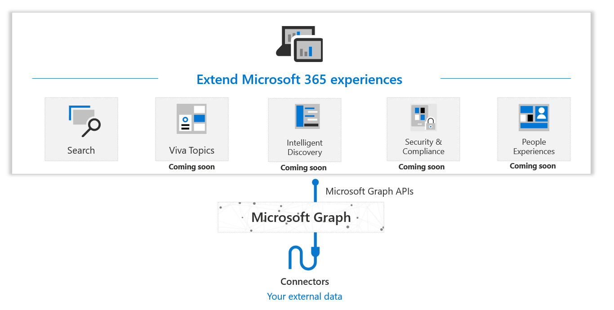

# Соединители Microsoft Graph

[Microsoft 365](https://www.microsoft.com/microsoft-365) — это полное интеллектуальное решение, расширяющее возможности пользователей и организаций за счет инновационных функций для увеличения производительности и ценных аналитических сведений, призванных повышать эффективность и стимулировать рост бизнеса. Microsoft Graph представляет собой базовые данные, лежащие в основе этих интеллектуальных функций, а Microsoft Graph API обеспечивает доступ к этим данным и средствам искусственного интеллекта.

Хотя большинство работников информационной сферы проводит значительную часть своего рабочего времени в приложениях, ориентированных на повышение производительности, например [Microsoft 365](https://www.microsoft.com/microsoft-365), им необходим также способ интеграции этой среды с приложениями предприятия и другими программами и службами (локальными и SaaS), которыми они пользуются. Например, с приложениями для планирования корпоративных ресурсов (ERP) и управления клиентскими ресурсами (CRM), приложениями интрасети, вики, блогами и сайтами социальных сетей.

Соединители Microsoft Graph обеспечивают простой и интуитивно понятный способ доставки содержимого из внешних служб в Microsoft Graph, предоставляя возможность использования внешних данных интеллектуальными функциями Microsoft 365, например функцией "Поиск" (в настоящее время общедоступной) и множеством других, ожидаемых в ближайшее время, таких как Viva Темы.

Сегодня с помощью соединителей Microsoft Graph данные вашей организации могут отображаться в результатах Поиска. Эта возможность расширяет типы источников содержимого, по которым можно выполнять поиск как в ориентированных на повышение производительности приложениях Microsoft 365, так и в более широком контексте экосистемы Майкрософт. Скоро соединители будут поддерживать множество других интеллектуальных функций Microsoft 365.
На диаграмме ниже представлен обобщенный обзор соединителей Microsoft Graph.

<!---Insert image reference here --->
<!---        --->

## Создание собственного пользовательского соединителя

Более 100 доступных в настоящее время соединителей корпорации Майкрософт и ее партнеров позволяют подключиться к популярным службам Майкрософт и сторонних разработчиков. Среди примеров существующих соединителей службы Azure, Box, ServiceNow, SalesForce, службы Google, MediaWiki и множество других.

Дополнительная информация о существующих соединителях Microsoft Graph представлена в [коллекции соединителей Microsoft Graph](/microsoftsearch/connectors-gallery).

Эти соединители помогают подключиться к популярным службам, но вам может потребоваться интеграция со службами, которых нет в существующей [коллекции соединителей](/microsoftsearch/connectors-gallery). Вы можете воспользоваться API соединителей Microsoft Graph и создать пользовательский соединитель для доставки внешних данных функциям Microsoft 365 в вашей организации, среди которых Поиск, Viva Темы и многие другие (ожидаемые в ближайшее время).

## Начало работы с пользовательскими соединителями Graph:
* [Работа с API соединителей](connecting-external-content-connectors-api-overview.md)
* [Использование Postman с API соединителей Microsoft Graph](connecting-external-content-connectors-api-postman.md)
<!---**(Articles coming next)**
* [Build your first custom connector with Microsoft Graph]()
--->

