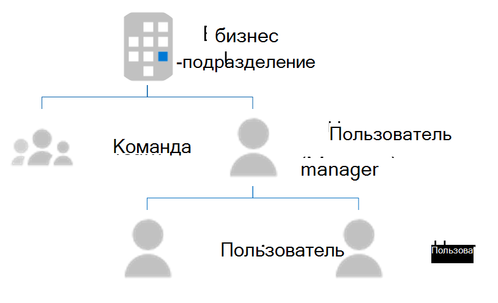
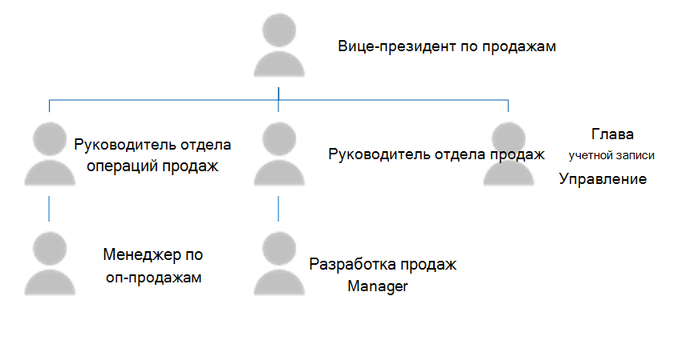

# <a name="use-external-groups-to-manage-permissions-to-microsoft-graph-connector-data-sources"></a>Использование внешних групп для управления разрешениями для источников данных Graph соединители Microsoft

[Внешние](/graph/api/resources/externalgroup?view=graph-rest-beta&preserve-view=true) группы позволяют управлять разрешениями для просмотра внешних элементов в подключении Microsoft Graph и подключения к источникам данных за пределами Azure Active Directory (Azure AD). [](/graph/api/resources/externalitem?view=graph-rest-beta&preserve-view=true)

Для источников данных, которые зависят от пользователей и групп Azure AD, при создании или обновлении внешних элементов устанавливаются разрешения [](/graph/api/externalconnection-put-items?view=graph-rest-beta&preserve-view=true) на внешние элементы, связывая список управления доступом (ACL) с пользователем Azure AD и групповым ИД.

Однако для источников данных, которые используют группы не Azure AD или групповые конструкции, такие как Профили Salesforce, Dynamics Business Units, SharePoint группы, локальные группы ServiceNow или локальные группы Confluence, рекомендуется использовать внешние *группы.*

## <a name="common-external-group-scenarios"></a>Общие внешние групповые сценарии

Ниже приводится ряд примеров групп, не относящуюся к приложениям Azure AD.

Microsoft Dynamics 365 позволяет клиентам структурировать свои ЦПМ с бизнес-подразделениями и группами.Сведения о членстве для этих бизнес-подразделений и групп не хранятся в Azure AD.

На следующем изображении показана структура бизнес-подразделений и групп.

<!---Using html to adjust the size of the image --->
<br><p align="center"></p>

Salesforce использует профили, роли и наборы разрешений для авторизации. Они специфичествеен для Salesforce, а сведения о членстве недоступны в Azure AD.

На следующем изображении показана структура сведений о членстве в Salesforce.

<!---Using html to adjust the size of the image --->
<br><p align="center"></p>

## <a name="using-external-groups-in-your-connection"></a>Использование внешних групп в подключении

Использование внешних групп в подключениях:

1. Для каждой группы, не влияемой на Azure AD, создайте внешнюю группу в Microsoft Graph с помощью [API групп.](/en-us/graph/api/resources/group?view=graph-rest-beta&preserve-view=true)
2. Используйте внешнюю группу при определении ACL для внешних элементов по мере необходимости.  
3. Следите за тем, чтобы членство внешних групп было в курсе и синхронизируется.

### <a name="create-external-groups"></a>Создание внешних групп

Внешние группы относятся к подключению. Создание внешних групп в подключениях:
* Используйте API групп в Microsoft Graph, как показано в следующем примере.

    > [!NOTE]
    > [DisplayName и](/graph/api/resources/externalgroup?view=graph-rest-beta&preserve-view=true) **описание являются** необязательными полями.

    ```http
    POST /connections/{connectionId}/groups 

    {  
      "id": "contosoEscalations",  
      "displayName": "Contoso Escalations",  
      "description": "Tier-1 escalations within Contoso"
    }  
    ```

* Предоставление идентификатора или имени в поле [ID.](/graph/api/resources/externalgroup?view=graph-rest-beta&preserve-view=true) Используйте это значение для вызова внешней группы в последующих запросах.

    > [!NOTE]
    > Поле ID позволяет использовать наборы символов Base64, безопасных для URL-адресов и файлов, и имеет ограничение в 128 символов.

Внешняя группа может содержать одну или несколько следующих групп:
* Пользователь Azure AD.
* Группа Azure AD.
* Другая внешняя группа, в том числе вложенные внешние группы.

После создания группы можно добавить членов в группу, как показано в следующих примерах.

```http
POST https://graph.microsoft.com/beta/connections/{connectionId}/groups/{groupId}/members

{ 
  "id": "contosoSupport", 
  "type": "group", 
  "identitySource": "external" 
}
```
```http
POST https://graph.microsoft.com/beta/connections/{connectionId}/groups/{groupId}/members 

{ 
  "id": "25f143de-be82-4afb-8a57-e032b9315752", 
  "type": "user", 
  "identitySource": "azureActiveDirectory" 
}
```
```http
POST https://graph.microsoft.com/beta/connections/{connectionId}/groups/{groupId}/members 

{ 
  "id": "99a3b3d6-71ee-4d21-b08b-4b6f22e3ae4b", 
  "type": "group", 
  "identitySource": "azureActiveDirectory" 
}
```

### <a name="use-external-groups-in-acl"></a>Использование внешних групп в ACL

Внешние группы можно использовать при определении [ALS](connecting-external-content-manage-items.md#access-control-list) для внешних элементов, как показано в следующем примере. Помимо пользователей и групп Azure AD внешний элемент может иметь внешние группы в записях управления доступом.

```http
PUT https://graph.microsoft.com/beta/external/connections/{id}/items/{id}  

Content-type: application/json  
{  
  "@odata.type": "microsoft.graph.externalItem",  
  "acl": [  
    {  
      "type": "group",  
      "value": "contosEscalations",  
      "accessType": "grant",  
      "identitySource": "External"  
    },  
    {  
      "type": "user",  
      "value": "87e9089a-08d5-4d9e-9524-b7bd6be580d5",  
      "accessType": "grant",  
      "identitySource": "azureActiveDirectory"  
    },  
    {  
      "type": "group",  
      "value": "96fbeb4f-f71c-4405-9f0b-1d6988eda2d2",  
      "accessType": "deny",  
      "identitySource": "azureActiveDirectory"  
    }  
  ],  
  "properties": {  
    "title": "Error in the payment gateway",  
    "priority": 1,  
    "assignee": "john@contoso.com"  
  },  
  "content": {  
    "value": "<h1>Error in payment gateway</h1><p>Error details...</p>",  
    "type": "html"  
  }  
}  
```

> [!NOTE]
> Внешние группы в acLs можно использовать еще до создания групп.

### <a name="keep-external-group-memberships-in-sync"></a>Синхронизируйте внешние члены группы

Сохранение членства вашей внешней группы в Microsoft Graph. При изменении членства в настраиваемой группе убедитесь, что изменение отражается во внешней группе в то время, которое работает для ваших потребностей.

### <a name="manage-external-groups-and-membership"></a>Управление внешними группами и членством

API групп можно использовать для управления внешними группами и членством в группе. Подробнее см. в [материале externalGroup](/graph/api/resources/externalgroup?view=graph-rest-beta&preserve-view=true) и [externalGroupMember.](/graph/api/resources/externalgroupmember?view=graph-rest-beta&preserve-view=true)

## <a name="see-also"></a>См. также
Дополнительные информацию об API Graph соединителов Майкрософт см. в этой ссылке [Работа с API соединителов.](connecting-external-content-connectors-api-overview.md)
