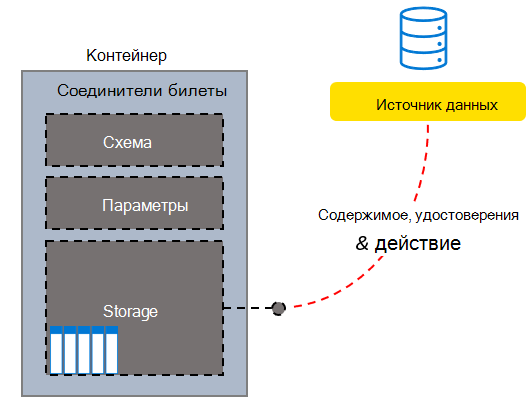

<!---<author of this doc: rsamai>--->

# Создание, обновление и удаление подключений в Microsoft Graph

Подключения внешних служб к службе "Поиск (Майкрософт)" представляются ресурсом [externalConnection](/graph/api/resources/externalconnection?view=graph-rest-beta&preserve-view=true) в Microsoft Graph.

Платформа соединителей Microsoft Graph — это простой способ добавления внешних данных в Microsoft Graph. Подключение — это логический контейнер для внешних данных, которыми администратор управляет как единым целым.

После создания подключения можно добавить содержимое из любого внешнего источника данных, такого как локальный источник контента или внешний сервис SaaS. Вы можете просматривать и управлять только созданными вами подключениями, и теми из них, которые были [авторизованными](/graph/api/external-post-connections?view=graph-rest-beta&preserve-view=true) для управления. Администратор поиска может просматривать все подключения клиента и управлять ими в современной версии центра администрирования.

<!-- markdownlint-disable MD036 -->

*Образец структуры соединителей запросов в пользовательскую систему поддержки*

*Представление администратора подключений, включающее пользовательский соединитель запросов*

<!-- markdownlint-enable MD036 -->

Моделируйте подключения как пожелаете. Однако создание одного подключение на каждый экземпляр соединителя используется чаще всего. Например, каждый раз, когда вы [настраиваете соединитель общей папки Microsoft Windows](/microsoftsearch/configure-connector), создается новое подключение. Кроме того, вы можете создать единое подключение, чтобы добавить все элементы из источника данных. Например, вы создаете единое подключение, чтобы добавить в систему своей службы поддержки все запросы и инциденты для нескольких групп.

## Состояния и операции

Подключение может находиться в одном из следующих состояний:

| Состояние             | Описание                                                                                                                                               |
|-------------------|-----------------------------------------------------------------------------------------------------------------------------------------------------------|
| **Draft**         | Подготовлено пустое подключение. Источник данных, схема или другие параметры еще не настроены.                                                |
| **Ready**         | Соединение подготовлено с помощью зарегистрированной схемы и готово к использованию.                                                                          |
| **Obsolete**      | Это происходит, если зависимая функция, например API, устарела. Единственное допустимое решение – удалить подключение.                           |
| **LimitExceeded** | Если достигнуто максимальный предел для единого подключения или квоты клиента для всех подключений, невозможно добавить дополнительные элементы, пока вы не выйдете из этого состояния. |

В следующей таблице указано, какие операции доступны в каждом из этих состояний.

| Операция         | Draft              | Ready              | Obsolete           | LimitExceeded      |
|-------------------|--------------------|--------------------|--------------------|--------------------|
| Создание подключения | :x:                | :heavy_check_mark: | :x:                | :heavy_check_mark: |
| Чтение подключения   | :heavy_check_mark: | :heavy_check_mark: | :heavy_check_mark: | :heavy_check_mark: |
| Обновление подключения | :heavy_check_mark: | :heavy_check_mark: | :x:                | :heavy_check_mark: |
| Удаление подключения | :heavy_check_mark: | :heavy_check_mark: | :heavy_check_mark: | :heavy_check_mark: |
| Создание схемы     | :heavy_check_mark: | :x:                | :x:                | :x:                |
| Чтение схемы       | :x:                | :heavy_check_mark: | :heavy_check_mark: | :heavy_check_mark: |
| Обновление схемы     | :x:                | :x:                | :x:                | :x:                |
| Удаление схемы     | :x:                | :x:                | :x:                | :x:                |
| Создание элемента       | :x:                | :heavy_check_mark: | :x:                | :x:                |
| Чтение элемента         | :x:                | :heavy_check_mark: | :heavy_check_mark: | :heavy_check_mark: |
| Обновление элемента       | :x:                | :heavy_check_mark: | :x:                | :heavy_check_mark: |
| Удаление элемента       | :x:                | :heavy_check_mark: | :x:                | :heavy_check_mark: |

Подключение позволяет приложению [определить схему](/graph/api/externalconnection-post-schema?view=graph-rest-beta&preserve-view=true) для индексируемых элементов, а также предоставляет службе конечную точку для добавления, обновления и удаления элементов индекса. [Создание подключения](#create-a-connection) — первый шаг приложения к добавлению элементов в индекс поиска.

## Создание подключения

Чтобы приложение могло добавлять элементы в индекс поиска, ему необходимо создать и настроить подключение, выполнив указанные ниже действия.

- [Создание подключения](/graph/api/external-post-connections?view=graph-rest-beta&preserve-view=true) с уникальным идентификатором, отображаемым именем и описанием.
- [Зарегистрируйте схему](/graph/api/externalconnection-post-schema?view=graph-rest-beta&preserve-view=true), чтобы определить поля, которые будут включены в индекс.

> [!NOTE]
> Сведения об обновлении схемы для существующего подключения см. в статье [Возможности обновления схемы](/graph/connecting-external-content-manage-schema#schema-update-capabilities).

## Обновление подключения

Вы можете изменить отображаемое имя или описание существующего подключения, [обновив подключение](/graph/api/externalconnection-update?view=graph-rest-beta&preserve-view=true).

## Удаление подключения

Вы можете [удалить подключение](/graph/api/externalconnection-delete?view=graph-rest-beta&preserve-view=true) и удалить все элементы, индексированные через него.

## Дальнейшие действия

- [Регистрация схемы подключения](/graph/connecting-external-content-manage-schema.md)
- [Обзор справочника API соединителей Graph](/graph/api/resources/indexing-api-overview?view=graph-rest-beta&preserve-view=true)
- [Обзор соединителей Microsoft Graph](/microsoftsearch/connectors-overview)
- Скачайте [образец соединителя поиска](https://github.com/microsoftgraph/msgraph-search-connector-sample) с сайта GitHub.
