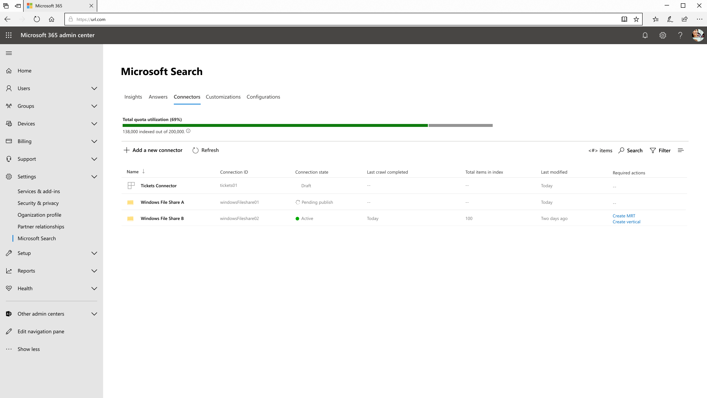

<!---<author of this doc: rsamai>--->

# Создание, обновление и удаление подключений в Microsoft Graph

Подключения внешних служб к службе "Поиск (Майкрософт)" представляются ресурсом [externalConnection](/graph/api/resources/externalconnectors-externalconnection?view=graph-rest-1.0&preserve-view=true) в Microsoft Graph.

Платформа соединителей Microsoft Graph предлагает интуитивно понятный способ добавления внешних данных в Microsoft Graph. Подключение — это логический контейнер для внешних данных, которыми администратор управляет как единым целым.

После создания подключения вы можете добавить содержимое из любого внешнего источника данных, например локального источника содержимого или внешней службы SaaS. Вы можете просматривать и управлять только теми подключениями, которые вы [создали](/graph/api/externalconnectors-external-post-connections?view=graph-rest-1.0&preserve-view=true&tabs=http) или для управления которыми вы получили явное разрешение. Администратор поиска может просматривать все подключения клиента и управлять ими в современной версии центра администрирования.

<!-- markdownlint-disable MD036 -->

*Образец пользовательской структуры системы поддержки Tickets Connector.*

*Административный вид подключений, включая настраиваемый Tickets Connector.*

<!-- markdownlint-enable MD036 -->

Моделируйте подключения как вам нравится. Однако создание одного соединения для каждого экземпляра соединителя является наиболее распространенной моделью. Например, каждый раз, когда вы [настраиваете соединитель общего доступа к файлам Microsoft Windows](/en-us/microsoftsearch/configure-connector), создается новое подключение. Кроме того, вы можете создать единое подключение, чтобы добавить все элементы из источника данных. Например, вы можете создать одно соединение, чтобы добавить все запросы и инциденты в нескольких командах из вашей системы службы поддержки.

## Состояния и операции

Подключение может находиться в одном из следующих состояний:

| Состояние             | Описание                |
|-------------------|----------------------------|
| **Draft**         | Подготовлено пустое подключение. Источник данных, схема или другие параметры еще не настроены. |
| **Ready**         | Соединение подготовлено с помощью зарегистрированной схемы и готово к использованию. |
| **Obsolete**      | Это происходит, если зависимая функция, например API, устарела. Единственное допустимое решение – удалить подключение. |
| **LimitExceeded** | Если вы достигли максимального предела одного подключения или квоты на уровне клиента для всех подключений, вы не сможете добавить больше элементов, пока не выйдете из этого состояния. |

В следующей таблице указано, какие операции доступны в каждом из этих состояний.

| Операция         | Draft              | Ready              | Obsolete           | LimitExceeded      |
|-------------------|--------------------|--------------------|--------------------|--------------------|
| Создание подключения | :x:                | :heavy_check_mark: | :x:                | :heavy_check_mark: |
| Чтение подключения   | :heavy_check_mark: | :heavy_check_mark: | :heavy_check_mark: | :heavy_check_mark: |
| Обновление подключения | :heavy_check_mark: | :heavy_check_mark: | :x:                | :heavy_check_mark: |
| Удаление подключения | :heavy_check_mark: | :heavy_check_mark: | :heavy_check_mark: | :heavy_check_mark: |
| Создание схемы     | :heavy_check_mark: | :x:                | :x:                | :x:                |
| Чтение схемы       | :x:                | :heavy_check_mark: | :heavy_check_mark: | :heavy_check_mark: |
| Обновление схемы     | :x:                | :x:                | :x:                | :x:                |
| Удаление схемы     | :x:                | :x:                | :x:                | :x:                |
| Создание элемента       | :x:                | :heavy_check_mark: | :x:                | :x:                |
| Чтение элемента         | :x:                | :heavy_check_mark: | :heavy_check_mark: | :heavy_check_mark: |
| Обновление элемента       | :x:                | :heavy_check_mark: | :x:                | :heavy_check_mark: |
| Удаление элемента       | :x:                | :heavy_check_mark: | :x:                | :heavy_check_mark: |

Соединение позволяет приложению [определять схему](/graph/api/externalconnectors-externalconnection-post-schema?view=graph-rest-beta&preserve-view=true&tabs=http&viewFallbackFrom=graph-rest-1.0) для элементов, которые будут проиндексированы, и предоставляет конечную точку для вашей службы, чтобы добавлять, обновлять или удалять элементы из индекса. 

Первым шагом приложения для добавления элементов в поисковый индекс является создание соединения.

## Создание подключения

Прежде чем приложение сможет добавлять элементы в поисковый индекс, оно должно создать и настроить соединение:

1. [Создание подключения](/graph/api/externalconnectors-external-post-connections?view=graph-rest-1.0&preserve-view=true&tabs=http) с уникальным идентификатором, отображаемым именем и описанием.
2. [Зарегистрируйте схему](/graph/api/externalconnectors-externalconnection-post-schema?view=graph-rest-beta&preserve-view=true&tabs=http&viewFallbackFrom=graph-rest-1.0), чтобы определить поля, которые будут включены в индекс.

> [!NOTE]
> Сведения об обновлении схемы для существующего подключения см. в статье [Возможности обновления схемы](/graph/connecting-external-content-manage-schema#schema-update-capabilities).

## Обновление подключения

Чтобы изменить отображаемое имя или описание существующего соединения, вы можете [обновить соединение](/graph/api/externalconnectors-externalconnection-update?view=graph-rest-1.0&preserve-view=true&tabs=http).

## Удаление подключения

Чтобы удалить все элементы, которые были проиндексированы через соединение, вы можете [удалить соединение](/graph/api/externalconnectors-externalconnection-delete?view=graph-rest-1.0&preserve-view=true&tabs=http).

## Дальнейшие действия

- [Регистрация схемы подключения](connecting-external-content-manage-schema.md)
- [Обзор справочника API соединителей Microsoft Graph](/graph/api/resources/indexing-api-overview?view=graph-rest-1.0&preserve-view=true)
- [Загрузите образец соединителя поиска с GitHub.](https://github.com/microsoftgraph/msgraph-search-connector-sample)
