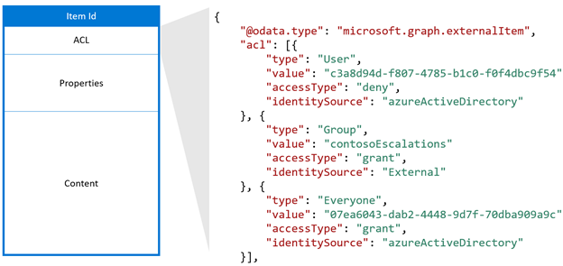
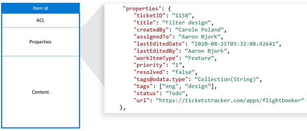
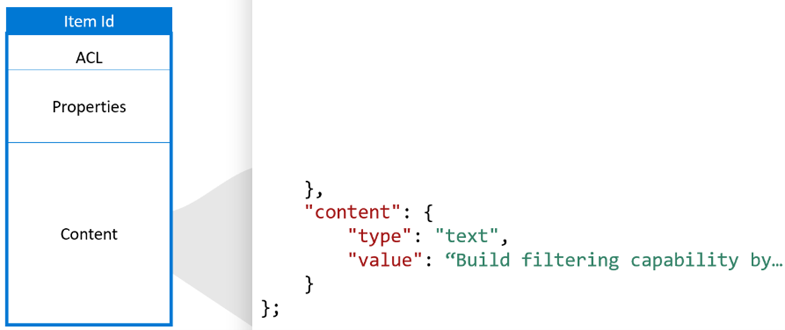

<!---<author of this doc: rsamai>--->

# <a name="create-update-and-delete-items-added-by-your-application-via-microsoft-graph-connectors"></a><span data-ttu-id="61a22-103">Создание, обновление и удаление элементов, добавленных приложением с помощью соединителей Microsoft Graph</span><span class="sxs-lookup"><span data-stu-id="61a22-103">Create, update, and delete items added by your application via Microsoft Graph connectors</span></span>

<span data-ttu-id="61a22-104">Соединители Microsoft Graph — это простой способ добавления внешних данных в Microsoft Graph.</span><span class="sxs-lookup"><span data-stu-id="61a22-104">Microsoft Graph connectors offer a simple way to bring external data into Microsoft Graph.</span></span> <span data-ttu-id="61a22-105">Элементы, добавленные приложением в службу "Поиск (Майкрософт)", представлены ресурсом [externalItem](/graph/api/resources/externalitem?view=graph-rest-beta&preserve-view=true) в Microsoft Graph.</span><span class="sxs-lookup"><span data-stu-id="61a22-105">Items added by your application to the Microsoft Search service are represented by the [externalItem](/graph/api/resources/externalitem?view=graph-rest-beta&preserve-view=true) resource in Microsoft Graph.</span></span>

<span data-ttu-id="61a22-106">После [создания связи](/graph/api/external-post-connections?view=graph-rest-beta&preserve-view=true) вы можете добавить содержимое.</span><span class="sxs-lookup"><span data-stu-id="61a22-106">After you have [created a connection](/graph/api/external-post-connections?view=graph-rest-beta&preserve-view=true), you can add your content.</span></span> <span data-ttu-id="61a22-107">Каждый элемент из источника данных должен быть представлен в виде [externalItem](/graph/api/resources/externalitem?view=graph-rest-beta&preserve-view=true) в Microsoft Graph с уникальным идентификатором элемента.</span><span class="sxs-lookup"><span data-stu-id="61a22-107">Each item from your data source must be represented as an [externalItem](/graph/api/resources/externalitem?view=graph-rest-beta&preserve-view=true) in Microsoft Graph with a unique item ID.</span></span> <span data-ttu-id="61a22-108">Этот идентификатор используется для создания, обновления или удаления элемента в Microsoft Graph.</span><span class="sxs-lookup"><span data-stu-id="61a22-108">This ID is used to create, update, or delete the item from Microsoft Graph.</span></span> <span data-ttu-id="61a22-109">Вы можете использовать первичный ключ из источника данных в качестве itemId или получить его из одного или нескольких полей.</span><span class="sxs-lookup"><span data-stu-id="61a22-109">You can use the primary key from your data source as the itemId or derive it from one or more fields.</span></span> <span data-ttu-id="61a22-110">**externalItem** содержит три основных компонента: список управления доступом, свойства и содержимое.</span><span class="sxs-lookup"><span data-stu-id="61a22-110">An **externalItem** has three key components: access control list, properties, and content.</span></span>

## <a name="access-control-list"></a><span data-ttu-id="61a22-111">Список управления доступом</span><span class="sxs-lookup"><span data-stu-id="61a22-111">Access control list</span></span>

<span data-ttu-id="61a22-112">Список управления доступом используется для указания того, предоставляется ли определенным ролям доступ для просмотра элементов в интерфейсах Майкрософт.</span><span class="sxs-lookup"><span data-stu-id="61a22-112">The access control list is used to specify whether the given roles are granted or denied access to view items in Microsoft experiences.</span></span> <span data-ttu-id="61a22-113">Это массив записей управления доступом, каждая из которых представляет пользователя или группу Azure Active Directory.</span><span class="sxs-lookup"><span data-stu-id="61a22-113">It is an array of access control entries, each representing an Azure Active Directory user or group.</span></span> <span data-ttu-id="61a22-114">Существует третий тип записей управления доступом: `Everyone`, который представляет всех пользователей в клиенте.</span><span class="sxs-lookup"><span data-stu-id="61a22-114">A third access control entry type `Everyone` that represents all the users in the tenant.</span></span>



<span data-ttu-id="61a22-116">Значение **accessType** `deny` имеет приоритет над `grant`.</span><span class="sxs-lookup"><span data-stu-id="61a22-116">The **accessType** value `deny` takes precedence over `grant`.</span></span> <span data-ttu-id="61a22-117">Например, хотя в указанном ранее элементе доступ предоставлен с помощью параметра `Everyone`, а конкретному пользователю доступ запрещен, действующим разрешением для этого пользователя будет вариант `deny`.</span><span class="sxs-lookup"><span data-stu-id="61a22-117">For example, in the item shown earlier, while `Everyone` is granted access and a specific user is denied access, the effective permission for this user is `deny`.</span></span>

<span data-ttu-id="61a22-118">Если ваш источник данных не содержит групп Azure Active Directory, таких как группы в вашей службе поддержки, применяемых для настройки разрешений для элемента, вы можете создать внешние группы в Microsoft Graph, используя API синхронизации группы для репликации разрешений `allow` или `deny`.</span><span class="sxs-lookup"><span data-stu-id="61a22-118">If your data source has non-Azure Active Directory groups, such as teams within your helpdesk system, used to set permissions for the item, you can create external groups in Microsoft Graph using the group sync APIs to replicate the `allow` or `deny` permissions.</span></span> <span data-ttu-id="61a22-119">Избегайте расширения участия ваших внешних групп непосредственно в списках управления доступом отдельных элементов, так как каждое участие группы может привести к многочисленным обновлениям элементов.</span><span class="sxs-lookup"><span data-stu-id="61a22-119">Avoid expanding the membership of your external groups directly into the access control lists of individual items, because each group membership can lead to a high volume of item updates.</span></span>

<span data-ttu-id="61a22-120">Внешние группы могут состоять из других внешних групп, пользователей Azure Active Directory и групп Azure Active Directory.</span><span class="sxs-lookup"><span data-stu-id="61a22-120">External groups can consist of another external group, Azure Active Directory users, and Azure Active Directory groups.</span></span> <span data-ttu-id="61a22-121">Если у вас есть пользователи не из Azure Active Directory, вы должны преобразовать их в пользователей Azure Active Directory в своем списке управления доступом.</span><span class="sxs-lookup"><span data-stu-id="61a22-121">If you have non-Azure Active Directory users, you must translate them to Azure Active Directory users in your access control list.</span></span>

## <a name="properties"></a><span data-ttu-id="61a22-122">Свойства</span><span class="sxs-lookup"><span data-stu-id="61a22-122">Properties</span></span>

<span data-ttu-id="61a22-123">С помощью компонента свойств можно добавлять метаданные элементов, которые удобно применять в интерфейсах Microsoft Graph.</span><span class="sxs-lookup"><span data-stu-id="61a22-123">The properties component is used to add item metadata that is useful in Microsoft Graph experiences.</span></span> <span data-ttu-id="61a22-124">Вы должны [зарегистрировать схему](./connecting-external-content-manage-schema.md) для связи перед добавлением в нее элементов и преобразованием **типов данных** в [поддерживаемые типы данных](/graph/api/resources/property?view=graph-rest-beta&preserve-view=true).</span><span class="sxs-lookup"><span data-stu-id="61a22-124">You must [register the schema](./connecting-external-content-manage-schema.md) for the connection before adding items into it and convert **datatypes** into [supported datatypes](/graph/api/resources/property?view=graph-rest-beta&preserve-view=true).</span></span>



## <a name="content"></a><span data-ttu-id="61a22-126">Содержимое</span><span class="sxs-lookup"><span data-stu-id="61a22-126">Content</span></span>

<span data-ttu-id="61a22-127">Компонент содержимого используется для массового добавления элементов, которые должны быть полнотекстовым индексом.</span><span class="sxs-lookup"><span data-stu-id="61a22-127">The content component is used to add the bulk of the item that needs to be full text indexed.</span></span> <span data-ttu-id="61a22-128">Примеры включают описание запроса, проанализированный текст из файла или вики-страницы.</span><span class="sxs-lookup"><span data-stu-id="61a22-128">Examples include ticket description, parsed text from a file body, or a wiki page body.</span></span>

<span data-ttu-id="61a22-129">Содержимое — одно из ключевых полей, влияющих на [релевантность](./connecting-external-content-manage-schema.md#relevance) в интерфейсах Майкрософт.</span><span class="sxs-lookup"><span data-stu-id="61a22-129">Content is one of the key fields influencing [relevance](./connecting-external-content-manage-schema.md#relevance) across Microsoft experiences.</span></span> <span data-ttu-id="61a22-130">Поддерживаются типы контента: `text` и `HTML`.</span><span class="sxs-lookup"><span data-stu-id="61a22-130">The content types `text` and `HTML` are supported.</span></span> <span data-ttu-id="61a22-131">Если источник данных содержит двоичные файлы, вы можете проанализировать их в качестве текста перед добавлением в Microsoft Graph.</span><span class="sxs-lookup"><span data-stu-id="61a22-131">If your data source has binary files, you can parse them to text before adding them to Microsoft Graph.</span></span>



<span data-ttu-id="61a22-133">Содержимое нельзя непосредственно добавить в шаблон результатов поиска, но вы можете использовать созданный фрагмент результатов, являющийся динамически создаваемым предварительным просмотром соответствующих разделов в содержимом.</span><span class="sxs-lookup"><span data-stu-id="61a22-133">Content cannot be directly added into a search result template, but you can use a generated result snippet, which is a dynamically generated preview of the relevant sections within content.</span></span>


<span data-ttu-id="61a22-135">При изменении содержимого в источнике данных вы должны синхронизировать его с элементами связи.</span><span class="sxs-lookup"><span data-stu-id="61a22-135">When content in your data source changes, you must sync it with your connection items.</span></span> <span data-ttu-id="61a22-136">Вы можете обновить весь элемент или обновить один или несколько его компонентов.</span><span class="sxs-lookup"><span data-stu-id="61a22-136">You can either update the entire item or update one or more of its components.</span></span> <span data-ttu-id="61a22-137">После добавления содержимого в Microsoft Graph вы можете искать его с помощью интерфейса Поиска (Майкрософт), настроив [вертикали и типы результатов](/MicrosoftSearch/customize-search-page) или воспользовавшись [API поиска Microsoft Graph](/graph/api/resources/search-api-overview?view=graph-rest-beta&preserve-view=true).</span><span class="sxs-lookup"><span data-stu-id="61a22-137">Once your content has been added to Microsoft Graph, you can search for it through the Microsoft Search experience after setting up [verticals and result types](/MicrosoftSearch/customize-search-page) or using the [Microsoft Graph Search API](/graph/api/resources/search-api-overview?view=graph-rest-beta&preserve-view=true).</span></span>

## <a name="add-an-item"></a><span data-ttu-id="61a22-138">Добавление элемента</span><span class="sxs-lookup"><span data-stu-id="61a22-138">Add an item</span></span>

<span data-ttu-id="61a22-139">Вы можете добавить элемент в индекс, [создав объект externalItem](/graph/api/externalconnection-put-items?view=graph-rest-beta&preserve-view=true).</span><span class="sxs-lookup"><span data-stu-id="61a22-139">You can add an item to the index by [creating an externalItem](/graph/api/externalconnection-put-items?view=graph-rest-beta&preserve-view=true).</span></span> <span data-ttu-id="61a22-140">При создании элемента ему назначается уникальный идентификатор в URL-адресе.</span><span class="sxs-lookup"><span data-stu-id="61a22-140">When you create an item, you assign a unique identifier in the URL.</span></span>

<span data-ttu-id="61a22-141">Например, приложение может индексировать запросы в службу технической поддержки по их номерам.</span><span class="sxs-lookup"><span data-stu-id="61a22-141">For example, your application may index helpdesk tickets using the ticket number.</span></span> <span data-ttu-id="61a22-142">Если запросу назначен номер `SR00145`, он может выглядеть так:</span><span class="sxs-lookup"><span data-stu-id="61a22-142">If a ticket has the ticket number `SR00145`, the request may look like the following.</span></span>

```http
PUT /external/connections/contosohelpdesk/items/SR00145
Content-Type: application/json

{
  "title": "WiFi outage in Conference Room A",
  "status": "New",
  "assignee": "meganb@contoso.com"
}
```

> <span data-ttu-id="61a22-143">![ПРИМЕЧАНИЕ] Перед поиском индексированных элементов в пользовательском интерфейсе "Поиск (Майкрософт)", администратор должен [настроить страницу результатов поиска](/MicrosoftSearch/configure-connector#next-steps-customize-the-search-results-page) для соответствующего подключения.</span><span class="sxs-lookup"><span data-stu-id="61a22-143">![NOTE] Before indexed items can be found in the Microsoft Search UI, an administrator must [customize the search results page](/MicrosoftSearch/configure-connector#next-steps-customize-the-search-results-page) for the corresponding connection.</span></span>

## <a name="update-an-item"></a><span data-ttu-id="61a22-144">Обновление элемента</span><span class="sxs-lookup"><span data-stu-id="61a22-144">Update an item</span></span>

<span data-ttu-id="61a22-145">При обновлении элемента во внешней службе (переназначении запросов в службу технической поддержки или обновлении описания продукта), вы можете обновить соответствующую запись в индексе, [обновив externalItem](/graph/api/externalitem-update?view=graph-rest-beta&preserve-view=true) по уникальному идентификатору, назначенному элементу при его создании.</span><span class="sxs-lookup"><span data-stu-id="61a22-145">When an item is updated in the external service (helpdesk ticket is reassigned, or a product description is updated), you can update its entry in the index by [updating the externalItem](/graph/api/externalitem-update?view=graph-rest-beta&preserve-view=true), using the unique identifier assigned to the item when you created it.</span></span>

```http
PATCH /external/connections/contosohelpdesk/items/SR00145
Content-Type: application/json

{
  "assignee": "alexw@contoso.com"
}
```

## <a name="delete-an-item"></a><span data-ttu-id="61a22-146">Удаление элемента</span><span class="sxs-lookup"><span data-stu-id="61a22-146">Delete an item</span></span>

<span data-ttu-id="61a22-147">Вы можете удалить элементы из индекса, [удалив externalItem](/graph/api/externalitem-delete?view=graph-rest-beta&preserve-view=true) по уникальному идентификатору, назначенному при его создании.</span><span class="sxs-lookup"><span data-stu-id="61a22-147">You can remove items from the index by [deleting the externalItem](/graph/api/externalitem-delete?view=graph-rest-beta&preserve-view=true), using the unique identifier assigned to the item when you created it.</span></span>

```http
DELETE /external/connections/contosohelpdesk/items/SR00145
```

## <a name="see-also"></a><span data-ttu-id="61a22-148">См. также</span><span class="sxs-lookup"><span data-stu-id="61a22-148">See also</span></span>

- [<span data-ttu-id="61a22-149">Запросы с использованием API Поиска (Майкрософт)</span><span class="sxs-lookup"><span data-stu-id="61a22-149">Query using the Microsoft Search API</span></span>](search-concept-overview.md#why-use-the-microsoft-search-api)
- [<span data-ttu-id="61a22-150">Обзор индексирования справочных материалов по API</span><span class="sxs-lookup"><span data-stu-id="61a22-150">Review the Indexing API reference</span></span>](/graph/api/resources/indexing-api-overview?view=graph-rest-beta&preserve-view=true)
- [<span data-ttu-id="61a22-151">Настройка страницы результатов поиска Microsoft</span><span class="sxs-lookup"><span data-stu-id="61a22-151">Customize Microsoft Search results page</span></span>](/MicrosoftSearch/customize-search-page)
- [<span data-ttu-id="61a22-152">Поиск объектов настраиваемого типа (externalItem)</span><span class="sxs-lookup"><span data-stu-id="61a22-152">Search custom types (externalItem)</span></span>](search-concept-custom-types.md)
- <span data-ttu-id="61a22-153">Скачайте [образец соединителя поиска](https://github.com/microsoftgraph/msgraph-search-connector-sample) с сайта GitHub.</span><span class="sxs-lookup"><span data-stu-id="61a22-153">Download the [sample search connector](https://github.com/microsoftgraph/msgraph-search-connector-sample) from GitHub</span></span>