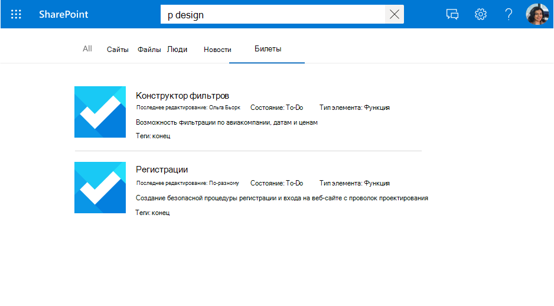
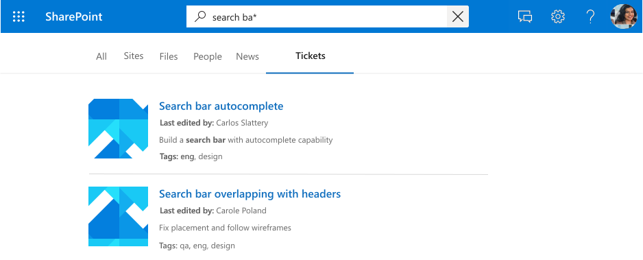
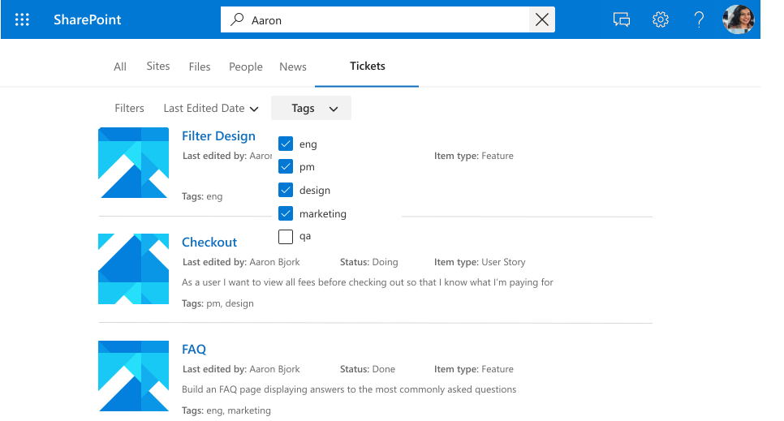

<!---<author of this doc: rsamai>--->

# Регистрация и обновление схемы для связей Microsoft Graph

[Схема](/graph/api/resources/schema?view=graph-rest-beta&preserve-view=true) связей определяет, как ваше содержимое будет использоваться в различных интерфейсах Microsoft Graph. Схема — это плоский список всех свойств, которые вы планируете добавить в связь, а также их атрибуты, метки и псевдонимы. Перед добавлением элементов в связь вы должны зарегистрировать схему.

## Пример схемы

В таблице ниже приведен пример возможной схемы для соединителя системы рабочих запросов.

| Свойство       | Тип             | Возможность поиска         | Возможность запроса          | Возможность извлечения        | Возможность уточнения          | Метки               | Псевдонимы    |
|----------------|------------------|--------------------|--------------------|--------------------|--------------------|----------------------|------------|
| ticketId       | String           |                    |                    |                    |                    |                      | Идентификатор         |
| title          | String           | :heavy_check_mark: | :heavy_check_mark: | :heavy_check_mark: |                    | title                |            |
| createdBy      | String           | :heavy_check_mark: | :heavy_check_mark: |                    |                    | createdBy            | creator    |
| assignedTo     | String           | :heavy_check_mark: | :heavy_check_mark: |                    |                    |                      |            |
| lastEditedDate | DateTime         |                    | :heavy_check_mark: | :heavy_check_mark: | :heavy_check_mark: | lastModifiedDateTime | editedDate |
| lastEditedBy   | String           | :heavy_check_mark: | :heavy_check_mark: | :heavy_check_mark: |                    | lastModifiedBy       | edited     |
| workItemType   | String           |                    | :heavy_check_mark: | :heavy_check_mark: |                    |                      | ticketType |
| priority       | Int64            | :heavy_check_mark: |                    |                    |                    |                      |            |
| tags           | StringCollection |                    | :heavy_check_mark: | :heavy_check_mark: | :heavy_check_mark: |                      |            |
| status         | String           |                    | :heavy_check_mark: | :heavy_check_mark: |                    |                      |            |
| url            | String           |                    |                    |                    |                    | url                  |            |
| resolved       | Boolean          |                    | :heavy_check_mark: | :heavy_check_mark: |                    |                      |            |

## Атрибуты свойства

### Возможность поиска

Если свойство доступно для поиска, его значение добавляется в полнотекстовый индекс. Когда пользователь выполняет поиск, результаты возвращаются в том случае, если поисковый запрос совпадает с одним из полей, доступных для поиска, или его [контентом](connecting-external-content-manage-items.md#content).

<!-- markdownlint-disable MD036 -->

*Поиск по запросу "design" с отображением результатов соответствия по свойству (`title`) и контенту.*

### Возможность запроса

Если свойство поддерживает запросы, вы можете запрашивать его с помощью языка KQL. KQL содержит один или несколько ключевых слов в свободной текстовой форме (слова или фразы) или ограничения свойств. Имя свойства должно быть включено в запрос, будучи либо указанным в самом запросе, либо включаемым в запрос программно. Вы можете использовать сопоставление префиксов с помощью оператора подстановочного знака(*).

> [!NOTE]
> Сопоставление суффиксов не поддерживается.

*Поиск по запросу "search ba*" с отображением результатов, соответствующих этому префиксу.*

*Поиск по запросу "tags:design" с областью результатов, соответствующих элементам с "design" в свойстве тегов.*

### Возможность извлечения

Если свойство можно извлечь, его значение может возвращаться в результатах поиска. Любое свойство, которое вы хотите добавить в шаблон отображения или вернуть из запроса и показывать в результатах поиска, должно быть извлекаемым. Пометка больших свойств или слишком большого количества свойств в качестве извлекаемых увеличит задержку поиска. Будьте внимательны и выбирайте нужные свойства.

*Набор свойств, доступных для извлечения (`title` и `lastEditedBy`), отображаемый в качестве результата.*

### Возможность уточнения

Если свойство поддерживает уточнение, администратор может настроить его в качестве пользовательского фильтра на странице результатов Поиска (Майкрософт). Свойство `refinable` не может иметь значение `searchable`.

*Уточнение результатов по `tags`, свойство с возможностью уточнения.*

## Семантические метки

Семантическая метка — это известный тег, опубликованный корпорацией Майкрософт, который можно добавить для свойства в схему. Добавление семантических меток позволяет различным продуктам Майкрософт понимать свойство и обеспечивать более удобное взаимодействие.

Семантические метки предоставляют независимый от домена подход к назначению свойств из различных доменов контента набору известных классов. Они находят приложения в различных контентных интерфейсах и предоставляют автоматическую поддержку для таких задач, как:

* Интеграция данных в разнородных интерфейсах
* Создание общеизвестных графиков (например, Viva Тем)
* Шаблоны по умолчанию для пользовательских интерфейсов

Семантические метки можно назначить исходным свойствам на странице **Назначение меток свойств**. Метки обеспечивают семантическое значение и позволяют интегрировать данные соединителей в интерфейсы Microsoft 365.  

| Метка                 | Описание                                                                          |
|---------------------- |------------------------------------------------------------------------------------- |
| title                 | Название элемента, которое вы хотите отображать в поиске и других интерфейсах.           |
| url                   | Целевой URL-адрес элемента в источнике данных.                                        |
| createdBy             | Имя пользователя, создавшего элемент в источнике данных.                           |
| lastModifiedBy        | Имя пользователя, который последним изменил элемент в источнике данных.              |
| authors               | Имена всех пользователей, которые совместно работали над элементом в источнике данных.  |
| createdDateTime       | Время и дата создания элемента в источнике данных.                             |
| lastModifiedDateTime  | Время и дата последнего изменения элемента в источнике данных.                            |
| fileName              | В случае с файлом — имя файла в источнике данных.                           |
| fileExtension         | В случае с файлом — расширение файла в источнике данных.                     |
| iconUrl               | URL-адрес значка.|
| containerName         | Имя контейнера.|
| containerUrl          | URL-адрес контейнера.|

Например, свойство связи **lastEditedBy** имеет то же значение, что и метка Майкрософт *lastModifiedBy*.

Добавьте столько меток, сколько сможете, но убедитесь, что они точно соответствуют свойствам. Не добавляйте метку к свойству, если она не имеет смысла. Неправильные сопоставления ухудшат взаимодействие.

> [!IMPORTANT]
> Все свойства, сопоставленные с метками, должны быть доступны для извлечения.

Метка **title** является самой важной меткой. Обязательно назначьте свойство этой метке, чтобы разрешить своей связи участвовать во взаимодействии с кластером результатов.
Неправильное сопоставление меток ухудшит функцию поиска. Для некоторых меток отсутствие назначенного свойства является нормальным.

### Релевантность

Применяя как можно более точные сопоставленные метки, вы также можете улучшить обнаружение контента при поиске. Настоятельно рекомендуем определить как можно больше меток ниже, перечисленных по потенциальному влиянию на обнаружение в убывающем порядке:

- title
- lastModifiedDateTime
- lastModifiedBy
- url
- filename
- fileExtension

Для обнаружения, т. е. сценариев поиска, обратите внимание на следующее:

- Используйте точные сопоставления.
- Когда вы используете свойство в качестве метки, содержащей много контента, вы можете увеличить задержку поиска, и вам придется ждать дольше, чтобы получить результаты.
- В частности, в сценарии с настройкой пользовательской вертикали, позволяющей искать несколько связей, результаты поиска значительно выигрывают от назначения максимально большого количества меток.

### Типы результатов по умолчанию

Метки также влияют на то, как создаются типы результатов, используемые по умолчанию. Добавление меток заголовка и контента как минимум обеспечит создание типа результатов для вашей связи.

*Тип результатов, используемый по умолчанию, с `title` и фрагментом результата*

Тип результатов, используемый по умолчанию, обеспечивает более эффективное взаимодействие, если вы определите (если применимо) следующие метки, перечисленные по возрастанию:

- title
- url
- lastModifiedBy
- lastModifiedDateTime
- fileName
- fileExtension

Наконец, назначая метки, убедитесь в следующем:

- Свойства, выбранные в качестве меток, должны быть помечены как доступные для извлечения.
- Свойства и назначенные им метки должны иметь одинаковый тип данных.
- Можно сопоставить только одну метку с одним свойством.

## Псевдонимы

Псевдонимы — это понятные имена свойств, которые вы назначаете. Они будут использоваться в запросах и при выборе фильтров уточняемых свойств.

## Возможности обновления схемы

В этом разделе содержатся сведения о возможностях обновления API [схемы](/graph/api/resources/schema?view=graph-rest-beta&preserve-view=true).

> [!NOTE]
> Рекомендуется повторно принять элементы после обновления, чтобы они соответствовали последней схеме. Без повторного приема поведение элементов будет несогласованным.

### Добавление свойства

Вы можете добавить свойство в свою схему. Для этого не требуется повторный прием, но он рекомендуется.

При добавлении свойства можно включить все необходимые атрибуты поиска.

### Добавление и удаление возможности поиска

Вы можете добавить в свойство определенные атрибуты поиска, но помните, что атрибут уточнения поиска нельзя добавить в качестве изменения схемы. Кроме того, уточняемые атрибуты невозможно использовать в качестве возможностей, поддерживающих поиск.

Добавление возможности поиска требует повторного приема.

### Добавление и удаление псевдонима

Вы можете добавлять или удалять псевдонимы, а также использовать их для поисковых запросов.

Учитывайте, что вы не сможете удалить исходный псевдоним уточняемого свойства, автоматически созданный системой.

### Добавление и удаление семантической метки

Добавление семантической метки может повлиять на такие функции, как релевантность и Viva Темы.

## Дальнейшие действия

- [Добавление элементов в связь](./connecting-external-content-manage-items.md)
- [Обзор справочника API соединителей Microsoft Graph](/graph/api/resources/indexing-api-overview?view=graph-rest-beta&preserve-view=true)
- [Поиск объектов настраиваемого типа (externalItem)](search-concept-custom-types.md)
- [Сборка первого настраиваемого соединителя с помощью Microsoft Graph](/graph/connecting-external-content-build-quickstart&preserve-view=true)

