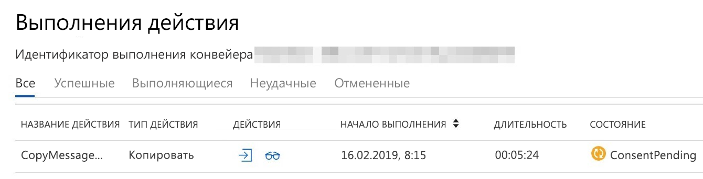

# Подключение к данным Microsoft Graph: часто задаваемые вопросы

Подключение к данным Microsoft Graph позволяет разработчикам создавать приложения, которым пользователи смогут предоставлять управляемый доступ к масштабным наборам данных Microsoft Graph. Эта статья содержит советы, помогающие воспользоваться преимуществами функции подключения к данным. Для знакомства с подключением к данным Microsoft Graph см. статью [Обзор](data-connect-concept-overview.md).

## Подходит ли мне функция подключения к данным Microsoft Graph?

Подключение к данным и API Microsoft Graph обеспечивают доступ к одинаковым базовым данным, но очень разными способами. Подключение к данным предназначено для массового извлечения больших объемов данных, а API Microsoft Graph больше подходит для доступа к отдельным наборам данных в режиме реального времени. В некоторых случаях можно даже объединить их. Например, может потребоваться использовать подключение к данным, чтобы выполнить начальное извлечение данных электронной почты за последний год, а затем применить API Microsoft Graph для дальнейшего анализа писем в режиме реального времени. Подключение к данным и API Microsoft Graph — это разные средства для разных задач. Важно продумать, какой метод лучше подходит к вашему сценарию.

## Будут ли первоначальные накладные расходы?

Так как подключение к данным предназначено для массового извлечения больших объемов данных, возникают дополнительные затраты времени перед тем, как можно будет извлечь данные. Эти затраты составляют около 45 минут. Это означает, что этот период потребуется для всех конвейеров вне зависимости от размера данных. Этими затратами можно пренебречь для больших объемов данных, но если такой промежуток времени недопустим в вашем сценарии, API Microsoft Graph может обеспечить более подходящий способ.

## Сколько нужно платить за функцию подключения к данным Microsoft Graph?

Плата за использование функции подключения к данным Microsoft Graph взимается ежемесячно с оплатой по мере использования. Ед. изм. выставления счетов за функцию подключения к данным Microsoft Graph Microsoft Graph состоит из нескольких тысяч объектов, где 1 объект соответствует 1 отдельному экземпляру сущности в Microsoft 365. Например, 1 сообщение электронной почты == 1 объект, 1 файл == 1 объект, 1 сообщение чата Teams == 1 объект и так далее. Плата рассчитывается по фиксированной ставке, основанной на количестве объектов на 1000, извлеченных через соединитель. За извлечение объектов из следующих наборов данных плата не взимается:

- BasicDataSet_v0.User
- BasicDataSet_v0.MailboxSettings
- BasicDataSet_v0.Manager
- BasicDataSet_v0.DirectReport.

Цена на объекты функции подключения к данным Microsoft Graph на сегодняшний день составляет 0,375 долларов США за извлеченные объекты размером 1 КБ.

## Могут ли мои данные остаться в рамках подписки организации с помощью подключения к данным Microsoft Graph?

Конвейеры подключения к данным управляются фабрикой данных Azure, являющейся службой интеграции данных, работающей в рамках подписки Azure. Подписка Azure [связана только с одним клиентом Microsoft 365](/azure/active-directory/fundamentals/active-directory-how-subscriptions-associated-directory). Таким образом, данные должны сначала направляться в связанную подписку Azure. После дальнейшей минимизации и агрегации данные можно использовать в другом месте.

Если нужно создать приложение для других пользователей, чтобы извлекать данные Microsoft 365, можно упаковать приложение как [управляемое приложение Azure](/azure/managed-applications/overview) и опубликовать его в Azure Marketplace. Затем другой пользователь сможет развернуть ваше приложение в своей подписке Azure, и приложение получит доступ к данным в клиенте.

## Требуются ли для подключения к данным Microsoft Graph субъекты службы?

При создании конвейера фабрики данных необходимо предоставить субъект-службу для связанной службы Microsoft 365. В Azure субъект-служба — это объект безопасности, представляющий приложение или службу (в отличие от пользователя). Подключение к данным использует этот субъект-службу в качестве удостоверения при получении авторизованного доступа к вашим данным Microsoft 365.

Если вы создаете управляемое приложение Azure для других пользователей с целью применения в клиентах, вам также нужно предоставить субъект-службу для использования приложением. Этот субъект-служба будет существовать в вашем клиенте (издателя). Но если приложению требуются другие субъекты-службы, пользователю (установщику) нужно будет создать их в собственном клиенте. Например, вашему конвейеру фабрики данных, скорее всего, потребуется доступ к ресурсу хранилища в Azure. Пользователю потребуется создать субъект-службу с разрешениями на доступ к учетной записи хранилища для использования конвейером.

## Как проверить наличие ожидающих запросов Privileged Access Management?

Прежде чем подключение к данным сможет скопировать ваши данные администратор должен утвердить запрос на управление привилегированным доступом (PAM). Управление привилегированным доступом — это механизм, используемый для разрешения доступа вашего конвейера данных к данным в Microsoft 365. При первом запуске конвейера ожидается утверждение запроса на доступ администратором Microsoft 365 (или назначенным делегатом). Хотя состояние конвейера отображается как **Выполняется**, базовому действию копирования будет соответствовать состояние **ConsentPending** до получения утверждения, как показано на снимке экрана ниже.

При разработке рекомендуется проверять, что канал не застрял в состоянии **ConsentPending**, особенно после внесения изменений в конвейер. Например, при добавлении дополнительного поля в схему следующий запуск конвейера приведет к созданию запроса PAM, требующего утверждения. Не теряйте время с конвейером, ожидающим вашего утверждения.

## Как утвердить запросы PAM на портале администрирования Microsoft 365?

В документации по подключению данных показано, как использовать PowerShell и пользовательский интерфейс PAM, чтобы утверждать запросы PAM. Для утверждения с помощью пользовательского интерфейса PAM откройте пользовательский интерфейс PAM на [портале администрирования Microsoft 365](https://admin.microsoft.com/Adminportal/Home?source=applauncher#/Settings/PrivilegedAccess). Портал предоставляет простой и понятный способ просмотра, утверждения, отклонения или отзыва запросов PAM. Ссылка на надстройку подключения к данным Microsoft Graph находится в разделе **Параметры** > **Службы и надстройки** > **Подключение к данным Microsoft Graph**.

## Можно ли использовать второго пользователя для утверждения запросов PAM?

Если вы запускаете конвейер и запрос PAM, запрос вкладывается в вашу учетную запись, которой принадлежит субъект-служба, используемая конвейером. Но даже если эта учетная запись состоит в настроенной вами группе утверждающих, вы не сможете использовать ее для утверждения запроса PAM, так как самостоятельные утверждения не разрешаются. При попытке появится сообщение об ошибке в портале PAM: "Запрашивающий и утверждающий совпадают. Самостоятельное утверждение запрещено". При разработке рекомендуется использовать вторую учетную запись помимо администратора, утверждающего запросы. Как отправитель, так и утверждающий должны иметь активные учетные записи Exchange Online.

## Можно ли при необходимости выполнять дедупликацию сообщений электронной почты?

При извлечении сообщений электронной почты из набора данных `Message` часто создается несколько объектов JSON одного сообщения. Эти дубликаты существуют, так как при отправке сообщения нескольким пользователям создается его копия в почтовом ящике каждого получателя. Так как набор данных извлекается из каждого почтового ящика, он будет содержать все копии от разных пользователей. В некоторых случаях может требоваться сохранение всех копий, но в остальных случаях рекомендуется удалять дубликаты.
Выполнить дедупликацию экспортированных объектов JSON можно на основе параметра `internetMessageId` сообщений: два сообщения с одинаковым значением `internetMessageId` являются копиями одного экземпляра. Так как дубликаты могут существовать в разных BLOB-объектах, дедупликацию необходимо выполнять во всех BLOB-объектах, а не в отдельных BLOB-объектах.

## Можно ли использовать поле "Puser" для определения соответствующего пользователя?

Извлеченные данные содержат некоторые свойства Meta, не существующие при использовании соответствующего API Microsoft Graph. В частности, поле `puser` может быть полезно для определения пользователя, данные о котором извлечены. В сценарии с двумя копиями одного сообщения электронной почты в разных почтовых ящиках вы можете использовать поле `puser`, чтобы определить, из какого почтового ящика получена каждая копия. Поле `puser` также удобно применять для наборов данных, например для набора данных `Manager`. Экспортированные объекты JSON содержат сведения о руководителе, но они полезны, только если вы знаете, кем он руководит. Поле `puser` указывает, чей руководитель соответствует этому объекту JSON.

## Поддерживается ли сочетание пользователей с лицензиями Рабочей аналитики и без них?

Сегодня мы требуем, чтобы у всех пользователей в списке пользователей была лицензия Рабочей аналитики, либо у всех пользователей в списке пользователей не было лицензии Рабочей аналитики. К сожалению, мы не поддерживаем смешанный список пользователей, когда у некоторых пользователей есть лицензия Рабочей аналитики, а у некоторых нет. Это связано с тем, что если у пользователей в списке пользователей есть лицензия Рабочей аналитики, то для функции подключения к данным не требуется дополнительных сборов, тогда как если у клиентов нет лицензии Рабочей аналитики, клиентам выставляются счета за потребление, что подробно описано здесь. Если это вам не подходит для вашего варианта использования, сообщите нам об этом, и мы посмотрим, есть ли возможность помочь вашему сценарию здесь.

## Поддерживается ли настройка клиента в гибридном режиме?

Если в вашей настройке Microsoft 365 есть некоторые пользователи в Exchange Online и некоторые пользователи в локальной службе Exchange, то пользователи, которые находятся в локальной службе Exchange, не будут поддерживаться. К сожалению, сегодня подключение к данным для локальных пользователей Exchange не поддерживается.

## Поддерживаются ли учетные записи ресурсов?

В настоящее время мы не поддерживаем доступ к сообщениям или событиям из учетных записей ресурсов. Мы добавим поддержку этой функции в будущем.

## Я вижу несколько файлов за один запуск устройства автоматической подачи листов, но иногда только один файл за один запуск. С чем это связано?

Подключение к данным Microsoft Graph берет список пользователей для каждого запуска устройства, а затем распределяет извлечение набора данных и курирование по нескольким заданиям, которые выполняются параллельно. Для каждого параллельного запуска в определенном вами источнике данных создается 1 выходной файл. В некоторых случаях, если список пользователей небольшой, его можно сопоставить с 1 заданием извлечения и курсирования, и в таких случаях в источнике данных будет создан только 1 выходной файл.

## Каким образом выполняется расчет по выставлению счета, если количество объектов не является круглым числом?

В целях выставления счетов подключение к данным Microsoft Graph округляет количество извлеченных объектов до ближайшего значения 1000. Например, если вы извлекаете 125 объектов или извлекаете 999 объектов, им будет выставлен счет за 1000 объектов. Аналогичным образом при извлечении от 1001 до 2000 объектов будет взиматься плата за 2000 объектов.

## При инициализации с помощью Azure Synapse всегда происходит сбой копирования данных Microsoft 365. С чем это связано?

Сегодня мы не поддерживаем копирование данных Microsoft 365 для инициализации с помощью Azure Synapse. Мы работаем над добавлением интеграции для инициализированного действия Azure Synapse и обновим нашу документацию по ее завершению.
