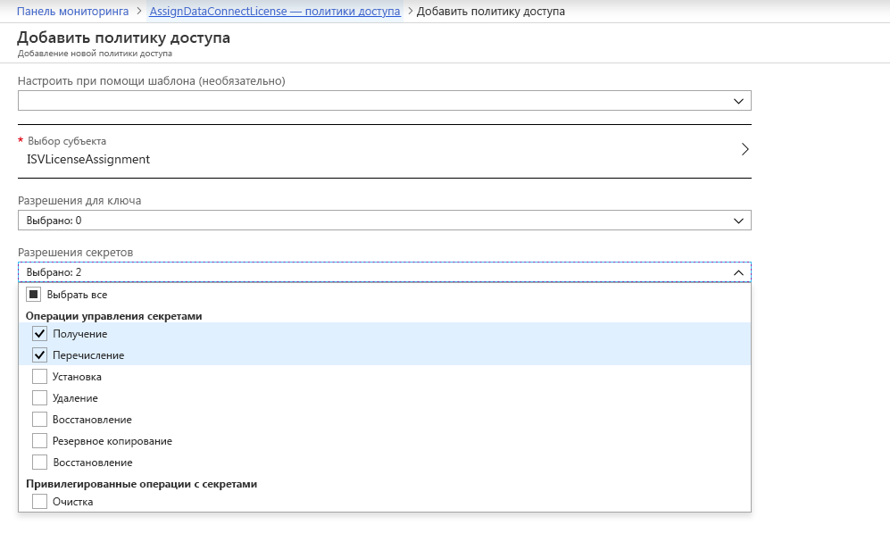
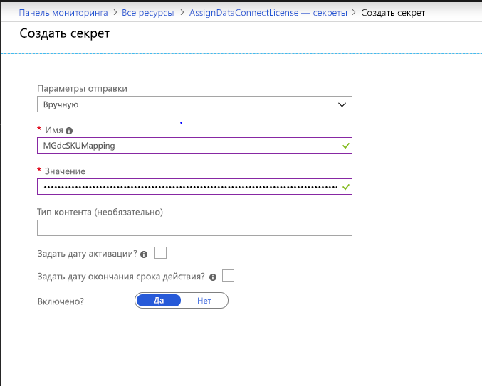

# <a name="microsoft-graph-data-connect-policies-and-licensing"></a><span data-ttu-id="d83bd-103">Политики и лицензирование подключения к данным Microsoft Graph</span><span class="sxs-lookup"><span data-stu-id="d83bd-103">Microsoft Graph data connect policies and licensing</span></span>

<span data-ttu-id="d83bd-104">Подключение к данным Microsoft Graph осуществляется с помощью [управляемых приложений Azure](https://docs.microsoft.com/azure/managed-applications/overview). С их помощью вы можете создать и развернуть решения в клиентской среде Azure.</span><span class="sxs-lookup"><span data-stu-id="d83bd-104">Microsoft Graph data connect uses [Azure managed applications](https://docs.microsoft.com/azure/managed-applications/overview) to allow you to create and deploy your solutions in your customer's Azure environment.</span></span> <span data-ttu-id="d83bd-105">С помощью управляемых приложений вы можете поддерживать определенные политики Azure, обеспечивая клиентам более высокий доверительный уровень и комфортность при использовании приложений.</span><span class="sxs-lookup"><span data-stu-id="d83bd-105">Managed applications allow you to support certain Azure policies, giving customers greater confidence and comfortability when using your applications.</span></span> <span data-ttu-id="d83bd-106">Кроме того, необходимо приобрести у Майкрософт лицензии и применить их в своей организации или в организациях, установивших ваши приложения, чтобы обеспечить приложениям доступ к подключению к данным.</span><span class="sxs-lookup"><span data-stu-id="d83bd-106">Additionally, you must purchase and apply licenses from Microsoft your organization or the organizations that install your applications, in order to allow the application to access data through data connect.</span></span>

## <a name="policies"></a><span data-ttu-id="d83bd-107">Политики</span><span class="sxs-lookup"><span data-stu-id="d83bd-107">Policies</span></span>

<span data-ttu-id="d83bd-108">Управляемые приложения Azure, созданные на основе данных Office 365, поддерживают такие политики Azure:</span><span class="sxs-lookup"><span data-stu-id="d83bd-108">The following Azure policies are supported for an Azure managed application built using Office 365 data:</span></span>

- [<span data-ttu-id="d83bd-109">Политика обязательного шифрования ADLS Gen1</span><span class="sxs-lookup"><span data-stu-id="d83bd-109">ADLS Gen1 Encryption Required Policy</span></span>](https://docs.microsoft.com/azure/azure-policy/scripts/enforce-datalakestore-encryption)

<span data-ttu-id="d83bd-110">После проверки состояния соответствия политике, выбранной во время публикации в Azure Marketplace, она применяется ко всем установленным экземплярам приложения.</span><span class="sxs-lookup"><span data-stu-id="d83bd-110">When you select any of the policies during Azure marketplace publishing, the policy compliance status will be checked and enforced for all installations of your application.</span></span> <span data-ttu-id="d83bd-111">Все соответствующие выбранные политики отображаются для лиц, утверждающих данные, в рамках запроса данных.</span><span class="sxs-lookup"><span data-stu-id="d83bd-111">All selected policies that are compliant will be shown to the data approvers as part of the data request.</span></span> <span data-ttu-id="d83bd-112">В случае нарушения соответствия политике происходит сбой в работе канала и прекращается извлечение данных.</span><span class="sxs-lookup"><span data-stu-id="d83bd-112">Any policy compliance violation would cause the pipeline run to fail and stop the data extraction.</span></span>

<span data-ttu-id="d83bd-113">Чтобы запросить поддержку дополнительных политик, свяжитесь с нами в [UserVoice](https://microsoftgraph.uservoice.com/forums/920506-microsoft-graph-feature-requests?category_id=359581).</span><span class="sxs-lookup"><span data-stu-id="d83bd-113">If you would like to request support for additional policies , let us know on [UserVoice](https://microsoftgraph.uservoice.com/forums/920506-microsoft-graph-feature-requests?category_id=359581).</span></span>

## <a name="licensing"></a><span data-ttu-id="d83bd-114">Лицензирование</span><span class="sxs-lookup"><span data-stu-id="d83bd-114">Licensing</span></span>

<span data-ttu-id="d83bd-115">Доступ к набору инструментов для подключения к данным Microsoft Graph можно получить через Рабочую аналитику, получив лицензию пользователя на месяц.</span><span class="sxs-lookup"><span data-stu-id="d83bd-115">Access to the Microsoft Graph data connect toolset is available through Workplace Analytics, which is licensed on a per-user, per-month basis.</span></span>  <span data-ttu-id="d83bd-116">Рабочая аналитика позволяет организациям дополнить аналитические сведения, полученные на основе данных Office 365, путем предоставления приложениям (собственным и разработанным независимыми поставщиками программного обеспечения) управляемого доступа к масштабируемым данным.</span><span class="sxs-lookup"><span data-stu-id="d83bd-116">Organizations with Workplace Analytics can extend their insights from Office 365 data by granting and governing access to their data at scale to applications developed in-house or by independent software vendors (ISVs).</span></span> <span data-ttu-id="d83bd-117">Подробнее, в том числе о приобретении, см. на [странице продукта "Рабочая аналитика"](https://products.office.com/business/workplace-analytics).</span><span class="sxs-lookup"><span data-stu-id="d83bd-117">To learn more, including how to purchase, visit the [Workplace Analytics product page](https://products.office.com/business/workplace-analytics).</span></span>

<span data-ttu-id="d83bd-118">Независимые поставщики программного обеспечения могут создавать приложения для пользователей, которые не приобрели Рабочую аналитику.</span><span class="sxs-lookup"><span data-stu-id="d83bd-118">If you’re an ISV, we also provide an option for you to build applications for customers who have not purchased Workplace Analytics.</span></span> <span data-ttu-id="d83bd-119">Для этого необходимо приобрести достаточное количество лицензий и связать их с пользователями, которые после приобретения приложения получат доступ через подключение к данным Microsoft Graph.</span><span class="sxs-lookup"><span data-stu-id="d83bd-119">To do so, you must purchase enough licenses to associate them with all the users your application will access through Microsoft Graph data connect, for each customer who purchases your application.</span></span> <span data-ttu-id="d83bd-120">Этот способ можно использовать одновременно с лицензиями на Рабочую аналитику.</span><span class="sxs-lookup"><span data-stu-id="d83bd-120">You can use this option along with Workplace Analytics licenses.</span></span> <span data-ttu-id="d83bd-121">Необходимо выполнить действия, чтобы связать экземпляры лицензии на подключение к данным Microsoft Graph с каждой установкой пользователя.</span><span class="sxs-lookup"><span data-stu-id="d83bd-121">You’ll need to take steps to associate instances of the Microsoft Graph data connect license with each of their customer installations.</span></span>

### <a name="isvs-using-the-microsoft-graph-data-connect-license"></a><span data-ttu-id="d83bd-122">Независимые поставщики программного обеспечения, использующие лицензии на подключение к данным Microsoft Graph</span><span class="sxs-lookup"><span data-stu-id="d83bd-122">ISVs using the Microsoft Graph data connect license</span></span>
<span data-ttu-id="d83bd-123">Независимые поставщики программного обеспечения, использующие лицензии на подключение к данным, должны использовать [Azure Key Vault](https://azure.microsoft.com/services/key-vault/) для хранения лицензий и обработки их назначения.</span><span class="sxs-lookup"><span data-stu-id="d83bd-123">If you're an ISV using the data connect license, you must utilized [Azure Key Vault](https://azure.microsoft.com/services/key-vault/) to store and process the license assignment.</span></span> <span data-ttu-id="d83bd-124">Для этого необходимо [создать Key Vault](https://docs.microsoft.com/azure/key-vault/quick-create-portal).</span><span class="sxs-lookup"><span data-stu-id="d83bd-124">You will need to [create a Key Vault](https://docs.microsoft.com/azure/key-vault/quick-create-portal).</span></span> <span data-ttu-id="d83bd-125">Во время создания обратите внимание на значение универсального кода ресурса (URI) хранилища Key Vault.</span><span class="sxs-lookup"><span data-stu-id="d83bd-125">During creation, note the Key Vault URI value.</span></span> <span data-ttu-id="d83bd-126">Его необходимо использовать в определении приложения как ссылку на хранилище Key Vault.</span><span class="sxs-lookup"><span data-stu-id="d83bd-126">It will be used in the application definition to reference the Key Vault.</span></span> <span data-ttu-id="d83bd-127">После создания хранилища Key Vault убедитесь, что у имени субъекта-службы, которое использует связанная с источником служба шаблона ARM приложения, есть доступ к нему.</span><span class="sxs-lookup"><span data-stu-id="d83bd-127">After you create the Key Vault, ensure that the SPN used in the Source Linked Service of the application's ARM template has access to it.</span></span> <span data-ttu-id="d83bd-128">Для этого перейдите в область **Политики доступа** экземпляра Key Vault, создайте политику доступа для приложения, на которое ссылается имя субъекта-службы, и назначьте приложению разрешения **Получить** и **Список**.</span><span class="sxs-lookup"><span data-stu-id="d83bd-128">To do so, go to the **Access Policies** pane of the Key Vault instance, create an access policy for the application referenced by the SPN, and assign **Get** and **List** permissions to the application.</span></span> 



<span data-ttu-id="d83bd-130">Назначение лицензий на подключение к данным Microsoft Graph для организаций осуществляется в виде секрета в хранилище Key Vault.</span><span class="sxs-lookup"><span data-stu-id="d83bd-130">The assignment of Microsoft Graph data connect licenses to organizations is provided as a secret in the Key Vault.</span></span> <span data-ttu-id="d83bd-131">Для этого:</span><span class="sxs-lookup"><span data-stu-id="d83bd-131">To do so:</span></span>
1. <span data-ttu-id="d83bd-132">Перейдите в хранилище Key Vault и в разделе **Создание/импорт** создайте секрет вручную.</span><span class="sxs-lookup"><span data-stu-id="d83bd-132">Go to the Key Vault and under **Generate/Import**, create a manual secret.</span></span> <span data-ttu-id="d83bd-133">Имя секрета должно быть **MGdcSKUMapping**, а в его значение необходимо включить ИД клиента и количество выделенных ему лицензий в следующем формате.</span><span class="sxs-lookup"><span data-stu-id="d83bd-133">The name of the secret must be **MGdcSKUMapping** and the value of the secret must contain the ID of the tenant and the number of licenses allocated to that tenant, in the following format.</span></span>

`{"tenantId1" : 20, "tenantId2" : 35, "tenantId3" : 12}`

2. <span data-ttu-id="d83bd-134">Задав значение, убедитесь, что оно включено, и нажмите **Создать**, чтобы начать развертывание.</span><span class="sxs-lookup"><span data-stu-id="d83bd-134">After setting the value, make sure that it is enabled and select **Create** to begin the deployment.</span></span> 



3. <span data-ttu-id="d83bd-136">Необходимо также обновить шаблон ARM приложения, который ссылается на созданное хранилище Key Vault.</span><span class="sxs-lookup"><span data-stu-id="d83bd-136">You also need to update the application's ARM template to reference the Key Vault that you created.</span></span> <span data-ttu-id="d83bd-137">Для этого в свойстве **LicenseKeyVaultUri** необходимо указать значение **KeyVaultUri**, полученное во время создания.</span><span class="sxs-lookup"><span data-stu-id="d83bd-137">To do so, populated the **LicenseKeyVaultUri** property, which must be populated with the **KeyVaultUri** value you noted during creation.</span></span> <span data-ttu-id="d83bd-138">Это свойство находится в связанной с источником службе шаблона ARM приложения, как показано ниже.</span><span class="sxs-lookup"><span data-stu-id="d83bd-138">This property is provided in the Source Linked Service of the application's ARM template, as shown.</span></span> 

```
"properties": {
        "type": "Office365",
            "description": "Source O365 linked service",
            "typeProperties": {
                   "office365tenantId": "[subscription().tenantId]",
        "PrivacyPolicyUri": "http://www.wkw.com/privacy",
        "TermsOfUseUri": "http://www.wkw.com/tos",
        "servicePrincipalId": "[variables('sourceLinkedServicePrincipalId')]",
        "servicePrincipalKey": {
                           "type": "SecureString",
                "value": "[variables('sourceLinkedServicePrincipalKey')]"
        },
        "servicePrincipalTenantId": "[variables('sourceLinkedServicePrincipalTenantId')]",
        "LicenseKeyVaultUri": "<KeyVaultUri>",
            }
    }
```

<span data-ttu-id="d83bd-139">Перед началом работы канала подключение к данным ссылается на секрет в хранилище Key Vault.</span><span class="sxs-lookup"><span data-stu-id="d83bd-139">Data connect will reference the secret in the Key Vault before each pipeline run.</span></span> <span data-ttu-id="d83bd-140">В работе канала произойдет сбой, если в организации недостаточно лицензий для предоставления доступа каждому пользователю или при отсутствии доступа к хранилищу Key Vault.</span><span class="sxs-lookup"><span data-stu-id="d83bd-140">It will fail the pipeline if there aren't enough licenses assigned to the organization to provide data for each user, or if the Key Vault is inaccessible.</span></span> 

## <a name="next-steps"></a><span data-ttu-id="d83bd-141">Дальнейшие действия</span><span class="sxs-lookup"><span data-stu-id="d83bd-141">Next Steps</span></span>
<span data-ttu-id="d83bd-142">Чтобы запросить поддержку дополнительных политик, свяжитесь с нами в [UserVoice](https://microsoftgraph.uservoice.com/forums/920506-microsoft-graph-feature-requests?category_id=359581).</span><span class="sxs-lookup"><span data-stu-id="d83bd-142">If you would like to request support for additional policies, let us know on [UserVoice](https://microsoftgraph.uservoice.com/forums/920506-microsoft-graph-feature-requests?category_id=359581).</span></span> <span data-ttu-id="d83bd-143">Дополнительные сведения о Рабочей аналитике, в том числе о приобретении доступа к ней, см. на [странице продукта "Рабочая аналитика"](https://products.office.com/business/workplace-analytics).</span><span class="sxs-lookup"><span data-stu-id="d83bd-143">To learn more about Workplace Analytics, including how to purchase, visit the [Workplace Analytics product page](https://products.office.com/business/workplace-analytics).</span></span>
