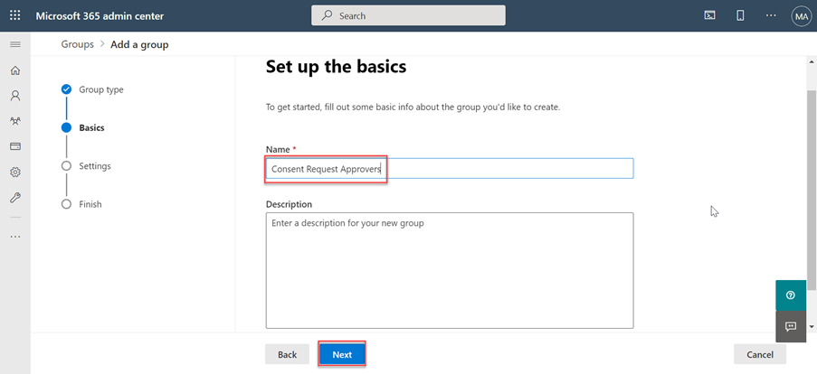

<!-- markdownlint-disable MD002 MD041 -->

Перед использованием microsoft Graph данных Подключение в первый раз, необходимо настроить Microsoft 365 клиента. Это включает включение службы и настройку группы безопасности с разрешениями на утверждение запросов на извлечение данных.

## Предоставление пользователям Azure AD роли глобального администратора

На этом шаге вы убедитесь, что два Microsoft 365 клиента имеют роль **глобального администратора.**

- [Встроенная роль глобального администратора](/azure/active-directory/roles/permissions-reference#global-administrator).
- [Повышение доступности для получения роли глобального администратора.](/azure/role-based-access-control/elevate-access-global-admin)

## Настройка группы утверждения запроса Graph данных Подключение Майкрософт

На этом шаге вы настроите Microsoft 365 клиента, чтобы включить использование Microsoft Graph data Подключение.

1. Откройте браузер и перейдите [на Microsoft 365 Портал администрирования.](https://admin.microsoft.com/)

1. На боковой панели навигации выберите **Active Groups**.
  
    

1. Выберите **кнопку Добавить группу.**

1. Создайте новую группу  безопасности с поддержкой почты и выберите кнопку **Добавить.**
   - **Тип:** безопасность с поддержкой почты

    

   - **Имя:** Одобрение запроса на согласие

    

   - **Префикс электронной почты:** consentrequestapprovers

    

1. **Это может занять до часа,** прежде чем вновь созданная группа появляется в списке. После создания группы выберите ее.

1. Снова перейдите **к параметру Active groups** и найдите только что созданную группу.

1. Выберите группу и на **вкладке Участники,** выберите **Просмотр всех и управление участниками.**

1. Добавьте двух пользователей, которые включили роль **глобального администратора** в эту новую группу.

## Включить microsoft Graph data Подключение в Microsoft 365 клиенте

На этом шаге вы включаете службу Microsoft Graph data Подключение на Microsoft 365 клиента.

1. В то время как вы все еще подписаны на портал администрирования Microsoft 365, выберите **пункт меню параметров Параметры > Org.**

1. Выберите **службу Microsoft Graph data Подключение.**

    

1. Выберите почтовый ящик, включив Graph **microsoft Подключение** для всей организации, чтобы включить Подключение.

    

1. Введите **утверждения запросов** на согласие (или имя группы,  созданной ранее) в группе пользователей для принятия решений об утверждении и выбора **Сохранить**.
