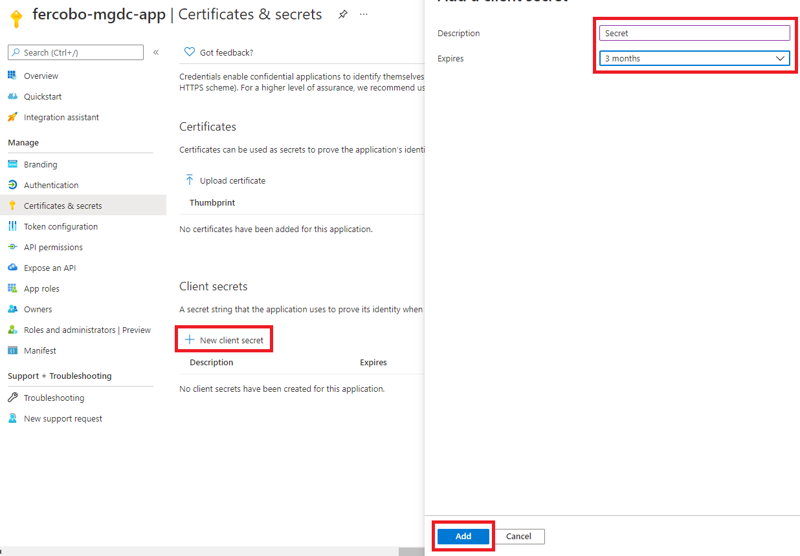

<!-- markdownlint-disable MD002 MD041 -->

В этом упражнении вы создадим, запустите и утвердите конвейер Azure Data Factory для извлечения данных из Microsoft 365 в служба хранилища Azure Blob для дополнительной обработки.In this exercise you will create, run, and approve an Azure Data Factory pipeline to extract data from Microsoft 365 to an Azure Storage Blob for additional processing.

## Создание регистрации Microsoft Azure Active Directory приложенийCreate a Microsoft Azure Active Directory application registration

Первым шагом является создание приложения Azure AD, которое будет использоваться в качестве основного обеспечения безопасности для запуска процесса извлечения данных.The first step is to create an Azure AD application that will be used as the security principal to run the data extraction process.

1. Откройте браузер и перейдите на портал [Azure.](https://portal.azure.com/)Open a browser and go to your [Azure Portal](https://portal.azure.com/).

1. Впишитесь в использование учетной записи **с правами глобального** администратора для клиентов Azure и Microsoft 365.Sign in using an account with **Global administrator** rights to your Azure and Microsoft 365 tenants.

1. На боковой панели навигации **выберите Azure Active Directory** (Azure AD).On the sidebar navigation, select **Azure Active Directory** (Azure AD).

1. На странице Обзор Azure AD выберите **регистрации приложений** из раздела **Управление** меню.On the Azure AD Overview page, select **App registrations** from the **Manage** section of the menu.

1. Выберите **кнопку Новая регистрация.**Select the **New registration** button.

    

1. Используйте следующие значения для создания нового приложения Azure AD и выбора **Register.**Use the following values to create a new Azure AD application and select **Register**.

   - **Имя:** Microsoft Graph Подключение передачи данных**Name**: Microsoft Graph Data Connect Data Transfer
   - **Поддерживаемые типы** учетных записей. Учетные записи только в этом организационном каталоге.**Supported account types**: Accounts in this organizational directory only.
   - **Перенаправление URI:** Оставьте значения по умолчанию.**Redirect URI**: Leave the default values.

    

1. Найдите **ID приложения (клиента) и** скопируйте его так, как вам понадобится позже в этом учебнике.Locate the **Application (client) ID** and copy it as you will need it later in this tutorial. Это будет называться главным ИД службы.This will be referred to as the service principal ID.

1. Найдите **ID каталога (клиента)** и скопируйте его так, как вам потребуется в этом руководстве.Locate the **Directory (tenant) ID** and copy it as you will need it later in this tutorial. Это будет называться ИД клиента.This will be referred to as the tenant ID.

1. На боковой панели навигации выберите **Сертификаты и секреты в** **статье Управление**.On the sidebar navigation, select **Certificates and secrets** under **Manage**.

1. Выберите **секретную кнопку "Новый клиент".**Select the **New client secret button**. Установите *описание* для любого имени, установите **Истекает** значение в отсеве и выберите **Добавить**.Set *Description* to any name, set **Expires** to any value in the dropdown and choose **Add**.

    

    - После создания секрета клиента убедитесь,  что вы сохраните значение в безопасном месте, так как оно больше не будет доступно позже, и вам потребуется создать новое.After the client secret is created, make sure you save the **Value** somewhere safe, as it will no longer be available later, and you will need to create a new one.
    - Это будет ссылаться в качестве основного ключа службы.This will be referenced as the service principal key.

1. На боковой панели навигации для приложения выберите **Owners**.On the sidebar navigation for the application, select **Owners**.

1. Убедитесь, что ваша учетная запись указана как владелец приложения.Verify that your account is listed as an owner for the application. Если он не указан как владелец, добавьте его.If it isn't listed as an owner, add it.

    
