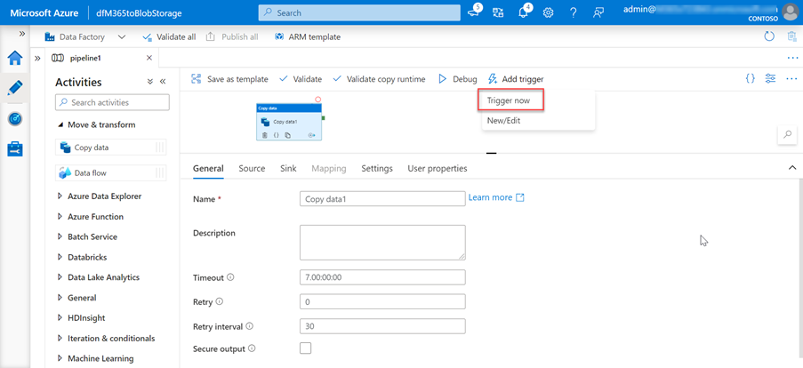

<!-- markdownlint-disable MD002 MD041 -->

Следующим шагом является использование фабрики данных Azure для создания конвейера для извлечения данных из Microsoft 365 в учетную запись служба хранилища Azure с помощью подключение к данным Microsoft Graph.The next step is to use the Azure Data Factory to create a pipeline to extract the data from Microsoft 365 to the Azure Storage account using Microsoft Graph data connect.

## Создание конвейера Фабрики данных AzureCreate an Azure Data Factory pipeline

1. Откройте браузер и перейдите на портал [Azure.](https://portal.azure.com/)Open a browser and go to your [Azure Portal](https://portal.azure.com/).

1. Впишитесь в использование учетной записи **с правами глобального** администратора для клиентов Azure и Microsoft 365.Sign in using an account with **Global administrator** rights to your Azure and Microsoft 365 tenants.

1. На боковой панели навигации выберите **Создать ресурс**.On the sidebar navigation, select **Create a resource**.

1. Найдите **тип ресурса Фабрика** данных и используйте для его создания следующие значения, а затем выберите **Create**.Find the **Data Factory** resource type and use the following values to create it, then select **Create**.

    1. **Подписка:** выберите подписку Azure**Subscription**: select your Azure subscription
    2. **Группа ресурсов:** GraphDataConnect**Resource group**: GraphDataConnect
    3. **Регион:** выберите регион Azure в том же регионе, что и Microsoft 365 регионе**Region**: pick an Azure region in the same region as your Microsoft 365 region
    4. **Имя:** dfM365toBlobStorage**Name**: dfM365toBlobStorage
    5. **Версия:** V2**Version**: V2

        

    6. На **вкладке конфигурации Git** убедитесь, что вы либо настраивали Git, либо выберите параметр _Configure Git позже._In the **Git configuration** tab, make sure you either configure Git or select the option _Configure Git later_.

1. После создания ресурса Фабрика данных Azure выберите плитку **Author и Monitor** для запуска редактора полного экрана Azure Data Factory.After the Azure Data Factory resource is created, select the **Author and Monitor** tile to launch the Azure Data Factory full screen editor.

    

1. Переключение с **"Обзор"** на **"Управление** опытом", выбрав его из левой навигации.Switch from the **Overview** to the **Manage** experience by selecting it from the left-hand navigation.

1. По умолчанию фабрика данных Azure будет использовать время запуска интеграции, которое автоматически разрешит область.By default, the Azure Data Factory will use an integration runtime that is auto-resolving the region. Поскольку для Подключение данных требуется, чтобы ваш источник и назначение, а также время запуска интеграции существовали в одном Microsoft 365 регионе, рекомендуется создать новое время запуска интеграции с фиксированным регионом.Because Data Connect requires that your source and destination, and integration runtime to exist in the same Microsoft 365 region, we recommend that you create a new integration runtime with a fixed region.

    1. Выберите **время запуска**  >  **интеграции New**.Select **Integration runtimes** > **New**.
    2. Выберите **Azure, самообуправление и** выберите **Продолжить**.Select **Azure, Self-Hosted** and select **Continue**.
    3. Выберите **Azure** для сетевой среды и выберите **Продолжить**.Select **Azure** for network environment and select **Continue**.

        

    4. Чтобы заполнить форму на окончательном экране, используйте следующие сведения, а затем выберите **Create**.Use the following details to complete the form on the final screen and then select **Create**.

        - **Имя:** имя времени запуска интеграции**Name**: name of your integration runtime
        - **Описание:** введите описание**Description**: enter a description
        - **Регион:** выберите регион, который соответствует вашему Microsoft 365 региону**Region**: select the region that matches your Microsoft 365 region
        - **Виртуальная конфигурация сети (предварительный просмотр)**: Отключено**Virtual network configuration (preview)**: Disabled

1. Переключиться с **"Управление"** на **"Автор",** выбрав его из левой навигации.Switch from the **Manage** to the **Author** experience by selecting it from the left-hand navigation.
1. Создайте новый конвейер, выбрав значок **плюс,** а затем **конвейер.**Create a new pipeline by selecting the **plus** icon, then **pipeline**.

    

    - **Перетащите действие Copy Data** из раздела Перемещение и **Преобразование** на поверхность разработки.Drag the **Copy Data** activity from the **Move and Transform** section onto the design surface.

        

    - Выберите действие в конструкторе.Select the activity in the designer.
    - Выберите **вкладку General** и назови ей имя и описание.Select the **General** tab and give it a name and description.

      - **Имя:** CopyFromM365toBlobStorage**Name**: CopyFromM365toBlobStorage
      - **Описание.** Описание, необходимое.**Description**: A description you want.

    - В области редактора действий ниже конструктора выберите вкладку **Source,** а затем выберите **New**.In the activity editor pane below the designer, select the **Source** tab, then select **New**.
    - Найдите набор **Office 365,** выберите его и выберите кнопку **Продолжить.**Locate the dataset **Office 365**, select it and then select the **Continue** button.

        

    - Конструктор обновляет вкладку **Source** с помощью параметров Microsoft 365 соединители.The designer will update the **Source** tab with the Microsoft 365 connector settings.
    - Выберите параметр **Open** рядом с **полем Исходный набор** данных.Select the **Open** option next to the **Source dataset** field.
    - В параметрах таблицы выберите вкладку **Подключение,** а затем **кнопку New.**In the table settings, select the **Connection** tab, then the **New** button.
    - В диалоговом окте, который отображается, введите ранее созданный **ID** приложения Azure  AD и секретный **ID** в полях основных ИД служб и основных ключевых ключевых служб соответственно, а затем выберите  **Создать**.In the dialog that appears, enter the previously created Azure AD application's **Application ID** and **Secret ID** in the **Service principal ID** and **Service principal key** fields respectively, then select **Create**.
    - Выберите время запуска интеграции, созданное ранее в **Подключение** при отсеве времени интеграции.Select the integration runtime you previously created in the **Connect via integration runtime** dropdown.

        

    - После создания Microsoft 365 для поля **Таблицы** выберите **BasicDataSet_v0. Message_v0**.After creating the Microsoft 365 connection, for the **Table** field, select **BasicDataSet_v0.Message_v0**.
    - Переключение **с Office365Table** на **источник > Pipeline.**Switch from **Office365Table** to **Pipeline > Source**. Используйте следующие значения для фильтра **Date.**Use the following values for the **Date filter**.

      - **Имя столбца:** CreatedDateTime**Column name**: CreatedDateTime
      - **Время начала (UTC)**: выберите дату до текущей даты**Start time (UTC)**: select a date sometime prior to the current date
      - **Время окончания (UTC)**: выберите текущую дату**End time (UTC)**: select the current date
      - Выберите **схему импорта** в разделе _Выходные столбцы._Select **Import schema** in the _Output columns_ section.

    - Выберите действие **копирования** данных на вкладке конвейера, а затем вкладки **Sink.**Select the **Copy data** activity in the pipeline tab, then select the **Sink** tab.

      - Выберите **кнопку New,** выберите **служба хранилища Azure Blob** и выберите кнопку **Продолжить.**Select the **New** button, select **Azure Blob Storage**, and then select the **Continue** button.
      - Выберите **двоичный** формат для данных, а затем выберите кнопку **Продолжить.**Select **Binary** as the format for the data and then select the **Continue** button.
      - Дайте набору данных имя **M365JsonFile** и создайте новую связанную службу, если она еще не существует.Give the dataset the name **M365JsonFile** and create new linked service if it does not exist already.

    - В таблице выберите вкладку **Подключение,** а затем выберите **New**.In the table select the **Connection** tab, then select **New**.
    - Установите следующие значения в диалоговом окантове, а затем выберите **Finish**.Set the following values in the dialog, then select **Finish**.

        - **Метод проверки подлинности:** руководитель службы**Authentication method**: Service principal
        - **Подписка Azure:** выберите все**Azure subscription**: Select all
        - **служба хранилища учетной записи:** mgdcm365datastore**Storage account name**: mgdcm365datastore
          - Это учетная запись хранилища, созданная ранее в этом упражнении.This is the storage account created earlier in this exercise.
        - **Клиент:** введите ID клиента Azure**Tenant**: enter the ID of your Azure tenant
        - **Основной ID службы:** введите ID созданного ранее приложения Azure AD**Service principal ID**: enter the ID of the Azure AD application you previously created
        - **Основной ключ службы:** введите клавишу hashed приложения Azure AD, созданного ранее**Service principal key**: enter the hashed key of the Azure AD application you previously created

    - Рядом с **полем Путь к файлу** выберите **Просмотр**.Next to the **File path** field, select **Browse**.
    - Выберите имя созданного ранее контейнера хранения.Select the name of the storage container you created previously.

      

1. Создав конвейер, выберите кнопку **Проверка всех** в верхней части конструктора.With the pipeline created, select the **Validate All** button at the top of the designer.

1. После проверки (и устранения всех найденных проблем) выберите кнопку **Опубликовать** все в верхней части конструктора.After validating (and fixing any issues that were found), select the **Publish All** button at the top of the designer.

## Запуск конвейера фабрики данных AzureRun the Azure Data Factory Pipeline

С помощью созданного конвейера пришло время запустить его.With the pipeline created, now it is time to run it.

> [!NOTE]
> Для появления запроса на согласие может занять несколько минут, и для всего процесса (запуска, запроса согласия и утверждения согласия, завершаемого запуском конвейера) требуется более 40 минут.It can take several minutes for the consent request to appear and it is not uncommon for the entire process (start, requesting consent and after approving the consent completing the pipeline run) to take over 40 minutes.

1. В конструкторе Фабрики данных Azure с открытым конвейером выберите **добавить триггер**> Trigger Now .In the Azure Data Factory designer, with the pipeline open, select **Add trigger > Trigger Now**.

    

1. После запуска задания из меню боковой панели выберите **Монитор,** чтобы просмотреть текущие запущенные задания.After starting the job, from the sidebar menu, select **Monitor** to view current running jobs.

1. На панели навигации слева найдите вкладку **Запуск конвейера** и выберите ее.On the left-side navigation bar, locate the **Pipeline runs** tab and select it. Выберите конвейер в столбце **Имя конвейера,** чтобы просмотреть **выполняется действие.**Select the pipeline under the **Pipeline name** column to view the **Activity runs**. Этот конвейер будет показываться в _процессе выполнения_.This pipeline will show as _In progress_.

    

1. После просмотра **выполняется действие,** перейдите в раздел _Действия выполняется,_ который расположен в нижней части страницы.After you are in the **Activity runs** view, go to the _Activity runs_ section, which is located in the bottom side of the page.

1. Наведите **курсор над именем Activity** и выберите параметр Googles.Hover over the **Activity name** and select the googles option. В этом случае будет приведена **вкладка Details.**This will bring up the **Details** tab.

    

1. На экране **Details** посмотрите на состояние действия конвейера, как посветилось на следующем изображении.In the **Details** screen, look for the status of the pipeline activity as highlighted in the following image. В этом случае вы можете увидеть, что он находится в состоянии **RequestingConsent**.In this case you can see it is in a state of **RequestingConsent**.

    

1. На этом этапе запуск действий будет внутренне приостановлен, пока кто-то вручную не утвердит запрос на согласие через центр администрирования Microsoft 365 или через PowerShell.At this point, the activity run is internally paused until someone manually approves the consent request via the Microsoft 365 admin center or via PowerShell.
