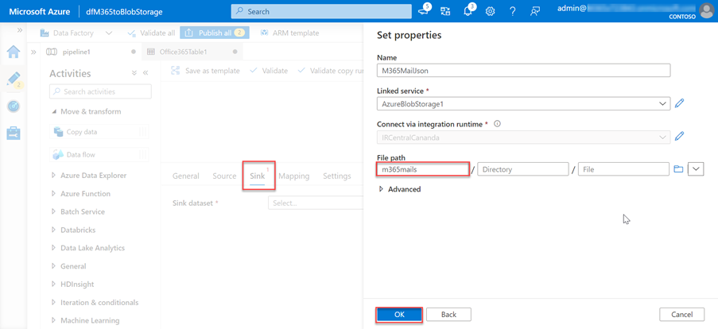

<!-- markdownlint-disable MD002 MD041 -->

Следующим шагом является использование фабрики данных Azure для создания конвейера для извлечения данных из Microsoft 365 в учетную запись служба хранилища Azure с помощью подключение к данным Microsoft Graph.

## Создание конвейера Фабрики данных Azure

1. Откройте браузер и перейдите на портал [Azure.](https://portal.azure.com/)

1. Впишитесь в использование учетной записи **с правами глобального** администратора для клиентов Azure и Microsoft 365.

1. На боковой панели навигации выберите **Создать ресурс**.

1. Найдите **тип ресурса Фабрика** данных и используйте для его создания следующие значения, а затем выберите **Create**.

    1. **Подписка:** выберите подписку Azure
    2. **Группа ресурсов:** GraphDataConnect
    3. **Регион:** выберите регион Azure в том же регионе, что и Microsoft 365 регионе
    4. **Имя:** dfM365toBlobStorage
    5. **Версия:** V2

        

    6. На **вкладке конфигурации Git** убедитесь, что вы либо настраивали Git, либо выберите параметр _Configure Git позже._

1. После создания ресурса Фабрика данных Azure выберите плитку **Author и Monitor** для запуска редактора полного экрана Azure Data Factory.

    

1. Переключение с **"Обзор"** на **"Управление** опытом", выбрав его из левой навигации.

1. По умолчанию фабрика данных Azure будет использовать время запуска интеграции, которое автоматически разрешит область. Поскольку для Подключение данных требуется, чтобы ваш источник и назначение, а также время запуска интеграции существовали в одном Microsoft 365 регионе, рекомендуется создать новое время запуска интеграции с фиксированным регионом.

    1. Выберите **время запуска**  >  **интеграции New**.
    2. Выберите **Azure, самообуправление и** выберите **Продолжить**.
    3. Выберите **Azure** для сетевой среды и выберите **Продолжить**.

        

    4. Чтобы заполнить форму на окончательном экране, используйте следующие сведения, а затем выберите **Create**.

        - **Имя:** имя времени запуска интеграции
        - **Описание:** введите описание
        - **Регион:** выберите регион, который соответствует вашему Microsoft 365 региону
        - **Виртуальная конфигурация сети (предварительный просмотр)**: Отключено

1. Переключиться с **"Управление"** на **"Автор",** выбрав его из левой навигации.
1. Создайте новый конвейер, выбрав значок **плюс,** а затем **конвейер.**

    

    - **Перетащите действие Copy Data** из раздела Перемещение и **Преобразование** на поверхность разработки.

        

    - Выберите действие в конструкторе.
    - Выберите **вкладку General** и назови ей имя и описание.

      - **Имя:** CopyFromM365toBlobStorage
      - **Описание.** Описание, необходимое.

    - В области редактора действий ниже конструктора выберите вкладку **Source,** а затем выберите **New**.
    - Найдите набор **Office 365,** выберите его и выберите кнопку **Продолжить.**

        

    - Конструктор обновляет вкладку **Source** с помощью параметров Microsoft 365 соединители.
    - Выберите параметр **Open** рядом с **полем Исходный набор** данных.
    - В параметрах таблицы выберите вкладку **Подключение,** а затем **кнопку New.**
    - В диалоговом окте, который отображается, введите ранее созданный **ID** приложения Azure  AD и секретный **ID** в полях основных ИД служб и основных ключевых ключевых служб соответственно, а затем выберите  **Создать**.
    - Выберите время запуска интеграции, созданное ранее в **Подключение** при отсеве времени интеграции.

        

    - После создания Microsoft 365 для поля **Таблицы** выберите **BasicDataSet_v0. Message_v0**.
    - Переключение **с Office365Table** на **источник > Pipeline.** Используйте следующие значения для фильтра **Date.**

      - **Имя столбца:** CreatedDateTime
      - **Время начала (UTC)**: выберите дату до текущей даты
      - **Время окончания (UTC)**: выберите текущую дату
      - Выберите **схему импорта** в разделе _Выходные столбцы._

    - Выберите действие **копирования** данных на вкладке конвейера, а затем вкладки **Sink.**

      - Выберите **кнопку New,** выберите **служба хранилища Azure Blob** и выберите кнопку **Продолжить.**
      - Выберите **двоичный** формат для данных, а затем выберите кнопку **Продолжить.**
      - Дайте набору данных имя **M365JsonFile** и создайте новую связанную службу, если она еще не существует.

    - В таблице выберите вкладку **Подключение,** а затем выберите **New**.
    - Установите следующие значения в диалоговом окантове, а затем выберите **Finish**.

        - **Метод проверки подлинности:** руководитель службы
        - **Подписка Azure:** выберите все
        - **служба хранилища учетной записи:** mgdcm365datastore
          - Это учетная запись хранилища, созданная ранее в этом упражнении.
        - **Клиент:** введите ID клиента Azure
        - **Основной ID службы:** введите ID созданного ранее приложения Azure AD
        - **Основной ключ службы:** введите клавишу hashed приложения Azure AD, созданного ранее

    - Рядом с **полем Путь к файлу** выберите **Просмотр**.
    - Выберите имя созданного ранее контейнера хранения.

      

1. Создав конвейер, выберите кнопку **Проверка всех** в верхней части конструктора.

1. После проверки (и устранения всех найденных проблем) выберите кнопку **Опубликовать** все в верхней части конструктора.

## Запуск конвейера фабрики данных Azure

С помощью созданного конвейера пришло время запустить его.

> [!NOTE]
> Для появления запроса на согласие может занять несколько минут, и для всего процесса (запуска, запроса согласия и утверждения согласия, завершаемого запуском конвейера) требуется более 40 минут.

1. В конструкторе Фабрики данных Azure с открытым конвейером выберите **добавить триггер**> Trigger Now .

    

1. После запуска задания из меню боковой панели выберите **Монитор,** чтобы просмотреть текущие запущенные задания.

1. На панели навигации слева найдите вкладку **Запуск конвейера** и выберите ее. Выберите конвейер в столбце **Имя конвейера,** чтобы просмотреть **выполняется действие.** Этот конвейер будет показываться в _процессе выполнения_.

    

1. После просмотра **выполняется действие,** перейдите в раздел _Действия выполняется,_ который расположен в нижней части страницы.

1. Наведите **курсор над именем Activity** и выберите параметр Googles. В этом случае будет приведена **вкладка Details.**

    

1. На экране **Details** посмотрите на состояние действия конвейера, как посветилось на следующем изображении. В этом случае вы можете увидеть, что он находится в состоянии **RequestingConsent**.

    

1. На этом этапе запуск действий будет внутренне приостановлен, пока кто-то вручную не утвердит запрос на согласие через центр администрирования Microsoft 365 или через PowerShell.
