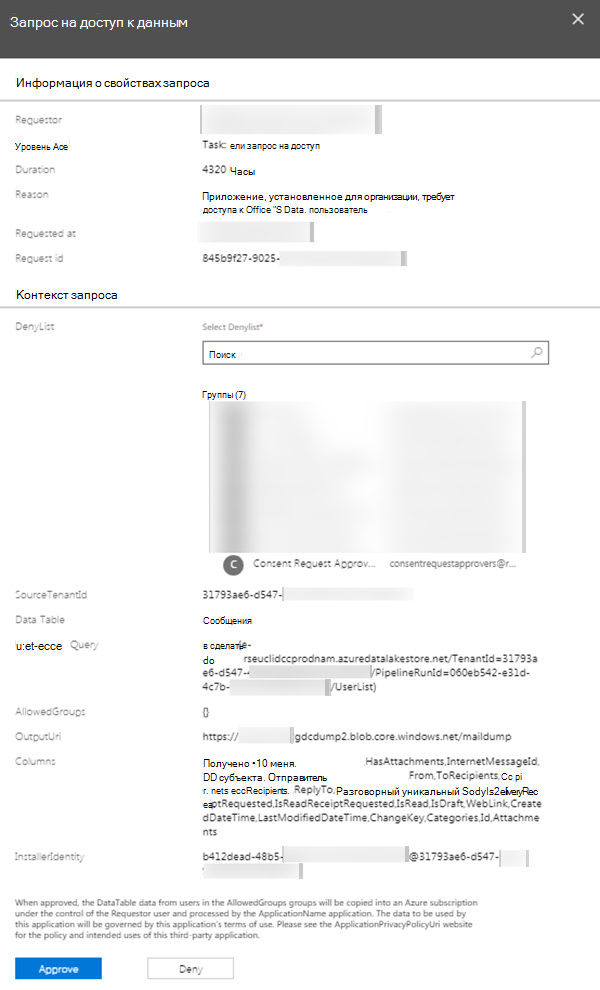
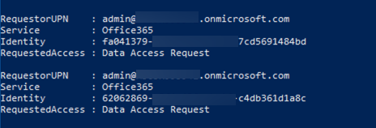
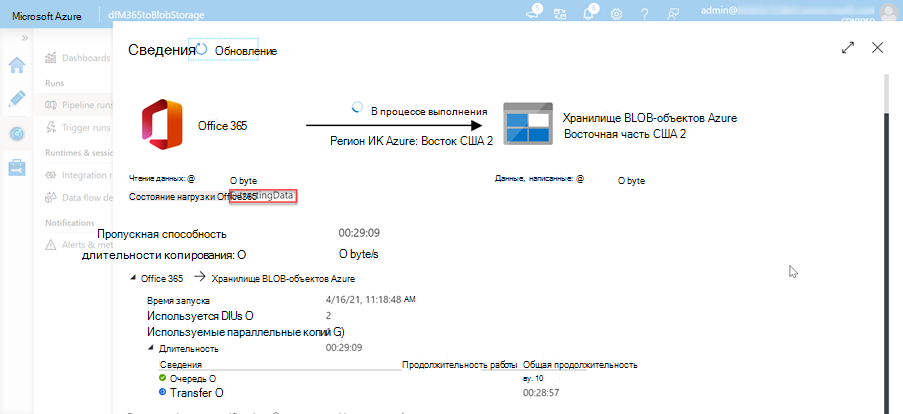
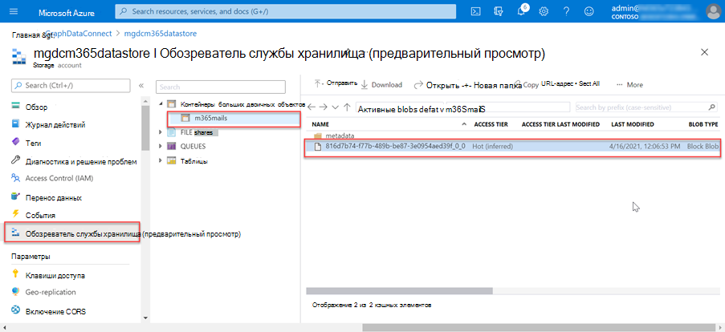

<!-- markdownlint-disable MD002 MD041 -->

<span data-ttu-id="42cce-101">Администратор Microsoft 365 может утверждать или отказывать в запросах на согласие.</span><span class="sxs-lookup"><span data-stu-id="42cce-101">A Microsoft 365 administrator has the ability to approve or deny consent requests.</span></span> <span data-ttu-id="42cce-102">Это можно сделать через центр администрирования Microsoft 365 или программным образом с помощью PowerShell.</span><span class="sxs-lookup"><span data-stu-id="42cce-102">This can be done via the Microsoft 365 Admin Center or programmatically via PowerShell.</span></span>

## <a name="approve-consent-requests"></a><span data-ttu-id="42cce-103">Утверждение запросов на согласие</span><span class="sxs-lookup"><span data-stu-id="42cce-103">Approve consent requests</span></span>

# <a name="microsoft-365-admin-center"></a>[<span data-ttu-id="42cce-104">Microsoft 365 Центр администрирования</span><span class="sxs-lookup"><span data-stu-id="42cce-104">Microsoft 365 Admin Center</span></span>](#tab/Microsoft365)

1. <span data-ttu-id="42cce-105">Откройте браузер и перейдите [на Microsoft 365 Портал администрирования.](https://admin.microsoft.com)</span><span class="sxs-lookup"><span data-stu-id="42cce-105">Open a browser and go to your [Microsoft 365 Admin Portal](https://admin.microsoft.com).</span></span>

1. <span data-ttu-id="42cce-106">Чтобы утверждать или отказывать в запросах на согласие, перейдите в [привилегированный доступ](https://portal.office.com/adminportal/home#/Settings/PrivilegedAccess).</span><span class="sxs-lookup"><span data-stu-id="42cce-106">To approve or deny consent requests, go to [Privileged Access](https://portal.office.com/adminportal/home#/Settings/PrivilegedAccess).</span></span>

1. <span data-ttu-id="42cce-107">Выберите ожидающих **запрос на доступ к данным.**</span><span class="sxs-lookup"><span data-stu-id="42cce-107">Select a pending **Data Access Request**.</span></span>

1. <span data-ttu-id="42cce-108">В **вызове запроса на доступ к данным** выберите кнопку **Утверждение.**</span><span class="sxs-lookup"><span data-stu-id="42cce-108">In the **Data Access Request** call out, select the **Approve** button.</span></span>

    

# <a name="powershell"></a>[<span data-ttu-id="42cce-110">PowerShell</span><span class="sxs-lookup"><span data-stu-id="42cce-110">PowerShell</span></span>](#tab/PowerShell)

1. <span data-ttu-id="42cce-111">Откройте Windows PowerShell.</span><span class="sxs-lookup"><span data-stu-id="42cce-111">Open Windows PowerShell.</span></span>
1. <span data-ttu-id="42cce-112">Убедитесь, что сеанс PowerShell включил удаленно подписанные скрипты.</span><span class="sxs-lookup"><span data-stu-id="42cce-112">Ensure that your PowerShell session has enabled remotely signed scripts.</span></span>

    ```powershell
    Set-ExecutionPolicy RemoteSigned
    ```

1. <span data-ttu-id="42cce-113">Подключение Exchange Online.</span><span class="sxs-lookup"><span data-stu-id="42cce-113">Connect to Exchange Online.</span></span>

    1. <span data-ttu-id="42cce-114">Получение входа в учетные данные, исполнив следующую PowerShell.</span><span class="sxs-lookup"><span data-stu-id="42cce-114">Obtain a sign in credential by executing the following PowerShell.</span></span> <span data-ttu-id="42cce-115">Во включай использование другого пользователя, создавшего и затеявшего конвейер Azure Data Factory, который имеет роль глобального администратора, который входит в группу, которая имеет права утверждать запросы на данные в Microsoft 365 и имеет многофакторную проверку подлинности. </span><span class="sxs-lookup"><span data-stu-id="42cce-115">Sign in using a different user than one that created and started the Azure Data Factory pipeline, who has the **Global administrator** role applied, who is a member of the group that has rights to approve requests to data in Microsoft 365, and has multi-factor authentication enabled.</span></span>

        ```powershell
        $UserCredential = Get-Credential
        ```

    1. <span data-ttu-id="42cce-116">Создайте новый сеанс Exchange Online PowerShell и загрузим его (импорт).</span><span class="sxs-lookup"><span data-stu-id="42cce-116">Create a new Exchange Online PowerShell session and load (import) it.</span></span>

        ```powershell
        $Session = New-PSSession -ConfigurationName Microsoft.Exchange -ConnectionUri https://ps.protection.outlook.com/powershell-liveid/ -Credential $UserCredential -Authentication Basic -AllowRedirection
        Import-PSSession $Session -DisableNameChecking
        ```

        > [!IMPORTANT]
        > <span data-ttu-id="42cce-117">После завершения этого сеанса убедитесь, что вы отключались от сеанса с помощью команды `Remove-PSSession $Session` PowerShell.</span><span class="sxs-lookup"><span data-stu-id="42cce-117">After you are finished with this session, be sure you you disconnect from the session using the PowerShell command `Remove-PSSession $Session`.</span></span> <span data-ttu-id="42cce-118">Exchange Online позволяет использовать только три открытых сеанса удаленной powerShell для защиты от атак с отказом в обслуживании (DoS).</span><span class="sxs-lookup"><span data-stu-id="42cce-118">Exchange Online only allows for three open remote PowerShell sessions to protect against denial-of-service (DoS) attacks.</span></span> <span data-ttu-id="42cce-119">Если просто закрыть окно PowerShell, оно оставит подключение открытым.</span><span class="sxs-lookup"><span data-stu-id="42cce-119">If you simply close the PowerShell window, it will leave the connection open.</span></span>

1. <span data-ttu-id="42cce-120">Получите список всех ожидающих запросов данных из подключение к данным Microsoft Graph, исполнив следующую PowerShell.</span><span class="sxs-lookup"><span data-stu-id="42cce-120">Get a list of all pending data requests from Microsoft Graph data connect by executing the following PowerShell.</span></span>

    ```powershell
    Get-ElevatedAccessRequest | where {$_.RequestStatus -eq 'Pending'} | select RequestorUPN, Service, Identity, RequestedAccess | fl
    ```

    - <span data-ttu-id="42cce-121">Изучите список возвращенных запросов на доступ к данным.</span><span class="sxs-lookup"><span data-stu-id="42cce-121">Examine the list of data access requests returned.</span></span> <span data-ttu-id="42cce-122">На следующем изображении обратите внимание на два ожидающих запроса.</span><span class="sxs-lookup"><span data-stu-id="42cce-122">In the following image, notice there are two pending requests.</span></span>

        

1. <span data-ttu-id="42cce-124">Утверждение доступа к данным, возвращенного на предыдущем шаге, скопируйте GUID удостоверения запроса, исполнив следующую PowerShell.</span><span class="sxs-lookup"><span data-stu-id="42cce-124">Approve a data access returned in the previous step by copying the Identity GUID of a request by executing the following PowerShell.</span></span>

    > [!NOTE]
    > <span data-ttu-id="42cce-125">Замените GUID в следующем фрагменте кода на GUID по результатам предыдущего шага.</span><span class="sxs-lookup"><span data-stu-id="42cce-125">Replace the GUID in the following code snippet with the GUID from the results of the previous step.</span></span>

    ```powershell
    Approve-ElevatedAccessRequest -RequestId fa041379-0000-0000-0000-7cd5691484bd -Comment 'approval request granted'
    ```

1. <span data-ttu-id="42cce-126">Через несколько минут вы увидите страницу состояния для обновления запуска действий, чтобы показать, что она теперь _извлекает данные._</span><span class="sxs-lookup"><span data-stu-id="42cce-126">After a few moments, you should see the status page for the activity run update to show it is now _extracting data_.</span></span>

    

1. <span data-ttu-id="42cce-128">Этот процесс извлечения данных может занять некоторое время в зависимости от размера Microsoft 365 клиента.</span><span class="sxs-lookup"><span data-stu-id="42cce-128">This process of extracting the data can take some time depending on the size of your Microsoft 365 tenant.</span></span>

---

## <a name="verify-extracted-data-from-microsoft-365-to-azure-storage-blob"></a><span data-ttu-id="42cce-129">Проверка извлеченных данных из Microsoft 365 до служба хранилища Azure Blob</span><span class="sxs-lookup"><span data-stu-id="42cce-129">Verify extracted data from Microsoft 365 to Azure Storage Blob</span></span>

1. <span data-ttu-id="42cce-130">Откройте браузер и перейдите на портал [Azure.](https://portal.azure.com/)</span><span class="sxs-lookup"><span data-stu-id="42cce-130">Open a browser and go to your [Azure Portal](https://portal.azure.com/).</span></span>

1. <span data-ttu-id="42cce-131">Впишитесь в использование учетной записи **с правами глобального** администратора для клиентов Azure и Microsoft 365.</span><span class="sxs-lookup"><span data-stu-id="42cce-131">Sign in using an account with **Global administrator** rights to your Azure and Microsoft 365 tenants.</span></span>

1. <span data-ttu-id="42cce-132">На боковой панели навигации выберите элемент **меню "Все** ресурсы".</span><span class="sxs-lookup"><span data-stu-id="42cce-132">On the sidebar navigation, select the **All resources** menu item.</span></span>

1. <span data-ttu-id="42cce-133">В списке ресурсов выберите учетную **запись служба хранилища Azure, созданную** ранее в этом руководстве.</span><span class="sxs-lookup"><span data-stu-id="42cce-133">In the list of resources, select the **Azure Storage account** you created previously in this tutorial.</span></span>

1. <span data-ttu-id="42cce-134">В меню навигации на боковой панели выберите **Blobs** из служба хранилища Azure **учетной записи.**</span><span class="sxs-lookup"><span data-stu-id="42cce-134">On the sidebar navigation menu, select **Blobs** from the **Azure Storage account** blade.</span></span>

1. <span data-ttu-id="42cce-135">Выберите **контейнер,** созданный ранее в этом руководстве, который вы настроили конвейер Azure Data Factory в качестве раковины для извлеченных данных.</span><span class="sxs-lookup"><span data-stu-id="42cce-135">Select the **container** created previously in this tutorial that you configured the Azure Data Factory pipeline as the sink for the extracted data.</span></span> <span data-ttu-id="42cce-136">Вы должны видеть данные в этом контейнере сейчас.</span><span class="sxs-lookup"><span data-stu-id="42cce-136">You should see data in this container now.</span></span>

    
