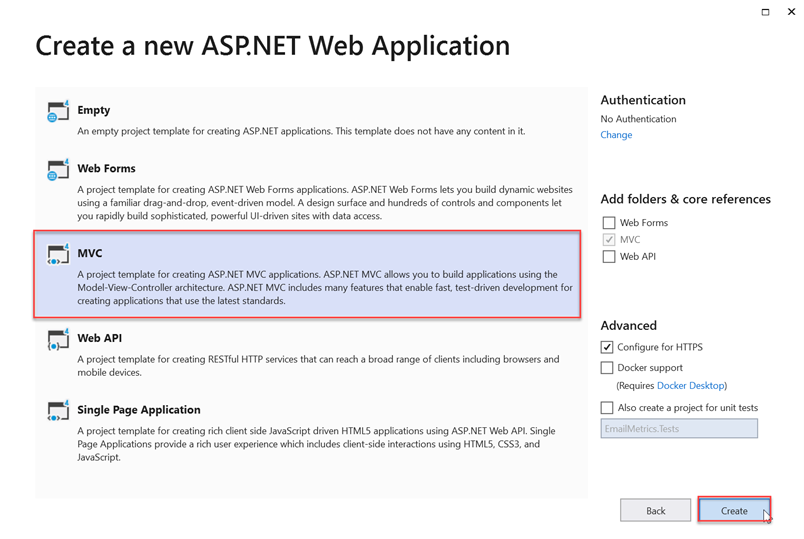
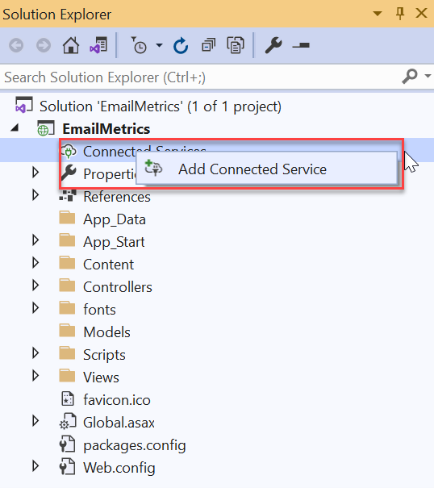

<!-- markdownlint-disable MD002 MD041 -->

В этом разделе будет построено первое приложение ASP.NET для обработки экспортируемых данных Microsoft Graph data Подключение.

## <a name="create-a-new-aspnet-project"></a>Создание нового ASP.NET проекта

1. Откройте Visual Studio и выберите **файл > New > Project**.

1. В **диалоговом Project** New Project сделайте следующее.

    1. Поиск **ASP.NET веб-приложения** в поле поиска и **выберите ASP.NET (платформа .NET Framework).**
    1. Нажмите **кнопку Далее**.

        

    1. Введите **EmailMetrics** для имени проекта.
    1. Выберите **платформа .NET Framework 4.7.2 для** параметра framework.
    1. Выберите пункт **Создать**.

    > [!IMPORTANT]
    > Убедитесь, что вы вводите точно такое же имя для Visual Studio Project, указанного в этом инструкции быстрого запуска. Имя проекта Visual Studio становится частью пространства имен в коде. Для кода в этих инструкциях важно, чтобы пространство имен совпадало с именем проекта Visual Studio, указанным в этих инструкциях. Если ввести другое имя проекта, код не будет компилироваться, пока вы не настроите все пространства имен в соответствии с именем, которое вы указали для проекта Visual Studio при его создании.

    1. В **диалоговом ASP.NET веб-приложения** выберите MVC.
    1. Выберите пункт **Создать**.

    

## <a name="add-and-configure-your-azure-storage-as-a-connected-service"></a>Добавление и настройка служба хранилища Azure как подключенной службы

1. В **окне средства Обозреватель** решений щелкните правой кнопкой мыши узел **Подключенные** службы и выберите **Добавить подключенную службу.**

    

1. В **диалоговом окте** "Подключенные службы" выберите зеленый знак, расположенный в верхнем правом углу **+** диалогов.

1. В **диалоговом окте Добавить зависимость** выберите **служба хранилища Azure** и выберите **Далее**.

    

1. В **диалоговом служба хранилища Azure** выберите учетную запись подписки и хранилища, в которой экспортировали данные в предыдущем упражнении, выберите **Далее**.

    

1. **Предостанав служба хранилища Azure подключения** имя **AzureStorageConnectionString** и выберите **Далее**.
1. Нажмите **Готово**.

    

## <a name="create-a-new-model-class-that-will-be-used-to-store-the-email-metrics"></a>Создание нового класса модели, который будет использоваться для хранения метрик электронной почты

1. В  **окне средства Обозреватель** решений щелкните правой кнопкой мыши папку **Модели** и выберите **Добавить > класс**.

    

1. В **диалоговом** окрике Добавить новый элемент выберите **класс,** установите имя файла _в EmailMetric.cs_ и выберите **Добавить**.

1. Добавьте следующий код в только что созданный класс EmailMetric.

    ```csharp
    public string Email;
    public double RecipientsToEmail;
    ```

## <a name="create-a-new-controller-that-will-calculate-and-display-the-results"></a>Создание нового контроллера, который будет вычислять и отображать результаты

1. Щелкните правой кнопкой мыши **папку Контроллеры** и выберите **Добавить > Контроллер**.

1. В **диалоговом окте Добавить scaffold** выберите **контроллер MVC 5 — Пустой и** выберите **Добавить**.

1. При запросе напишите **контроллеру EmailMetricsController** и выберите **ОК.**

1. Добавьте следующие утверждения с помощью существующих заявлений с использованием в верхней части файла, содержащего **класс EmailMetricsController.**

    ```csharp
    using System.Collections.Generic;
    using System.Configuration;
    using System.IO;
    using System.Linq;
    using System.Threading.Tasks;
    using System.Web.Mvc;
    using Azure.Storage.Blobs;
    using Azure.Storage.Blobs.Models;
    using Newtonsoft.Json.Linq;
    ```

1. Добавьте следующий код в **класс EmailMetricsController.** Они будут использоваться для подключения к учетной записи **служба хранилища Azure,** которая содержит экспортируемую информацию.

    ```csharp
    private const string connectionStringName = "AzureStorageConnectionString";
    private const string emailBlobName = "m365mails";

    ```

1. Добавьте следующий метод в **класс EmailMetricsController.** Это обработать **Blob Azure** и обновить коллекцию, представляющую учетные записи электронной почты и количество получателей, объединенных во всех электронных сообщениях, найденных для извлеченных учетных записей.

    ```csharp
    private async Task ProcessBlobEmails(List<Models.EmailMetric> emailMetrics, BlobClient emailBlob)
    {
        using (var stream = new MemoryStream())
        {
            var response = await emailBlob.DownloadToAsync(stream);
            var pos = stream.Seek(0, SeekOrigin.Begin);

            using (var reader = new StreamReader(stream))
            {

                string line;
                while ((line = reader.ReadLine()) != null)
                {
                    var jsonObj = JObject.Parse(line);

                    // extract sender
                    var sender = jsonObj.SelectToken("Sender.EmailAddress.Address")?.ToString();
                    // No sender - skip this one
                    if (string.IsNullOrEmpty(sender)) continue;

                    // extract and count up recipients
                    var totalRecipients = 0;
                    totalRecipients += jsonObj.SelectToken("ToRecipients")?.Children().Count() ?? 0;
                    totalRecipients += jsonObj.SelectToken("CcRecipients")?.Children().Count() ?? 0;
                    totalRecipients += jsonObj.SelectToken("BccRecipients")?.Children().Count() ?? 0;

                    var emailMetric = new Models.EmailMetric();
                    emailMetric.Email = sender;
                    emailMetric.RecipientsToEmail = totalRecipients;

                    // if already have this sender...
                    var existingMetric = emailMetrics.FirstOrDefault(metric => metric.Email == emailMetric.Email);
                    if (existingMetric != null)
                    {
                        existingMetric.RecipientsToEmail += emailMetric.RecipientsToEmail;
                    }
                    else
                    {
                        emailMetrics.Add(emailMetric);
                    }
                }
            }
        }
    }
    ```

1. Добавьте следующий метод в **класс EmailMetricsController.** При этом будут указаны все blobs **в** указанном контейнере служба хранилища Azure указанной учетной записи и отправляться каждый метод, добавленный `ProcessBlobEmails()` на последнем шаге.

    ```csharp
    private async Task<List<Models.EmailMetric>> ProcessBlobFiles()
    {
        var emailMetrics = new List<Models.EmailMetric>();
        var connectionString = ConfigurationManager.ConnectionStrings[connectionStringName];

        // Connect to the storage account
        var containerClient = new BlobContainerClient(connectionString.ConnectionString, emailBlobName);

        foreach (var blob in containerClient.GetBlobs())
        {
            if (blob.Properties.BlobType == BlobType.Block &&
                // Don't process blobs in the metadata folder
                !blob.Name.StartsWith("metadata/"))
            {
                var blobClient = containerClient.GetBlobClient(blob.Name);
                await ProcessBlobEmails(emailMetrics, blobClient);
            }
        }

        return emailMetrics;
    }
    ```

1. Добавьте следующее действие в **EmailMetricsController,** который будет использовать методы, добавленные этим классом, для обработки сообщений электронной почты и отправки результатов в представление.

    ```csharp
    [HttpPost, ActionName("ShowMetrics")]
    [ValidateAntiForgeryToken]
    public async Task<ActionResult> ShowMetrics()
    {
        var emailMetrics = await ProcessBlobFiles();

        return View(emailMetrics);
    }
    ```

## <a name="create-a-new-view-for-the-emailmetrics-index-action"></a>Создание нового представления для действия индекса EmailMetrics

1. В  **окне средства Обозреватель** решений щелкните правой кнопкой мыши папку Представления **> EmailMetrics** и выберите **Добавить > View**.

1. В **диалоговом окне Add New Scaffolded Item** выберите **представление MVC 5,** а затем выберите **Добавить**.

1. В **диалоговом** окантове Add View установите имя **View** **Index**, оставьте оставшиеся элементы управления входом значениями по умолчанию и выберите **Добавить**.

    

1. Обновление разметки в новом представлении **> EmailMetrics > _Index.cshtml_** до следующего. Это добавит форму с одной кнопкой, которая будет отправлять HTTP POST в действие настраиваемой контроллера, добавленной на последнем шаге.

    ```html
    @{
    ViewBag.Title = "Index";
    }

    <h2>Email Metrics</h2>
    ```

1. В этом приложении будут отображаться данные электронной почты для электронных писем, извлеченных в учетную запись **Azure Blob служба хранилища** и отображается общее число получателей от каждого отправитель.

    ```html
    @using (Html.BeginForm("ShowMetrics", "EmailMetrics", FormMethod.Post))
    {
    @Html.AntiForgeryToken()
    <div>
        <button type="submit">View email metrics</button>
    </div>

    <div>
        <em>Please be patient as this can take a few moments to calculate depending on the size of the exported data...</em>
    </div>
    }
    ```

## <a name="create-a-new-view-for-the-emailmetrics-showmetrics-action"></a>Создание нового представления для действия ShowMetrics EmailMetrics

1. В **окне средства Обозреватель** решений щелкните правой кнопкой мыши папку Представления **> EmailMetrics** и выберите **Добавить > View**.

1. В **диалоговом** окантове Add View установите следующие значения и оставьте оставшиеся элементы управления входом к значениям по умолчанию и выберите **Добавить**.

    - **Имя просмотра:** ShowMetrics
    - **Шаблон**: Список
    - **Класс модели:** EmailMetric (EmailMetric.Models)

        

    >[!TIP]
    > В случае, если вы не можете увидеть модель **EmailMetric** в поле dropdown, создайте решение.

1. Обновление разметки в новом представлении **> EmailMetrics > _ShowMetrics.cshtml_** до следующего. В этом случае будут отображаться результаты вычислений.

    ```html
    @model IEnumerable<EmailMetrics.Models.EmailMetric>

    @{
    ViewBag.Title = "ShowMetrics";
    }

    <h2>Email Metrics</h2>

    <table class="table">
    <tr>
        <th>Sender</th>
        <th>Number of Recipients</th>
    </tr>

    @foreach (var item in Model)
    {
    <tr>
        <td>@Html.DisplayFor(modelItem => item.Email)</td>
        <td>@Html.DisplayFor(modelItem => item.RecipientsToEmail)</td>
    </tr>
    }

    </table>
    ```

## <a name="update-the-navigation-to-have-a-way-to-get-to-the-new-controller"></a>Обновление навигации, чтобы получить способ добраться до нового контроллера

1. В **окне средства Обозреватель** решений найдите и откройте **файл Views > Shared > _Layout.cshtml_**.
1. Замените содержимое приведенным ниже кодом.

    ```html
    <!-- new code -->
    <li>@Html.ActionLink("Email Metrics", "Index", "EmailMetrics")</li>
    ```

## <a name="test-the-application"></a>Тестирование приложения

1. В Visual Studio выберите **отладку > начать отладку**.

1. При построении приложения и загрузке в новом окне браузера выберите элемент **Метрик электронной** почты в верхней панели навигации.

1. На странице **Метрик электронной почты** выберите кнопку **Просмотр метрик электронной почты.**

    

1. При загрузке страницы вы увидите список адресов электронной почты, найденных среди всех сообщений электронной почты с суммой всех получателей, отправленных между ними, как показано из небольшого примера, установленного в тестовом экстракте электронной почты на следующем рисунке.

    
