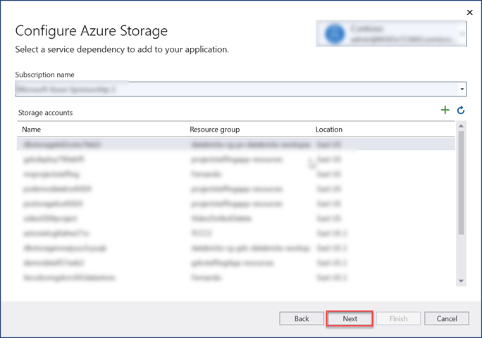
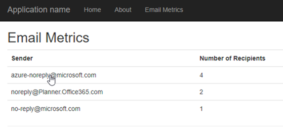

<!-- markdownlint-disable MD002 MD041 -->

<span data-ttu-id="cf2df-101">В этом разделе будет построено первое приложение ASP.NET для обработки экспортируемых данных Microsoft Graph data Подключение.</span><span class="sxs-lookup"><span data-stu-id="cf2df-101">In this section we will be building your first ASP.NET project application for to process the Microsoft Graph Data Connect data that was exported.</span></span>

## <a name="create-a-new-aspnet-project"></a><span data-ttu-id="cf2df-102">Создание нового ASP.NET проекта</span><span class="sxs-lookup"><span data-stu-id="cf2df-102">Create a new ASP.NET project</span></span>

1. <span data-ttu-id="cf2df-103">Откройте Visual Studio и выберите **файл > New > Project**.</span><span class="sxs-lookup"><span data-stu-id="cf2df-103">Open Visual Studio and select **File > New > Project**.</span></span>

1. <span data-ttu-id="cf2df-104">В **диалоговом Project** New Project сделайте следующее.</span><span class="sxs-lookup"><span data-stu-id="cf2df-104">In the **New Project** dialog, do the following.</span></span>

    1. <span data-ttu-id="cf2df-105">Поиск **ASP.NET веб-приложения** в поле поиска и **выберите ASP.NET (платформа .NET Framework).**</span><span class="sxs-lookup"><span data-stu-id="cf2df-105">Search **ASP.NET Web Application** in the search box and select the **ASP.NET Web Application (.NET Framework)** option.</span></span>
    1. <span data-ttu-id="cf2df-106">Нажмите **кнопку Далее**.</span><span class="sxs-lookup"><span data-stu-id="cf2df-106">Click on **Next**.</span></span>

        

    1. <span data-ttu-id="cf2df-108">Введите **EmailMetrics** для имени проекта.</span><span class="sxs-lookup"><span data-stu-id="cf2df-108">Enter **EmailMetrics** for the name of the project.</span></span>
    1. <span data-ttu-id="cf2df-109">Выберите **платформа .NET Framework 4.7.2 для** параметра framework.</span><span class="sxs-lookup"><span data-stu-id="cf2df-109">Select **.NET Framework 4.7.2** for the framework option.</span></span>
    1. <span data-ttu-id="cf2df-110">Выберите пункт **Создать**.</span><span class="sxs-lookup"><span data-stu-id="cf2df-110">Select **Create**.</span></span>

    > [!IMPORTANT]
    > <span data-ttu-id="cf2df-111">Убедитесь, что вы вводите точно такое же имя для Visual Studio Project, указанного в этом инструкции быстрого запуска.</span><span class="sxs-lookup"><span data-stu-id="cf2df-111">Ensure that you enter the exact same name for the Visual Studio Project that is specified in this quick start instructions.</span></span> <span data-ttu-id="cf2df-112">Имя проекта Visual Studio становится частью пространства имен в коде.</span><span class="sxs-lookup"><span data-stu-id="cf2df-112">The Visual Studio Project name becomes part of the namespace in the code.</span></span> <span data-ttu-id="cf2df-113">Для кода в этих инструкциях важно, чтобы пространство имен совпадало с именем проекта Visual Studio, указанным в этих инструкциях.</span><span class="sxs-lookup"><span data-stu-id="cf2df-113">The code inside these instructions depends on the namespace matching the Visual Studio Project name specified in these instructions.</span></span> <span data-ttu-id="cf2df-114">Если ввести другое имя проекта, код не будет компилироваться, пока вы не настроите все пространства имен в соответствии с именем, которое вы указали для проекта Visual Studio при его создании.</span><span class="sxs-lookup"><span data-stu-id="cf2df-114">If you use a different project name the code will not compile unless you adjust all the namespaces to match the Visual Studio Project name you enter when you create the project.</span></span>

    1. <span data-ttu-id="cf2df-115">В **диалоговом ASP.NET веб-приложения** выберите MVC.</span><span class="sxs-lookup"><span data-stu-id="cf2df-115">In the new **ASP.NET Web Application** project dialog, select MVC.</span></span>
    1. <span data-ttu-id="cf2df-116">Выберите пункт **Создать**.</span><span class="sxs-lookup"><span data-stu-id="cf2df-116">Select **Create**.</span></span>

    

## <a name="add-and-configure-your-azure-storage-as-a-connected-service"></a><span data-ttu-id="cf2df-118">Добавление и настройка служба хранилища Azure как подключенной службы</span><span class="sxs-lookup"><span data-stu-id="cf2df-118">Add and configure your Azure Storage as a Connected Service</span></span>

1. <span data-ttu-id="cf2df-119">В **окне средства Обозреватель** решений щелкните правой кнопкой мыши узел **Подключенные** службы и выберите **Добавить подключенную службу.**</span><span class="sxs-lookup"><span data-stu-id="cf2df-119">In the **Solution Explorer** tool window, right-click the **Connected Services** node and select **Add Connected Service**.</span></span>

    

1. <span data-ttu-id="cf2df-121">В **диалоговом окте** "Подключенные службы" выберите зеленый знак, расположенный в верхнем правом углу **+** диалогов.</span><span class="sxs-lookup"><span data-stu-id="cf2df-121">On the **Connected Services** dialog, select the green **+** sign which is located in the upper-right corner of the dialog.</span></span>

1. <span data-ttu-id="cf2df-122">В **диалоговом окте Добавить зависимость** выберите **служба хранилища Azure** и выберите **Далее**.</span><span class="sxs-lookup"><span data-stu-id="cf2df-122">In the **Add dependency** dialog, select **Azure Storage** and select **Next**.</span></span>

    

1. <span data-ttu-id="cf2df-124">В **диалоговом служба хранилища Azure** выберите учетную запись подписки и хранилища, в которой экспортировали данные в предыдущем упражнении, выберите **Далее**.</span><span class="sxs-lookup"><span data-stu-id="cf2df-124">In the **Azure Storage** dialog, select the subscription and storage account where you exported the data in the previous exercise, select **Next**.</span></span>

    

1. <span data-ttu-id="cf2df-126">**Предостанав служба хранилища Azure подключения** имя **AzureStorageConnectionString** и выберите **Далее**.</span><span class="sxs-lookup"><span data-stu-id="cf2df-126">Provide the **Azure Storage connection** a name of **AzureStorageConnectionString** and select **Next**.</span></span>
1. <span data-ttu-id="cf2df-127">Нажмите **Готово**.</span><span class="sxs-lookup"><span data-stu-id="cf2df-127">Select **Finish**.</span></span>

    

## <a name="create-a-new-model-class-that-will-be-used-to-store-the-email-metrics"></a><span data-ttu-id="cf2df-129">Создание нового класса модели, который будет использоваться для хранения метрик электронной почты</span><span class="sxs-lookup"><span data-stu-id="cf2df-129">Create a new model class that will be used to store the email metrics</span></span>

1. <span data-ttu-id="cf2df-130">В  **окне средства Обозреватель** решений щелкните правой кнопкой мыши папку **Модели** и выберите **Добавить > класс**.</span><span class="sxs-lookup"><span data-stu-id="cf2df-130">In the  **Solution Explorer** tool window, right-click the **Models** folder and select **Add > Class**.</span></span>

    

1. <span data-ttu-id="cf2df-132">В **диалоговом** окрике Добавить новый элемент выберите **класс,** установите имя файла _в EmailMetric.cs_ и выберите **Добавить**.</span><span class="sxs-lookup"><span data-stu-id="cf2df-132">In the **Add New Item** dialog, select **Class**, set the name of the file to _EmailMetric.cs_ and select **Add**.</span></span>

1. <span data-ttu-id="cf2df-133">Добавьте следующий код в только что созданный класс EmailMetric.</span><span class="sxs-lookup"><span data-stu-id="cf2df-133">Add the following code to the class EmailMetric you just created.</span></span>

    ```csharp
    public string Email;
    public double RecipientsToEmail;
    ```

## <a name="create-a-new-controller-that-will-calculate-and-display-the-results"></a><span data-ttu-id="cf2df-134">Создание нового контроллера, который будет вычислять и отображать результаты</span><span class="sxs-lookup"><span data-stu-id="cf2df-134">Create a new controller that will calculate and display the results</span></span>

1. <span data-ttu-id="cf2df-135">Щелкните правой кнопкой мыши **папку Контроллеры** и выберите **Добавить > Контроллер**.</span><span class="sxs-lookup"><span data-stu-id="cf2df-135">Right-click the **Controllers** folder and select **Add > Controller**.</span></span>

1. <span data-ttu-id="cf2df-136">В **диалоговом окте Добавить scaffold** выберите **контроллер MVC 5 — Пустой и** выберите **Добавить**.</span><span class="sxs-lookup"><span data-stu-id="cf2df-136">In the **Add Scaffold** dialog, select **MVC 5 Controller - Empty** and select **Add**.</span></span>

1. <span data-ttu-id="cf2df-137">При запросе напишите **контроллеру EmailMetricsController** и выберите **ОК.**</span><span class="sxs-lookup"><span data-stu-id="cf2df-137">When prompted, name the controller **EmailMetricsController** and select **OK**.</span></span>

1. <span data-ttu-id="cf2df-138">Добавьте следующие утверждения с помощью существующих заявлений с использованием в верхней части файла, содержащего **класс EmailMetricsController.**</span><span class="sxs-lookup"><span data-stu-id="cf2df-138">Add the following using statements after the existing using statements at the top of the file containing the **EmailMetricsController** class.</span></span>

    ```csharp
    using System.Collections.Generic;
    using System.Configuration;
    using System.IO;
    using System.Linq;
    using System.Threading.Tasks;
    using System.Web.Mvc;
    using Azure.Storage.Blobs;
    using Azure.Storage.Blobs.Models;
    using Newtonsoft.Json.Linq;
    ```

1. <span data-ttu-id="cf2df-139">Добавьте следующий код в **класс EmailMetricsController.**</span><span class="sxs-lookup"><span data-stu-id="cf2df-139">Add the following code to the **EmailMetricsController** class.</span></span> <span data-ttu-id="cf2df-140">Они будут использоваться для подключения к учетной записи **служба хранилища Azure,** которая содержит экспортируемую информацию.</span><span class="sxs-lookup"><span data-stu-id="cf2df-140">These will be used to connect to the **Azure Storage Account** that contains the exported data.</span></span>

    ```csharp
    private const string connectionStringName = "AzureStorageConnectionString";
    private const string emailBlobName = "maildump";

    ```

1. <span data-ttu-id="cf2df-141">Добавьте следующий метод в **класс EmailMetricsController.**</span><span class="sxs-lookup"><span data-stu-id="cf2df-141">Add the following method to the **EmailMetricsController** class.</span></span> <span data-ttu-id="cf2df-142">Это обработать **Blob Azure** и обновить коллекцию, представляющую учетные записи электронной почты и количество получателей, объединенных во всех электронных сообщениях, найденных для извлеченных учетных записей.</span><span class="sxs-lookup"><span data-stu-id="cf2df-142">This will process an **Azure Blob** and update a collection representing the email accounts and how many recipients there were combined across all emails found for the extracted accounts.</span></span>

    ```csharp
    private async Task ProcessBlobEmails(List<Models.EmailMetric> emailMetrics, BlobClient emailBlob)
    {
        using (var stream = new MemoryStream())
        {
            var response = await emailBlob.DownloadToAsync(stream);
            var pos = stream.Seek(0, SeekOrigin.Begin);

            using (var reader = new StreamReader(stream))
            {

                string line;
                while ((line = reader.ReadLine()) != null)
                {
                    var jsonObj = JObject.Parse(line);

                    // extract sender
                    var sender = jsonObj.SelectToken("Sender.EmailAddress.Address")?.ToString();
                    // No sender - skip this one
                    if (string.IsNullOrEmpty(sender)) continue;

                    // extract and count up recipients
                    var totalRecipients = 0;
                    totalRecipients += jsonObj.SelectToken("ToRecipients")?.Children().Count() ?? 0;
                    totalRecipients += jsonObj.SelectToken("CcRecipients")?.Children().Count() ?? 0;
                    totalRecipients += jsonObj.SelectToken("BccRecipients")?.Children().Count() ?? 0;

                    var emailMetric = new Models.EmailMetric();
                    emailMetric.Email = sender;
                    emailMetric.RecipientsToEmail = totalRecipients;

                    // if already have this sender...
                    var existingMetric = emailMetrics.FirstOrDefault(metric => metric.Email == emailMetric.Email);
                    if (existingMetric != null)
                    {
                        existingMetric.RecipientsToEmail += emailMetric.RecipientsToEmail;
                    }
                    else
                    {
                        emailMetrics.Add(emailMetric);
                    }
                }
            }
        }
    }
    ```

1. <span data-ttu-id="cf2df-143">Добавьте следующий метод в **класс EmailMetricsController.**</span><span class="sxs-lookup"><span data-stu-id="cf2df-143">Add the following method to the **EmailMetricsController** class.</span></span> <span data-ttu-id="cf2df-144">При этом будут указаны все blobs **в** указанном контейнере служба хранилища Azure указанной учетной записи и отправляться каждый метод, добавленный `ProcessBlobEmails()` на последнем шаге.</span><span class="sxs-lookup"><span data-stu-id="cf2df-144">This will enumerate through all blobs in the specified **Azure Storage** account's specified container and send each one to `ProcessBlobEmails()` method added in the last step.</span></span>

    ```csharp
    private async Task<List<Models.EmailMetric>> ProcessBlobFiles()
    {
        var emailMetrics = new List<Models.EmailMetric>();
        var connectionString = ConfigurationManager.ConnectionStrings[connectionStringName];

        // Connect to the storage account
        var containerClient = new BlobContainerClient(connectionString.ConnectionString, emailBlobName);

        foreach (var blob in containerClient.GetBlobs())
        {
            if (blob.Properties.BlobType == BlobType.Block &&
                // Don't process blobs in the metadata folder
                !blob.Name.StartsWith("metadata/"))
            {
                var blobClient = containerClient.GetBlobClient(blob.Name);
                await ProcessBlobEmails(emailMetrics, blobClient);
            }
        }

        return emailMetrics;
    }
    ```

1. <span data-ttu-id="cf2df-145">Добавьте следующее действие в **EmailMetricsController,** который будет использовать методы, добавленные этим классом, для обработки сообщений электронной почты и отправки результатов в представление.</span><span class="sxs-lookup"><span data-stu-id="cf2df-145">Add the following action to the **EmailMetricsController** that will use the methods added this class to process the emails and send the results to the view.</span></span>

    ```csharp
    [HttpPost, ActionName("ShowMetrics")]
    [ValidateAntiForgeryToken]
    public async Task<ActionResult> ShowMetrics()
    {
        var emailMetrics = await ProcessBlobFiles();

        return View(emailMetrics);
    }
    ```

## <a name="create-a-new-view-for-the-emailmetrics-index-action"></a><span data-ttu-id="cf2df-146">Создание нового представления для действия индекса EmailMetrics</span><span class="sxs-lookup"><span data-stu-id="cf2df-146">Create a new view for the EmailMetrics index action</span></span>

1. <span data-ttu-id="cf2df-147">В  **окне средства Обозреватель** решений щелкните правой кнопкой мыши папку Представления **> EmailMetrics** и выберите **Добавить > View**.</span><span class="sxs-lookup"><span data-stu-id="cf2df-147">In the  **Solution Explorer** tool window, right-click the **Views > EmailMetrics** folder and select **Add > View**.</span></span>

1. <span data-ttu-id="cf2df-148">В **диалоговом окне Add New Scaffolded Item** выберите **представление MVC 5,** а затем выберите **Добавить**.</span><span class="sxs-lookup"><span data-stu-id="cf2df-148">In the **Add New Scaffolded Item** dialog box, select **MVC 5 View**, then select **Add**.</span></span>

1. <span data-ttu-id="cf2df-149">В **диалоговом** окантове Add View установите имя **View** **Index**, оставьте оставшиеся элементы управления входом значениями по умолчанию и выберите **Добавить**.</span><span class="sxs-lookup"><span data-stu-id="cf2df-149">In the **Add View** dialog, set the **View** name to **Index**, leave the remaining input controls to their default values, and select **Add**.</span></span>

    

1. <span data-ttu-id="cf2df-151">Обновление разметки в новом представлении **> EmailMetrics > _Index.cshtml_** до следующего.</span><span class="sxs-lookup"><span data-stu-id="cf2df-151">Update the markup in the new **Views > EmailMetrics > _Index.cshtml_** to the following.</span></span> <span data-ttu-id="cf2df-152">Это добавит форму с одной кнопкой, которая будет отправлять HTTP POST в действие настраиваемой контроллера, добавленной на последнем шаге.</span><span class="sxs-lookup"><span data-stu-id="cf2df-152">This will add a form with a single button that will submit an HTTP POST to the custom controller action added in the last step.</span></span>

    ```html
    @{
    ViewBag.Title = "Index";
    }

    <h2>Email Metrics</h2>
    ```

1. <span data-ttu-id="cf2df-153">В этом приложении будут отображаться данные электронной почты для электронных писем, извлеченных в учетную запись **Azure Blob служба хранилища** и отображается общее число получателей от каждого отправитель.</span><span class="sxs-lookup"><span data-stu-id="cf2df-153">This application will look at the email data for emails extracted to the **Azure Blob Storage** account and display the total number of recipients from each sender.</span></span>

    ```html
    @using (Html.BeginForm("ShowMetrics", "EmailMetrics", FormMethod.Post))
    {
    @Html.AntiForgeryToken()
    <div>
        <button type="submit">View email metrics</button>
    </div>

    <div>
        <em>Please be patient as this can take a few moments to calculate depending on the size of the exported data...</em>
    </div>
    }
    ```

## <a name="create-a-new-view-for-the-emailmetrics-showmetrics-action"></a><span data-ttu-id="cf2df-154">Создание нового представления для действия ShowMetrics EmailMetrics</span><span class="sxs-lookup"><span data-stu-id="cf2df-154">Create a new view for the EmailMetrics ShowMetrics action</span></span>

1. <span data-ttu-id="cf2df-155">В **окне средства Обозреватель** решений щелкните правой кнопкой мыши папку Представления **> EmailMetrics** и выберите **Добавить > View**.</span><span class="sxs-lookup"><span data-stu-id="cf2df-155">In the **Solution Explorer** tool window, right-click the **Views > EmailMetrics** folder and select **Add > View**.</span></span>

1. <span data-ttu-id="cf2df-156">В **диалоговом** окантове Add View установите следующие значения и оставьте оставшиеся элементы управления входом к значениям по умолчанию и выберите **Добавить**.</span><span class="sxs-lookup"><span data-stu-id="cf2df-156">In the **Add View** dialog, set the following values and leave the remaining input controls to their default values and select **Add**.</span></span>

    - <span data-ttu-id="cf2df-157">**Имя просмотра:** ShowMetrics</span><span class="sxs-lookup"><span data-stu-id="cf2df-157">**View name**: ShowMetrics</span></span>
    - <span data-ttu-id="cf2df-158">**Шаблон**: Список</span><span class="sxs-lookup"><span data-stu-id="cf2df-158">**Template**: List</span></span>
    - <span data-ttu-id="cf2df-159">**Класс модели:** EmailMetric (EmailMetric.Models)</span><span class="sxs-lookup"><span data-stu-id="cf2df-159">**Model class**: EmailMetric (EmailMetric.Models)</span></span>

        

    >[!TIP]
    > <span data-ttu-id="cf2df-161">В случае, если вы не можете увидеть модель **EmailMetric** в поле dropdown, создайте решение.</span><span class="sxs-lookup"><span data-stu-id="cf2df-161">In case you can't see the **EmailMetric** model in the dropdown box, please build the solution.</span></span>

1. <span data-ttu-id="cf2df-162">Обновление разметки в новом представлении **> EmailMetrics > _ShowMetrics.cshtml_** до следующего.</span><span class="sxs-lookup"><span data-stu-id="cf2df-162">Update the markup in the new **Views > EmailMetrics > _ShowMetrics.cshtml_** to the following.</span></span> <span data-ttu-id="cf2df-163">В этом случае будут отображаться результаты вычислений.</span><span class="sxs-lookup"><span data-stu-id="cf2df-163">This will display the results of the calculations.</span></span>

    ```html
    @model IEnumerable<EmailMetrics.Models.EmailMetric>

    @{
    ViewBag.Title = "ShowMetrics";
    }

    <h2>Email Metrics</h2>

    <table class="table">
    <tr>
        <th>Sender</th>
        <th>Number of Recipients</th>
    </tr>

    @foreach (var item in Model)
    {
    <tr>
        <td>@Html.DisplayFor(modelItem => item.Email)</td>
        <td>@Html.DisplayFor(modelItem => item.RecipientsToEmail)</td>
    </tr>
    }

    </table>
    ```

## <a name="update-the-navigation-to-have-a-way-to-get-to-the-new-controller"></a><span data-ttu-id="cf2df-164">Обновление навигации, чтобы получить способ добраться до нового контроллера</span><span class="sxs-lookup"><span data-stu-id="cf2df-164">Update the navigation to have a way to get to the new controller</span></span>

1. <span data-ttu-id="cf2df-165">В **окне средства Обозреватель** решений найдите и откройте **файл Views > Shared > _Layout.cshtml_**.</span><span class="sxs-lookup"><span data-stu-id="cf2df-165">In the **Solution Explorer** tool window, locate and open the file **Views > Shared > _Layout.cshtml_**.</span></span>
1. <span data-ttu-id="cf2df-166">Замените содержимое приведенным ниже кодом.</span><span class="sxs-lookup"><span data-stu-id="cf2df-166">Replace the contents with the following code.</span></span>

    ```html
    <!-- new code -->
    <li>@Html.ActionLink("Email Metrics", "Index", "EmailMetrics")</li>
    ```

## <a name="test-the-application"></a><span data-ttu-id="cf2df-167">Тестирование приложения</span><span class="sxs-lookup"><span data-stu-id="cf2df-167">Test the application</span></span>

1. <span data-ttu-id="cf2df-168">В Visual Studio выберите **отладку > начать отладку**.</span><span class="sxs-lookup"><span data-stu-id="cf2df-168">In Visual Studio, select **Debug > Start Debugging**.</span></span>

1. <span data-ttu-id="cf2df-169">При построении приложения и загрузке в новом окне браузера выберите элемент **Метрик электронной** почты в верхней панели навигации.</span><span class="sxs-lookup"><span data-stu-id="cf2df-169">When the application is built and loads in a new browser window, select the **Email Metrics** item in the top navigation bar.</span></span>

1. <span data-ttu-id="cf2df-170">На странице **Метрик электронной почты** выберите кнопку **Просмотр метрик электронной почты.**</span><span class="sxs-lookup"><span data-stu-id="cf2df-170">On the **Email Metrics** page, select the **View email metrics** button.</span></span>

    

1. <span data-ttu-id="cf2df-172">При загрузке страницы вы увидите список адресов электронной почты, найденных среди всех сообщений электронной почты с суммой всех получателей, отправленных между ними, как показано из небольшого примера, установленного в тестовом экстракте электронной почты на следующем рисунке.</span><span class="sxs-lookup"><span data-stu-id="cf2df-172">When the page loads, you will see a list of emails addresses that were found among all emails with a sum of all the recipients sent between them, as shown from a small sample set in a test email extract in the following figure.</span></span>

    
