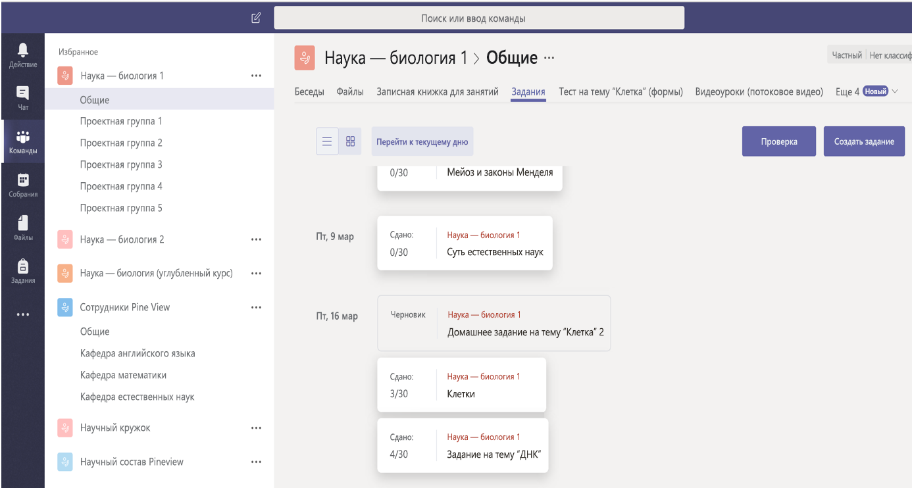

# Обзор API для образования

API в Microsoft Graph дополняет ресурсы Office 365 сведениями, актуальными для учебных заведений, включая данные об учреждениях, классах, пользователях (учащихся и преподавателях), заданиях и сданных работах. Это упрощает создание решений, интегрируемых с образовательными ресурсами, для различных сценариев в учебных заведениях и аудиториях.

API для образования в Microsoft Graph предоставляет доступ к классам, учебным заведениям, пользователям, заданиям, сданным работам и т. д.

## Зачем нужна интеграция со сценариями образования?

### Создавайте приложений, работающие со списком курса

Большинство разработчиков программного обеспечения быстро понимают, что список курса — один из важнейших ресурсов для работы приложения. Как правило, он скрыт в информационной системе для учащихся (SIS). Каждый раз, когда преподаватели приносят в класс новое приложение, им приходится вручную импортировать в него данные о составе. Многие независимые поставщики программного обеспечения решают эту проблему, подключаясь к SIS для импорта данных о составе. Учитывая, что на рынке доступны сотни информационных систем для учащихся, где используются собственные форматы, это может оказаться непростой задачей. [Microsoft School Data Sync](https://sds.microsoft.com/) в сочетании с API для списков курсов помогает разработчикам приложений и учебным заведениям решить эту проблему.

Вот некоторые сценарии, которые поддерживают API для списков курсов:

- [получение всех классов в учебном заведении](https://developer.microsoft.com/ru-RU/graph/docs/api-reference/v1.0/api/educationschool_list_classes);
- [получение всех пользователей в классе](https://developer.microsoft.com/ru-RU/graph/docs/api-reference/v1.0/api/educationclass_list_members);
- [получение всех классов, в которых я преподаю](https://developer.microsoft.com/ru-RU/graph/docs/api-reference/v1.0/api/educationuser_list_classes).

### Используйте Microsoft Teams для создания заданий для классов на соответствующей вкладке

С помощью API заданий вы можете создать веб-приложение, управляющее заданиями для классов, а затем интегрировать приложение в Microsoft Teams на специальной вкладке.  

Microsoft Teams в Office 365 — это цифровой центр, объединяющий беседы, содержимое и приложения для аудиторий. Microsoft Teams имеет [много точек расширяемости](https://docs.microsoft.com/ru-RU/microsoftteams/platform/concepts/apps/apps-overview), в том числе для создания вкладок, соединителей и ботов. Эти точки расширяемости могут вызывать API для образования в Microsoft Graph для работы с заданиями и сданными работами. Вы можете создать более целостную среду, включив точку расширения с любым другим API Microsoft Graph, а также API заданий и сданных работ.

Приложения со специальными вкладками Microsoft Teams открываются в контексте класса (команды), где имеет смысл управлять полным потоком заданий — от создания и распространения до оценивания и отзывов. Это лишь один из примеров того, как Microsoft Teams экономит время и упрощает повседневные задачи логистики, позволяя преподавателям полностью посвятить себя учащимся.

На приведенном ниже изображении показано веб-приложение для управления заданиями на специальной вкладке "Задания" для класса **Наука — биология 1**.

При помощи API заданий приложение может взаимодействовать со службой заданий вне Microsoft Teams. Microsoft Teams займется распространением, датами выполнения и оценками, а ваша система обеспечит для учащихся удобные условия обучения.
Ниже приведены примеры сценариев, работу которых обеспечивает API заданий:

- [добавление задания, связанного с вашим приложением](https://developer.microsoft.com/ru-RU/graph/docs/api-reference/beta/api/educationclass_post_assignments); 
- [назначение отдельным учащимся оценок за задания, связанные с приложением](https://developer.microsoft.com/ru-RU/graph/docs/api-reference/beta/api/educationsubmission_update);
- [создание информационной панели с датами выполнения заданий](https://developer.microsoft.com/ru-RU/graph/docs/api-reference/beta/api/educationclass_list_assignments).

## Предоставьте администраторам учебного заведения возможность управлять синхронизацией удостоверений и списков при помощи School Data Sync Management (ознакомительная версия)

[School Data Sync](https://sds.microsoft.com/) помогает автоматизировать процесс импорта и синхронизации данных об удостоверениях и списках учащихся из информационных систем для учащихся с Azure Active Directory (Azure AD) и Office 365. При синхронизации этих сведений вы можете использовать API для импорта информации о списке класса в приложения. Если вы настраиваете интеграцию информационной системы для учащихся со School Data Sync, можете воспользоваться [API для управления SDS](https://developer.microsoft.com/ru-RU/graph/docs/api-reference/beta/resources/educationsynchronizationprofile) в Microsoft Graph, чтобы настроить синхронизацию из CSV-файла или поддерживаемого соединителя API для SIS.

API управления School Data Sync поддерживают полноценные сценарии управления синхронизацией, например:

- [создание профиля, автоматически запускающего синхронизацию](https://developer.microsoft.com/ru-RU/graph/docs/api-reference/beta/api/educationsynchronizationprofile_post);
- управление жизненным циклом синхронизации при помощи операций [pause](https://developer.microsoft.com/ru-RU/graph/docs/api-reference/beta/api/educationsynchronizationprofile_pause), [resume](https://developer.microsoft.com/ru-RU/graph/docs/api-reference/beta/api/educationsynchronizationprofile_resume) и [reset](https://developer.microsoft.com/ru-RU/graph/docs/api-reference/beta/api/educationsynchronizationprofile_reset).

## Дальнейшие действия

- Прежде чем приступить к использованию API для образования, ознакомьтесь со следующими статьями:
    - [Использование API для списков курсов](https://developer.microsoft.com/ru-RU/graph/docs/api-reference/v1.0/resources/education-overview)
    - [Использование API заданий](https://developer.microsoft.com/ru-RU/graph/docs/api-reference/beta/resources/educationassignment)
    - [Использование API управления SDS](https://developer.microsoft.com/ru-RU/graph/docs/api-reference/beta/resources/educationsynchronizationprofile)
- Опробуйте API для образования в [песочнице Graph](https://developer.microsoft.com/ru-RU/graph/graph-explorer).
- Ознакомьтесь со следующими примерами, связанными с образованием:
    - [Пример единого входа и составления списков на .NET](https://github.com/OfficeDev/O365-EDU-AspNetMVC-Samples)
    - [Пример единого входа и составления списков на Angular Node](https://github.com/OfficeDev/O365-EDU-AngularNodeJS-Samples)   
    - [Пример единого входа и составления списков на Python](https://github.com/OfficeDev/O365-EDU-Python-Samples)
    - [Пример единого входа и составления списков на PHP](https://github.com/OfficeDev/O365-EDU-PHP-Samples)
    - [Пример использования API для управления профилями](https://github.com/OfficeDev/O365-EDU-SDS-AspNetMVC-Samples) 

 

