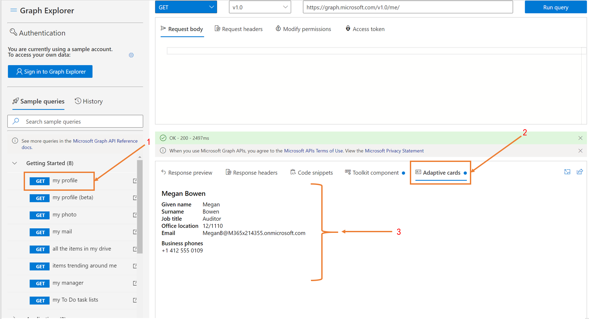

# Работа с Graph Explorer

[Graph Explorer](https://developer.microsoft.com/graph/graph-explorer/) — это средство разработчика, которое позволяет удобно создавать запросы microsoft Graph API REST и просматривать соответствующие ответы. В этой статье описывается использование некоторых важных функций Graph Explorer.

## Согласие на разрешения

Пользователь или администратор должны предоставить Graph Explorer правильные разрешения с помощью процесса согласия для доступа к данным в Microsoft Graph. Согласие на разрешения в Graph Explorer с помощью вкладки **Изменение** разрешений или параметра Select **permissions** в шестеренке параметров рядом с профилем при подписании. На **вкладке Изменение** разрешений перечислены все разрешения, необходимые для выполнения запроса в панели адресов. 

Согласие на разрешения:

1.  Выберите пример запроса и запустите его.
2.  Выберите **вкладку Изменение разрешений.**
3.  Список разрешений, необходимых для выполнения запроса.
4.  Выберите кнопку согласия рядом с разрешением, на который требуется согласие. 

Функция **Изменение разрешений** в настоящее время находится в предварительном просмотре, и некоторые запросы могут быть отсутствуют разрешения. Если для запроса отсутствуют разрешения, параметр **Select permissions** в шестеренки параметров рядом с профилем содержит список всех доступных разрешений:

1.  Перейдите к шестеренку параметров и нажмите кнопку **Выбор разрешений.** Этот параметр содержит список всех доступных разрешений.
2.  Из списка всех разрешений, согласие на те, которые вы хотите.

## Получить маркер доступа или проверки подлинности

Graph Explorer включает вкладку **Маркер доступа,** которая показывает маркер доступа при входе. На **вкладке Маркер Доступа** можно скопировать маркер, если необходимо использовать его в любимом клиентской приложении REST.

## Фрагменты кода копирования

Для каждого запроса API REST, который вы выбираете или вводите в Graph Explorer, вы можете  найти способ вызова этого API на каждом из четырех языков, демонстрируемых в вкладке фрагментов кода — C#, Java, JavaScript и Objective-C. 

## Интеграция компонентов пользовательского интерфейса

Graph Explorer включает несколько функций, упрощающих реализацию пользовательского интерфейса. Повторное использование этих компонентов и в приложениях.

### Интеграция Graph набор средств Microsoft

Microsoft [Graph набор средств](../toolkit/overview.md) — это коллекция многоиспользоваемых веб-компонентов и помощников для доступа и работы с Microsoft Graph. Компоненты полностью функциональны, с встроенными поставщиками, которые аутентификация и извлечение данных из Microsoft Graph.

Graph Explorer предоставляет примеры запросов API REST, которые соответствуют компонентам Microsoft Graph набор средств. Синяя точка на вкладке **набор средств** указывает, что набор средств предоставляет компонент для указанного в настоящее время запроса API REST в Graph Explorer. Код компонента можно удобно скопировать в приложении.

В следующей таблице перечислены примеры запросов, которые в настоящее время включают набор средств компонент.

| **Graph Пример запроса проводника** | **набор средств URL-адрес iFrame** |
| --- | --- |
| GET мой профиль | [https://mgt.dev/iframe.html?id=components-mgt-person-card—person-card-hover](https://nam06.safelinks.protection.outlook.com/?url=https%3A%2F%2Fmgt.dev%2Fiframe.html%3Fid%3Dcomponents-mgt-person-card--person-card-hover&amp;data=04%7C01%7CElise.Yang%40microsoft.com%7Ca81f0f07873240d8571b08d7dac329d4%7C72f988bf86f141af91ab2d7cd011db47%7C1%7C0%7C637218404083362882%7CUnknown%7CTWFpbGZsb3d8eyJWIjoiMC4wLjAwMDAiLCJQIjoiV2luMzIiLCJBTiI6Ik1haWwiLCJXVCI6Mn0%3D%7C-1&amp;sdata=9FvGlMZNc78EE66JiY7hrusYVuGUm2NeflYlVgwTVwo%3D&amp;reserved=0) |
| GET people I work with | [https://mgt.dev/iframe.html?id=components-mgt-people—люди](https://nam06.safelinks.protection.outlook.com/?url=https%3A%2F%2Fmgt.dev%2Fiframe.html%3Fid%3Dcomponents-mgt-people--people&amp;data=04%7C01%7CElise.Yang%40microsoft.com%7Ca81f0f07873240d8571b08d7dac329d4%7C72f988bf86f141af91ab2d7cd011db47%7C1%7C0%7C637218404083372878%7CUnknown%7CTWFpbGZsb3d8eyJWIjoiMC4wLjAwMDAiLCJQIjoiV2luMzIiLCJBTiI6Ik1haWwiLCJXVCI6Mn0%3D%7C-1&amp;sdata=yMF3X0M%2FmvWTUfhMdNYkG5I7fDMXpPHS6Fwea%2B3ycPs%3D&amp;reserved=0) |
| GET all my planner tasks | [https://mgt.dev/iframe.html?id=components-mgt-tasks— задачи](https://nam06.safelinks.protection.outlook.com/?url=https%3A%2F%2Fmgt.dev%2Fiframe.html%3Fid%3Dcomponents-mgt-tasks--tasks&amp;data=04%7C01%7CElise.Yang%40microsoft.com%7Ca81f0f07873240d8571b08d7dac329d4%7C72f988bf86f141af91ab2d7cd011db47%7C1%7C0%7C637218404083382869%7CUnknown%7CTWFpbGZsb3d8eyJWIjoiMC4wLjAwMDAiLCJQIjoiV2luMzIiLCJBTiI6Ik1haWwiLCJXVCI6Mn0%3D%7C-1&amp;sdata=Vk5IhPb%2FNbni7c6bteEveIdQNn%2BPm6AchwewCJ%2Fkmzk%3D&amp;reserved=0) |
| Get my events for the next week | [https://mgt.dev/iframe.html?id=components-mgt-agenda—get-events-for-next-week](https://nam06.safelinks.protection.outlook.com/?url=https%3A%2F%2Fmgt.dev%2Fiframe.html%3Fid%3Dcomponents-mgt-agenda--get-events-for-next-week&amp;data=04%7C01%7CElise.Yang%40microsoft.com%7Ca81f0f07873240d8571b08d7dac329d4%7C72f988bf86f141af91ab2d7cd011db47%7C1%7C0%7C637218404083382869%7CUnknown%7CTWFpbGZsb3d8eyJWIjoiMC4wLjAwMDAiLCJQIjoiV2luMzIiLCJBTiI6Ik1haWwiLCJXVCI6Mn0%3D%7C-1&amp;sdata=VVFcx3gXMmg%2B%2BdQCZXjAmkCk5zKcrntK6fI35jbdN94%3D&amp;reserved=0) |
| Получение своей фотографии | [https://mgt.dev/iframe.html?id=components-mgt-person—только для фотографий](https://nam06.safelinks.protection.outlook.com/?url=https%3A%2F%2Fmgt.dev%2Fiframe.html%3Fid%3Dcomponents-mgt-person--person-photo-only&amp;data=04%7C01%7CElise.Yang%40microsoft.com%7Ca81f0f07873240d8571b08d7dac329d4%7C72f988bf86f141af91ab2d7cd011db47%7C1%7C0%7C637218404083392872%7CUnknown%7CTWFpbGZsb3d8eyJWIjoiMC4wLjAwMDAiLCJQIjoiV2luMzIiLCJBTiI6Ik1haWwiLCJXVCI6Mn0%3D%7C-1&amp;sdata=aI%2BUqciLPOxEqlIpbjT8wtWBgcaJWM6sqooRlLVspZ0%3D&amp;reserved=0) |

### Интеграция адаптивных карт

[Адаптивные карточки](https://adaptivecards.io/) — это фрагменты пользовательского интерфейса с платформой агностика, автором которой является JSON, которые приложения и службы могут открыто обмениваться. При запуске запроса и доступной адаптивной карты на вкладке **Адаптивные** карты появляется синяя точка.

## Настройка темы в Graph Explorer

Выберите тему для Graph Explorer, выбрав параметр **Изменение** темы под параметров передачи. Параметры темы : светлый, темный и высокий контраст.

## Хранение и общий доступ к запросам

Запросы, Graph Explorer, сохраняются в течение 30 дней на **вкладке История.** На вкладке История можно:

1.  Экспорт всех элементов истории в `.har` формате.
2.  Удаление всех элементов истории.
3.  Просмотр элемента истории.
4.  Запустите запрос.
5.  Экспорт элемента истории в `.har` формате.
6.  Удаление элемента истории.

Чтобы обмениваться запросами, которые вы запустите, щелкните кнопку запроса share в области ответа и щелкните **скопировать**. Это копирует ссылку для обмена данными и позволяет другим пользователям видеть ваш запрос и результаты.

## Graph Функции пользовательского интерфейса Explorer

Обрушение и расширение компонента боковой панели в Graph Explorer при расширении области запроса и ответа. Чтобы свернуть компонент боковой панели, выберите значок гамбургера в верхней левой части боковой панели.

Расширь и обрушив предварительный просмотр ответа, выбрав стрелку расширения в окне предварительного просмотра отклика.

Удобный доступ к сайту Microsoft 365 разработчика из пользовательского интерфейса Graph Explorer, чтобы получить бесплатную песочницу с примерными данными для экспериментов. В настройках выберите **"Получить песочницу" с примерными данными.**

## Дальнейшие действия

- Посетите [Graph Explorer и](https://developer.microsoft.com/graph/graph-explorer/) ознакомьтесь с примерами запросов.
- Ознакомьтесь с [документацией Graph набор средств Microsoft.](../toolkit/overview.md)
- Внести или предоставить обратную [связь в Graph Explorer GitHub репо](https://github.com/microsoftgraph/microsoft-graph-explorer-v4/issues/new/choose).
