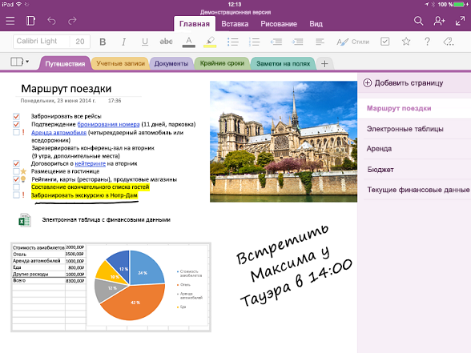

# Обзор API OneNoteOneNote API overview

OneNote — это цифровая записная книжка, с помощью которой клиенты могут записывать и отслеживать свои идеи и заметки для дома, учебы и работы, вводя данные, рисуя или диктуя текст в Интернете, на телефоне, планшете или настольном компьютере.OneNote is a digital notebook that lets customers track ideas and notes for home, school, or work, by typing, sketching, or voice, on the web, phone, tablet, or desktop. Они могут свободно упорядочивать заметки, переключаться между устройствами и продолжать работу с места, на котором они закончили ее в прошлый раз. Кроме того, они могут совместно работать над заметками с другими пользователями в режиме реального времени.They can freely organize notes, switch devices and pick up where they leave off, and collaborate on notes with others in real time.

## Зачем нужна интеграция с OneNote?Why integrate with OneNote?

Интегрируя свои приложения с OneNote, вы можете создавать функциональные интерфейсы на различных платформах, доступных миллионам пользователей по всему миру.By integrating your apps with OneNote, you can create empowering experiences across multiple platforms that reach millions of users worldwide. С помощью Microsoft Graph вы можете получать доступ к записным книжкам, разделам и страницам в OneNote для создания решений, помогающих пользователям планировать и упорядочивать идеи и сведения.You can use Microsoft Graph to access notebooks, sections, and pages in OneNote to create solutions that help your users plan and organize ideas and information.

### Сбор и упорядочение заметок и идейCollect and organize notes and ideas  
OneNote можно использовать как холст, где пользователи будут добавлять и упорядочивать содержимое.Use OneNote as a canvas where users can add and arrange their content. Microsoft Graph упрощает создание приложений, с помощью которых можно делать учебные заметки и проводить исследования, делиться планами и идеями с родными и близкими, а также обмениваться фотографиями покупок.Microsoft Graph makes it easy to write apps that enable students to take notes and do research, families to share plans and ideas, or shoppers to share pictures. Приложение может собирать нужные пользователям сведения, отправлять их в OneNote и помогать упорядочивать их.Your app can grab the information people want, send it to OneNote, and then help them organize it.

### Запись данных во множестве форматовCapture information in many formats
Записывайте HTML-код, внедряйте изображения (с локального компьютера или общедоступного URL-адреса), видео, звуковые файлы, электронные сообщения и другие файлы распространенных типов.Capture HTML, embed images (sourced locally or at a public URL), video, audio, email messages, and other common file types. В OneNote даже могут отображаться веб-страницы и PDF-файлы в виде моментальных снимков.OneNote can even render webpages and PDF files as snapshots. Microsoft Graph поддерживает набор стандартных тегов HTML и CSS для разметки страниц OneNote, позволяющий создавать нужное оформление с помощью таблиц, встроенных рисунков и базового форматирования.Microsoft Graph supports a set of standard HTML and CSS for OneNote page layout, so you can use tables, inline images, and basic formatting to get the look you want. 

### Расширение основных сценариев с помощью экосистемы OneNoteUse the OneNote ecosystem to enhance your core scenarios
Воспользуйтесь широкими возможностями OneNote.Tap into other powerful OneNote features. API OneNote в Microsoft Graph выполняют распознавание текста с изображений, поддерживают полнотекстовый поиск, автоматически синхронизируют клиенты, обрабатывают изображения, а также извлекают записанные визитные карточки, описания продукции и рецепты из Интернета.The OneNote APIs in Microsoft Graph run OCR on images, support full-text search, auto-syncs clients, process images, and extract business card captures and online product and recipe listings. Вы можете использовать OneNote в качестве цифрового хранилища в облаке для заметок и небольших файлов мультимедиа, а также в качестве канала для данных, относящихся к определенным доменам.Use OneNote as your digital memory store in the cloud for notes and lightweight media, or as a data feed for domain-specific data. 

### Доступ для миллионов пользователей OneNote на всех основных платформахReach millions of OneNote users on all major platforms
С помощью OneNote вы можете сделать свое приложение более популярным.Use OneNote to increase your app usage. Приложение OneNote предустановлено на новых устройствах с Windows и доступно на большинстве платформ, в Интернете и в составе Office 365.OneNote is preinstalled on new Windows devices, and is available for most platforms, online, and as part of Office 365. При публикации приложений, использующих многофункциональную среду OneNote, вам открывается доступ к обширному кроссплатформенному рынку.When you publish apps that use the feature-rich OneNote environment, you have access to broad cross-platform market potential.

<!-- Might be good to show a few examples of Microsoft Graph API calls here, similar to what we have in the featured scenarios topic: https://developer.microsoft.com/en-us/graph/docs/concepts/featured_scenarios. You could have an H2 section called "What can I do with OneNote APIs in Microsoft Graph?"-->

## Возможности API OneNote в Microsoft GraphWhat can I do with OneNote APIs in Microsoft Graph?

Ниже приводятся некоторые из наиболее популярных запросов для работы с ресурсами OneNote.The following are some of the most popular requests for working with OneNote resources.

|ОперацияOperation|URL-адресURL|
|:--------|:--|
|Получение записных книжек с помощью запроса GETGET my notebooks|[https://graph.microsoft.com/v1.0/me/onenote/notebooks](https://developer.microsoft.com/en-us/graph/graph-explorer?request=me/onenote/notebooks&version=1.0)|
|Получение разделов с помощью запроса GETGET my sections|[https://graph.microsoft.com/v1.0/me/onenote/sections](https://developer.microsoft.com/en-us/graph/graph-explorer?request=me/onenote/sections&version=1.0)|
|Получение страниц с помощью запроса GETGET my pages|[https://graph.microsoft.com/v1.0/me/onenote/pages](https://developer.microsoft.com/en-us/graph/graph-explorer?request=me/onenote/pages&version=1.0)|

## Узнайте больше об API OneNoteLearn more about OneNote APIs

Подробно изучите API Microsoft Graph, чтобы узнать о возможностях изменения контента в OneNote.Take an in-depth look at Microsoft Graph APIs to learn about the OneNote content updating capabilities. В перечисленных ниже статьях рассказывается, как создавать страницы OneNote и добавлять новый контент на существующие страницы.The topics in the following list show you how to create new OneNote pages and update existing pages with new content. Кроме того, вы узнаете о рекомендациях по использованию Microsoft Graph для изменения записных книжек OneNote.You'll also learn about best practices in using Microsoft Graph to update OneNote notebooks. 

**Работа с OneNote****Work with OneNote**

* [Использование REST API для OneNoteUse the OneNote REST API](../api-reference/v1.0/resources/onenote-api-overview.md)
* [РекомендацииBest practices](onenote_best_practices.md)
* [Рекомендации по использованию фирменной символикиBranding guidelines](onenote-branding.md)
* [Открытие клиента OneNoteOpen the OneNote client](open_onenote_client.md)
* [Использование тегов заметок на страницах OneNoteUse note tags in OneNote pages](onenote-note-tags.md)
* [Коды ошибок для API OneNote в Microsoft GraphError codes for OneNote APIs in Microsoft Graph](onenote_error_codes.md)

**Работа со страницами OneNote****Work with OneNote pages**

* [Входной и выходной HTML-код на страницах OneNoteInput and output HTML in OneNote pages](onenote_input_output_html.md)
* [Получение содержимого и структуры OneNote с помощью Microsoft GraphGet OneNote content and structure with Microsoft Graph](onenote-get-content.md)
* [Создание страниц OneNoteCreate OneNote pages](onenote-create-page.md)
* [Обновление содержимого страницы OneNoteUpdate OneNote page content](onenote_update_page.md)

**Работа с содержимым страницы в OneNote****Work with OneNote page content**

* [Создание элементов с абсолютным положением на страницах OneNoteCreate absolute positioned elements in OneNote pages](onenote-abs-pos.md)
* [Добавление изображений, видео и файлов на страницы OneNoteAdd images, videos, and files to OneNote pages](onenote_images_files.md)
* [Использование тегов div API OneNote для извлечения данных из записанного содержимогоUse OneNote API div tags to extract data from captures](onenote-extract-data.md)

## Изучение API OneNoteExplore the OneNote APIs
Используйте [песочницу Microsoft Graph](https://developer.microsoft.com/ru-RU/graph/graph-explorer), чтобы опробовать API OneNote с собственными записными книжками OneNote.Use the [Microsoft Graph Explorer](https://developer.microsoft.com/ru-RU/graph/graph-explorer) to try out the OneNote APIs with your own OneNote notebooks.

Чтобы отправлять вызовы API OneNote из песочницы Graph, нажмите **Показать другие примеры** в столбце слева.To make OneNote API calls from the Graph Explorer, choose **Show more samples** in the column on the left. **Включите** OneNote с помощью меню.Use the menu to toggle OneNote **On**. Вам также потребуется включить соответствующие разрешения.You will also need to enable the appropriate permissions. В меню слева под именем учетной записи выберите **Изменить разрешения**.Under your account name in the menu on the left, choose **modify permissions**. Дополнительные сведения о разрешениях OneNote см. в разделе [Разрешения для заметок](permissions_reference.md#notes-permissions).For more information about OneNote permissions, see [Notes permissions](permissions_reference.md#notes-permissions).

Сведения о том, как приступить к работе с API OneNote в Microsoft Graph, см. в [справочных материалах по OneNote](../api-reference/v1.0/resources/onenote-api-overview.md).To get started with OneNote APIs in Microsoft Graph, see the [OneNote reference content](../api-reference/v1.0/resources/onenote-api-overview.md).

## См. такжеSee also

- [Разработка для OneNoteOneNote development](https://docs.microsoft.com/ru-RU/previous-versions/office/office-365-api/how-to/onenote-landing)
- [Работа с записными книжками для занятийWork with class notebooks](https://docs.microsoft.com/ru-RU/previous-versions/office/office-365-api/how-to/onenote-classnotebook)
- [Работа со служебными записными книжкамиWork with staff notebooks](https://docs.microsoft.com/ru-RU/previous-versions/office/office-365-api/how-to/onenote-staffnotebook)
- [Подписка на веб-перехватчикиSubscribe to webhooks](https://docs.microsoft.com/ru-RU/previous-versions/office/office-365-api/how-to/onenote-sync)
