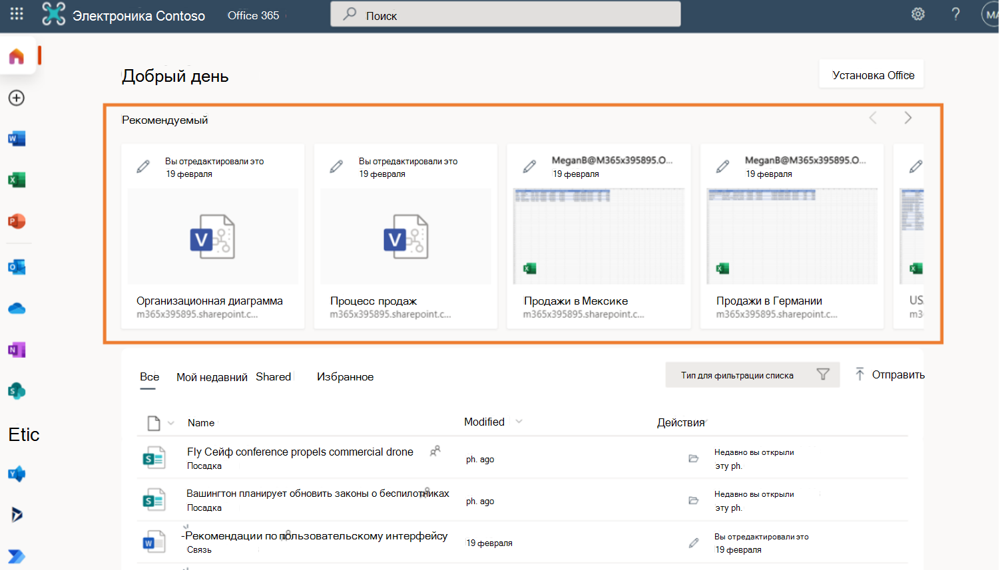
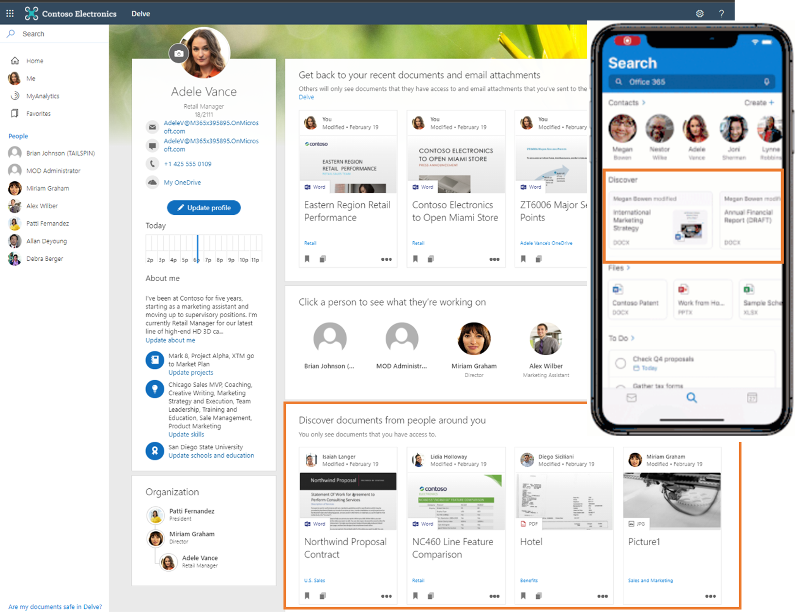
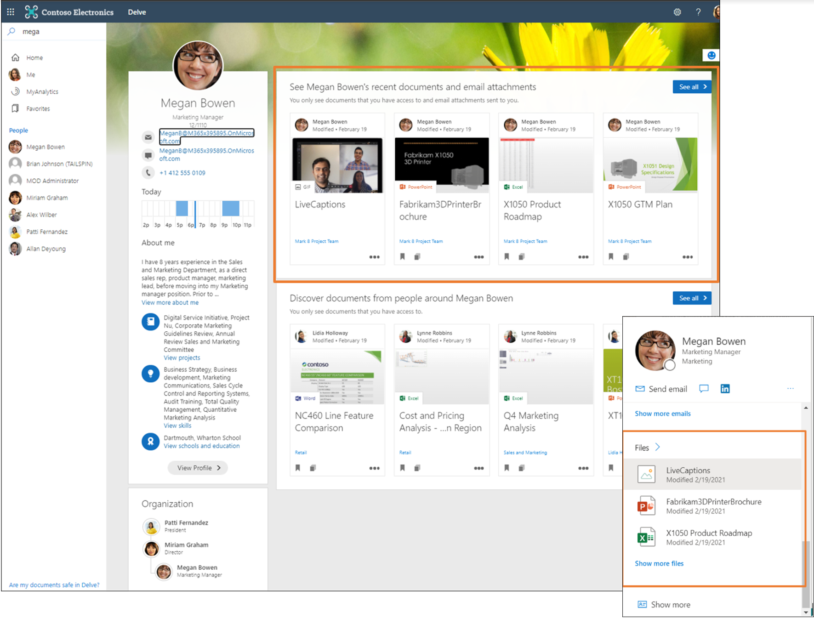
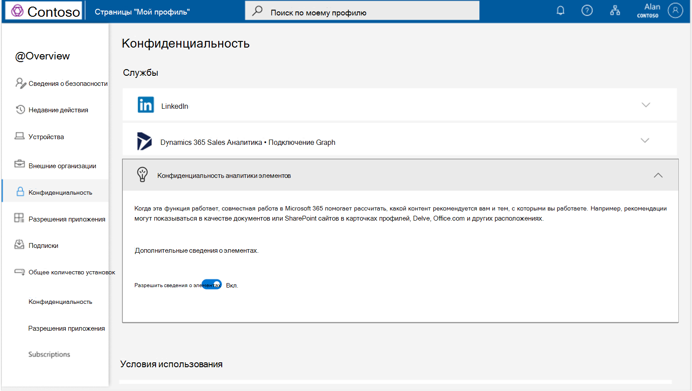
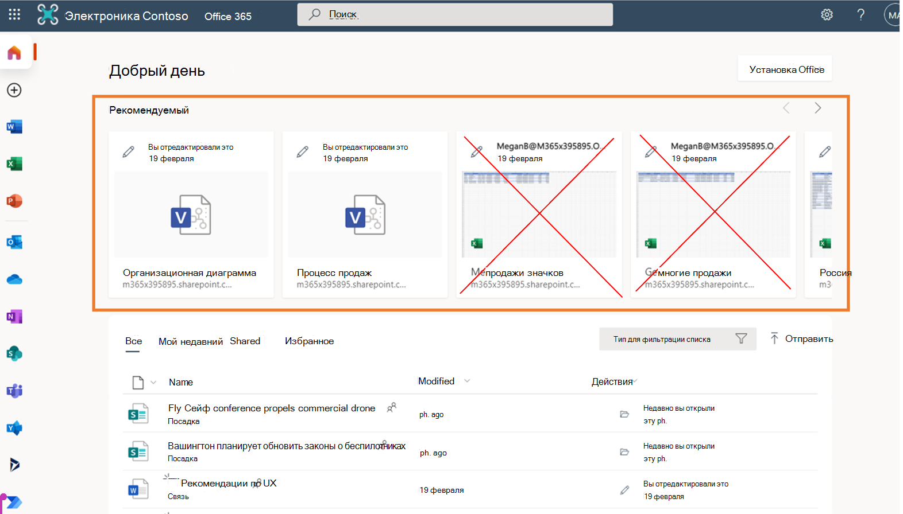
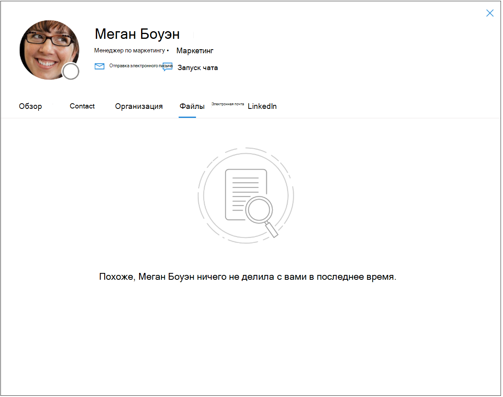
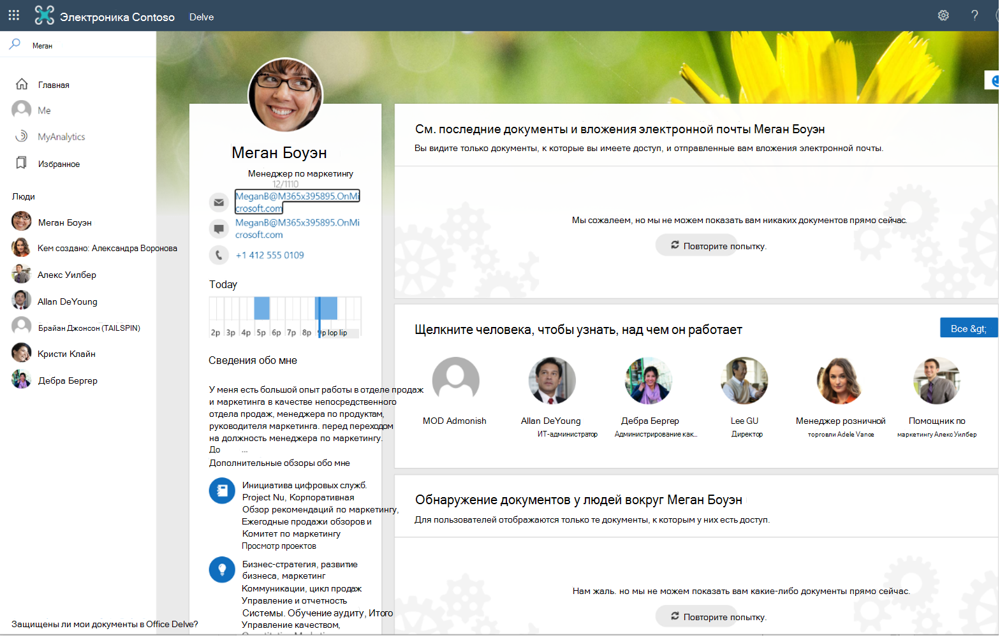

# Обзор аналитики элементов
Аналитика элементов — это ориентированные на пользователя рекомендации для вас и для тех, с кем вы работаете, основанные на вашей совместной работе в Microsoft 365.

## Вычисление аналитики элементов
Microsoft 365 — это всемирное облако для продуктивной работы, многочисленные возможности которого создаются на основе действий, совершаемых вами как пользователем. Взаимодействуя с ресурсами, например с файлами в Microsoft 365, вы создаете сигналы, которые Майкрософт объединяет и собирает в граф для вашей организации. В этом графе данные сигналов представлены как отношения между вами и ресурсами. Исходя из сигналов в графе вычисляется аналитика, лежащая в основе нескольких функций Microsoft 365. Среди примеров таких функций рекомендации по выбору оптимального времени для очередного собрания команды, помощь в сортировке личной и рабочей информации на вашем телефоне, а также множество других интеллектуальных сценариев. 

Что представляет собой взаимодействие с ресурсами Microsoft 365 и каким образом на их основе получается аналитика элементов? Microsoft 365 предоставляет вам множество способов взаимодействия с коллегами: беседы с в чатах или каналах Teams, документы, например списки в SharePoint, отчеты PowerBI в OneDrive для бизнеса, а также сайты SharePoint, Teams и электронная почта Outlook. Корпорация Майкрософт получает аналитику путем анализа действий (например, изменений, добавления комментариев или предоставления общего доступа к элементам) и применяет ее в качестве основы для ориентированных на пользователя функций с рекомендациями для пользователей Microsoft 365, тем самым повышая производительность организации в целом. Аналитика элементов представляет собой тип аналитики, которую корпорация Майкрософт вычисляет с использованием передовых методов машинного обучения и применяет в качестве относящихся к содержимому рекомендаций, адресованных вам и вашим коллегам в организации.

> [!NOTE]
> Эта статья не относится к другим аналитическим функциям в Microsoft 365, таким как Viva Аналитика, надстройка "Аналитика" для Outlook, функция WorkWith, MyAnalytics и информационная панель Insights. 

## Аналитика элементов в Microsoft 365 
На основе аналитики элементов построено несколько файловых функций Microsoft 365.

### Рекомендуемые файлы 
Примером функции на основе аналитики элементов служат файлы из категории **Рекомендуемые** в Office.com. Microsoft Graph собирает сигналы от доступных вам файлов, с которыми осуществляются действия, на основе этих сигналов вычисляет аналитику элементов и применяет ее, рекомендуя вам файлы и давая возможность быстро найти среди них наиболее актуальные для вас. С помощью аналитики элементов вы можете быстро найти наиболее актуальные для вас документы.

### Файлы, которые можно обнаружить 
В разделе **Обзор** Delve или Outlook Mobile вы можете обнаружить потенциально полезное содержимое, к которому у вас есть доступ, но которого вы, возможно, еще не видели. Это документы, актуальность которых для вас вычислена исходя из действий ближайшей к вам сети пользователей в вашей организации. Среди них файлы, хранящиеся в OneDrive для бизнеса и SharePoint Online.  

### Последние файлы в карточных интерфейсах 
В карточных интерфейсах, таких как Delve, карточка профиля в приложениях Microsoft 365 и карточка пользователя в рабочих результатах Bing, аналитика элементов выдвигает на первый план файлы OneDrive, SharePoint или Outlook, которые вы недавно изменили или которыми поделились с пользователем, просматривающим ваш профиль и имеющим доступ к этому содержимому. Такая персонализированная аналитика помогает вашим коллегам экономить время на поиске нужного человека или информации.  

## Корпорация Майкрософт существует благодаря доверию
Корпорация Майкрософт использует только ваши действия в общей рабочей области (такие как предоставление общего доступа, изменение, добавление комментариев) в пределах вашей организации для вычисления рекомендаций для других пользователей. Это означает, что если вы просто взглянули на общий документ или щелкнули по нему, он не будет показан вашим коллегам как рекомендуемый на том основании, что вы его просмотрели. 

Корпорация Майкрософт не использует ваши действия, совершаемые во время работы в персональной области, для расчета рекомендаций остальным пользователям. Это значит, что никто не может получить аналитику, основанную на ваших персональных документах.  

Наконец, ваши коллеги могут видеть только рекомендации, относящиеся к доступному им содержимому. Если Анна работает с Кириллом над составлением документа, Анна и Кирилл получают рекомендации, основанные на их совместной работе. Елена, не имеющая доступа к этому документу, не видит рекомендаций, связанных с этим файлом или с совместной работой Анны и Кирилла. Это правило относится ко всем пользователям организации. В нашем примере сюда входит руководитель и администраторы Елены, которые не будут видеть рекомендаций, основанных на том содержимом, к которому у них нет доступа. 

## Отключение аналитики элементов
Разрешая корпорации Майкрософт вычислять аналитику элементов из сигналов в ваших общих рабочих областях, вы преобразуете действия и содержимое в полезные рекомендации и делаете это знание легко обнаруживаемым и действенным для вас и ваших коллег в организации. Предоставляя это разрешение, вы помогаете повысить эффективность работы всей вашей организации.  

Хотя корпорация Майкрософт никогда не раскрывает ваших персональных документов и использует аналитику, основанную только на том содержимом, к которому у пользователей уже есть доступ, возможны случаи, когда риск обнаружения содержимого нежелательными пользователями перевешивает возможные преимущества. В таких случаях вам следует рассмотреть возможность отключения аналитики элементов. Помните, что отключение аналитики элементов не является мерой безопасности и что всегда необходимо начинать с анализа ваших рабочих шаблонов и обеспечения надлежащей настройки доступа в системе безопасности. Если вы хотите понизить обнаруживаемость вашего содержимого и действий, вы можете отключить аналитику элементов с помощью [переключателя в разделе "Моя учетная запись" под заголовком "Параметры и конфиденциальность"](https://myaccount.microsoft.com/settingsandprivacy/privacy).  

### Отключение или повторное включение аналитики элементов 
По умолчанию аналитика элементов включена. Администраторы управляют этой аналитикой с помощью конкретных параметров. Если администратор отключил для вас аналитику элементов, повторно включить ее вы можете только по согласованию с администратором. 
[Подробнее об имеющихся в распоряжении администратора способах управления аналитикой элементов](insights-customize-item-insights-privacy.md).

Вступление в силу обновленных параметров всех функций Microsoft 365 в организации пользователя может потребовать до 24 часов.

После отключения аналитики элементов происходит следующее. 
* Корпорация Майкрософт перестает использовать ваши сигналы в вычислении рекомендаций для остальных пользователей. Ваши коллеги перестают получать аналитику элементов, основанную на ваших действиях в общих рабочих областях, поэтому снижается информативная насыщенность используемых ими функций на основе аналитики, таких как **Рекомендуемые** файлы в Office.com и Delve.

* Ваши коллеги больше не могут видеть такую аналитику, как последние файлы из OneDrive для бизнеса и SharePoint, которыми вы поделились с ними, в таких интерфейсах как Delve, карточка профиля в Microsoft 365 и результаты Bing. Это содержимое по-прежнему доступно через Поиск (Майкрософт) или другие соответствующие функции, но его труднее обнаружить, и вашим коллегам придется тратить больше времени на его поиск.  

* Функции, показывающие актуальное для вас содержимое, заблокированы для вас и недоступны для других в таких интерфейсах как раздел **Обзор** Delve и Outlook Mobile. Отсутствие аналитики об актуальном для вас содержимом также влияет на релевантность персонализированных результатов Поиска (Майкрософт), поскольку он не может использовать актуальное для вас содержимое в качестве сигналов для определения релевантности.

* Отключение аналитики элементов приведет к прекращению расчета и показа [рекомендуемого времени собраний](https://support.microsoft.com/office/update-your-meeting-hours-using-the-profile-card-0613d113-d7c1-4faa-bb11-c8ba30a78ef1) пользователю в его карточке профиля. 
* Для пользователя, который отключил аналитику элементов, запрос поиска ресурсов по категориям [актуальные](/graph/api/resources/insights-trending) и[используемые](/graph/api/resources/insights-used) в Microsoft Graph API возвращает `HTTP 403 Forbidden`.

## Справочные материалы по API
Ищете справочные материалы по API для этой службы?

- [API аналитики в Microsoft Graph v1.0](/graph/api/resources/officegraphinsights)
- [API аналитики в бета-версии Microsoft Graph](/graph/api/resources/iteminsights?view=graph-rest-beta&preserve-view=true)

## Дальнейшие действия

- Опробуйте API аналитики на собственных файлах в [песочнице Graph](https://developer.microsoft.com/graph/graph-explorer). Выполните вход, разверните узел **Аналитика** в столбце слева и попробуйте примеры запросов.
- Узнайте больше о [настройке конфиденциальности аналитики элементов для пользователей (предварительная версия)](insights-customize-item-insights-privacy.md) и [API параметров аналитики элементов (предварительная версия)](/graph/api/resources/iteminsightssettings?view=graph-rest-beta&preserve-view=true) с поддержкой персонализации.
