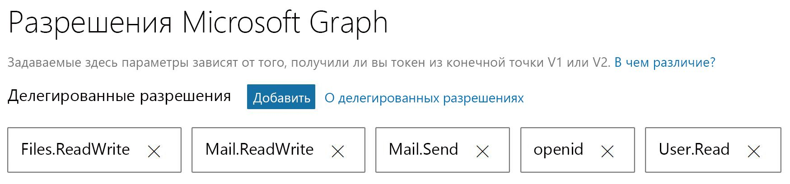

# <a name="get-started-with-microsoft-graph-in-a-java-app"></a><span data-ttu-id="75184-101">Начало работы с Microsoft Graph в приложении Java</span><span class="sxs-lookup"><span data-stu-id="75184-101">Get started with Microsoft Graph in a PHP app</span></span>

<span data-ttu-id="75184-102">В этой статье рассказывается, как отправлять почту через Microsoft Graph из консольного Java-приложения. В качестве примера используется приложение [console-java-connect-sample](https://github.com/microsoftgraph/console-java-connect-sample).</span><span class="sxs-lookup"><span data-stu-id="75184-102">This article uses the [console-java-connect-sample](https://github.com/microsoftgraph/console-java-connect-sample) to walk through sending mail via Microsoft Graph from a Java console application.</span></span> <span data-ttu-id="75184-103">В статье приведен код, который вам следует добавить в свое Java-приложение, чтобы вы могли использовать API Microsoft Graph.</span><span class="sxs-lookup"><span data-stu-id="75184-103">The article shows you the code that you need to add to your Java app so that you can use the Microsoft Graph API.</span></span> <span data-ttu-id="75184-104">Приложение получает доступ к Microsoft Graph, используя [пакет SDK Microsoft Graph для Java](https://github.com/microsoftgraph/msgraph-sdk-java).</span><span class="sxs-lookup"><span data-stu-id="75184-104">The app accesses Microsoft Graph by using the [Microsoft Graph SDK for Java](https://github.com/microsoftgraph/msgraph-sdk-java).</span></span>

## <a name="choose-an-authentication-library"></a><span data-ttu-id="75184-105">Выбор библиотеки аутентификации</span><span class="sxs-lookup"><span data-stu-id="75184-105">Choosing an authentication library</span></span>

<span data-ttu-id="75184-106">В Microsoft Graph применяются стандарты OAuth 2.0 и Open ID Connect, что позволяет выбирать любые библиотеки Java среди большого количества доступных библиотек OAuth 2 с открытым кодом.</span><span class="sxs-lookup"><span data-stu-id="75184-106">Microsoft Graph adopted the OAuth 2.0 and Open ID Connect standards, which lets you choose from many available open source OAuth 2 Java libraries.</span></span> <span data-ttu-id="75184-107">Группа разработчиков Azure AD рекомендует использовать [ScribeJava](https://github.com/scribejava/scribejava). Это простая библиотека OAuth2 для Java.</span><span class="sxs-lookup"><span data-stu-id="75184-107">The Azure AD team recommends using [ScribeJava](https://github.com/scribejava/scribejava), a simple OAuth2 library for Java.</span></span>

<span data-ttu-id="75184-108">В примере показано, как реализовать поток предоставления кода авторизации, который подходит для сценария авторизации клиента, пользователя и конечной точки с поддержкой OAuth 2.</span><span class="sxs-lookup"><span data-stu-id="75184-108">The sample implements the Authorization Code Grant flow which is the right choice for a client authorization scenario, a user, and an OAuth 2-enabled endpoint.</span></span> <span data-ttu-id="75184-109">В Java-приложениях типа "сервер-сервер" в рабочей среде используется поток авторизации по учетным данным клиента.</span><span class="sxs-lookup"><span data-stu-id="75184-109">In production server-to-server Java applications, the Client Credentials authorization flow is used.</span></span> <span data-ttu-id="75184-110">Библиотека **ScribeJava** обрабатывает оба этих потока авторизации.</span><span class="sxs-lookup"><span data-stu-id="75184-110">**ScribeJava** handles both of these authorization flows.</span></span> <span data-ttu-id="75184-111">Чтобы упростить регистрацию, аутентификацию и выполнение этого примера, мы демонстрируем самый простой поток.</span><span class="sxs-lookup"><span data-stu-id="75184-111">To make this sample easy to register, authenticate, and run, we demonstrate the simplest flow.</span></span>

<span data-ttu-id="75184-112">Чтобы ваше приложение могло вызывать Microsoft Graph, оно должно получить маркер доступа из Azure Active Directory (Azure AD).</span><span class="sxs-lookup"><span data-stu-id="75184-112">Before your app can make calls on Microsoft Graph, the app must get an access token from Azure Active Directory (Azure AD).</span></span> <span data-ttu-id="75184-113">Этот маркер должен присутствовать в HTTP-заголовке аутентификации в каждом вызове Microsoft Graph.</span><span class="sxs-lookup"><span data-stu-id="75184-113">This token must be present in an HTTP authentication header with each call to Microsoft Graph.</span></span> <span data-ttu-id="75184-114">**Пакет SDK Microsoft Graph** вставляет заголовок и добавляет маркер в каждый вызов через интерфейс [IAuthenticationProvider](https://github.com/microsoftgraph/msgraph-sdk-java/blob/dev/src/main/java/com/microsoft/graph/authentication/IAuthenticationProvider.java).</span><span class="sxs-lookup"><span data-stu-id="75184-114">The **Microsoft Graph SDK** takes care of inserting the header and adding the token for each call when you implement [IAuthenticationProvider](https://github.com/microsoftgraph/msgraph-sdk-java/blob/dev/src/main/java/com/microsoft/graph/authentication/IAuthenticationProvider.java).</span></span> <span data-ttu-id="75184-115">Библиотека **ScribeJava** выполняет аутентификацию и получает маркер доступа.</span><span class="sxs-lookup"><span data-stu-id="75184-115">**ScribeJava** handles authentication and getting an access token.</span></span> <span data-ttu-id="75184-116">Ваше приложение предоставляет маркер доступа в пакет SDK Microsoft Graph через интерфейс **IAuthenticationProvider**.</span><span class="sxs-lookup"><span data-stu-id="75184-116">Your app provides the access token to the Microsoft Graph SDK via the **IAuthenticationProvider** interface.</span></span>

## <a name="install-and-run-the-sample"></a><span data-ttu-id="75184-117">Установка и запуск примера</span><span class="sxs-lookup"><span data-stu-id="75184-117">Install and run the solution</span></span>

<span data-ttu-id="75184-118">Чтобы установить и настроить пример приложения, выполните инструкции в документе [README](https://github.com/microsoftgraph/console-java-connect-sample/blob/master/README.md) в репозитории **console-java-connect-sample** на веб-сайте GitHub.</span><span class="sxs-lookup"><span data-stu-id="75184-118">To install and configure the sample app, follow the instructions in the [README](https://github.com/microsoftgraph/console-java-connect-sample/blob/master/README.md) document in the **console-java-connect-sample** repository on GitHub.</span></span> <span data-ttu-id="75184-119">C помощью указанной ниже команды клонирования репозитория вы можете клонировать этот пример и пошагово изучить код в удобном для вас интерфейсе IDE Java.</span><span class="sxs-lookup"><span data-stu-id="75184-119">You can clone the sample and walk through the code in your favorite Java IDE by using this command to clone the repository:</span></span>

```
git@github.com:microsoftgraph/console-java-connect-sample.git
```

<span data-ttu-id="75184-120">Когда вы [регистрируете приложение Console Java Connect](https://github.com/microsoftgraph/console-java-connect-sample/blob/master/README.md#register-your-app), назначьте делегированные разрешения примеру.</span><span class="sxs-lookup"><span data-stu-id="75184-120">When you [register the Console Java Connect app](https://github.com/microsoftgraph/console-java-connect-sample/blob/master/README.md#register-your-app), assign delegated scopes (permissions) to the sample.</span></span> <span data-ttu-id="75184-121">Убедитесь, что разрешения соответствуют показанным на рисунке ниже.</span><span class="sxs-lookup"><span data-stu-id="75184-121">Be sure to scopes as shown in the following image:</span></span>



<span data-ttu-id="75184-123">После того как вы зарегистрируете приложение и [настроите пример](https://github.com/microsoftgraph/console-java-connect-sample/blob/master/README.md#configure-your-app) для **идентификатора приложения**, который вы получите при регистрации приложения, вы можете выполнить сборку примера и запустить его.</span><span class="sxs-lookup"><span data-stu-id="75184-123">After you register the application and [configure the sample](https://github.com/microsoftgraph/console-java-connect-sample/blob/master/README.md#configure-your-app) for the **Application Id** you get from the application registration, you can build and run the sample.</span></span>

## <a name="console-java-connect-code"></a><span data-ttu-id="75184-124">Код Console-Java-Connect</span><span class="sxs-lookup"><span data-stu-id="75184-124">Console-Java-Connect code</span></span> 

<span data-ttu-id="75184-125">Прежде чем анализировать логику примера, изучите [структуру примера проекта](#sample-project-structure).</span><span class="sxs-lookup"><span data-stu-id="75184-125">Before you look at the sample logic flow, take a few minutes to learn about the [sample project's structure](#sample-project-structure).</span></span> <span data-ttu-id="75184-126">После этого можете приступать к анализу логики в примере:</span><span class="sxs-lookup"><span data-stu-id="75184-126">When you're ready, lets step through the logic in the sample:</span></span>


   
### <a name="walk-through-the-code"></a><span data-ttu-id="75184-127">Подробный анализ кода</span><span class="sxs-lookup"><span data-stu-id="75184-127">Walk through the code</span></span>
<span data-ttu-id="75184-128">Мы рассмотрим код примера бегло, а затем углубимся в подробности создания и отправки электронного письма.</span><span class="sxs-lookup"><span data-stu-id="75184-128">We'll look at the sample code at a high level and then dive into the details of creating an email message and sending it.</span></span>

#### <a name="the-user-experience"></a><span data-ttu-id="75184-129">Взаимодействие с пользователем</span><span class="sxs-lookup"><span data-stu-id="75184-129">The user experience</span></span>

<span data-ttu-id="75184-130">В этом разделе рассмотрена логика, которая запускает приложение и затем отображает пример выходных данных для пользователя.</span><span class="sxs-lookup"><span data-stu-id="75184-130">This section takes a look at the logic that starts up the application and then shows you the sample output that the user sees when they run the sample.</span></span>

<span data-ttu-id="75184-131">Метод [PublicClient](https://github.com/microsoftgraph/console-java-connect-sample/blob/master/src/main/java/com/microsoft/graphsample/PublicClient.java) **main** static создает экземпляр объекта **PublicClient** и запускает процесс входа в систему и аутентификации.</span><span class="sxs-lookup"><span data-stu-id="75184-131">The [PublicClient](https://github.com/microsoftgraph/console-java-connect-sample/blob/master/src/main/java/com/microsoft/graphsample/PublicClient.java) **main** static method creates an instance of **PublicClient** and then kicks off the sign in and authentication process.</span></span>  

<span data-ttu-id="75184-132">[AuthenticationManager](https://github.com/microsoftgraph/console-java-connect-sample/blob/master/src/main/java/com/microsoft/graphsample/connect/AuthenticationManager) предоставляет отдельный экземпляр, который используется для подключения пользователя к Microsoft Graph.</span><span class="sxs-lookup"><span data-stu-id="75184-132">[AuthenticationManager](https://github.com/microsoftgraph/console-java-connect-sample/blob/master/src/main/java/com/microsoft/graphsample/connect/AuthenticationManager) provides a singleton instance which is used to connect the user to Microsoft Graph.</span></span> <span data-ttu-id="75184-133">**AuthenticationManager** предоставляет **маркер доступа** в качестве строкового свойства.</span><span class="sxs-lookup"><span data-stu-id="75184-133">**AuthenticationManager** exposes an **access token** as a string property.</span></span> <span data-ttu-id="75184-134">**Azure AD** возвращает маркер доступа, когда пользователь проходит аутентификацию, и предоставляет примеру разрешение на доступ к запрошенным ресурсам Microsoft Graph.</span><span class="sxs-lookup"><span data-stu-id="75184-134">The access token is returned by **Azure AD** when the user is authenticated and gives the sample permission to access requested Microsoft Graph resources.</span></span> 

<span data-ttu-id="75184-135">Метод **PublicClient.startSendMail** выполняет указанные ниже действия.</span><span class="sxs-lookup"><span data-stu-id="75184-135">The **PublicClient.startSendMail** method performs the following steps:</span></span>

- <span data-ttu-id="75184-136">Создает экземпляр класса [GraphSendMail](https://github.com/microsoftgraph/console-java-connect-sample/blob/master/src/main/java/com/microsoft/graphsample/msgraph/GraphSendMail.java).</span><span class="sxs-lookup"><span data-stu-id="75184-136">Creates a new instance of the  [InputComponentSubmission](https://github.com/microsoftgraph/console-java-connect-sample/blob/master/src/main/java/com/microsoft/graphsample/msgraph/GraphSendMail.java) class.</span></span> 
- <span data-ttu-id="75184-137">Вызывает метод **GraphSendMail.getMeUser()**, чтобы возвратить профиль текущего пользователя в **Azure AD**. Благодаря этому объект консоли может персонализировать отображаемые запросы.</span><span class="sxs-lookup"><span data-stu-id="75184-137">Calls **GraphSendMail.getMeUser()** to return the **Azure AD** profile of the current user so that the sample console object can personalize the prompts that it displays to the user.</span></span> 
- <span data-ttu-id="75184-138">В консоли отображается следующее сообщение:</span><span class="sxs-lookup"><span data-stu-id="75184-138">The console displays:</span></span>

   `Hello, Laura Steele. Would you like to send an email to yourself or someone else?`

   `Enter the address to which you'd like to send a message. If you enter nothing, the message will go to your address`

- <span data-ttu-id="75184-139">Вызывает метод **GraphSendMail.sendMail**, который принимает вводимые пользователем данные.</span><span class="sxs-lookup"><span data-stu-id="75184-139">Calls the **GraphSendMail.sendMail** method which takes the user's input.</span></span> <span data-ttu-id="75184-140">Если указан электронный адрес, метод **sendMail** отправляет сообщение по этому адресу.</span><span class="sxs-lookup"><span data-stu-id="75184-140">If an email address is provided, **sendMail** sends a message to that address.</span></span> <span data-ttu-id="75184-141">В противном случае сообщение отправляется текущему пользователю.</span><span class="sxs-lookup"><span data-stu-id="75184-141">Otherwise, the message is sent to the current user.</span></span> 

- <span data-ttu-id="75184-142">Спрашивает у пользователя, что нужно сделать: отправить еще одно электронное сообщение или выйти из приложения консоли.</span><span class="sxs-lookup"><span data-stu-id="75184-142">Prompts the user to send another email or quit the console app.</span></span>

   `Email sent!`

   `Want to send another message? Type 'y' for yes and any other key to exit.`

#### <a name="the-send-mail-logic"></a><span data-ttu-id="75184-143">Логика отправки почты</span><span class="sxs-lookup"><span data-stu-id="75184-143">The send mail logic</span></span>

<span data-ttu-id="75184-144">Логика отправки почты выполняет указанные ниже действия.</span><span class="sxs-lookup"><span data-stu-id="75184-144">The mail sending logic takes the following steps:</span></span>


1. <span data-ttu-id="75184-145">**Получение аватара**:</span><span class="sxs-lookup"><span data-stu-id="75184-145">**Get profile picture**:</span></span><br/> <span data-ttu-id="75184-146">Вызывает метод **GraphServiceController.getUserProfilePicture()**, чтобы получить массив байтов, представляющих аватар вошедшего пользователя **Azure AD**.</span><span class="sxs-lookup"><span data-stu-id="75184-146">Calls **GraphServiceController.getUserProfilePicture()** to get an array of bytes representing the profile picture of the **Azure AD** user who signed into the sample.</span></span>

   <span data-ttu-id="75184-147">**Вызов API**</span><span class="sxs-lookup"><span data-stu-id="75184-147">**The API call**</span></span>

```java
            photoStream = mGraphServiceClient
                    .me()
                    .photo()
                    .content()
                    .buildRequest()
                    .get();

```
2. <span data-ttu-id="75184-148">**Отправка изображения в OneDrive**:</span><span class="sxs-lookup"><span data-stu-id="75184-148">**Upload picture to OneDrive**:</span></span>
<br/><span data-ttu-id="75184-149">Вызывает метод **GraphServiceController.uploadPictureToOneDrive(bytes)**, чтобы разместить аватар в корневой папке OneDrive пользователя.</span><span class="sxs-lookup"><span data-stu-id="75184-149">Calls **GraphServiceController.uploadPictureToOneDrive(bytes)** to POST the profile picture in the user's OneDrive root folder.</span></span> <span data-ttu-id="75184-150">Система возвращает объект **DriveItem** из пакета SDK Microsoft Graph.</span><span class="sxs-lookup"><span data-stu-id="75184-150">A Microsoft Graph SDK **DriveItem** object is returned.</span></span> 

   <span data-ttu-id="75184-151">**Вызов API**</span><span class="sxs-lookup"><span data-stu-id="75184-151">**The API call**</span></span>
```java
            driveItem = mGraphServiceClient
                    .me()
                    .drive()
                    .root()
                    .itemWithPath("me2.png")
                    .content()
                    .buildRequest()
                    .put(picture);

```
3. <span data-ttu-id="75184-152">**Получение ссылки для общего доступа к изображению в OneDrive**:</span><span class="sxs-lookup"><span data-stu-id="75184-152">**Get the OneDrive sharing link for the picture**:</span></span><br/><span data-ttu-id="75184-153">Вызывает метод **GraphServiceController.getPermissionSharingLink**, чтобы создать ссылку для общего доступа.</span><span class="sxs-lookup"><span data-stu-id="75184-153">Calls **GraphServiceController.getPermissionSharingLink** to create a new sharing link.</span></span> <span data-ttu-id="75184-154">Система возвращает объект **Permission** из пакета SDK Microsoft Graph.</span><span class="sxs-lookup"><span data-stu-id="75184-154">A Microsoft Graph SDK **Permission** object is returned.</span></span>

   <span data-ttu-id="75184-155">**Вызов API**</span><span class="sxs-lookup"><span data-stu-id="75184-155">**The API call**</span></span>
```java
            permission = mGraphServiceClient
                    .me()
                    .drive()
                    .items(id)
                    .createLink("view", "organization")
                    .buildRequest()
                    .post();

```
4. <span data-ttu-id="75184-156">**Заменяет содержимое тега привязки шаблона HTML** ссылкой для общего доступа (**webUrl**), полученной на предыдущем шаге.</span><span class="sxs-lookup"><span data-stu-id="75184-156">**Replace the contents of the HTML template anchor tag** with the **webUrl** for the sharing link in the previous step.</span></span> 
> <span data-ttu-id="75184-157">**Примечание.** Тело сообщения, оправленного приложением, создается на основе шаблона HTML, хранящегося в статической строке [Constants.java](https://github.com/microsoftgraph/console-java-connect-sample/blob/master/src/main/java/com/microsoft/graphsample/connect/Constants.java).</span><span class="sxs-lookup"><span data-stu-id="75184-157">**Note:** The body of the message sent by the application originates as an HTML template stored in [Constants.java](https://github.com/microsoftgraph/console-java-connect-sample/blob/master/src/main/java/com/microsoft/graphsample/connect/Constants.java) as a static string.</span></span> <span data-ttu-id="75184-158">При отправке тело сообщения содержит общедоступную гиперссылку для общего доступа к изображению, которое пример отправляет в корневую папку OneDrive пользователя.</span><span class="sxs-lookup"><span data-stu-id="75184-158">When sent, the body of the message contains a public sharing hyperlink to a picture that the sample uploads to the user's OneDrive root folder.</span></span> 
5. <span data-ttu-id="75184-159">**Создание черновика сообщения**:</span><span class="sxs-lookup"><span data-stu-id="75184-159">**Create** a draft of a new message.</span></span> <br/><span data-ttu-id="75184-160">Вызывает метод **GraphServiceController.createDraftMail**, передавая в него электронный адрес получателя, тему и обновленный шаблон HTML.</span><span class="sxs-lookup"><span data-stu-id="75184-160">Calls **GraphServiceController.createDraftMail**, passing the recipient email address, subject text, and the updated HTML template.</span></span> <span data-ttu-id="75184-161">В папке черновиков сообщений пользователя создается черновик сообщения.</span><span class="sxs-lookup"><span data-stu-id="75184-161">A draft message is created and POSTed to the user's draft message folder.</span></span>

   <span data-ttu-id="75184-162">**Вызов API**</span><span class="sxs-lookup"><span data-stu-id="75184-162">**The API call**</span></span>
```java
            message = mGraphServiceClient
                    .me()
                    .messages()
                    .buildRequest()
                    .post(message);

```
6. <span data-ttu-id="75184-163">**Прикрепление изображения к черновику сообщения**:</span><span class="sxs-lookup"><span data-stu-id="75184-163">**Attach picture to draft message**:</span></span> <br/><span data-ttu-id="75184-164">Вызывает метод **GraphServiceController.addPictureToDraftMessage**, чтобы получить черновик сообщения, и добавляет изображение в сообщение в виде вложения объекта.</span><span class="sxs-lookup"><span data-stu-id="75184-164">Calls **GraphServiceController.addPictureToDraftMessage** to get the draft message and add the picture to the message as an object attachment.</span></span>

   <span data-ttu-id="75184-165">**Вызов API**</span><span class="sxs-lookup"><span data-stu-id="75184-165">**The API call**</span></span>
```java
            FileAttachment fileAttachment = new FileAttachment();
            fileAttachment.oDataType = "#microsoft.graph.fileAttachment";
            fileAttachment.contentBytes = attachementBytes;
            fileAttachment.name = "me.png";
            fileAttachment.size = attachementBytes.length;
            fileAttachment.isInline = false;
            fileAttachment.id = "my profile picture";

            attachment = mGraphServiceClient
                    .me()
                    .messages(messageId)
                    .attachments()
                    .buildRequest()
                    .post(fileAttachment);

```
7. <span data-ttu-id="75184-166">**Отправка черновика сообщения**:</span><span class="sxs-lookup"><span data-stu-id="75184-166">**Send the draft message**:</span></span><br/><span data-ttu-id="75184-167">Вызывает метод **GraphServiceController.sendDraftMessage**, чтобы отправить обновленный черновик сообщения указанному получателю.</span><span class="sxs-lookup"><span data-stu-id="75184-167">Calls **GraphServiceController.sendDraftMessage** to send the updated draft message to the intended user.</span></span>

   <span data-ttu-id="75184-168">**Вызов API**</span><span class="sxs-lookup"><span data-stu-id="75184-168">**The API call**</span></span>
```java
            mGraphServiceClient
                    .me()
                    .mailFolders("Drafts")
                    .messages(messageId)
                    .send()
                    .buildRequest()
                    .post();

```


### <a name="sample-project-structure"></a><span data-ttu-id="75184-169">Структура примера проекта</span><span class="sxs-lookup"><span data-stu-id="75184-169">Sample project structure</span></span>

### <a name="connect-package"></a><span data-ttu-id="75184-170">Пакет connect</span><span class="sxs-lookup"><span data-stu-id="75184-170">connect package</span></span>
<span data-ttu-id="75184-171">Этот пакет содержит логику потока аутентификации OAuth2 и конфигурацию, которую вы измените.</span><span class="sxs-lookup"><span data-stu-id="75184-171">This package contains the OAuth2 authentication flow logic and the configuration that you'll be updating.</span></span>

- <span data-ttu-id="75184-172">[AuthenticationManager.java](https://github.com/microsoftgraph/console-java-connect-sample/blob/master/src/main/java/com/microsoft/graphsample/connect/AuthenticationManager.java): этот класс импортирует объекты **ScribeJava**, используемые для потока предоставления кода авторизации.</span><span class="sxs-lookup"><span data-stu-id="75184-172">[AuthenticationManager.java](https://github.com/microsoftgraph/console-java-connect-sample/blob/master/src/main/java/com/microsoft/graphsample/connect/AuthenticationManager.java):  This class imports the  **ScribeJava** objects used for the Authorization Code Grant flow.</span></span>
- <span data-ttu-id="75184-173">[Constants.java](https://github.com/microsoftgraph/console-java-connect-sample/blob/master/src/main/java/com/microsoft/graphsample/connect/Constants.java): содержит строки public static для указания значений, связанных с регистрацией приложений, и шаблон электронного письма, которое отправляет приложение.</span><span class="sxs-lookup"><span data-stu-id="75184-173">[Constants.java](https://github.com/microsoftgraph/console-java-connect-sample/blob/master/src/main/java/com/microsoft/graphsample/connect/Constants.java): Holds public static strings for providing app registration related values and the template for the email message that the application sends.</span></span>
- <span data-ttu-id="75184-174">[Debug.java](https://github.com/microsoftgraph/console-java-connect-sample/blob/master/src/main/java/com/microsoft/graphsample/connect/Debug.java): общедоступный флаг уровня отладки.</span><span class="sxs-lookup"><span data-stu-id="75184-174">[Debug.java](https://github.com/microsoftgraph/console-java-connect-sample/blob/master/src/main/java/com/microsoft/graphsample/connect/Debug.java): Public debug level flag.</span></span> <span data-ttu-id="75184-175">Задайте значение, чтобы изменить режим ведения журнала приложения.</span><span class="sxs-lookup"><span data-stu-id="75184-175">Set it's value to change the logging behavior of the sample app.</span></span>
- <span data-ttu-id="75184-176">[DebugLogger.java](https://github.com/microsoftgraph/console-java-connect-sample/blob/master/src/main/java/com/microsoft/graphsample/connect/DebugLogger.java): служебная программа ведения журнала, которая записывает информацию в консоль согласно заданному уровню отладки.</span><span class="sxs-lookup"><span data-stu-id="75184-176">[DebugLogger.java](https://github.com/microsoftgraph/console-java-connect-sample/blob/master/src/main/java/com/microsoft/graphsample/connect/DebugLogger.java): Logging utility that writes information to the console according to the debug level set.</span></span>
- <span data-ttu-id="75184-177">[IConnectCallback](https://github.com/microsoftgraph/console-java-connect-sample/blob/master/src/main/java/com/microsoft/graphsample/connect/IConnectCallback.java): определяет метод обратного вызова, который следует использовать, если вы вызываете асинхронную перегрузку метода **ScribeJava.getAccessToken**.</span><span class="sxs-lookup"><span data-stu-id="75184-177">[IConnectCallback](https://github.com/microsoftgraph/console-java-connect-sample/blob/master/src/main/java/com/microsoft/graphsample/connect/IConnectCallback.java): Defines the callback method that you'd use if you call the asynchronous overload of the **ScribeJava.getAccessToken** method.</span></span>
- <span data-ttu-id="75184-178">[SendMailException](https://github.com/microsoftgraph/console-java-connect-sample/blob/master/src/main/java/com/microsoft/graphsample/msgraph/SendMailException.java): класс, производный от класса **Exception**, который инкапсулирует информацию об исключении Microsoft Graph.</span><span class="sxs-lookup"><span data-stu-id="75184-178">[SendMailException](https://github.com/microsoftgraph/console-java-connect-sample/blob/master/src/main/java/com/microsoft/graphsample/msgraph/SendMailException.java): A class that is derived from **Exception** and encapsulates Microsoft Graph-specific exception information.</span></span> <span data-ttu-id="75184-179">Классы в пакете **GraphSendMail** могут создавать исключения этого типа.</span><span class="sxs-lookup"><span data-stu-id="75184-179">Classes in the **GraphSendMail** package can throw this type of exception.</span></span>

### <a name="msgraph-package"></a><span data-ttu-id="75184-180">Пакет msgraph</span><span class="sxs-lookup"><span data-stu-id="75184-180">msgraph package</span></span>

<span data-ttu-id="75184-181">Этот пакет содержит всю логику, которая вызывает Microsoft Graph.</span><span class="sxs-lookup"><span data-stu-id="75184-181">This package contains all of the logic that makes calls on Microsoft Graph.</span></span>

- <span data-ttu-id="75184-182">[GraphSendMail](https://github.com/microsoftgraph/console-java-connect-sample/blob/master/src/main/java/com/microsoft/graphsample/msgraph/GraphSendMail.java): последовательно соединяет вызовы в объект **GraphServiceController** (пример вспомогательного класса API Microsoft Graph) для создания и отправки сообщения с вложенным изображением.</span><span class="sxs-lookup"><span data-stu-id="75184-182">[GraphSendMail](https://github.com/microsoftgraph/console-java-connect-sample/blob/master/src/main/java/com/microsoft/graphsample/msgraph/GraphSendMail.java): Chains together calls into **GraphServiceController** (a Microsoft Graph API sample helper class) to create and send an email message with a picture attachment.</span></span>
- <span data-ttu-id="75184-183">[GraphServiceClientManager.java](https://github.com/microsoftgraph/console-java-connect-sample/blob/master/src/main/java/com/microsoft/graphsample/msgraph/GraphServiceClientManager.java): создает экземпляр [GraphServiceClient](https://github.com/microsoftgraph/msgraph-sdk-java/blob/dev/src/main/java/com/microsoft/graph/requests/extensions/GraphServiceClient.java) в пакете SDK Microsoft Graph и добавляет маркер доступа во все исходящие вызовы API в конечной точке Microsoft Graph.</span><span class="sxs-lookup"><span data-stu-id="75184-183">[GraphServiceClientManager.java](https://github.com/microsoftgraph/console-java-connect-sample/blob/master/src/main/java/com/microsoft/graphsample/msgraph/GraphServiceClientManager.java): Instantiates the Microsoft Graph SDK [GraphServiceClient](https://github.com/microsoftgraph/msgraph-sdk-java/blob/dev/src/main/java/com/microsoft/graph/requests/extensions/GraphServiceClient.java) and adds an access token to all outgoing API calls on the Microsoft Graph endpoint.</span></span>

- <span data-ttu-id="75184-184">[GraphServiceController.java](https://github.com/microsoftgraph/console-java-connect-sample/blob/master/src/main/java/com/microsoft/graphsample/msgraph/GraphServiceController.java): использует пакет SDK Microsoft Graph для всех вызовов **GraphServiceClient**.</span><span class="sxs-lookup"><span data-stu-id="75184-184">[GraphServiceController.java](https://github.com/microsoftgraph/console-java-connect-sample/blob/master/src/main/java/com/microsoft/graphsample/msgraph/GraphServiceController.java): Uses the Microsoft Graph SDK to make all of the calls on the **GraphServiceClient**.</span></span> <span data-ttu-id="75184-185">Ниже перечислены такие вызовы.</span><span class="sxs-lookup"><span data-stu-id="75184-185">Calls include:</span></span>

   - <span data-ttu-id="75184-186">**createDraftMail**: создает черновик сообщения и сохраняет его в вашей папке черновиков.</span><span class="sxs-lookup"><span data-stu-id="75184-186">**createDraftMail**: creates a draft email message and saves it in your draft messages folder.</span></span>
   - <span data-ttu-id="75184-187">**sendNewMessageAsync**: создает и отправляет электронное сообщение.</span><span class="sxs-lookup"><span data-stu-id="75184-187">**sendNewMessageAsync**: Creates and sends an email message.</span></span>
   - <span data-ttu-id="75184-188">**addPictureToDraftMessage**: публикует вложенный файл в черновике сообщения по идентификатору сообщения.</span><span class="sxs-lookup"><span data-stu-id="75184-188">**addPictureToDraftMessage**: Posts a file attachment in a draft message by message Id</span></span>
   - <span data-ttu-id="75184-189">**addAttachmentToDraftAsync**: добавляет вложение в черновик сообщения.</span><span class="sxs-lookup"><span data-stu-id="75184-189">**addAttachmentToDraftAsync**: Adds an attachment to a draft message.</span></span>
   - <span data-ttu-id="75184-190">**sendDraftMessage**: отправляет сообщение из папки "Черновики".</span><span class="sxs-lookup"><span data-stu-id="75184-190">**sendDraftMessage**: Sends a message from the drafts folder.</span></span>
   - <span data-ttu-id="75184-191">**getDraftMessage**: получает сообщение из коллекции сообщений пользователя по идентификатору сообщения.</span><span class="sxs-lookup"><span data-stu-id="75184-191">**getDraftMessage**: Gets a message from the user' message collection by message id.</span></span>
   - <span data-ttu-id="75184-192">**getUser**: получает локального пользователя, который прошел аутентификацию в конечной точке API Microsoft Graph.</span><span class="sxs-lookup"><span data-stu-id="75184-192">**getUser**: Gets the local user who is authenticated with the Microsoft Graph API endpoint.</span></span>
   - <span data-ttu-id="75184-193">**getUserProfilePicture**: получает аватар вошедшего пользователя из Microsoft Graph.</span><span class="sxs-lookup"><span data-stu-id="75184-193">**getUserProfilePicture**: Gets the signed in user's profile picture from the Microsoft Graph.</span></span>
   - <span data-ttu-id="75184-194">**uploadPictureToOneDrive**: отправляет изображение в виде массива байтов в корневую папку OneDrive пользователя.</span><span class="sxs-lookup"><span data-stu-id="75184-194">**uploadPictureToOneDrive**: Uploads a picture as byte array to the user's OneDrive root folder.</span></span>
   - <span data-ttu-id="75184-195">**getPermissionSharingLink**: отправляет в OneDrive запрос на создание общедоступной ссылки для общего доступа к изображению, хранящемуся в OneDrive.</span><span class="sxs-lookup"><span data-stu-id="75184-195">**getPermissionSharingLink**: Requests OneDrive to create a public sharing link to a picture stored in OneDrive.</span></span>

## <a name="other-microsoft-graph-samples"></a><span data-ttu-id="75184-196">Другие примеры кода для Microsoft Graph</span><span class="sxs-lookup"><span data-stu-id="75184-196">Other Microsoft Graph Snippets samples</span></span>

<span data-ttu-id="75184-197">Если вы хотите увидеть какой-то конкретный пример, сообщите нам об этом, [отправив сообщение о проблеме](https://github.com/microsoftgraph/console-java-connect-sample/issues).</span><span class="sxs-lookup"><span data-stu-id="75184-197">If there's a particular sample you'd like to see, please let us know by [submitting an issue](https://github.com/microsoftgraph/console-java-connect-sample/issues).</span></span> <span data-ttu-id="75184-198">Мы будем рады узнать, какие сценарии Microsoft Graph вы хотели бы реализовать на Java!</span><span class="sxs-lookup"><span data-stu-id="75184-198">We're very interested in your feedback on any Microsoft Graph scenario you'd like to build in Python!</span></span>

<span data-ttu-id="75184-199">API Microsoft Graph — очень мощный API, с помощью которого можно взаимодействовать со всеми данными Майкрософт.</span><span class="sxs-lookup"><span data-stu-id="75184-199">The Microsoft Graph API is a very powerful, unifiying API that can be used to interact with all kinds of Microsoft data.</span></span> <span data-ttu-id="75184-200">Чтобы узнать больше о возможностях Microsoft Graph, ознакомьтесь с [документацией для разработчиков](https://developer.microsoft.com/ru-RU/graph/docs/concepts/overview) или опробуйте [песочницу Graph](https://developer.microsoft.com/ru-RU/graph/graph-explorer).</span><span class="sxs-lookup"><span data-stu-id="75184-200">Check out the [developer documentation](https://developer.microsoft.com/ru-RU/graph/docs/concepts/overview) or the [Graph Explorer](https://developer.microsoft.com/ru-RU/graph/graph-explorer) to explore what else you can accomplish with Microsoft Graph.</span></span>
