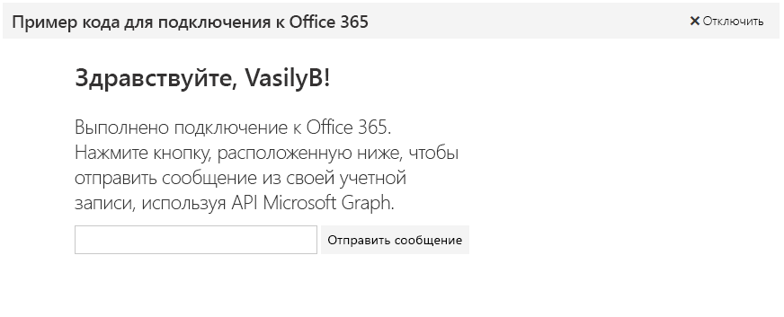

# Начало работы с Microsoft Graph в приложении Node.jsGet started with Microsoft Graph in a Node.js app

В этой статье описываются задачи, которые необходимо выполнить, чтобы получить маркер доступа из конечной точки Azure AD версии 2.0 и вызвать Microsoft Graph.This article describes the tasks required to get an access token from the v2.0 authentication endpoint and call  Microsoft Graph. В ней рассмотрен [пример кода для подключения приложения Node.js от корпорации Майкрософт](https://github.com/microsoftgraph/nodejs-connect-rest-sample) и объясняются основные понятия, которые необходимо реализовать для использования Microsoft Graph.It walks you through building the [Connect Sample for PHP](https://github.com/microsoftgraph/nodejs-connect-rest-sample) and explains the main concepts that you implement to use Microsoft Graph. В этой статье рассказывается, как получить доступ к API Microsoft Graph с помощью необработанных вызовов REST.The article describes how to access Microsoft Graph by using direct REST calls. Если вы хотите создать приложение Node.js, которое подключается к Microsoft Graph с помощью пакета SDK для JavaScript, ознакомьтесь с [примером кода подключения на базе пакета SDK Microsoft Graph для Node.js](https://github.com/microsoftgraph/nodejs-connect-sample).If you're interested in building a Node.js app that connects to Microsoft Graph with the JavaScript SDK, see our [Microsoft Graph SDK-based Node.js Connect sample](https://github.com/microsoftgraph/nodejs-connect-sample).

На приведенном ниже изображении показано создаваемое приложение.The following image shows is the app you'll create. 

**Не хотите создавать приложение?** С помощью [краткого руководства по Microsoft Graph](https://graph.microsoft.io/ru-RU/getting-started) вы сможете быстро приступить к работе.**Don't feel like building an app?** Use the [Microsoft Graph quick start](https://graph.microsoft.io/ru-RU/getting-started) to get up and running fast.

Скачать вариант этого примера, использующий конечную точку Azure AD, можно на странице [приложения Microsoft Graph Connect для Node.js](https://github.com/microsoftgraph/nodejs-connect-rest-sample/releases/tag/last_v1_auth).To download a version of the Connect sample that uses the Azure AD endpoint, see [Microsoft Graph Connect Sample for Node.js](https://github.com/microsoftgraph/nodejs-connect-rest-sample/releases/tag/last_v1_auth).

## Необходимые условияPrerequisites

Чтобы приступить к работе, вам понадобится следующее:To get started, you'll need: 

- [Учетная запись Майкрософт](https://www.outlook.com/) либо [рабочая или учебная учетная запись](http://dev.office.com/devprogram).A [Microsoft account](https://www.outlook.com/) or a [work or school account](http://dev.office.com/devprogram)
- [Node.js с npmNode.js with npm](https://nodejs.org/en/download/) 
- [Пример подключения для Node.js от корпорации Майкрософт](https://github.com/microsoftgraph/nodejs-connect-rest-sample).The [Microsoft Connect sample for Node.js](https://github.com/microsoftgraph/nodejs-connect-rest-sample). Вы будете использовать папку **starter-project** в примерах файлов для этого пошагового руководства.The Microsoft Connect Sample for AngularJS. You'll use the **starter-project** folder in the sample files for this walkthrough.

## Регистрация приложенияRegister the application
Зарегистрируйте приложение на портале регистрации приложений (Майкрософт). При этом будут созданы идентификатор и пароль приложения, которые понадобятся при его настройке в Visual Studio.Register an app on the Microsoft App Registration Portal. This generates the app ID and password that you'll use to configure the app in Visual Studio.

1. Войдите на [портал регистрации приложений Майкрософт](https://apps.dev.microsoft.com/) с помощью личной, рабочей или учебной учетной записи.Sign into the [Microsoft App Registration Portal](https://apps.dev.microsoft.com/) using either your personal or work or school account.

2. Нажмите кнопку **Добавить приложение**.Choose **Add an app**.

3. Введите имя приложения и нажмите кнопку **Создать приложение**.Enter a name for the app, and choose **Create application**. 
    
    Откроется страница регистрации со свойствами приложения.The registration page displays, listing the properties of your app.

4. Скопируйте идентификатор приложения. Это уникальный идентификатор приложения.Copy the application ID. This is the unique identifier for your app. 

5. В разделе **Секреты приложения** нажмите кнопку **Создать новый пароль**. Скопируйте пароль из диалогового окна **Новый пароль создан**.Under **Application Secrets**, choose **Generate New Password**. Copy the password from the **New password generated** dialog.

    Идентификатор и пароль (секрет) приложения используются для его настройки.You'll use the application ID and application password (secret) to configure the app. 

6. В разделе **Платформы** выберите **Добавление платформы** > **Веб**.Under **Platforms**, choose **Add platform** > **Web**.

7. Введите URI перенаправления *http://localhost:3000/token*.Enter *http://localhost:3000/token* as the Redirect URI. 

8. Нажмите **Сохранить**.Choose **Save**.

## Настройка проектаConfigure the project
1. Откройте папку **starter-project** с файлами примера.Open the **starter-project** folder in the sample files.

1. Откройте командную строку и выполните приведенную ниже команду в корневом каталоге начального проекта. При этом устанавливаются зависимости проекта.In a command prompt, run the following command in the root directory of the starter project. This installs the project dependencies.

        npm install

1. В файлах начального проекта откройте utils\config.js.In the starter project files, open utils\config.js.

1. В поле **credentials** замените строки **ENTER\_YOUR\_CLIENT\_ID** и **ENTER\_YOUR\_SECRET** скопированными только что значениями.In the **credentials** field, replace the **ENTER\_YOUR\_CLIENT\_ID** and **ENTER\_YOUR\_SECRET** placeholder values with the values you just copied.

  
## Проверка подлинности пользователя и получение маркера доступаAuthenticate the user and get an access token
На этом этапе вы добавите код для входа и управления маркером. Но для начала подробнее рассмотрим поток проверки подлинности.In this step, you'll add sign-in and token management code. But first, let's take a closer look at the auth flow.

В этом приложении используется поток предоставления кода авторизации с делегированным удостоверением пользователя. В веб-приложении для этого потока требуются идентификатор, секрет и URI перенаправления зарегистрированного приложения.This app uses the authorization code grant flow with a delegated user identity. For a web application, the flow requires the application ID, secret, and redirect URI from the registered app. 

Поток проверки подлинности можно разделить на следующие основные этапы:The auth flow can be broken down into these basic steps:

1. Перенаправление пользователя для проверки подлинности и согласияRedirect the user for authentication and consent
2. Получение кода авторизацииGet an authorization code
3. Обмен кода авторизации на маркер доступаRedeem the authorization code for an access token
4. Использование маркера обновления для получения нового маркера доступа по истечении срока действия текущегоUse the refresh token to get a new access token when the access token expires

В приложении используется ПО промежуточного слоя [oauth](https://www.npmjs.com/package/oauth) для проверки подлинности и получения маркеров. С помощью ПО промежуточного слоя [cookie-parser](https://www.npmjs.com/package/cookie-parser) приложение кэширует сведения о маркере в файлах cookie. Код, используемый для хранения сведений о маркере и доступа к ним, находится в контроллере index.js.The app uses the [oauth](https://www.npmjs.com/package/oauth) middleware to authenticate and obtain tokens. It uses the [cookie-parser](https://www.npmjs.com/package/cookie-parser) middleware to cache token information in cookies. The code used to store and access token information is found in the index.js controller.
    
   >**Важно!** Простые процедуры проверки подлинности и обработки маркеров в этом проекте представлены исключительно в качестве примера. В рабочем приложении следует реализовать более надежную процедуру проверки подлинности, включающую утверждение и безопасную обработку маркеров.**Important** The simple authentication and token handling in this project is for sample purposes only. In a production app, you should construct a more robust way of handling authentication, including validation and secure token handling.

Теперь вы готовы добавить код для вызова Microsoft Graph.Now you're ready to add code to call Microsoft Graph. 

## Вызов Microsoft GraphCall Microsoft Graph
Приложение вызывает Microsoft Graph, чтобы получить данные пользователя и отправить электронное сообщение от его имени. Такие вызовы отправляются из контроллера index.js в ответ на события пользовательского интерфейса.The app calls Microsoft Graph to get user information and to send an email on the user's behalf. These calls are initiated from the index.js controller in response to UI events.

1. Откройте utils\graphHelper.js.Open utils\graphHelper.js.

1. Замените функцию **getUserData** приведенным ниже кодом. Этот код настраивает и отправляет запрос GET конечной точке */me*, а затем обрабатывает ответ.Replace the **getUserData** function with the following code. This configures and sends the GET request to the */me* endpoint and processes the response.

        function getUserData(accessToken, callback) {
          request
           .get('https://graph.microsoft.com/v1.0/me')
           .set('Authorization', 'Bearer ' + accessToken)
           .end((err, res) => {
             callback(err, res);
           });
        }

1. Замените функцию **getProfilePhoto** приведенным ниже кодом. Этот код настраивает и отправляет запрос GET конечной точке */me/photo/$value*, а затем обрабатывает ответ. Обратите внимание, что фотографии профиля в настоящее время недоступны для учетных записей MSA.Replace the **getProfilePhoto** function with the following code. This configures and sends the GET request to the */me/photo/$value* endpoint and processes the response. Note that profile photos aren't currently available for MSA accounts.
    
        function getProfilePhoto(accessToken, callback) {
          // Get the profile photo of the current user (from the user's mailbox on Exchange Online).
          // This operation in version 1.0 supports only work or school mailboxes, not personal mailboxes.
          request
           .get('https://graph.microsoft.com/v1.0/me/photo/$value')
           .set('Authorization', 'Bearer ' + accessToken)
           .end((err, res) => {
             // Returns 200 OK and the photo in the body. If no photo exists, returns 404 Not Found.
             callback(err, res.body);
           });
        }

1. Замените функцию **uploadFile** следующим кодом. Он настраивает и отправляет запрос PUT в конечную точку */me/drive/root/children/mypic.jpg/content*. Если файл существует, этот запрос обновляет содержимое. В противном случае он создает файл и добавляет фотографию профиля.Replace the **uploadFile** function with the following code. This configures and sends the PUT request to the */me/drive/root/children/mypic.jpg/content* endpoint. If the file exists, this requests updates the content. If it doesn't exist, it creates the file and uploads the contents of the profile photo. 

        function uploadFile(accessToken, file, callback) {
          // This operation only supports files up to 4MB in size.
          // To upload larger files, see `https://developer.microsoft.com/graph/docs/api-reference/v1.0/api/item_createUploadSession`.
          request
           .put('https://graph.microsoft.com/v1.0/me/drive/root/children/mypic.jpg/content')
           .send(file)
           .set('Authorization', 'Bearer ' + accessToken)
           .set('Content-Type', 'image/jpg')
           .end((err, res) => {
             // Returns 200 OK and the file metadata in the body.
             callback(err, res.body);
           });
        }

1. Замените функцию **getSharingLink** приведенным ниже кодом. Он настраивает и отправляет запрос GET в конечную точку */me/drive/items/{идентификатор файла}/createLink* и обрабатывает результат (ссылку для общего доступа к файлу, которая будет включена в сообщение).Replace the **getSharingLink** function with the following code. This configures and sends the GET request to the */me/drive/items/{file id}/createLink* endpoint and processes the result. The result is a sharing link to the file that will be included in the message.

        function getSharingLink(accessToken, id, callback) {
          request
           .post('https://graph.microsoft.com/v1.0/me/drive/items/' + id + '/createLink')
           .send({ type: 'view' })
           .set('Authorization', 'Bearer ' + accessToken)
           .set('Content-Type', 'application/json')
           .end((err, res) => {
             // Returns 200 OK and the permission with the link in the body.
             callback(err, res.body.link);
           });
        }

1. Замените функцию **postSendMail** приведенным ниже кодом. Этот код настраивает и отправляет запрос POST конечной точке */me/sendMail*, а затем обрабатывает ответ.Replace the **postSendMail** function with the following code. This configures and sends the POST request to the */me/sendMail* endpoint and processes the response.

        function postSendMail(accessToken, message, callback) {
          request
           .post('https://graph.microsoft.com/v1.0/me/sendMail')
           .send(message)
           .set('Authorization', 'Bearer ' + accessToken)
           .set('Content-Type', 'application/json')
           .set('Content-Length', message.length)
           .end((err, res) => {
             // Returns 202 if successful.
             // Note: If you receive a 500 - Internal Server Error
             // while using a Microsoft account (outlook.com, hotmail.com or live.com),
             // it's possible that your account has not been migrated to support this flow.
             // Check the inner error object for code 'ErrorInternalServerTransientError'.
             // You can try using a newly created Microsoft account or contact support.
             callback(err, res);
           });
        }

1. Откройте utils\emailer.js.Open utils\emailer.js.

1. Замените функцию **wrapEmail** приведенным ниже кодом. Этот код создает полезные данные, представляющие отправляемое сообщение.Replace the **wrapEmail** function with the following code. This builds the payload that represents the email message to send.

        function wrapEmail(content, recipient, file) {
          const attachments = [{
            '@odata.type': '#microsoft.graph.fileAttachment',
            ContentBytes: file,
            Name: 'mypic.jpg'
          }];
          const emailAsPayload = {
            Message: {
              Subject: 'Welcome to Microsoft Graph development with Node.js and the Microsoft Graph Connect sample',
              Body: {
                ContentType: 'HTML',
                Content: content
              },
              ToRecipients: [
                {
                  EmailAddress: {
                    Address: recipient
                  }
                }
              ]
            },
            SaveToSentItems: true,
            Attachments: attachments
          };
          return emailAsPayload;
        }

## Запуск приложенияRun the app

1. Откройте командную строку и выполните приведенную ниже команду в корневом каталоге начального проекта.In a command prompt, run the following command in the root directory of the starter project.

        npm start

1. Введите в браузере адрес *http://localhost:3000* и нажмите кнопку **Подключиться к Office 365**.In a browser, navigate to *http://localhost:3000* and choose the **Connect to Office 365** button.

1. Выполните вход и предоставьте запрашиваемые разрешения.Sign in and grant the requested permissions. 

1. При необходимости измените электронный адрес получателя и нажмите кнопку **Отправить сообщение**. Под кнопкой появится сообщение, что отправка выполнена успешно.Optionally edit the recipient's email address, and then choose the **Send mail** button. When the mail is sent, a Success message is displayed below the button. 

## Дальнейшие действияNext steps
- Попробуйте REST API, используя [песочницу Graph](https://developer.microsoft.com/graph/graph-explorer).Try out the REST API using the [Graph explorer](https://developer.microsoft.com/graph/graph-explorer).
- Просмотрите другие [примеры для Node.js](https://github.com/search?utf8=%E2%9C%93&q=node+sample+user%3Amicrosoftgraph&type=Repositories&ref=searchresults) на сайте GitHub.Explore our other [Node.js samples](https://github.com/search?utf8=%E2%9C%93&q=node+sample+user%3Amicrosoftgraph&type=Repositories&ref=searchresults) on GitHub.
- Использование [типов TypeScript для Microsoft Graph](https://github.com/microsoftgraph/msgraph-typescript-typings)Use the [Microsoft Graph TypeScript types](https://github.com/microsoftgraph/msgraph-typescript-typings)
- Использование [пакета SDK JavaScript для Microsoft Graph](https://github.com/microsoftgraph/msgraph-sdk-javascript)Try the [Microsoft Graph JavaScript SDK](https://github.com/microsoftgraph/msgraph-sdk-javascript)

## См. такжеSee also
- [Протоколы Azure AD версии 2.0Azure AD v2.0 protocols](https://azure.microsoft.com/ru-RU/documentation/articles/active-directory-v2-protocols/)
- [Маркеры Azure AD версии 2.0Azure AD v2.0 tokens](https://azure.microsoft.com/ru-RU/documentation/articles/active-directory-v2-tokens/)
- [Пример подключения для Node.js с использованием SDK JavaScript для Microsoft GraphMicrosoft Graph JavaScript SDK Node.js Connect sample](https://github.com/microsoftgraph/nodejs-connect-sample)
