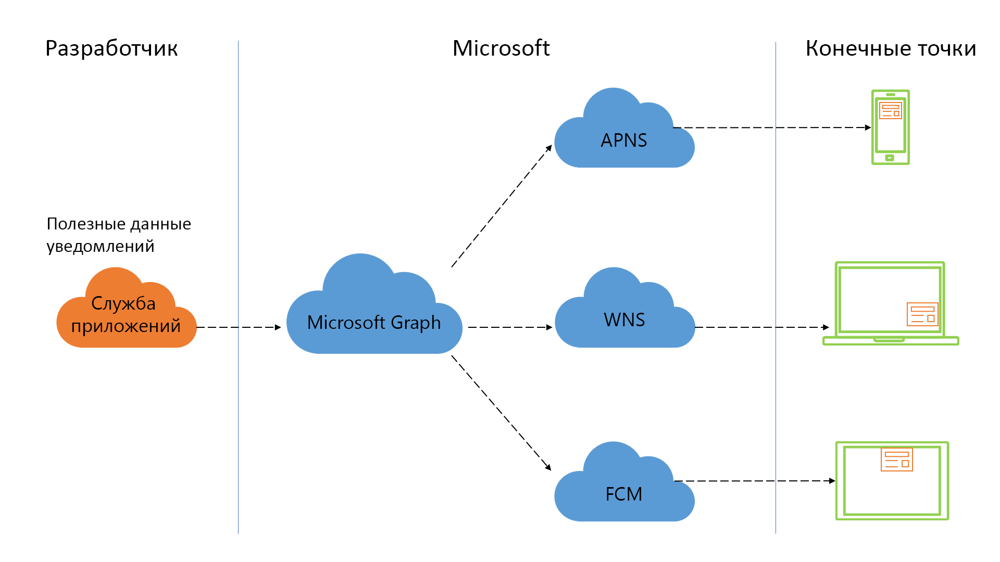

# Включение интерфейсов уведомлений, ориентированных на человека, с использованием уведомлений Microsoft Graph (не рекомендуется)

> [!IMPORTANT]
> API уведомлений Microsoft Graph не рекомендуется использовать, Он прекратил возвращать данные в январе 2022 г. Дополнительные сведения об уведомлениях см. в [Центрах уведомлений Microsoft Azure](/azure/notification-hubs). Дополнительные сведения см. в записи блога [Прекращение поддержки API уведомлений Microsoft Graph (бета-версия)](https://devblogs.microsoft.com/microsoft365dev/retiring-microsoft-graph-notifications/).

Уведомления — один из наиболее эффективных способов взаимодействия с пользователями вашего приложения. Отличный интерфейс уведомлений может создать канал общения между вами и пользователями практически в режиме реального времени, что может повышать уровень взаимодействия с приложением в нужный момент, увеличивать производительность пользователей и уведомлять их о важных событиях или требующихся действиях.

> [!VIDEO https://www.youtube-nocookie.com/embed/cmpPFhrS8ZA]

В настоящее время пользователи могут получать доступ к вашим приложениям и службам с помощью большого количества разных платформ и форм-факторов. Это сочетание устройств требует понимания и поддержки многоплатформенных систем уведомлений, сопоставления пользователей с конечными точками и обслуживания состояния уведомлений на разных устройствах.

Большинство других систем уведомлений избавляет от необходимости понимания и использования систем push-уведомлений для конкретных платформ, но по-прежнему ориентированы на каждое устройство. Платформа уведомлений Microsoft Graph предоставляет подход, ориентированный на человека и обеспечивающий возможность сосредоточиться на пользователях во всех конечных точках устройств.

## Зачем выполнять интеграцию с уведомлениями Microsoft Graph?

Платформа уведомлений Microsoft Graph предоставляет ориентированное на пользователя решение, предоставляющее четыре ключевых преимущества для ваших приложений.

### Простая ориентация на пользователей для доставки уведомлений в разные конечные точки

Вы можете использовать API уведомлений для ориентации на учетную запись Майкрософт, а также рабочую или учебную учетную запись Azure Active Directory (Azure AD) для доставки уведомлений. Платформа рассылает это уведомление во все конечные точки пользователей, использующие ваше приложение или службу, включая Windows UWP, iOS, Android и конечные точки в Интернете. Эта возможность позволяет максимально увеличить распространение, обеспечивая получение соответствующих уведомлений в целевых точках, где бы они ни находились.

### Простое управление уведомлениями в конечных точках

Используя [пакет SDK уведомлений](https://aka.ms/GNSDK) в своем клиентском приложении, вы можете обновлять состояние уведомлений и синхронизировать состояние во всех конечных точках. Например, если пользователь выполняет действие с уведомлением на одном устройстве, вы можете обновить состояние этого уведомления (например, пометить его как прочтенное или закрытое), и такое же изменение состояния будет распространено на все остальные конечные точки. API уведомлений Microsoft Graph отслеживает состояние уведомлений вашего пользователя централизованным образом, облегчая закрытие уведомлений во всех конечных точках после их однократной обработки, тем самым уменьшая избыточность и обеспечивая отличный пользовательский интерфейс.

### Получение состояния и журнала уведомлений

С помощью API уведомлений можно получить журнал уведомлений с учетом определенного вами срока действия (до 30 дней). Уведомления, помеченные как прочтенные или закрытые, по-прежнему можно извлечь из журнала, поддерживая просмотр в приложении журнала уведомлений, а также создание аналитики и статистики.

### Гарантированная доставка высокоприоритетных уведомлений

На таких платформах, как iOS, при определенных уровнях производительности уведомления о необработанных данных могут доставляться с задержкой в связи с пакетной обработкой или вообще не достигать конечной точки. В случае высокоприоритетных уведомлений, доставляемых пользователям в iOS, платформа уведомлений Microsoft Graph позволяет выбрать функцию "резервирования" всплывающих уведомлений из необработанных данных в визуальные на целевом устройстве iOS, обеспечивая уведомление пользователей практически в реальном времени.   

### Конфиденциальность и соответствие требованиям

Наша модель Push-to-Pull гарантирует, что в уведомлениях никогда не будет доверенных границ. Службы push-уведомлений для определенных платформ используются для отправки напоминаний на устройства пользователей, после чего клиентский пакет SDK получает соответствующие полезные данные из службы уведомлений Microsoft Graph. Мы гарантируем соответствие требованиям большинства корпоративных нормативов, включая ISO 27001, ISO 27018, EUMC, HIPAA, FERPA, SOC 1, SOC 2 и, конечно, GDPR.

## Как приступить к работе?

Для начала работы ознакомьтесь с разделом [Обзор интеграции](notifications-integration-e2e-overview.md), чтобы узнать, как можно интегрировать уведомления, ориентированные на пользователя, в свое приложение.

## Справочные материалы по API
Ищете справочные материалы по API для этой службы?

- [Использование REST API уведомлений в Microsoft Graph](/graph/api/resources/notifications-api-overview?view=graph-rest-beta&preserve-view=true)
