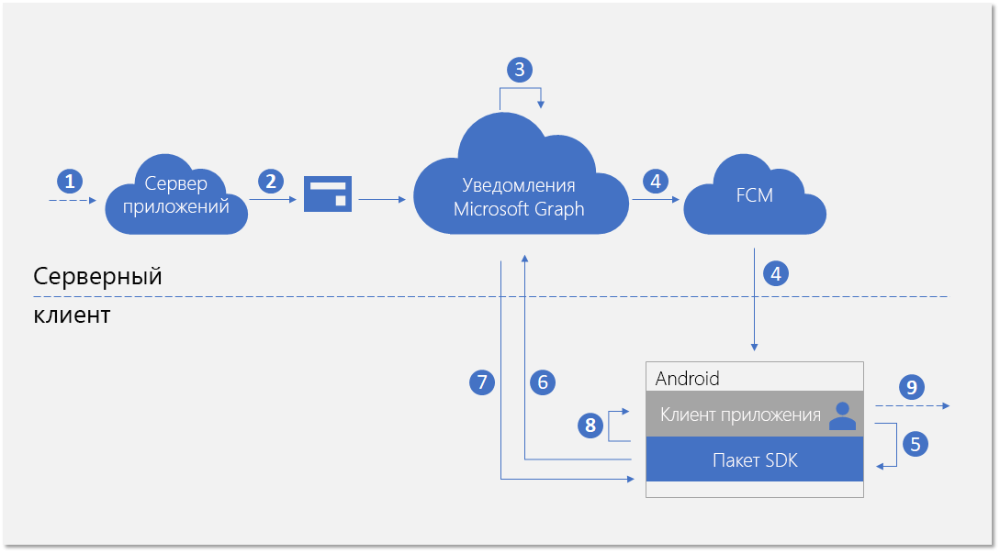
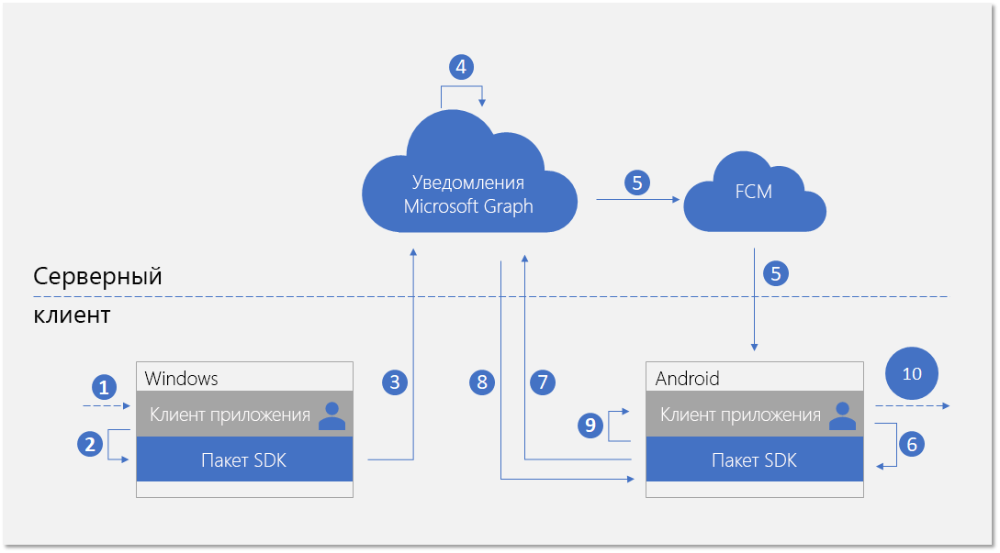

# <a name="integrate-your-android-app-with-the-client-side-sdk-for-user-notifications"></a>Интеграция приложения Android с клиентским пакетом SDK для уведомления пользователей

После [регистрации своего приложения](notifications-integration-app-registration.md) на портале Azure и внедрения [использования разных устройств](notifications-integration-cross-device-experiences-onboarding.md) в Центре разработки партнеров следующий этап состоит в интеграции вашего клиентского приложения с клиентским пакетом SDK для приложений Android.  

С помощью клиентского пакета SDK ваше приложение может выполнять необходимые действия регистрации, чтобы начать получение уведомлений, опубликованных вашим сервером приложений и предназначенных для вошедшего пользователя. После этого SDK управляет уведомлениями на стороне клиента, включая получение новых входящих уведомлений, управление состоянием уведомлений для осуществления таких сценариев, как универсальное закрытие и получение полного журнала уведомлений. 

## <a name="new-incoming-notification-flow"></a>Поток новых входящих уведомлений

Поток данных для получения новых входящих уведомлений показан на схеме ниже.



Процесс включает несколько компонентов:

* Сервер приложений — серверный компонент вашего приложения
* Клиент приложения — внешний интерфейс вашего приложения (приложение UWP, приложение Android или приложение iOS)
* Уведомления Microsoft Graph — компонент службы, позволяющий публиковать, хранить и синхронизировать уведомления пользователей на разных экземплярах клиентов приложения для разных устройств и платформ
* FCM (Firebase Cloud Messaging) — служба push-уведомлений, предусмотренная в Android в составе сервисов Google Play. Уведомления Microsoft Graph используют эту службу для сообщения клиентам приложений Android об изменениях данных в уведомлениях пользователей.  

На схеме показаны следующие шаги: 

1. Логика приложения. На этом этапе записываются события, вызывающие публикацию уведомления для пользователя. Эта логика зависит от приложения, это может быть событие или обновление данных других элементов в Microsoft Graph, например новое событие календаря или назначение задачи, а также любое другое событие, о котором службе приложения нужно уведомить пользователя.
2. Сервер приложений публикует уведомление для целевого пользователя с помощью API уведомлений Microsoft Graph. Дополнительные сведения см. в статье [Серверная интеграция](notifications-integrating-app-server.md).
3. После получения веб-запроса, содержащего новое уведомление, служба уведомлений Microsoft Graph безопасно сохраняет контент уведомления в облаке для этого приложения и этого пользователя.
4. Для каждого экземпляра клиента приложения, подписывающегося на получение уведомлений для этого пользователя, служба уведомлений Microsoft Graph отправляет сигнал для уведомления клиента приложения посредством собственной службы push-уведомлений, предоставляемой операционной системой. В этом случае мы имеем дело с приложением Android, использующим [сообщение с данными FCM](https://firebase.google.com/docs/cloud-messaging/concept-options) для отправки сигнала. 
5. После того, как приложение получит сигнал с помощью входящего push-уведомления, оно обращается к пакету SDK за получением изменений в хранилище уведомлений пользователя. 
6. SDK создает безопасное и соответствующее требованиям соединение с хранилищем уведомлений пользователя в Microsoft Graph.
7. SDK получает изменения данных, то есть, в этом случае, — новый контент уведомления. 
8. SDK выполняет обратные вызовы события, чтобы уведомить приложение после успешного получения изменений. 
9. Логика приложения. Этот шаг фиксирует выбранное приложением действие внутри обратного вызова события. Обычно это приводит к локальным изменениям данных приложения и локальным обновлениям пользовательского интерфейса. В этом случае приложение обычно создает всплывающее уведомление, чтобы уведомить пользователя о содержимом уведомления.

## <a name="notification-update-flow"></a>Поток обновления уведомлений

Одно из основных преимуществ использования уведомлений Microsoft Graph заключается в безопасном сохранении уведомлений в облаке и преобразование их в тип ресурса с отслеживанием состояния. Это может помочь вашему приложению управлять правильным состоянием уведомлений и синхронизировать его на разных устройствах для этого же вошедшего пользователя в сценарии с разными устройствами. Если уведомление помечено как закрытое или прочитанное на одном устройстве, другие устройства могут уведомляться в режиме реального времени. "Обработано однажды, закрыто везде" может стать истинным обещанием в рамках интерфейса уведомлений для ваших пользователей. 

На схеме ниже показан поток данных для изменения состояния уведомления или удаления уведомления на одном устройстве и получения/обработки изменения состояния или удаления на другом устройстве.



Обратите внимание, что вторая часть потока похожа на поток для обработки новых входящих уведомлений. Это сделано намеренно. Шаблон программирования SDK создан таким образом, чтобы клиент приложения мог обрабатывать все типы изменений данных в уведомлениях пользователей (новые входящие уведомления, изменения состояния уведомления, удаление уведомления) аналогичным образом.  

На схеме показаны следующие шаги:

1. Логика приложения. Некоторое событие запускает изменение или удаление уведомления. В принципе, любое событие может вызвать изменение уведомления. 
2. Приложение вызывает SDK клиента, чтобы обновить или удалить уведомление. В настоящее время представлено два свойства, связанных с изменением состояния: **userActionState** и **readState**, но ваше приложение может определять эти состояния и необходимость их обновления. Например, если пользователь закрывает всплывающее уведомление, вы можете обновить свойство **userActionState**, присвоив ему значение Dismissed. Когда пользователь щелкает всплывающее уведомление и запускает приложение для использования соответствующего контента приложения, вы можете обновить свойство **userActionState**, присвоив ему значение Activated, и обновить свойство **readState**, присвоив ему значение Read. 
3. После вызова соответствующего API для обновления или удаления уведомления пакет SDK вызовет хранилище уведомлений пользователя в облаке, чтобы развернуть это изменение для других экземпляров клиента приложения с этим вошедшим пользователем. 
4. После получения от клиента запроса на обновление или удаление служба уведомлений Microsoft Graph обновит хранилище уведомлений и определит другие экземпляры клиентов приложения, подписанные на это изменение.
5. Для каждой подписки экземпляра клиента приложения служба уведомлений Microsoft Graph отправляет сигнал для уведомления клиента приложения посредством собственной службы push-уведомлений, предоставляемой операционной системой. В этом случае применяется приложение Android, использующее [сообщение с данными FCM](https://firebase.google.com/docs/cloud-messaging/concept-options) для отправки сигнала. 
6. После того, как приложение получит сигнал с помощью входящего push-уведомления, оно обращается к пакету SDK за получением изменений в хранилище уведомлений пользователя. 
7. SDK создает безопасное и соответствующее требованиям соединение с хранилищем уведомлений пользователя в Microsoft Graph.
8. SDK получает изменения данных: в этом случае изменениями являются обновления состояния уведомления или удаления уведомления. 
9. SDK выполняет обратные вызовы события, чтобы уведомить приложение после успешного получения изменений. 
10. Логика приложения. Этот шаг фиксирует выбранное приложением действие внутри обратного вызова события. Обычно это приводит к локальным изменениям данных приложения и локальным обновлениям пользовательского интерфейса. В этом случае приложение должно локально обновить пользовательский интерфейс, чтобы отобразить изменение состояния, так как имеются обновления уведомлений. Например, если уведомление помечено как активированное, вы можете удалить соответствующее сообщение в области уведомлений Android, чтобы достичь результата "обработано однажды, закрыто везде". 

Дополнительные сведения об уведомлениях Microsoft Graph см. в статье [Общие сведения об уведомлениях Microsoft Graph](notifications-concept-overview.md). Дополнительные сведения о всех действиях, требующихся для интеграции с уведомлениями Microsoft Graph, см. в [обзоре интеграции](notifications-integration-e2e-overview.md) уведомлений Microsoft Graph.

## <a name="development-environment-and-requirements"></a>Среда и требования разработки

Чтобы использовать уведомления Microsoft Graph, вам потребуется среда IDE для разработки приложений Android и устройство Android с одной из поддерживаемых архитектур (**armeabi-v7a**, **arm64-v8a**, **x86** или **x86_64**) или эмулятор. Система должна работать под управлением Android 4.4.2 или более поздней версии.

## <a name="adding-the-sdk-to-your-project"></a>Добавление SDK в проект

Вставьте следующие ссылки на репозиторий в файл *build.gradle* в корневой папке проекта.

```Java
allprojects {
    repositories {
    jcenter()
    maven { url 'https://maven.google.com' }
    maven { url 'https://projectrome.bintray.com/maven/' }
    }
}
```

Затем вставьте следующую зависимость в файл _build.gradle_, находящийся в папке проекта.

```Java
dependencies { 
    ...
    implementation 'com.microsoft.connecteddevices:connecteddevices-sdk:+'
}
```

Если вы хотите использовать ProGuard в своем приложении, добавьте правила ProGuard для этих новых API. Создайте файл *proguard rules.txt* в папке *App* своего проекта и вставьте содержимое файла [ProGuard_Rules_for_Android_Rome_SDK.txt](https://github.com/Microsoft/project-rome/blob/master/Android/ProGuard_Rules_for_Android_Rome_SDK.txt).
В файле *AndroidManifest.xml* своего проекта добавьте следующие разрешения в элемент `manifest` (если они там отсутствуют). Это дает вашему приложению разрешение на подключение к Интернету и включение обнаружения Bluetooth на устройстве.
Обратите внимание, что разрешения, связанные с Bluetooth, необходимы только для использования обнаружения Bluetooth; они не нужны для других функций на платформе подключенных устройств. Кроме того, `ACCESS_COARSE_LOCATION` требуется только для Android SDK 21 и более поздних версий. На Android SDK 23 и более поздних версиях вы также должны запрашивать у пользователя предоставление доступа к расположению во время выполнения.

```xml
<uses-permission android:name="android.permission.INTERNET" />
<uses-permission android:name="android.permission.BLUETOOTH" />
<uses-permission android:name="android.permission.BLUETOOTH_ADMIN" />
<uses-permission android:name="android.permission.ACCESS_COARSE_LOCATION" />
<uses-permission android:name="android.permission.ACCESS_NETWORK_STATE" />
```
Затем перейдите к классам действий, в которых нужно разместить функции подключенных устройств. Импортируйте указанные ниже пространства имен.

```java
import com.microsoft.connecteddevices;
import com.microsoft.connecteddevices.userdata;
import com.microsoft.connecteddevices.userdata.usernotifications;
```

## <a name="initializing-the-connected-device-platforms"></a>Инициализация платформы подключенных устройств

Клиентский SDK создан на основе инфраструктуры, называемой платформой подключенных устройств. Перед использованием каких-либо функций необходимо инициализировать платформу в вашем приложении. Действия по инициализации должны находиться в методе **OnCreate** класса main, так как они должны быть выполнены до использования сценариев уведомлений.

Необходимо создать и инициализировать платформу путем создания экземпляра класса [**ConnectedDevicesPlatform**](/java/api/com.microsoft.connecteddevices.connecteddevicesplatform?view=rome-android-latest). Перед этим подключите обработчики событий, так как после запуска платформы могут начать возникать события. 

```java
ConnectedDevicesPlatform platform = new ConnectedDevicesPlatform(context);

platform.getAccountManager().accessTokenRequested().subscribe((accountManager, args) -> onAccessTokenRequested(accountManager, args));
platform.getAccountManager().accessTokenInvalidated().subscribe((accountManager, args) -> onAccessTokenInvalidated(accountManager, args));
platform.getNotificationRegistrationManager().notificationRegistrationStateChanged().subscribe((notificationRegistrationManager, args) -> onNotificationRegistrationStateChanged(notificationRegistrationManager, args));

platform.start();
```

### <a name="handling-account-access-token"></a>Обработка маркера доступа учетной записи

Все веб-вызовы, выполняемые SDK, включая получение контента нового входящего уведомления, обновление состояний уведомлений и т. д., считываются из данных пользователя или записываются в них, поэтому всегда требуется действующий маркер доступа. При использовании SDK требуется обработка следующих событий, вызываемых, когда маркер доступа запрашивается или становится недействительным. Это необходимо, чтобы правильно обрабатывать маркер доступа пользователя после инициализации платформы. 

#### <a name="accesstokenrequested"></a>accessTokenRequested 

Полную реализацию см. в [примере приложения Android](https://github.com/Microsoft/project-rome/blob/release/1.3.0/Android/samples/graphnotificationssample/app/src/main/java/com/microsoft/connecteddevices/graphnotifications/ConnectedDevicesManager.java). 

```Java
private void onAccessTokenRequested(ConnectedDevicesAccountManager sender, ConnectedDevicesAccessTokenRequestedEventArgs args) {
    ConnectedDevicesAccessTokenRequest request = args.getRequest();
    List<String> scopes = request.getScopes();

    // We always need to complete the request, even if a matching account is not found
    if (account == null) {
        request.completeWithErrorMessage("The app could not find a matching ConnectedDevicesAccount to get a token");
        return;
    }

    // Complete the request with a token
    account.getAccessTokenAsync(scopes)
        .thenAcceptAsync((String token) -> {
            request.completeWithAccessToken(token);
        }).exceptionally(throwable -> {
            request.completeWithErrorMessage("The Account could not return a token with those scopes");
            return null;
    });
}
```

#### <a name="accesstokeninvalidated"></a>accessTokenInvalidated

Полную реализацию см. в [примере приложения Android](https://github.com/Microsoft/project-rome/blob/release/1.3.0/Android/samples/graphnotificationssample/app/src/main/java/com/microsoft/connecteddevices/graphnotifications/ConnectedDevicesManager.java). 

```Java
private void onAccessTokenInvalidated(ConnectedDevicesAccountManager sender, ConnectedDevicesAccessTokenInvalidatedEventArgs args, List<Account> accounts) {
    Log.i(TAG, "Token invalidated for account: " + args.getAccount().getId());
}
```

### <a name="handling-push-registration-expiration"></a>Обработка истечения срока регистрации для push-уведомлений 

Уведомления Microsoft Graph используют FCM (собственная платформа push-уведомлений в Android) для отправки сигнала клиентскому приложению об изменениях данных в уведомлениях пользователя. Это происходит, когда новые входящие уведомления публикуются с вашего сервера приложений или когда обновляется состояние любого уведомления на другом устройстве с тем же вошедшим пользователем в сценарии с разными устройствами. 

Поэтому требуется действующий маркер FCM, обеспечивающий передачу сообщений с уведомлениями о данных. Следующий обратный вызов события обрабатывает истечения срока действия маркера FCM для push-уведомлений. 

#### <a name="notificationregistrationstatechanged"></a>notificationRegistrationStateChanged

Полную реализацию см. в [примере приложения Android](https://github.com/Microsoft/project-rome/blob/release/1.3.0/Android/samples/graphnotificationssample/app/src/main/java/com/microsoft/connecteddevices/graphnotifications/ConnectedDevicesManager.java). 

## <a name="signing-in-your-user"></a>Вход пользователя в систему

Уведомления Microsoft Graph, как и многие другие типы ресурсов в Microsoft Graph, ориентированы на пользователей. Чтобы приложение могло подписаться на уведомления и могло начать получать уведомления для пользователя, вошедшего в систему, сначала необходимо получить действующий маркер OAuth для использования в процессе регистрации. Вы можете использовать любой удобный способ создания маркеров OAuth и управления ими. В примере приложения используется ADAL. 

Если вы используете учетную запись Майкрософт, необходимо включить следующие разрешения в запрос входа: `wl.offline_access"`, `ccs.ReadWrite`, `wns.connect`, `asimovrome.telemetry` и `https://activity.windows.com/UserActivity.ReadWrite.CreatedByApp`. 

Если вы используете учетную запись Azure AD, необходимо запросить следующую аудиторию: `https://cdpcs.access.microsoft.com`.

## <a name="adding-the-user-account-to-the-platform"></a>Добавление учетной записи пользователя в платформу 

Необходимо зарегистрировать учетную запись вошедшего пользователя в SDK, что включает добавление учетной записи и регистрацию канала push-уведомлений для получения начальных push-уведомлений через FCM. 

```Java
public AsyncOperation<Boolean> prepareAccountAsync(final Context context) {
    // Accounts can be in 3 different scenarios:
    // 1: cached account in good standing (initialized in the SDK and our token cache).
    // 2: account missing from the SDK but present in our cache: Add and initialize account.
    // 3: account missing from our cache but present in the SDK. Log the account out async

    // Subcomponents (e.g. UserDataFeed) can only be initialized when an account is in both the app cache
    // and the SDK cache.
    // For scenario 1, initialize our subcomponents.
    // For scenario 2, subcomponents will be initialized after InitializeAccountAsync registers the account with the SDK.
    // For scenario 3, InitializeAccountAsync will unregister the account and subcomponents will never be initialized.
    switch (mState) {
        // Scenario 1
        case IN_APP_CACHE_AND_SDK_CACHE:
            mUserNotificationsManager = new UserNotificationsManager(context, mAccount, mPlatform);
            return registerAccountWithSdkAsync();
        // Scenario 2
        case IN_APP_CACHE_ONLY: {
            // Add the this account to the ConnectedDevicesPlatform.AccountManager
            return mPlatform.getAccountManager().addAccountAsync(mAccount).thenComposeAsync((ConnectedDevicesAddAccountResult result) -> {
                // We failed to add the account, so exit with a failure to prepare bool
                if (result.getStatus() != ConnectedDevicesAccountAddedStatus.SUCCESS) {
                    result.getStatus());
                    return AsyncOperation.completedFuture(false);
                }

                // Set the registration state of this account as in both app and sdk cache
                mState = AccountRegistrationState.IN_APP_CACHE_AND_SDK_CACHE;
                mUserNotificationsManager = new UserNotificationsManager(context, mAccount, mPlatform);
                return registerAccountWithSdkAsync();
            });
        }
        // Scenario 3
        case IN_SDK_CACHE_ONLY:
            // Remove the account from the SDK since the app has no knowledge of it
            mPlatform.getAccountManager().removeAccountAsync(mAccount);
            // This account could not be prepared
            return AsyncOperation.completedFuture(false);
        default:
            // This account could not be prepared
            Log.e(TAG, "Failed to prepare account " + mAccount.getId() + " due to unknown state!");
            return AsyncOperation.completedFuture(false);
    }
}
```

```Java
public AsyncOperation<Boolean> registerAccountWithSdkAsync() {
    if (mState != AccountRegistrationState.IN_APP_CACHE_AND_SDK_CACHE) {
        AsyncOperation<Boolean> toReturn = new AsyncOperation<>();
        toReturn.completeExceptionally(new IllegalStateException("Cannot register this account due to bad state: " + mAccount.getId()));
        return toReturn;
    }

    // Grab the shared GCM/FCM notification token from this app's BroadcastReceiver
    return RomeNotificationReceiver.getNotificationRegistrationAsync().thenComposeAsync((ConnectedDevicesNotificationRegistration notificationRegistration) -> {
        // Perform the registration using the NotificationRegistration
        return mPlatform.getNotificationRegistrationManager().registerAsync(mAccount, notificationRegistration)
            .thenComposeAsync((result) -> {
                if (result.getStatus() == ConnectedDevicesNotificationRegistrationStatus.SUCCESS) {
                    Log.i(TAG, "Successfully registered account " + mAccount.getId() + " for cloud notifications");
                } else {
                    // It would be a good idea for apps to take a look at the different statuses here and perhaps attempt some sort of remediation.
                    // For example, token request failed could mean that the user needs to sign in again. An app could prompt the user for this action 
                    // and retry the operation afterwards.
                    Log.e(TAG, "Failed to register account " + mAccount.getId() + " for cloud notifications!");
                    return AsyncOperation.completedFuture(false);
                }

                return mUserNotificationsManager.registerForAccountAsync();
            });
    });
}
```

## <a name="subscribing-to-receive-users-notifications"></a>Подписка для получения уведомлений пользователей 

Для вашего приложения необходимо создать экземпляр объекта **UserDataFeed** для вошедшего пользователя. Ваше приложение определяется по идентификатору кроссплатформенного приложения, указанному при [внедрении использования разных устройств](notifications-integration-cross-device-experiences-onboarding.md).

```Java
public UserNotificationsManager(@NonNull Context context, @NonNull ConnectedDevicesAccount account, @NonNull ConnectedDevicesPlatform platform)
{
    Context context = new Context;
    UserDataFeed feed = UserDataFeed.getForAccount(account, platform, Secrets.APP_HOST_NAME);
    UserNotificationChannel channel = new UserNotificationChannel(feed);
    UserNotificationReader reader = channel.createReader();
    reader.dataChanged().subscribe((reader, aVoid) -> readFromCache(reader));
    }
}
```

## <a name="receiving-and-managing-user-notifications"></a>Получение уведомлений пользователей и управление ими

На схеме, представленной выше в этой статье, показано, что шаблоны программирования для обработки новых входящих уведомлений с сервера приложений и для обновления или удаления уведомления, запущенного из другого экземпляра клиента приложения, похожи друг на друга. Ниже перечислены действия по работе с этими изменениями данных. 

### <a name="handling-incoming-push-notification-signal"></a>Обработка сигналов входящих push-уведомлений

Все типы изменений данных в уведомлениях пользователей создают сигнал, доставляемый клиентам приложений в виде push-уведомления. Для приложений Android сигнал доставляется как push-сообщение с данными FCM. После получения сигнала сообщения с данными приложение должно вызвать метод **TryParse**, чтобы запустить в SDK получение от службы уведомлений Microsoft Graph изменений фактических данных.

```Java
public void onMessageReceived(RemoteMessage message) {
    Map data = message.getData();
    ConnectedDevicesNotification notification = ConnectedDevicesNotification.tryParse(data);

    if (notification != null) {
        try {
            ConnectedDevicesPlatform platform = ConnectedDevicesManager.getConnectedDevicesManager(getApplicationContext()).getPlatform();

            // NOTE: it may be useful to attach completion to this async in order to know when the notification is done being processed.
            // This would be a good time to stop a background service or otherwise cleanup.
            platform.processNotificationAsync(notification);
        } catch (Exception e) {
            Log.e(TAG, "Failed to process FCM notification" + e.getMessage());
        }
    }
}
```

### <a name="handling-user-notification-data-changes"></a>Обработка изменений данных в уведомлениях пользователей

После получения пакетом SDK изменений данных выполняется обратный вызов события, при этом ожидается, что клиент приложения обработает создание, обновление или удаление уведомления.

```Java
private void readFromCache(final UserNotificationReader reader)
{
    reader.readBatchAsync(Long.MAX_VALUE).thenAccept(notifications -> {
        synchronized (this) {
            for (final UserNotification notification : notifications) {
                if (notification.getStatus() == UserNotificationStatus.ACTIVE) {
                    removeIf(mNewNotifications, item -> notification.getId().equals(item.getId()));

                    if (notification.getUserActionState() == UserNotificationUserActionState.NO_INTERACTION) {
                        mNewNotifications.add(notification);
                        if (notification.getReadState() != UserNotificationReadState.READ) {
                            clearNotification(mContext.getApplicationContext(), notification.getId());
                            addNotification(mContext.getApplicationContext(), notification.getContent(), notification.getId());
                        }
                    } else {
                        clearNotification(mContext.getApplicationContext(), notification.getId());
                    }

                    removeIf(mHistoricalNotifications, item -> notification.getId().equals(item.getId()));
                    mHistoricalNotifications.add(0, notification);
                } else {
                    removeIf(mNewNotifications, item -> notification.getId().equals(item.getId()));
                    removeIf(mHistoricalNotifications, item -> notification.getId().equals(item.getId()));
                    clearNotification(mContext.getApplicationContext(), notification.getId());
                }
            }
        }

    });
}
```

### <a name="update-state-of-a-notification"></a>Обновление состояния уведомлений

Если изменение состояния уведомления инициируется в этом экземпляре клиента приложения (например, если всплывающее уведомление на этом устройстве активировано пользователем), приложение должно вызвать SDK, чтобы обновить состояние уведомления для синхронизации изменения этого состояния на всех устройствах, используемых тем же пользователем. 

```Java
notification.setUserActionState(UserNotificationUserActionState.ACTIVATED);
notification.saveAsync().whenCompleteAsync((userNotificationUpdateResult, throwable) -> {
    if (throwable == null && userNotificationUpdateResult != null && userNotificationUpdateResult.getSucceeded()) {
        Log.d(TAG, "Successfully activated the notification");
    }
});
```

### <a name="delete-a-notification"></a>Удаление уведомления

Если удаление уведомления инициируется в этом экземпляре клиента приложения (например, если связанная с этим уведомлением задача помечена как завершенная и удалена из базы данных вашего приложения), приложение должно вызвать SDK, чтобы удалить уведомление для синхронизации этого удаления на всех устройствах, используемых тем же пользователем. 

Уведомление удаляется из хранилища уведомлений пользователя только при истечении срока действия уведомления или при удалении явным образом. Уведомление пользователя не удаляется при обновлении свойства **UserActionState** с присвоением значения Dismissed, так как семантическое определение **UserActionState** задается самим приложением.

```Java
channel.deleteUserNotificationAsync(notification.getId()).whenCompleteAsync((userNotificationUpdateResult, throwable) -> {
    if (throwable == null && userNotificationUpdateResult != null && userNotificationUpdateResult.getSucceeded()) {
        Log.d(TAG, "Successfully deleted the notification");
    }
});
```

## <a name="see-also"></a>См. также

- [Справочник по API](/windows/project-rome/notifications/api-reference-for-android) содержит информацию о всех API-интерфейсах, связанных с функциями уведомлений в SDK. 
- [Пример клиентского кода](https://github.com/Microsoft/project-rome/tree/master/Android/samples/graphnotificationssample) для приложений Android.
- [Пример серверного кода приложения](notifications-integrating-app-server.md) для публикации уведомлений.
