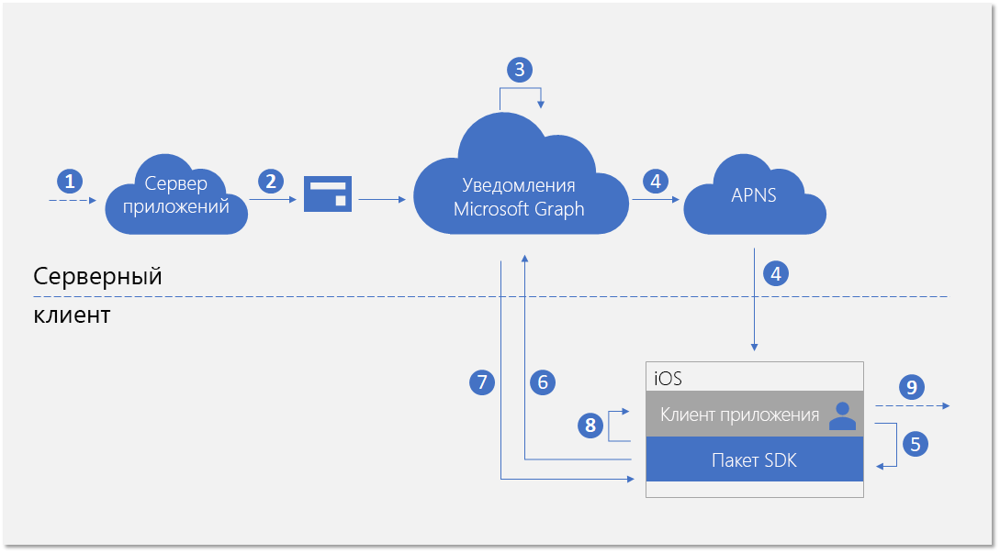
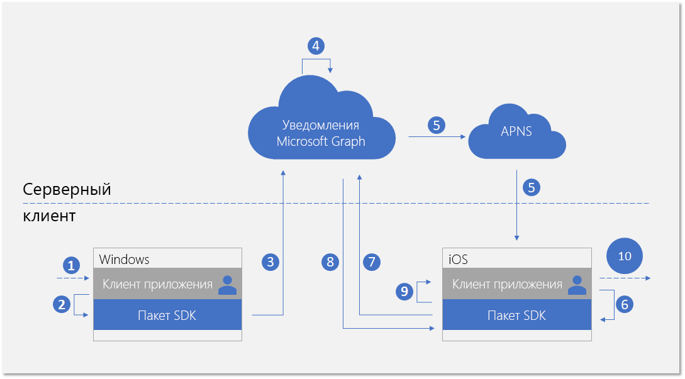

# <a name="integrate-your-ios-app-with-the-client-side-sdk-for-user-notifications-deprecated"></a>Интеграция приложения iOS с клиентским пакетом SDK для уведомления пользователей (не рекомендуется)

> [!IMPORTANT]
> API уведомлений Microsoft Graph не рекомендуется использовать, Он прекратил возвращать данные в январе 2022 г. Дополнительные сведения об уведомлениях см. в [Центрах уведомлений Microsoft Azure](/azure/notification-hubs). Дополнительные сведения см. в записи блога [Прекращение поддержки API уведомлений Microsoft Graph (бета-версия)](https://devblogs.microsoft.com/microsoft365dev/retiring-microsoft-graph-notifications/).

После [регистрации приложения](notifications-integration-app-registration.md) на портале Azure и подключения [кроссплатформенных интерфейсов](notifications-integration-cross-device-experiences-onboarding.md) в партнерском центре разработки следующий этап состоит в интеграции вашего клиентского приложения с клиентским пакетом SDK для приложений iOS.  

С помощью клиентского пакета SDK ваше приложение может выполнять необходимые действия регистрации, чтобы начать получение уведомлений, опубликованных вашим сервером приложений и предназначенных для вошедшего пользователя. После этого SDK управляет уведомлениями на стороне клиента, включая получение новых входящих уведомлений, управление состоянием уведомлений для осуществления таких сценариев, как универсальное закрытие и получение полного журнала уведомлений. 

## <a name="new-incoming-notification-flow"></a>Поток новых входящих уведомлений

Поток данных для получения новых входящих уведомлений показан на схеме ниже.



Этот процесс включает несколько компонентов:

* Сервер приложений — серверный компонент вашего приложения
* Клиент приложения — внешний интерфейс вашего приложения (приложение UWP, приложение Android или приложение iOS)
* Уведомления Microsoft Graph — компонент службы, позволяющий публиковать, хранить и синхронизировать уведомления пользователей на разных экземплярах клиентов приложения для разных устройств и платформ
* APNs — служба push-уведомлений Apple Push Notification Service, предоставленная корпорацией Apple для приложений iOS. Уведомления Microsoft Graph используют эти службы для сообщения клиентам приложений iOS об изменениях данных уведомления пользователя.  

На схеме показаны следующие шаги: 

1. Логика приложения. На этом этапе записываются события, вызывающие публикацию уведомления для пользователя. Эта логика зависит от приложения, это может быть событие или обновление данных других элементов в Microsoft Graph, например новое событие календаря или назначение задачи, а также любое другое событие, о котором службе приложения нужно уведомить пользователя.
2. Сервер приложений публикует уведомление для целевого пользователя с помощью API уведомлений Microsoft Graph. Дополнительные сведения см. в статье [Серверная интеграция](notifications-integrating-app-server.md).
3. После получения веб-запроса, содержащего новое уведомление, служба уведомлений Microsoft Graph безопасно сохраняет контент уведомления в облаке для этого приложения и этого пользователя.
4. Для каждого экземпляра клиента приложения, подписывающегося на получение уведомлений для этого пользователя, служба уведомлений Microsoft Graph отправляет сигнал для уведомления клиента приложения посредством собственной службы push-уведомлений, предоставляемой операционной системой. В этом случае мы имеем дело с приложением iOS, в нем для отправки сигнала используется [фоновое уведомление APNs об обновлении]. 
5. После того, как приложение получит сигнал с помощью входящего push-уведомления, оно обращается к пакету SDK за получением изменений в хранилище уведомлений пользователя. 
6. SDK создает безопасное и соответствующее требованиям соединение с хранилищем уведомлений пользователя в Microsoft Graph.
7. SDK получает изменения данных, то есть, в этом случае, — новый контент уведомления. 
8. SDK выполняет обратные вызовы события, чтобы уведомить приложение после успешного получения изменений. 
9. Логика приложения. Этот шаг фиксирует выбранное приложением действие внутри обратного вызова события. Обычно это приводит к локальным изменениям данных приложения и локальным обновлениям пользовательского интерфейса. В этом случае приложение обычно создает оповещение iOS, чтобы уведомить пользователя о содержимом уведомления.

## <a name="notification-update-flow"></a>Поток обновления уведомлений

Одно из основных преимуществ использования уведомлений Microsoft Graph заключается в безопасном сохранении уведомлений в облаке и преобразование их в тип ресурса с отслеживанием состояния. Это может помочь вашему приложению управлять правильным состоянием уведомлений и синхронизировать его на разных устройствах для этого же вошедшего пользователя в сценарии с разными устройствами. Если уведомление помечено как закрытое или прочитанное на одном устройстве, другие устройства могут уведомляться в режиме реального времени. "Обработано однажды, закрыто везде" может стать истинным обещанием в рамках интерфейса уведомлений для ваших пользователей. 

На схеме ниже показан поток данных для изменения состояния уведомления или удаления уведомления на одном устройстве и получения/обработки изменения состояния или удаления на другом устройстве.



Обратите внимание, что вторая часть потока похожа на поток для обработки новых входящих уведомлений. Это сделано намеренно. Шаблон программирования SDK создан таким образом, чтобы клиент приложения мог обрабатывать все типы изменений данных в уведомлениях пользователей (новые входящие уведомления, изменения состояния уведомления, удаление уведомления) аналогичным образом.  

На схеме показаны следующие шаги:

1. Логика приложения. Некоторое событие запускает изменение или удаление уведомления. В принципе, любое событие может вызвать изменение уведомления. 
2. Приложение вызывает SDK клиента, чтобы обновить или удалить уведомление. В настоящее время представлено два свойства, связанных с изменением состояния: **userActionState** и **readState**, но ваше приложение может определять эти состояния и необходимость их обновления. Например, если пользователь закрывает всплывающее уведомление, вы можете обновить свойство **userActionState**, присвоив ему значение Dismissed. Когда пользователь щелкает всплывающее уведомление и запускает приложение для использования соответствующего контента приложения, вы можете обновить свойство **userActionState**, присвоив ему значение Activated, и обновить свойство **readState**, присвоив ему значение Read. 
3. После вызова соответствующего API для обновления или удаления уведомления пакет SDK вызовет хранилище уведомлений пользователя в облаке, чтобы развернуть это изменение для других экземпляров клиента приложения с этим вошедшим пользователем. 
4. После получения от клиента запроса на обновление или удаление служба уведомлений Microsoft Graph обновит хранилище уведомлений и определит другие экземпляры клиентов приложения, подписанные на это изменение.
5. Для каждой подписки экземпляра клиента приложения служба уведомлений Microsoft Graph отправляет сигнал для уведомления клиента приложения посредством собственной службы push-уведомлений, предоставляемой операционной системой. В этом случае мы имеем дело с iOS, где для отправки сигнала используется [фоновое уведомление APNs об обновлении](https://developer.apple.com/library/archive/documentation/NetworkingInternet/Conceptual/RemoteNotificationsPG/CreatingtheNotificationPayload.html#//apple_ref/doc/uid/TP40008194-CH10-SW8). 
6. После того, как приложение получит сигнал с помощью входящего push-уведомления, оно обращается к пакету SDK за получением изменений в хранилище уведомлений пользователя. 
7. SDK создает безопасное и соответствующее требованиям соединение с хранилищем уведомлений пользователя в Microsoft Graph.
8. SDK получает изменения данных: в этом случае изменениями являются обновления состояния уведомления или удаления уведомления. 
9. SDK выполняет обратные вызовы события, чтобы уведомить приложение после успешного получения изменений. 
10. Логика приложения. Этот шаг фиксирует выбранное приложением действие внутри обратного вызова события. Обычно это приводит к локальным изменениям данных приложения и локальным обновлениям пользовательского интерфейса. В этом случае приложение должно локально обновить пользовательский интерфейс, чтобы отобразить изменение состояния, так как имеются обновления уведомлений. Например, если уведомление помечено как активированное, вы можете удалить соответствующее сообщение в центре уведомлений iOS, чтобы достичь результата "обработано однажды, закрыто везде". 

Дополнительные сведения об уведомлениях Microsoft Graph см. в статье [Общие сведения об уведомлениях Microsoft Graph](notifications-concept-overview.md). Дополнительные сведения о всех действиях, требующихся для интеграции с уведомлениями Microsoft Graph, см. в [обзоре интеграции](notifications-integration-e2e-overview.md) уведомлений Microsoft Graph.

## <a name="adding-the-sdk-to-your-project"></a>Добавление SDK в проект

Самый простой способ добавить платформу подключенных устройств в приложение iOS — воспользоваться диспетчером зависимостей [CocoaPods](https://cocoapods.org/). Перейдите в раздел *Podfile* проекта для iOS и вставьте следующую запись:

```ObjectiveC
platform :ios, "10.0"
workspace 'iOSSample'

target 'iOSSample' do
  # Uncomment the next line if you're using Swift or would like to use dynamic frameworks
  # use_frameworks!

    pod 'ProjectRomeSdk'

  # Pods for iOSSample
```

> [!NOTE]
> Для использования CocoaPod необходимо использовать в проекте файл _.xcworkspace_.

## <a name="initializing-the-connected-device-platforms"></a>Инициализация платформы подключенных устройств

Клиентский SDK создан на основе инфраструктуры, называемой платформой подключенных устройств. Перед использованием каких-либо функций необходимо инициализировать платформу в вашем приложении. Действия по инициализации должны находиться в методе **AppDelegate**, поскольку они должны быть выполнены до использования сценариев уведомлений.

Необходимо создать и инициализировать платформу путем создания экземпляра класса [**MCDConnectedDevicesPlatform**](/windows/project-rome/objectivec-api/connecteddevices/mcdconnecteddevicesplatform). Перед этим подключите обработчики событий, как показано здесь, поскольку после запуска платформы могут начать возникать события.  

```ObjectiveC
MCDConnectedDevicesPlatform* platform = [MCDConnectedDevicesPlatform new];
        
[platform.accountManager.accessTokenRequested subscribe:^(MCDConnectedDevicesAccountManager* _Nonnull manager, MCDConnectedDevicesAccessTokenRequestedEventArgs* _Nonnull args) {
    // implement the callback;
}];
        
[self.platform.accountManager.accessTokenInvalidated
    subscribe:^(MCDConnectedDevicesAccountManager* _Nonnull manager __unused,
        MCDConnectedDevicesAccessTokenInvalidatedEventArgs* _Nonnull request) {
    // implement the callback;
}];
        
[self.platform.notificationRegistrationManager.notificationRegistrationStateChanged subscribe:^(MCDConnectedDevicesNotificationRegistrationManager* _Nonnull manager __unused, MCDConnectedDevicesNotificationRegistrationStateChangedEventArgs* _Nonnull args) {
    // implement the callback
}];
        
[platform start];
```

### <a name="handling-account-access-token"></a>Обработка маркера доступа учетной записи

Все веб-вызовы, выполняемые SDK, включая получение контента нового входящего уведомления, обновление состояний уведомлений и т. д., считываются из данных пользователя или записываются в них, поэтому всегда требуется действующий маркер доступа. При использовании SDK требуется обработка следующих событий, вызываемых, когда маркер доступа запрашивается или становится недействительным. Это необходимо, чтобы правильно обрабатывать маркер доступа пользователя после инициализации платформы. 

#### <a name="accesstokenrequested"></a>accessTokenRequested

Полную реализацию см. в [примере приложения iOS](https://github.com/Microsoft/project-rome/blob/master/iOS/samples/GraphNotifications/GraphNotificationsSample/ConnectedDevicesPlatformManager.m). 

#### <a name="accesstokeninvalidated"></a>accessTokenInvalidated

Полную реализацию см. в [примере приложения iOS](https://github.com/Microsoft/project-rome/blob/master/iOS/samples/GraphNotifications/GraphNotificationsSample/ConnectedDevicesPlatformManager.m). 

```ObjectiveC
[platform.accountManager.accessTokenInvalidated
    subscribe:^(MCDConnectedDevicesAccountManager* _Nonnull manager __unused,
        MCDConnectedDevicesAccessTokenInvalidatedEventArgs* _Nonnull request) {
}];
```

### <a name="handling-push-registration-expiration"></a>Обработка истечения срока регистрации для push-уведомлений 

Уведомления Microsoft Graph используют APNs (собственная платформа push-уведомлений в iOS) для отправки клиентскому приложению сигнала об изменениях данных в уведомлениях пользователя. Это происходит, когда новые входящие уведомления публикуются с вашего сервера приложений или когда обновляется состояние любого уведомления на другом устройстве с тем же вошедшим пользователем в сценарии с разными устройствами. 

Поэтому требуется действующий маркер APNs, обеспечивающий передачу фоновых уведомлений об обновлениях. Следующий обратный вызов события обрабатывает истечение срока действия маркеров push-уведомлений APNs. 

#### <a name="notificationregistrationstatechanged"></a>notificationRegistrationStateChanged

Полную реализацию см. в [примере приложения iOS](https://github.com/Microsoft/project-rome/blob/master/iOS/samples/GraphNotifications/GraphNotificationsSample/ConnectedDevicesPlatformManager.m). 

## <a name="signing-in-your-user"></a>Вход пользователя в систему

Уведомления Microsoft Graph, как и многие другие типы ресурсов в Microsoft Graph, ориентированы на пользователей. Чтобы приложение могло подписаться на уведомления и могло начать получать уведомления для пользователя, вошедшего в систему, сначала необходимо получить действующий маркер OAuth для использования в процессе регистрации. Вы можете использовать любой удобный способ создания маркеров OAuth и управления ими. В примере приложения используется ADAL. 

Если вы используете учетную запись Майкрософт, необходимо включить следующие разрешения в запрос входа: `wl.offline_access"`, `ccs.ReadWrite`, `wns.connect`, `asimovrome.telemetry` и `https://activity.windows.com/UserActivity.ReadWrite.CreatedByApp`. 

Если вы используете учетную запись Azure AD, необходимо запросить следующую аудиторию: `https://cdpcs.access.microsoft.com`.

## <a name="adding-the-user-account-to-the-platform"></a>Добавление учетной записи пользователя в платформу 

Необходимо зарегистрировать в SDK учетную запись вошедшего пользователя. Для этого необходимо добавить учетную запись и зарегистрировать push-канал, чтобы получать начальные push-уведомления через службу APNs. Дополнительные сведения см. в методе [prepareAccountAsync](https://github.com/Microsoft/project-rome/blob/master/iOS/samples/GraphNotifications/GraphNotificationsSample/ConnectedDevicesPlatformManager.m) в примере.

```ObjectiveC
MCDConnectedDevicesPlatform* platform = [MCDConnectedDevicesPlatform new];
MCDConnectedDevicesAccount* mcdAccount = [MCDConnectedDevicesAccount new];

[platform.accountManager addAccountAsync:mcdAccount callback:adapter]; 
```

## <a name="subscribing-to-receive-users-notifications"></a>Подписка для получения уведомлений пользователей 

Для вашего приложения необходимо создать экземпляр объекта **UserDataFeed** для вошедшего пользователя. Ваше приложение определяется по идентификатору кроссплатформенного приложения, указанному в процессе [внедрения использования разных устройств](notifications-integration-cross-device-experiences-onboarding.md).

```ObjectiveC
// Initialize the feed and subscribe for notifications
MCDUserDataFeed* feed = [MCDUserDataFeed getForAccount:account
                        platform:platform
                        activitySourceHost:APP_HOST_NAME];

NSArray<MCDUserDataFeedSyncScope*>* syncScopes = @[ [MCDUserNotificationChannel syncScope] ];
[feed subscribeToSyncScopesAsync:syncScopes
        callback:^(BOOL success __unused, NSError* _Nullable error __unused) {
    // Start syncing down notifications
    [feed startSync];
}];
```

## <a name="receiving-and-managing-user-notifications"></a>Получение уведомлений пользователей и управление ими

На схеме, представленной выше в этой статье, показано, что шаблоны программирования для обработки новых входящих уведомлений с сервера приложений и для обновления или удаления уведомления, запущенного из другого экземпляра клиента приложения, похожи друг на друга. Ниже перечислены действия по работе с этими изменениями данных. 

### <a name="handling-incoming-push-notification-signal"></a>Обработка сигналов входящих push-уведомлений

Все типы изменений данных в уведомлениях пользователей создают сигнал, доставляемый клиентам приложений в виде push-уведомления. Для приложений iOS сигнал доставляется как фоновое уведомление APNs об обновлении. После получения сигнала сообщения с данными приложение должно вызвать метод **TryParse**, чтобы запустить в SDK получение изменений фактических данных от службы уведомлений Microsoft Graph.

```ObjectiveC
// App running in background and received a push notification, launched by user tapping the alert view
MCDConnectedDevicesNotification* notification = [MCDConnectedDevicesNotification tryParse:notificationInfo];
if (notification != nil) {
    [_platformManager.platform processNotificationAsync:notification
            completion:^(NSError* error __unused) {
        // NOTE: it may be useful to attach completion to this async in order to know when the
        // notification is done being processed.
        // This would be a good time to stop a background service or otherwise cleanup.
    }];
} else {
    NSLog(@"Remote notification is not for ConnectedDevicesPlatform, skip processing");
}
```

### <a name="handling-user-notification-data-changes"></a>Обработка изменений данных в уведомлениях пользователей

После получения пакетом SDK изменений данных выполняется обратный вызов события, при этом ожидается, что клиент приложения обработает создание, обновление или удаление уведомления.

```ObjectiveC
[reader readBatchAsyncWithMaxSize:100 completion:^(NSArray<MCDUserNotification *> * _Nullable notifications,
                                                    NSError * _Nullable error) {
    if (error) {
    } else {
        for (MCDUserNotification* notification in self.notifications) {
        // Handle notification change based on change type;
        }
        }
    }
}];
```

### <a name="update-state-of-a-notification"></a>Обновление состояния уведомлений

Если изменение состояния уведомления инициируется в этом экземпляре клиента приложения (например, если всплывающее уведомление на этом устройстве активировано пользователем), приложение должно вызвать SDK, чтобы обновить состояние уведомления для синхронизации изменения этого состояния на всех устройствах, используемых тем же пользователем. 

```ObjectiveC
- (void)dismissNotification:(MCDUserNotification*)notification {
    if (notification.userActionState == MCDUserNotificationUserActionStateNoInteraction) {
        [self dismissNotificationFromTrayWithId:notification.notificationId];
        notification.userActionState = MCDUserNotificationUserActionStateDismissed;
        [notification saveAsync:^(__unused MCDUserNotificationUpdateResult * _Nullable result, __unused NSError * _Nullable error) {
        // handle result;
         }];
    }
}
```

### <a name="delete-a-notifications"></a>Удаление уведомлений

Если удаление уведомления инициируется в этом экземпляре клиента приложения (например, если связанная с этим уведомлением задача помечена как завершенная и удалена из базы данных вашего приложения), приложение должно вызвать SDK для удаления уведомления, чтобы синхронизировать эту операцию удаления на всех устройствах, используемых тем же пользователем. 

Уведомление удаляется из хранилища уведомлений пользователя только при истечении срока действия уведомления или при удалении явным образом. Уведомление пользователя не удаляется при обновлении свойства **UserActionState** с присвоением значения Dismissed, так как семантическое определение **UserActionState** задается самим приложением.

```Obj-C
- (void)deleteNotification:(MCDUserNotification*)notification {
    [_channel deleteUserNotificationAsync:notification.notificationId
     completion:^(__unused MCDUserNotificationUpdateResult* _Nullable result, NSError* _Nullable error) {
        // handle result;
     }];
}
```

## <a name="see-also"></a>См. также

- [Справочник по API](/windows/project-rome/notifications/api-reference-for-ios/) содержит информацию о всех API-интерфейсах, связанных с функциями уведомлений в SDK. 
- [Пример клиентского кода](https://github.com/Microsoft/project-rome/tree/master/iOS/samples/GraphNotifications) для приложений Android.
- [Пример серверного кода приложения](notifications-integrating-app-server.md) для публикации уведомлений.
