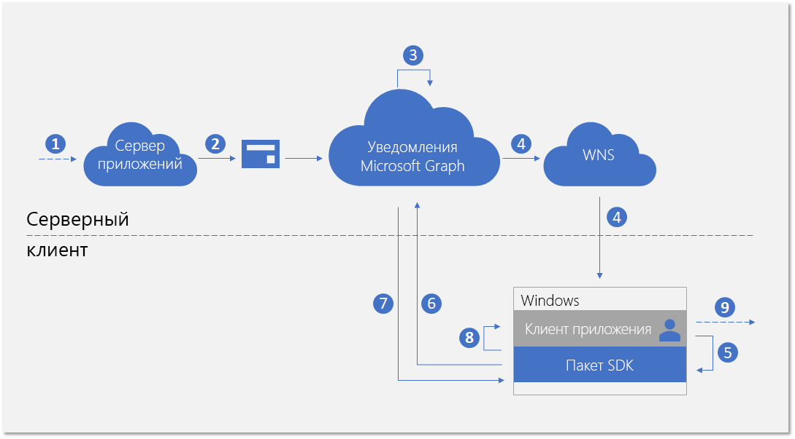
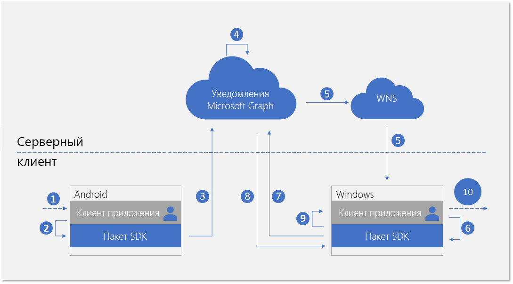
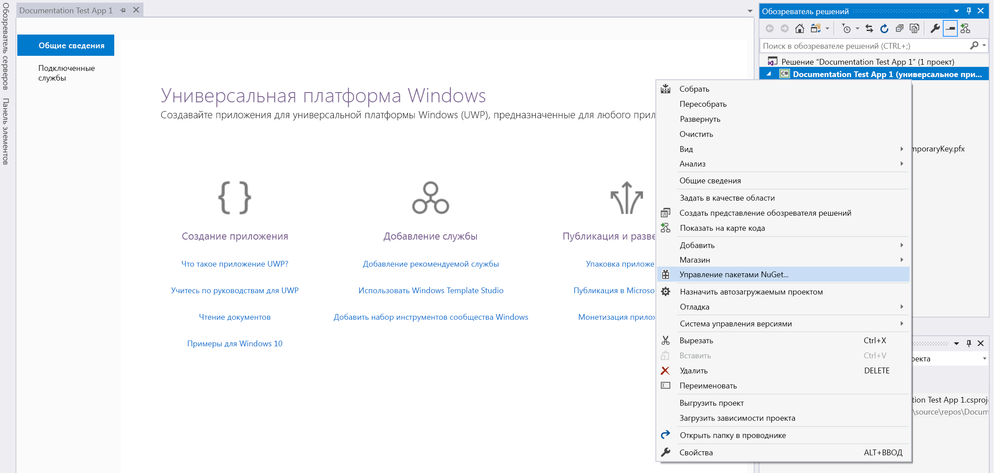
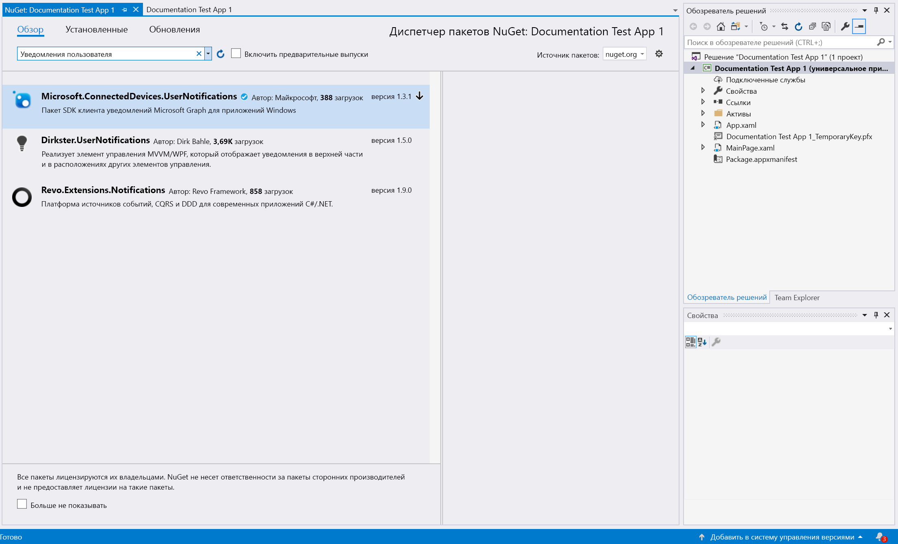
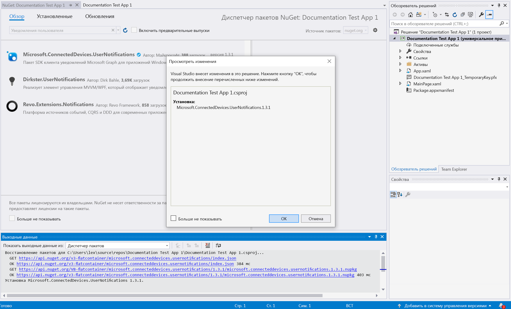

# <a name="integrate-your-windows-uwp-app-with-the-client-side-sdk-for-user-notifications"></a><span data-ttu-id="4f8ce-103">Интеграция приложения UWP Windows с клиентским пакетом SDK для уведомления пользователей</span><span class="sxs-lookup"><span data-stu-id="4f8ce-103">Integrate your Windows UWP app with the client-side SDK for user notifications</span></span>

<span data-ttu-id="4f8ce-104">После [регистрации своего приложения](notifications-integration-app-registration.md) на портале Azure и внедрения [использования разных устройств](notifications-integration-cross-device-experiences-onboarding.md) в Центре разработки партнеров следующий этап состоит в интеграции вашего клиентского приложения с клиентским пакетом SDK для приложений UWP Windows.</span><span class="sxs-lookup"><span data-stu-id="4f8ce-104">After you [register your app](notifications-integration-app-registration.md) in the Azure Portal and onboard your [cross-device experiences](notifications-integration-cross-device-experiences-onboarding.md) in the Partner Dev Center, the next step is to integrate your client app with the client-side SDK for Windows UWP apps.</span></span>  

<span data-ttu-id="4f8ce-105">С помощью клиентского пакета SDK ваше приложение может выполнять необходимые действия регистрации, чтобы начать получение уведомлений, опубликованных вашим сервером приложений и предназначенных для вошедшего пользователя.</span><span class="sxs-lookup"><span data-stu-id="4f8ce-105">With the client-side SDK, your app can perform the necessary registration steps to start receiving notifications published from your app server targeted at the user who is currently signed in.</span></span> <span data-ttu-id="4f8ce-106">После этого SDK управляет уведомлениями на стороне клиента, включая получение новых входящих уведомлений, управление состоянием уведомлений для осуществления таких сценариев, как универсальное закрытие и получение полного журнала уведомлений.</span><span class="sxs-lookup"><span data-stu-id="4f8ce-106">The SDK then manages the notifications on the client side, including receiving new incoming notifications, managing the state of notifications to achieve scenarios like universal dismiss, and retrieving full notification history.</span></span> 

## <a name="new-incoming-notification-flow"></a><span data-ttu-id="4f8ce-107">Поток новых входящих уведомлений</span><span class="sxs-lookup"><span data-stu-id="4f8ce-107">New incoming notification flow</span></span>

<span data-ttu-id="4f8ce-108">Поток данных для получения новых входящих уведомлений показан на схеме ниже.</span><span class="sxs-lookup"><span data-stu-id="4f8ce-108">For receiving new incoming notifications, the data flow is shown in the following diagram.</span></span>



<span data-ttu-id="4f8ce-110">Этот процесс включает несколько компонентов:</span><span class="sxs-lookup"><span data-stu-id="4f8ce-110">The process involves a few components:</span></span>

* <span data-ttu-id="4f8ce-111">Сервер приложений — серверный компонент вашего приложения</span><span class="sxs-lookup"><span data-stu-id="4f8ce-111">App server - The back end of your application</span></span>
* <span data-ttu-id="4f8ce-112">Клиент приложения — внешний интерфейс вашего приложения (приложение UWP, приложение Android или приложение iOS)</span><span class="sxs-lookup"><span data-stu-id="4f8ce-112">App client - The front end of your application (a UWP app, an Android app, or an iOS app)</span></span>
* <span data-ttu-id="4f8ce-113">Уведомления Microsoft Graph — компонент службы, позволяющий публиковать, хранить и синхронизировать уведомления пользователей на разных экземплярах клиентов приложения для разных устройств и платформ</span><span class="sxs-lookup"><span data-stu-id="4f8ce-113">Microsoft Graph notifications - The service component that enables user notifications to be published, stored, and synced across different instances of app clients across devices and platforms</span></span>
* <span data-ttu-id="4f8ce-114">WNS — служба push-уведомлений Windows, используемая уведомлениями Microsoft Graph для отправки сигналов клиентам</span><span class="sxs-lookup"><span data-stu-id="4f8ce-114">WNS - The Windows push notification service that Microsoft Graph notifications uses to signal the clients</span></span>

<span data-ttu-id="4f8ce-115">На схеме показаны следующие шаги:</span><span class="sxs-lookup"><span data-stu-id="4f8ce-115">The diagram shows the following steps:</span></span> 

1. <span data-ttu-id="4f8ce-116">Логика приложения.</span><span class="sxs-lookup"><span data-stu-id="4f8ce-116">Application logic.</span></span> <span data-ttu-id="4f8ce-117">Этот шаг фиксирует событие, запускающее публикацию уведомления для пользователя.</span><span class="sxs-lookup"><span data-stu-id="4f8ce-117">This step captures what triggers the notification to be published to the user.</span></span> <span data-ttu-id="4f8ce-118">Эта логика зависит от приложения и может относиться к обновлению события или данных других элементов в Microsoft Graph, например новому событию календаря, назначению задачи или другому действию, о котором ваша служба приложений хочет уведомить пользователя.</span><span class="sxs-lookup"><span data-stu-id="4f8ce-118">This is app-specific logic, and can be an event or data update about something else in Microsoft Graph, such as a new calendar event or task assignment, or else your app service wants to notify the user about.</span></span>
2. <span data-ttu-id="4f8ce-119">Сервер приложений публикует уведомление для целевого пользователя с помощью API уведомлений Microsoft Graph.</span><span class="sxs-lookup"><span data-stu-id="4f8ce-119">The app server publishes a notification to the targeted user via the Microsoft Graph notifications API.</span></span> <span data-ttu-id="4f8ce-120">Дополнительные сведения см. в статье [Серверная интеграция](notifications-integrating-app-server.md).</span><span class="sxs-lookup"><span data-stu-id="4f8ce-120">For more details, see [server side integration](notifications-integrating-app-server.md).</span></span>
3. <span data-ttu-id="4f8ce-121">После получения веб-запроса, содержащего новое уведомление, служба уведомлений Microsoft Graph безопасно сохраняет контент уведомления в облаке для этого приложения и этого пользователя.</span><span class="sxs-lookup"><span data-stu-id="4f8ce-121">On receiving the web request containing the new notification, Microsoft Graph notifications persists the content of the notification securely in the cloud for this app and this user.</span></span>
4. <span data-ttu-id="4f8ce-122">Для каждого экземпляра клиента приложения, подписывающегося на получение уведомлений для этого пользователя, служба уведомлений Microsoft Graph отправляет сигнал для уведомления клиента приложения посредством собственной службы push-уведомлений, предоставляемой операционной системой.</span><span class="sxs-lookup"><span data-stu-id="4f8ce-122">For each app client instance subscribing to receive notifications for this user, Microsoft Graph notifications sends a signal to notify the app client, via the native push service provided by the operating system.</span></span> <span data-ttu-id="4f8ce-123">В этом случае мы имеем дело с приложением UWP для Windows, использующим для отправки сигнала [необработанные push-уведомления WNS](/windows/uwp/design/shell/tiles-and-notifications/raw-notification-overview).</span><span class="sxs-lookup"><span data-stu-id="4f8ce-123">In this case, the application is a UWP app on Windows, and it uses [WNS push raw notification](/windows/uwp/design/shell/tiles-and-notifications/raw-notification-overview) to send the signal.</span></span> 
5. <span data-ttu-id="4f8ce-124">После того, как приложение получит сигнал с помощью входящего push-уведомления, оно обращается к SDK за получением изменений в хранилище уведомлений пользователя.</span><span class="sxs-lookup"><span data-stu-id="4f8ce-124">After the application is signaled by the incoming push notification, it asks the SDK to fetch for the changes in the user notification store.</span></span> 
6. <span data-ttu-id="4f8ce-125">SDK создает безопасное и соответствующее требованиям соединение с хранилищем уведомлений пользователя в Microsoft Graph.</span><span class="sxs-lookup"><span data-stu-id="4f8ce-125">The SDK establishes a secure and compliant connection with the user notifications store in Microsoft Graph.</span></span>
7. <span data-ttu-id="4f8ce-126">SDK получает изменения данных, то есть, в этом случае, — новый контент уведомления.</span><span class="sxs-lookup"><span data-stu-id="4f8ce-126">The SDK gets the data changes - in this case, the new notification contents.</span></span> 
8. <span data-ttu-id="4f8ce-127">SDK выполняет обратные вызовы события, чтобы уведомить приложение после успешного получения изменений.</span><span class="sxs-lookup"><span data-stu-id="4f8ce-127">The SDK fires event callbacks to notify the app after the changes are successfully retrieved.</span></span> 
9. <span data-ttu-id="4f8ce-128">Логика приложения.</span><span class="sxs-lookup"><span data-stu-id="4f8ce-128">Application logic.</span></span> <span data-ttu-id="4f8ce-129">Этот шаг фиксирует выбранное приложением действие внутри обратного вызова события.</span><span class="sxs-lookup"><span data-stu-id="4f8ce-129">This step captures what your app chooses to do inside the event callback.</span></span> <span data-ttu-id="4f8ce-130">Обычно это приводит к локальным изменениям данных приложения и локальным обновлениям пользовательского интерфейса.</span><span class="sxs-lookup"><span data-stu-id="4f8ce-130">Usually, this results in local app data changes and local UI updates.</span></span> <span data-ttu-id="4f8ce-131">В этом случае приложение обычно создает всплывающее уведомление, чтобы уведомить пользователя о содержимом уведомления.</span><span class="sxs-lookup"><span data-stu-id="4f8ce-131">In this case,  the app usually constructs a toast notification popup to notify the user about the notification contents.</span></span>

## <a name="notification-update-flow"></a><span data-ttu-id="4f8ce-132">Поток обновления уведомлений</span><span class="sxs-lookup"><span data-stu-id="4f8ce-132">Notification update flow</span></span>

<span data-ttu-id="4f8ce-133">Одно из основных преимуществ использования уведомлений Microsoft Graph заключается в безопасном сохранении уведомлений в облаке и преобразование их в тип ресурса с отслеживанием состояния.</span><span class="sxs-lookup"><span data-stu-id="4f8ce-133">One of the main benefits for using Microsoft Graph notifications is that it persists notifications in the cloud securely and turns them into a stateful resource type.</span></span> <span data-ttu-id="4f8ce-134">Это может помочь вашему приложению управлять правильным состоянием уведомлений и синхронизировать его на разных устройствах для этого же вошедшего пользователя в сценарии с разными устройствами.</span><span class="sxs-lookup"><span data-stu-id="4f8ce-134">Therefore, it can help your application to manage and sync the correct state of the notifications across different devices for the same signed in user in a cross-device scenario.</span></span> <span data-ttu-id="4f8ce-135">Если уведомление помечено как закрытое или прочитанное на одном устройстве, другие устройства могут уведомляться в режиме реального времени.</span><span class="sxs-lookup"><span data-stu-id="4f8ce-135">When a notification is marked as dismissed, or marked as read on one device, the other devices can be notified in real-time.</span></span> <span data-ttu-id="4f8ce-136">"Обработано однажды, закрыто везде" может стать истинным обещанием в рамках интерфейса уведомлений для ваших пользователей.</span><span class="sxs-lookup"><span data-stu-id="4f8ce-136">"Handled once, dismissed everywhere" can become a true promise as part of the notification experience for your users.</span></span> 

<span data-ttu-id="4f8ce-137">На схеме ниже показан поток данных для изменения состояния уведомления или удаления уведомления на одном устройстве и получения/обработки изменения состояния или удаления на другом устройстве.</span><span class="sxs-lookup"><span data-stu-id="4f8ce-137">The following diagram shows the data flow for changing the state of a notification or deleting the notification on one device, and receiving/handling the state change or the deletion on another device.</span></span>



<span data-ttu-id="4f8ce-139">Обратите внимание, что вторая часть потока похожа на поток для обработки новых входящих уведомлений.</span><span class="sxs-lookup"><span data-stu-id="4f8ce-139">Notice that the second part of the flow is similar to the flow for handling new incoming notifications.</span></span> <span data-ttu-id="4f8ce-140">Это сделано намеренно. Шаблон программирования SDK создан таким образом, чтобы клиент приложения мог обрабатывать все типы изменений данных в уведомлениях пользователей (новые входящие уведомления, изменения состояния уведомления, удаление уведомления) аналогичным образом.</span><span class="sxs-lookup"><span data-stu-id="4f8ce-140">This is by design - the  programming pattern of the SDK is designed so that the application client can handle all types of user notification data changes (new incoming notifications, notification state changes, notification deleted) in a similar way.</span></span>  

<span data-ttu-id="4f8ce-141">На схеме показаны следующие шаги:</span><span class="sxs-lookup"><span data-stu-id="4f8ce-141">The diagram shows the following steps:</span></span>

1. <span data-ttu-id="4f8ce-142">Логика приложения.</span><span class="sxs-lookup"><span data-stu-id="4f8ce-142">Application logic.</span></span> <span data-ttu-id="4f8ce-143">Некоторое событие запускает изменение или удаление уведомления.</span><span class="sxs-lookup"><span data-stu-id="4f8ce-143">Something triggers the notification to be changed or deleted.</span></span> <span data-ttu-id="4f8ce-144">В принципе, любое событие может вызвать изменение уведомления.</span><span class="sxs-lookup"><span data-stu-id="4f8ce-144">In general, any event can trigger a notification to change.</span></span> 
2. <span data-ttu-id="4f8ce-145">Приложение вызывает SDK клиента, чтобы обновить или удалить уведомление.</span><span class="sxs-lookup"><span data-stu-id="4f8ce-145">App calling into the client SDK to update or delete a notification.</span></span> <span data-ttu-id="4f8ce-146">В настоящее время представлено два свойства, связанных с изменением состояния: **userActionState** и **readState**, но ваше приложение может определять эти состояния и необходимость их обновления.</span><span class="sxs-lookup"><span data-stu-id="4f8ce-146">Currently, we expose two properties regarding state changes - **userActionState** and **readState** - but your application can define these states and when they need to be updated.</span></span> <span data-ttu-id="4f8ce-147">Например, если пользователь закрывает всплывающее уведомление, вы можете обновить свойство **userActionState**, присвоив ему значение Dismissed.</span><span class="sxs-lookup"><span data-stu-id="4f8ce-147">For example, when a user dismisses the notification popup, you can update the **userActionState** to be Dismissed.</span></span> <span data-ttu-id="4f8ce-148">Когда пользователь щелкает всплывающее уведомление и запускает приложение для использования соответствующего контента приложения, вы можете обновить свойство **userActionState**, присвоив ему значение Activated, и обновить свойство **readState**, присвоив ему значение Read.</span><span class="sxs-lookup"><span data-stu-id="4f8ce-148">When a user clicks the notification popup and launches the app to consume corresponding app content, you can update the **userActionState** to be Activated and update the **readState** to be Read.</span></span> 
3. <span data-ttu-id="4f8ce-149">После вызова соответствующего API для обновления или удаления уведомления пакет SDK вызовет хранилище уведомлений пользователя в облаке, чтобы развернуть это изменение для других экземпляров клиента приложения с этим вошедшим пользователем.</span><span class="sxs-lookup"><span data-stu-id="4f8ce-149">After the corresponding API is called to update or delete a notification, the SDK will call into the user notification store in the cloud in order to fan-out this change to the other app client instances with the same signed in user.</span></span> 
4. <span data-ttu-id="4f8ce-150">После получения от клиента запроса на обновление или удаление служба уведомлений Microsoft Graph обновит хранилище уведомлений и определит другие экземпляры клиентов приложения, подписанные на это изменение.</span><span class="sxs-lookup"><span data-stu-id="4f8ce-150">On receiving the update/delete request from a client, Microsoft Graph notifications will update the notification store, and identify the other app client instances that subscribed to this change.</span></span>
5. <span data-ttu-id="4f8ce-151">Для каждой подписки экземпляра клиента приложения служба уведомлений Microsoft Graph отправляет сигнал для уведомления клиента приложения посредством собственной службы push-уведомлений, предоставляемой операционной системой.</span><span class="sxs-lookup"><span data-stu-id="4f8ce-151">For each app client subscription, Microsoft Graph notifications sends a signal to notify the app client, via the native push service provided by the operating system.</span></span> <span data-ttu-id="4f8ce-152">В этом случае мы имеем дело с приложением UWP для Windows, использующим для отправки сигнала [необработанные push-уведомления WNS](/windows/uwp/design/shell/tiles-and-notifications/raw-notification-overview).</span><span class="sxs-lookup"><span data-stu-id="4f8ce-152">In this case, this is a UWP app on Windows, and it uses [WNS push raw notification](/windows/uwp/design/shell/tiles-and-notifications/raw-notification-overview) to send the signal.</span></span> 
6. <span data-ttu-id="4f8ce-153">После того, как приложение получит сигнал с помощью входящего push-уведомления, оно обращается к SDK за получением изменений в хранилище уведомлений пользователя.</span><span class="sxs-lookup"><span data-stu-id="4f8ce-153">After the application is signaled by the incoming push notification, it asks the SDK to fetch for the changes in the user notification store.</span></span> 
7. <span data-ttu-id="4f8ce-154">SDK создает безопасное и соответствующее требованиям соединение с хранилищем уведомлений пользователя в Microsoft Graph.</span><span class="sxs-lookup"><span data-stu-id="4f8ce-154">The SDK establishes a secure and compliant connection with the user notifications store in Microsoft Graph.</span></span>
8. <span data-ttu-id="4f8ce-155">SDK получает изменения данных: в этом случае изменениями являются обновления состояния уведомления или удаления уведомления.</span><span class="sxs-lookup"><span data-stu-id="4f8ce-155">The SDK gets the data changes - in this case, the changes are notification state updates or notification deletions.</span></span> 
9. <span data-ttu-id="4f8ce-156">SDK выполняет обратные вызовы события, чтобы уведомить приложение после успешного получения изменений.</span><span class="sxs-lookup"><span data-stu-id="4f8ce-156">The SDK fires event callbacks to notify the app after the changes are successfully retrieved.</span></span> 
10. <span data-ttu-id="4f8ce-157">Логика приложения.</span><span class="sxs-lookup"><span data-stu-id="4f8ce-157">Application logic.</span></span> <span data-ttu-id="4f8ce-158">Этот шаг фиксирует выбранное приложением действие внутри обратного вызова события.</span><span class="sxs-lookup"><span data-stu-id="4f8ce-158">This step captures what your app chooses to do inside the event callback.</span></span> <span data-ttu-id="4f8ce-159">Обычно это приводит к локальным изменениям данных приложения и локальным обновлениям пользовательского интерфейса.</span><span class="sxs-lookup"><span data-stu-id="4f8ce-159">Usually, this results in local app data changes and local UI updates.</span></span> <span data-ttu-id="4f8ce-160">В этом случае приложение должно локально обновить пользовательский интерфейс, чтобы отобразить изменение состояния, так как имеются обновления уведомлений.</span><span class="sxs-lookup"><span data-stu-id="4f8ce-160">In this case, because there are notification updates, the app should update the UI locally to reflect the state change.</span></span> <span data-ttu-id="4f8ce-161">Например, если уведомление помечено как активированное, вы можете удалить соответствующее всплывающее уведомление в центре уведомлений Windows, чтобы достичь результата "обработано однажды, закрыто везде".</span><span class="sxs-lookup"><span data-stu-id="4f8ce-161">For example, if a notification is marked as activated, you can remove the corresponding toast notification popup inside Windows action center to achieve "handled once, dismissed everywhere".</span></span> 

<span data-ttu-id="4f8ce-162">Дополнительные сведения об уведомлениях Microsoft Graph см. в статье  [Общие сведения об уведомлениях Microsoft Graph](notifications-concept-overview.md).</span><span class="sxs-lookup"><span data-stu-id="4f8ce-162">For more information about Microsoft Graph notifications, see [Microsoft Graph Notifications overview](notifications-concept-overview.md).</span></span> <span data-ttu-id="4f8ce-163">Дополнительные сведения о всех действиях, требующихся для интеграции с уведомлениями Microsoft Graph, см. в [обзоре интеграции](notifications-integration-e2e-overview.md) уведомлений Microsoft Graph.</span><span class="sxs-lookup"><span data-stu-id="4f8ce-163">For more information about the steps required to integrate with Microsoft Graph notifications from end to end, see Microsoft Graph notifications [integration overview](notifications-integration-e2e-overview.md).</span></span>

## <a name="adding-the-sdk-to-your-project"></a><span data-ttu-id="4f8ce-164">Добавление SDK в проект</span><span class="sxs-lookup"><span data-stu-id="4f8ce-164">Adding the SDK to your project</span></span>

<span data-ttu-id="4f8ce-165">В Windows клиентский пакет SDK — это пакет NuGet, предоставляемый отдельно от операционной системы Windows.</span><span class="sxs-lookup"><span data-stu-id="4f8ce-165">On Windows, the client-side SDK is a NuGet package that ships outside of the Windows operating system.</span></span> <span data-ttu-id="4f8ce-166">Этот интерфейс API доступен в C#, C++ и WinJS.</span><span class="sxs-lookup"><span data-stu-id="4f8ce-166">This API is available in C#, C++, and WinJS.</span></span> 

<span data-ttu-id="4f8ce-167">Скачайте пакет NuGet для SDK уведомлений Microsoft Graph, относящегося к приложениям Windows, на сайте [nuget](https://www.nuget.org/packages/Microsoft.ConnectedDevices.UserNotifications) или используйте следующие действия, чтобы скачать его из своего решения приложения в Visual Studio:</span><span class="sxs-lookup"><span data-stu-id="4f8ce-167">Download the NuGet package for the Microsoft Graph notifications SDK for Windows apps on [nuget](https://www.nuget.org/packages/Microsoft.ConnectedDevices.UserNotifications), or use the following steps to download it from your app solution in Visual Studio:</span></span> 

<span data-ttu-id="4f8ce-168">В Visual Studio щелкните проект правой кнопкой мыши, чтобы вызвать контекстное меню, и щелкните пункт **Управление пакетами NuGet...**.</span><span class="sxs-lookup"><span data-stu-id="4f8ce-168">In Visual Studio, right-click the project to bring up the context menu, and then click **Manage NuGet Packages…**.</span></span>



<span data-ttu-id="4f8ce-170">Перейдите на вкладку **Обзор** и выполните поиск Microsoft.ConnectedDevices.UserNotifications.</span><span class="sxs-lookup"><span data-stu-id="4f8ce-170">Go to the **Browse** tab, and search for Microsoft.ConnectedDevices.UserNotifications.</span></span>



<span data-ttu-id="4f8ce-172">В результатах поиска отобразится клиентский SDK уведомлений Microsoft Graph.</span><span class="sxs-lookup"><span data-stu-id="4f8ce-172">You will see the Microsoft Graph notifications client-side SDK in the search results.</span></span> <span data-ttu-id="4f8ce-173">Для его установки нажмите кнопку **Установить**.</span><span class="sxs-lookup"><span data-stu-id="4f8ce-173">Click the **Install** button to install it.</span></span> 



<span data-ttu-id="4f8ce-175">После завершения установки пакет отображается в разделе **Ссылки** в обозревателе решений.</span><span class="sxs-lookup"><span data-stu-id="4f8ce-175">After the installation finishes, the package shows up under **References** in the Solution Explorer.</span></span> 

<span data-ttu-id="4f8ce-176">Дополнительные сведения о добавлении и использовании пакетов NuGet в приложении UWP см. в следующих статьях:</span><span class="sxs-lookup"><span data-stu-id="4f8ce-176">For more details about including and consuming NuGet packages from your UWP app, see:</span></span>

* [<span data-ttu-id="4f8ce-177">Использование пакетов с сайта nuget.org</span><span class="sxs-lookup"><span data-stu-id="4f8ce-177">Use packages from nuget.org</span></span>](/azure/devops/artifacts/nuget/upstream-sources?tabs=new-nav&view=vsts)
* [<span data-ttu-id="4f8ce-178">Краткое руководство. Установка и использование пакета в Visual Studio</span><span class="sxs-lookup"><span data-stu-id="4f8ce-178">Quickstart: Install and use a package in Visual Studio</span></span>](/nuget/quickstart/install-and-use-a-package-in-visual-studio)


## <a name="initializing-the-connected-device-platforms"></a><span data-ttu-id="4f8ce-179">Инициализация платформы подключенных устройств</span><span class="sxs-lookup"><span data-stu-id="4f8ce-179">Initializing the Connected Device Platforms</span></span>

<span data-ttu-id="4f8ce-180">Клиентский SDK создан на основе инфраструктуры, называемой платформой подключенных устройств.</span><span class="sxs-lookup"><span data-stu-id="4f8ce-180">The client-side SDK is built on top of an infrastructure called Connected Device Platform.</span></span> <span data-ttu-id="4f8ce-181">Перед использованием каких-либо функций необходимо инициализировать платформу в вашем приложении.</span><span class="sxs-lookup"><span data-stu-id="4f8ce-181">Before you can use any features, the platform must be initialized within your app.</span></span> <span data-ttu-id="4f8ce-182">Действия по инициализации должны находиться в методе **OnLaunched** или **onActivated** класса main, так как они должны быть выполнены до использования сценариев уведомлений.</span><span class="sxs-lookup"><span data-stu-id="4f8ce-182">The initialization steps should occur in your main class **OnLaunched** or **onActivated** method, because they are required before the notification scenarios can take place.</span></span>

<span data-ttu-id="4f8ce-183">Необходимо создать и инициализировать платформу путем создания экземпляра класса **ConnectedDevicesPlatform**.</span><span class="sxs-lookup"><span data-stu-id="4f8ce-183">You must construct and initialize the platform by instantiating the **ConnectedDevicesPlatform** class.</span></span> <span data-ttu-id="4f8ce-184">Перед этим подключите обработчики событий, как показано здесь, так как после запуска платформы могут начать возникать события.</span><span class="sxs-lookup"><span data-stu-id="4f8ce-184">Before doing that, make sure to hook up event handlers, as shown, because after platform is started, the events might begin to fire.</span></span> 


```C#
var platform = new ConnectedDevicesPlatform();
platform.AccountManager.AccessTokenRequested += AccountManager_AccessTokenRequestedAsync;
platform.AccountManager.AccessTokenInvalidated += AccountManager_AccessTokenInvalidated;
platform.NotificationRegistrationManager.NotificationRegistrationStateChanged += NotificationRegistrationManager_NotificationRegistrationStateChanged;
platform.Start();
```

### <a name="handling-account-access-token"></a><span data-ttu-id="4f8ce-185">Обработка маркера доступа учетной записи</span><span class="sxs-lookup"><span data-stu-id="4f8ce-185">Handling account access token</span></span>

<span data-ttu-id="4f8ce-186">Все веб-вызовы, выполняемые SDK, включая получение контента нового входящего уведомления, обновление состояний уведомлений и т. д., считываются из данных пользователя или записываются в них, поэтому всегда требуется действующий маркер доступа.</span><span class="sxs-lookup"><span data-stu-id="4f8ce-186">All the web calls the SDK makes, including retrieving the content of a new incoming notification, updating notification states, and more, are reading from or writing to the user's data, and therefore always require a valid access token.</span></span> <span data-ttu-id="4f8ce-187">При использовании SDK требуется обработка следующих событий, вызываемых, когда маркер доступа запрашивается или становится недействительным. Это необходимо, чтобы правильно обрабатывать маркер доступа пользователя после инициализации платформы.</span><span class="sxs-lookup"><span data-stu-id="4f8ce-187">The SDK requires you to handle the following events - invoked when an access token is requested or invalidated - to make sure that after the platform is initialized, your access token for the user is handled correctly.</span></span> 

#### <a name="accountmanager_accesstokenrequestedasync"></a><span data-ttu-id="4f8ce-188">AccountManager_AccessTokenRequestedAsync</span><span class="sxs-lookup"><span data-stu-id="4f8ce-188">AccountManager_AccessTokenRequestedAsync</span></span>

<span data-ttu-id="4f8ce-189">Полную реализацию см. в [примере приложения Windows](https://github.com/Microsoft/project-rome/blob/master/Windows/samples/GraphNotificationsSample/ConnectedDevicesManager.cs).</span><span class="sxs-lookup"><span data-stu-id="4f8ce-189">For a full implementation, see the [Windows app sample](https://github.com/Microsoft/project-rome/blob/master/Windows/samples/GraphNotificationsSample/ConnectedDevicesManager.cs).</span></span> 

```C#
private async void AccountManager_AccessTokenRequestedAsync(ConnectedDevicesAccountManager sender, ConnectedDevicesAccessTokenRequestedEventArgs args)
{
    private List<Account> accounts = new List<Account>();
    var account = accounts.Find((x) => x.EqualsTo(args.Request.Account));
    if (account != null)
    {
        try
        {
            var accessToken = await account.GetAccessTokenAsync(args.Request.Scopes);
            args.Request.CompleteWithAccessToken(accessToken);
        }
        catch (Exception ex)
        {
            args.Request.CompleteWithErrorMessage(ex.Message);
        }
    }
}
```

#### <a name="accountmanager_accesstokeninvalidated"></a><span data-ttu-id="4f8ce-190">AccountManager_AccessTokenInvalidated</span><span class="sxs-lookup"><span data-stu-id="4f8ce-190">AccountManager_AccessTokenInvalidated</span></span>

<span data-ttu-id="4f8ce-191">Полную реализацию см. в [примере приложения Windows](https://github.com/Microsoft/project-rome/blob/master/Windows/samples/GraphNotificationsSample/ConnectedDevicesManager.cs).</span><span class="sxs-lookup"><span data-stu-id="4f8ce-191">For a full implementation, see the [Windows app sample](https://github.com/Microsoft/project-rome/blob/master/Windows/samples/GraphNotificationsSample/ConnectedDevicesManager.cs).</span></span> 

```C#
private void AccountManager_AccessTokenInvalidated(ConnectedDevicesAccountManager sender, ConnectedDevicesAccessTokenInvalidatedEventArgs args)
{
    Logger.Instance.LogMessage($"Token Invalidated. AccountId: {args.Account.Id}, AccountType: {args.Account.Id}, scopes: {string.Join(" ", args.Scopes)}");
}
```

### <a name="handling-push-registration-expiration"></a><span data-ttu-id="4f8ce-192">Обработка истечения срока регистрации для push-уведомлений</span><span class="sxs-lookup"><span data-stu-id="4f8ce-192">Handling push registration expiration</span></span> 

<span data-ttu-id="4f8ce-193">Уведомления Microsoft Graph используют WNS (собственная платформа push-уведомлений в Windows) для отправки сигнала клиентскому приложению об изменениях данных в уведомлениях пользователя.</span><span class="sxs-lookup"><span data-stu-id="4f8ce-193">Microsoft Graph notifications uses WNS, the native push platform on Windows, to signal the client application on user notifications data changes.</span></span> <span data-ttu-id="4f8ce-194">Это происходит, когда новые входящие уведомления публикуются с вашего сервера приложений или когда обновляется состояние любого уведомления на другом устройстве с тем же вошедшим пользователем в сценарии с разными устройствами.</span><span class="sxs-lookup"><span data-stu-id="4f8ce-194">This happens when new incoming notifications are published from your app server, or when any notification's state is updated on a different device with the same signed in user in a cross-device scenario.</span></span> 

<span data-ttu-id="4f8ce-195">Поэтому требуется действующий канал WNS, обеспечивающий передачу необработанных push-уведомлений.</span><span class="sxs-lookup"><span data-stu-id="4f8ce-195">For this reason, a valid WNS channel that allows raw push notifications to come through successfully is required.</span></span> <span data-ttu-id="4f8ce-196">Следующий обратный вызов события обрабатывает истечение срока действия push-канала WNS.</span><span class="sxs-lookup"><span data-stu-id="4f8ce-196">The following event callback handles WNS push channel expirations.</span></span> 

#### <a name="notificationregistrationmanager_notificationregistrationstatechanged"></a><span data-ttu-id="4f8ce-197">NotificationRegistrationManager_NotificationRegistrationStateChanged</span><span class="sxs-lookup"><span data-stu-id="4f8ce-197">NotificationRegistrationManager_NotificationRegistrationStateChanged</span></span>

<span data-ttu-id="4f8ce-198">Полную реализацию см. в [примере приложения Windows](https://github.com/Microsoft/project-rome/blob/master/Windows/samples/GraphNotificationsSample/ConnectedDevicesManager.cs).</span><span class="sxs-lookup"><span data-stu-id="4f8ce-198">For a full implementation, see the [Windows app sample](https://github.com/Microsoft/project-rome/blob/master/Windows/samples/GraphNotificationsSample/ConnectedDevicesManager.cs).</span></span> 

```C#
private async void NotificationRegistrationManager_NotificationRegistrationStateChanged(ConnectedDevicesNotificationRegistrationManager sender, ConnectedDevicesNotificationRegistrationStateChangedEventArgs args)
{
    if ((args.State == ConnectedDevicesNotificationRegistrationState.Expired) || (args.State == ConnectedDevicesNotificationRegistrationState.Expiring))
    {
        var account = m_accounts.Find((x) => x.EqualsTo(args.Account));
        if (account != null)
        {
            await account.RegisterAccountWithSdkAsync();
        }
    }
}
```

## <a name="signing-in-your-user"></a><span data-ttu-id="4f8ce-199">Вход пользователя в систему</span><span class="sxs-lookup"><span data-stu-id="4f8ce-199">Signing in your user</span></span>

<span data-ttu-id="4f8ce-200">Уведомления Microsoft Graph, как и многие другие типы ресурсов в Microsoft Graph, ориентированы на пользователей.</span><span class="sxs-lookup"><span data-stu-id="4f8ce-200">Microsoft Graph notifications, like many other resource types inside Microsoft Graph, are centralized around users.</span></span> <span data-ttu-id="4f8ce-201">Чтобы приложение могло подписаться на уведомления и могло начать получать уведомления для пользователя, вошедшего в систему, сначала необходимо получить действующий маркер OAuth для использования в процессе регистрации.</span><span class="sxs-lookup"><span data-stu-id="4f8ce-201">In order for your app to subscribe to and start receiving notifications for the signed in user, you first need to obtain a valid OAuth token to be used in the registration process.</span></span> <span data-ttu-id="4f8ce-202">Вы можете использовать любой удобный способ создания маркеров OAuth и управления ими.</span><span class="sxs-lookup"><span data-stu-id="4f8ce-202">You can use your preferred method of generating and managing the OAuth tokens.</span></span> <span data-ttu-id="4f8ce-203">В примере приложения используется ADAL.</span><span class="sxs-lookup"><span data-stu-id="4f8ce-203">The sample app uses ADAL.</span></span> 

<span data-ttu-id="4f8ce-204">Если вы используете учетную запись Майкрософт, необходимо включить следующие разрешения в запрос входа: `wl.offline_access"`, `ccs.ReadWrite`, `wns.connect`, `asimovrome.telemetry` и `https://activity.windows.com/UserActivity.ReadWrite.CreatedByApp`.</span><span class="sxs-lookup"><span data-stu-id="4f8ce-204">If you're using a Microsoft account, you will need to include the following permissions in your sign-in request: `wl.offline_access"`, `ccs.ReadWrite`, `wns.connect`, `asimovrome.telemetry`, and `https://activity.windows.com/UserActivity.ReadWrite.CreatedByApp`.</span></span> 

<span data-ttu-id="4f8ce-205">Если вы используете учетную запись Azure AD, необходимо запросить следующую аудиторию: `https://cdpcs.access.microsoft.com`.</span><span class="sxs-lookup"><span data-stu-id="4f8ce-205">If you're using an Azure AD account, you'll need to request the following audience: `https://cdpcs.access.microsoft.com`.</span></span>


## <a name="adding-the-user-account-to-the-platform"></a><span data-ttu-id="4f8ce-206">Добавление учетной записи пользователя в платформу</span><span class="sxs-lookup"><span data-stu-id="4f8ce-206">Adding the user account to the platform</span></span> 

<span data-ttu-id="4f8ce-207">Необходимо зарегистрировать в SDK учетную запись вошедшего пользователя.</span><span class="sxs-lookup"><span data-stu-id="4f8ce-207">You need to register the signed in user account with the SDK.</span></span> <span data-ttu-id="4f8ce-208">Для этого необходимо добавить учетную запись и зарегистрировать push-канал, чтобы получать начальные push-уведомления через службу WNS.</span><span class="sxs-lookup"><span data-stu-id="4f8ce-208">This involves adding the account and registering a push channel to receive the initial push notifications through WNS.</span></span> 

```C#
var account = new ConnectedDevicesAccount(accountId, accountType);           
var addResult = await platform.AccountManager.AddAccountAsync(account);
if (addResult.Status != ConnectedDevicesAccountAddedStatus.Success)
{
    throw new Exception("Add account failed with " + addResult.Status + "!");
}            

var pushChannel = await PushNotificationChannelManager.CreatePushNotificationChannelForApplicationAsync();
ConnectedDevicesNotificationRegistration registration = new ConnectedDevicesNotificationRegistration();
registration.Type = ConnectedDevicesNotificationType.WNS;
registration.Token = pushChannel.Uri;
var registerResult = await platform.NotificationRegistrationManager.RegisterAsync(account, registration);
if (registerResult.Status != ConnectedDevicesNotificationRegistrationStatus.Success)
{
    throw new Exception("Register push channel failed with " + registerResult.Status + "!");
}
```

## <a name="subscribing-to-receive-users-notifications"></a><span data-ttu-id="4f8ce-209">Подписка для получения уведомлений пользователей</span><span class="sxs-lookup"><span data-stu-id="4f8ce-209">Subscribing to receive user's notifications</span></span> 

<span data-ttu-id="4f8ce-210">Для вашего приложения необходимо создать экземпляр объекта **UserDataFeed** для вошедшего пользователя.</span><span class="sxs-lookup"><span data-stu-id="4f8ce-210">You need to instantiate a **UserDataFeed** object for your application for this signed in user.</span></span> <span data-ttu-id="4f8ce-211">Ваше приложение определяется по идентификатору кроссплатформенного приложения, указанному в процессе [внедрения использования разных устройств](notifications-integration-cross-device-experiences-onboarding.md).</span><span class="sxs-lookup"><span data-stu-id="4f8ce-211">Your application is identified by the cross-platform app ID you provided during the [Cross-Device Experiences onboarding](notifications-integration-cross-device-experiences-onboarding.md) process.</span></span>

```C#
UserDataFeed feed = UserDataFeed.GetForAccount(account, platform, "YOUR_HOST_HERE");

var scopes = new List<UserDataFeedSyncScope> { UserNotificationChannel.SyncScope };
var subscribeResult = await feed.SubscribeToSyncScopesAsync(scopes);
if (!subscribeResult)
{
    throw new Exception("Subsribe failed!");
}
var channel = new UserNotificationChannel(feed);
var reader = channel.CreateReader();
reader.DataChanged += Reader_DataChanged;
```

## <a name="receiving-and-managing-user-notifications"></a><span data-ttu-id="4f8ce-212">Получение уведомлений пользователей и управление ими</span><span class="sxs-lookup"><span data-stu-id="4f8ce-212">Receiving and managing user notifications</span></span>

<span data-ttu-id="4f8ce-213">На схеме, представленной ранее в этой статье, показано, что шаблоны программирования для обработки новых входящих уведомлений из сервера приложений и обновление или удаление уведомления, запущенное из другого экземпляра клиента приложения, похожи.</span><span class="sxs-lookup"><span data-stu-id="4f8ce-213">The flow diagram earlier in this topic shows that the programming patterns to handle a new incoming notifications from an app server and a notification update or deletion initiated from another app client instance are similar.</span></span> <span data-ttu-id="4f8ce-214">Ниже представлены действия для обработки этих изменений данных.</span><span class="sxs-lookup"><span data-stu-id="4f8ce-214">The following are the steps for handling these data changes.</span></span> 

### <a name="handling-incoming-push-notification-signal"></a><span data-ttu-id="4f8ce-215">Обработка сигналов входящих push-уведомлений</span><span class="sxs-lookup"><span data-stu-id="4f8ce-215">Handling incoming push notification signal</span></span>

<span data-ttu-id="4f8ce-216">Все типы изменений данных в уведомлениях пользователей создают сигнал, доставляемый клиентам приложений в виде push-уведомления.</span><span class="sxs-lookup"><span data-stu-id="4f8ce-216">All types of user notification data changes generate a signal that gets delivered to the app clients as a push notification.</span></span> <span data-ttu-id="4f8ce-217">Для приложений UWP Windows сигнал доставляется как необработанное push-уведомление WNS.</span><span class="sxs-lookup"><span data-stu-id="4f8ce-217">For Windows UWP apps, the signal is delivered as a WNS push raw notification.</span></span> <span data-ttu-id="4f8ce-218">После получения необработанного push-сигнала приложение должно вызвать метод **TryParse**, чтобы запустить в SDK получение изменений фактических данных от службы уведомлений Microsoft Graph.</span><span class="sxs-lookup"><span data-stu-id="4f8ce-218">On receiving the raw push signal, the app should call **TryParse** to trigger the SDK to fetch from the Microsoft Graph notifications service for the actual data changes.</span></span>

```C#
public async Task ReceiveNotificationAsync(string content)
{
    ConnectedDevicesNotification notification = ConnectedDevicesNotification.TryParse(content);
    if (notification != null)
    {
        await platform.ProcessNotificationAsync(notification);
    }
}
```

### <a name="handling-user-notification-data-changes"></a><span data-ttu-id="4f8ce-219">Обработка изменений данных в уведомлениях пользователей</span><span class="sxs-lookup"><span data-stu-id="4f8ce-219">Handling user notification data changes</span></span>

<span data-ttu-id="4f8ce-220">После получения пакетом SDK изменений данных выполняется обратный вызов события, при этом ожидается, что клиент приложения обработает создание, обновление или удаление уведомления.</span><span class="sxs-lookup"><span data-stu-id="4f8ce-220">After the SDK successfully fetches the data changes, an event callback is invoked and the app client is expected to handle notification creation, update, or deletion.</span></span>

```C#
private async void Reader_DataChanged(UserNotificationReader reader, object args)
{
    var notifications = await reader.ReadBatchAsync(UInt32.MaxValue);

    foreach (var notification in notifications)
    {
        // Handle notification changes based on change type;
    }
}
```


### <a name="update-state-of-a-notification"></a><span data-ttu-id="4f8ce-221">Обновление состояния уведомлений</span><span class="sxs-lookup"><span data-stu-id="4f8ce-221">Update state of a notification</span></span>

<span data-ttu-id="4f8ce-222">Если изменение состояния уведомления инициируется в этом экземпляре клиента приложения (например, если всплывающее уведомление на этом устройстве активировано пользователем), приложение должно вызвать SDK, чтобы обновить состояние уведомления для синхронизации изменения этого состояния на всех устройствах, используемых тем же пользователем.</span><span class="sxs-lookup"><span data-stu-id="4f8ce-222">If a notification state change is initiated from this app client instance (for example, if the toast notification popup on this device is activated by the user), the app needs to call the SDK to update the notification's state in order to have this state change synced across all devices used by the same user.</span></span> 

```C#
notification.UserActionState = UserNotificationUserActionState.Activated;
await notification.SaveAsync();
```

### <a name="delete-a-notification"></a><span data-ttu-id="4f8ce-223">Удаление уведомления</span><span class="sxs-lookup"><span data-stu-id="4f8ce-223">Delete a notification</span></span>

<span data-ttu-id="4f8ce-224">Если удаление уведомления инициируется в этом экземпляре клиента приложения (например, если связанная с этим уведомлением задача помечена как завершенная и удалена из базы данных вашего приложения), приложение должно вызвать SDK, чтобы удалить уведомление для синхронизации этого удаления на всех устройствах, используемых тем же пользователем.</span><span class="sxs-lookup"><span data-stu-id="4f8ce-224">If a notification deletion is initiated from this app client instance (for example, if the task corresponding to this notification is marked as complete and is removed from your app's database), the app needs to call the SDK to delete the notification in order to have this delete operation synced across all devices used by the same user.</span></span> 

<span data-ttu-id="4f8ce-225">Уведомление удаляется из хранилища уведомлений пользователя только при истечении срока действия уведомления или при удалении явным образом.</span><span class="sxs-lookup"><span data-stu-id="4f8ce-225">A notification is removed from the user notification store only if it is expired or explicitly deleted.</span></span> <span data-ttu-id="4f8ce-226">Уведомление пользователя не удаляется при обновлении свойства **UserActionState** с присвоением значения Dismissed, так как семантическое определение **UserActionState** задается самим приложением.</span><span class="sxs-lookup"><span data-stu-id="4f8ce-226">A user notification is not deleted when you update the **UserActionState** to be Dismissed, because the semantic definition of **UserActionState** is defined by the application itself.</span></span>

```C#
await channel.DeleteUserNotificationAsync(notification.Id);
```

## <a name="see-also"></a><span data-ttu-id="4f8ce-227">См. также</span><span class="sxs-lookup"><span data-stu-id="4f8ce-227">See also</span></span>

- <span data-ttu-id="4f8ce-228">[Справочник по API](/windows/project-rome/notifications/api-reference-for-windows/) содержит информацию о всех API-интерфейсах, связанных с функциями уведомлений в SDK.</span><span class="sxs-lookup"><span data-stu-id="4f8ce-228">[API reference](/windows/project-rome/notifications/api-reference-for-windows/) for the full set of APIs related to notification features in the SDK.</span></span> 
- <span data-ttu-id="4f8ce-229">[Пример клиентского кода](https://github.com/Microsoft/project-rome/tree/master/Windows/samples/GraphNotificationsSample) для приложений UWP Windows.</span><span class="sxs-lookup"><span data-stu-id="4f8ce-229">[Client-side sample](https://github.com/Microsoft/project-rome/tree/master/Windows/samples/GraphNotificationsSample) for Windows UWP apps.</span></span>
- <span data-ttu-id="4f8ce-230">[Пример серверного кода приложения](notifications-integrating-app-server.md) для публикации уведомлений.</span><span class="sxs-lookup"><span data-stu-id="4f8ce-230">[App server sample](notifications-integrating-app-server.md) for publishing notifications.</span></span>
