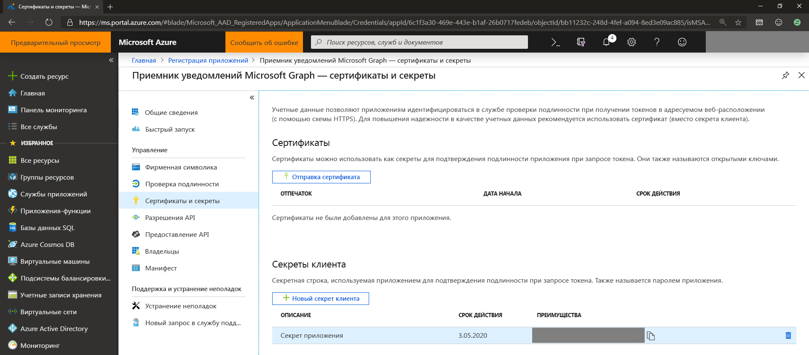
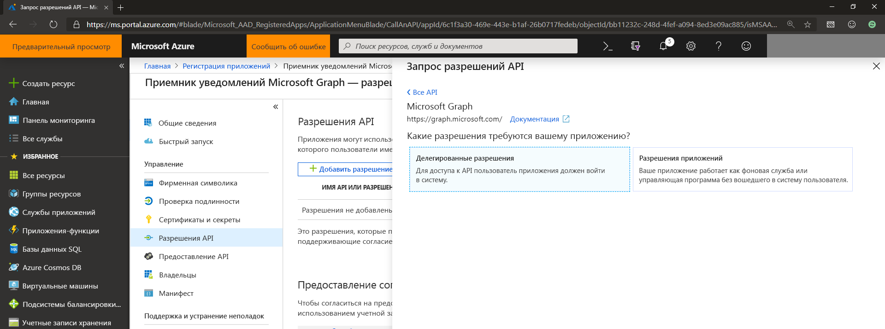
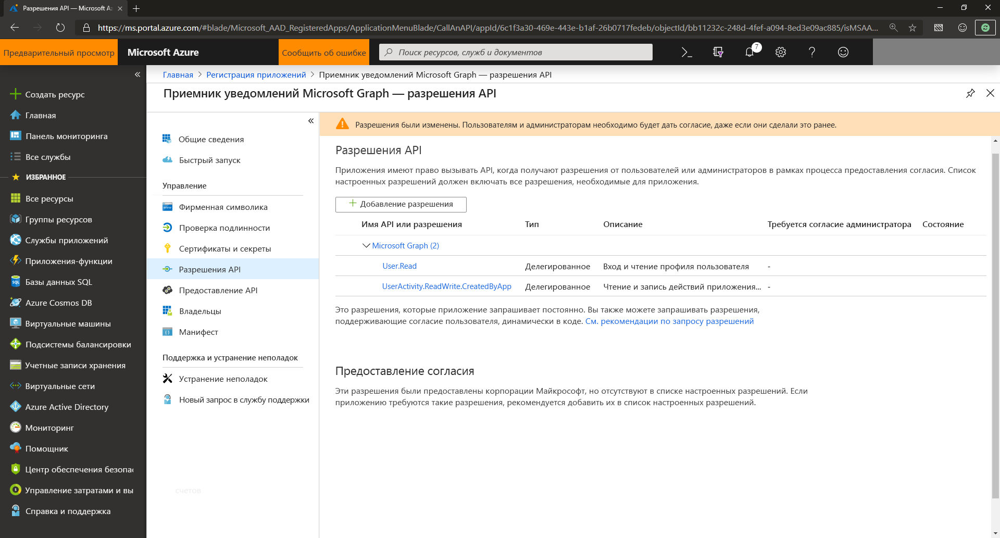

# Управление регистрацией приложений и разрешениями API для уведомлений Microsoft Graph (устарело)

> [!IMPORTANT]
> API уведомлений Microsoft Graph не рекомендуется использовать, Он прекратил возвращать данные в январе 2022 г. Дополнительные сведения об уведомлениях см. в [Центрах уведомлений Microsoft Azure](/azure/notification-hubs). Дополнительные сведения см. в записи блога [Прекращение поддержки API уведомлений Microsoft Graph (бета-версия)](https://devblogs.microsoft.com/microsoft365dev/retiring-microsoft-graph-notifications/).

Чтобы интегрировать в службу приложений уведомления Microsoft Graph, необходимо зарегистрировать свое приложение с помощью платформы удостоверений Майкрософт для поддержки учетных записей Майкрософт, рабочих или учебных учетных записей и объявить обязательные разрешение API.

## Регистрация приложения для поддержки учетных записей Майкрософт, рабочих или учебных учетных записей

Зарегистрируйте свое приложение на [портале Microsoft Azure](https://portal.azure.com/#home) для поддержки учетных записей Майкрософт, рабочих или учебных учетных записей. Если вы уже зарегистрировали свое приложение на [портале приложений Майкрософт](https://apps.dev.microsoft.com/), ваши существующие приложения отобразятся в новом улучшенном интерфейсе портала Azure.

Сведения о регистрации приложений см. в статье [Регистрация приложения с помощью платформы удостоверений Майкрософт](auth-register-app-v2.md). При регистрации приложения обязательно сохраните идентификатор приложения или идентификатор клиента под рукой. Вам потребуется этот идентификатор позднее при регистрации приложения для использования на разных устройствах в [Центре партнеров](https://partner.microsoft.com/) для клиентов Windows, Android и iOS.

> [!NOTE]
> Если у вас еще нет учетной записи Майкрософт и вы хотите ее получить, перейдите на страницу [учетной записи Майкрософт](https://account.microsoft.com/account). Если вы создаете приложение, требующее использования Azure AD версии 1.0 в качестве платформы проверки подлинности и удостоверений для рабочей или учебной учетной записи, см. статью [Библиотеки проверки подлинности Azure Active Directory](/azure/active-directory/develop/active-directory-authentication-libraries). Если вы хотите ознакомиться с новой единой платформой удостоверений Майкрософт (версия 2.0) или использовать ее, см. [сравнение конечной точки платформы удостоверений Майкрософт и конечной точки Azure AD версии 1.0](/azure/active-directory/develop/azure-ad-endpoint-comparison).

## Сертификаты и секреты приложения

Чтобы разрешить своему приложения самостоятельную идентификацию и проверку подлинности при получении маркеров проверки подлинности, можно отправить собственный сертификат или создать новый секрет клиента, выбрав пункт **Сертификаты и секреты** на портале Azure.
    

    
> [!NOTE]
> Если вы выбрали создание нового секрета клиента, обязательно скопируйте и сохраните его в надежном месте. Вы не сможете снова получить к нему доступ после закрытия портала.

## Разрешения API

Вам потребуется добавить дополнительные разрешения, чтобы использовать уведомления Microsoft Graph. Нажмите кнопку **Добавить разрешение** и в разделе интерфейсов API Майкрософт выберите **Microsoft Graph**, а затем щелкните вариант **Делегированные разрешения**.
    

    
Добавьте указанные ниже разрешения.

- User.Read — разрешает вашему приложению выполнять вход пользователя

- UserActivity.ReadWrite.CreatedByApp — разрешает подписку приложения на получение уведомлений

## Дальнейшие действия

Узнайте больше о [разрешениях и согласии](/azure/active-directory/develop/v2-permissions-and-consent) или просмотрите [справочник по разрешениям](./permissions-reference.md) Microsoft Graph.

Теперь, после регистрации своего приложения, посетите [Центр партнеров](https://partner.microsoft.com/), чтобы настроить приложение и выбрать соответствующие целевые платформы приложения (Windows, iOS или Android) для получения уведомлений, отправляемых через Microsoft Graph. Дополнительные сведения см. в статье [Внедрение использования на разных устройствах](notifications-integration-cross-device-experiences-onboarding.md). 

>[!NOTE]
>Если вам нужны только конечные веб-точки, можно пропустить регистрацию в Центре партнеров и перейти к настройке отправки уведомлений в [службе приложений](notifications-integrating-app-server.md).
