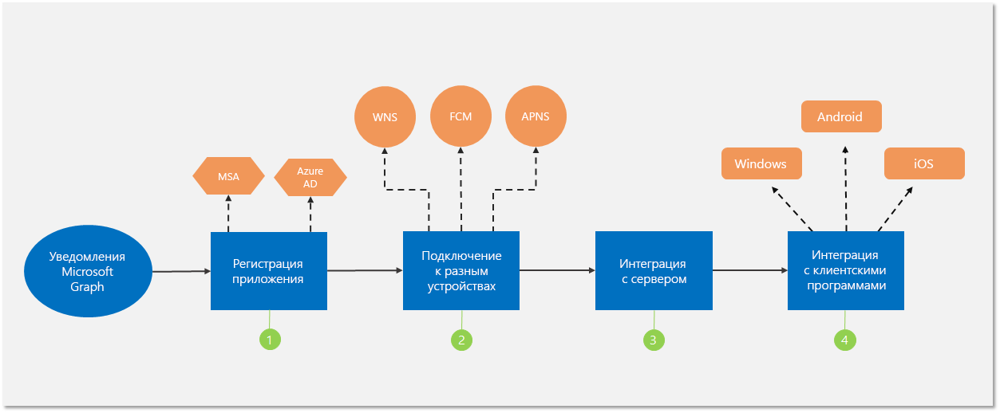

# Интеграция с уведомлениями Microsoft Graph (не рекомендуется)

> [!IMPORTANT]
> API уведомлений Microsoft Graph не рекомендуется использовать, Он прекратил возвращать данные в январе 2022 г. Дополнительные сведения об уведомлениях см. в [Центрах уведомлений Microsoft Azure](/azure/notification-hubs). Дополнительные сведения см. в записи блога [Прекращение поддержки API уведомлений Microsoft Graph (бета-версия)](https://devblogs.microsoft.com/microsoft365dev/retiring-microsoft-graph-notifications/).

Вы можете интегрировать в свои приложения уведомления Microsoft Graph с помощью нескольких простых действий, как показано на следующей схеме.

1.  [Зарегистрируйте](notifications-integration-app-registration.md) свое приложение на портале Microsoft Azure.

2. [Подключитесь](notifications-integration-cross-device-experiences-onboarding.md) к Центру партнеров или Центру разработки для Windows, чтобы получить удостоверение кроссплатформенного приложения и учетные данные push-уведомлений для Windows, iOS и Android.

3.  [Настройте свой сервер приложений](notifications-integrating-app-server.md) для отправки уведомлений через Microsoft Graph.

4.  [Интегрируйте](notifications-integrating-with-windows.md) новый [пакет SDK клиента уведомлений](https://aka.ms/GNSDK) в клиенты приложений для Windows, iOS, Android или веб-клиенты, чтобы получать уведомления и управлять ими.

> [!NOTE]
> Рекомендуем использовать новый, улучшенный и компактный [пакет SDK уведомлений](https://aka.ms/GNSDK) вместо [пакета SDK Project Rome](https://github.com/microsoft/project-rome) для различных устройств.
