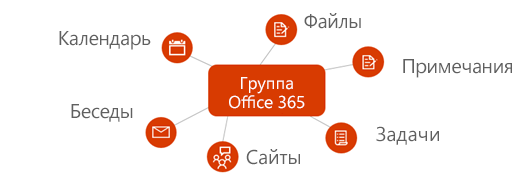
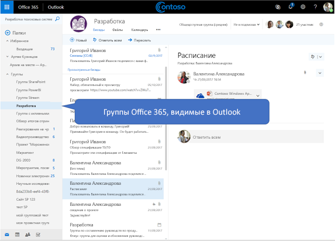

# Обзор групп Microsoft 365 в Microsoft Graph

Группы Microsoft 365 — фундаментальная служба, которая позволяет пользователям делиться беседами, файлами, заметками, календарями, планами и другими ресурсами. 

> [!VIDEO https://www.youtube-nocookie.com/embed/WB9w6QM9xIU]

## Зачем выполнять интеграцию с группами Microsoft 365?   

Группы формируют основу для совместной работы пользователей и интеграции различных служб, обеспечивающей поддержку сложных сценариев планирования задач, командной работы, образования и т. д. Интеграция с группами Microsoft 365 позволяет приложению поддерживать миллионы пользователей при переходе между различными службами в наборе Microsoft 365 и за его пределами.  
 
### Создавайте группы для облегчения командной работы в различных службах 
 
С помощью API Microsoft Graph можно создавать и удалять группы, а также управлять ими в течение всего жизненного цикла совместной работы. Например, вы можете делать следующее:  
 
- Используйте API [создания группы](/graph/api/group-post-groups), чтобы подготовить новую группу. После этого группа становится доступна во множестве приложений, таких как Outlook, SharePoint, Microsoft Teams, Планировщик и даже Microsoft Stream. Microsoft Graph синхронизирует эти взаимосвязанные службы, предоставляя доступ всем участникам группы.  
 
    **Каждая группа Microsoft 365 интегрируется со стандартным набором служб Microsoft 365**

      

- Предоставьте участникам возможность добавить группу в [избранное](/graph/api/group-addfavorite) или [удалить ее из избранного](/graph/api/group-removefavorite) по своему желанию. 
- [Создавайте](/graph/api/group-post-conversations), [получайте](/graph/api/group-get-conversation) или [удаляйте](/graph/api/group-delete-conversation) беседы группы из собственного приложения. 
- Планируйте [события](/graph/api/resources/event) в календаре группы. 
- Получайте сведения о [сайте SharePoint](/graph/api/resources/site), связанном с группой, например [дочерних сайтах](/graph/api/site-list-subsites) или [списках](/graph/api/list-list) библиотеки документов. 
- [Создайте план](/graph/api/planner-post-buckets), принадлежащий группе, с помощью Планировщика. План позволяет визуально отслеживать командную работу, [создавая задачи](/graph/api/planner-post-tasks), которые можно [упорядочивать по сегментам](/graph/api/planner-post-buckets). 
- Получите доступ к связанной с группой записной книжке [OneNote](/graph/api/resources/onenote), в которой можно собирать примечания к собраниям и упорядочивать идеи. 
  
    **Группы Microsoft 365 и беседы в Outlook в Интернете**

     

- [Включите группу для Microsoft Teams](/graph/api/team-put-teams), чтобы дать возможность участникам группы общаться в сохраняемом чате.  
- [Удаляйте группы](/graph/api/group-delete). При удалении группы также удаляется все связанное с нею содержимое, что позволяет избежать образования потерянных сайтов, бесед и планов. 
 
### Легко управляйте членством в группах
 
Группы Microsoft 365 — это коллекции пользователей с совместным доступом к ресурсам в службах Майкрософт или приложении. Так как управление членством в группах централизовано, все изменения членства влияют на все службы, связанные с группой. Используйте Microsoft Graph, чтобы выполнять следующие задачи с членством в группах:
 
- [Добавляйте](/graph/api/group-post-members) и [удаляйте](/graph/api/group-delete-members) участников существующей группы. 
- Получайте [список владельцев](/graph/api/group-list-owners) или [участников](/graph/api/group-list-members) группы. Это помогает понять, кому доступно содержимое группы и кто может исполнять обязанности администратора, например обновлять группы или утверждать запросы на присоединение. 
- Делайте группы **общедоступными** (содержимое группы видно всем пользователям в организации) или **частными** (содержимое группы видно только участникам) с помощью операции [обновления группы](/graph/api/group-update). 
- [Удаляйте владельцев](/graph/api/group-delete-owners), больше не исполняющих свои обязанности для определенной группы, из списка владельцев группы. 
 
### Устанавливайте параметры групповой политики 
 
По мере роста количества групп, создаваемых в организации, с помощью Microsoft Graph можно управлять использованием и жизненным циклом группы. Вы можете применять групповые политики ко всем группам в организации. Используйте API Microsoft Graph, чтобы выполнять следующие задачи:

- Настраивайте [параметры групповых политик](/graph/api/resources/groupsetting), которые помогают определить поведение, например автоматическое удаление групп, не обновленных владельцем, и применение политик именования к группам Microsoft 365. 
- [Обновляйте](/graph/api/group-renew) группы, срок действия которых подходит к концу, чтобы участники группы могли продолжить совместную работу и доступ к содержимому. Если группа не будет обновлена в соответствии с установленной политикой срока действия, она будет автоматически удалена. 
- [Восстанавливайте](/graph/api/directory-deleteditems-restore) удаленные группы.

## Справочные материалы по API

Ищете справочные материалы по API для этой службы?

- [API групп в Microsoft Graph версии 1.0](/graph/api/resources/groups-overview?view=graph-rest-1.0&preserve-view=true)
- [API групп в бета-версии Microsoft Graph](/graph/api/resources/groups-overview?view=graph-rest-beta&preserve-view=true)

## Дальнейшие действия

- Попробуйте образцы запросов API в [песочнице Graph](https://developer.microsoft.com/graph/graph-explorer).
- Узнайте больше об [использовании API групп](/graph/api/resources/groups-overview) в Microsoft Graph.
