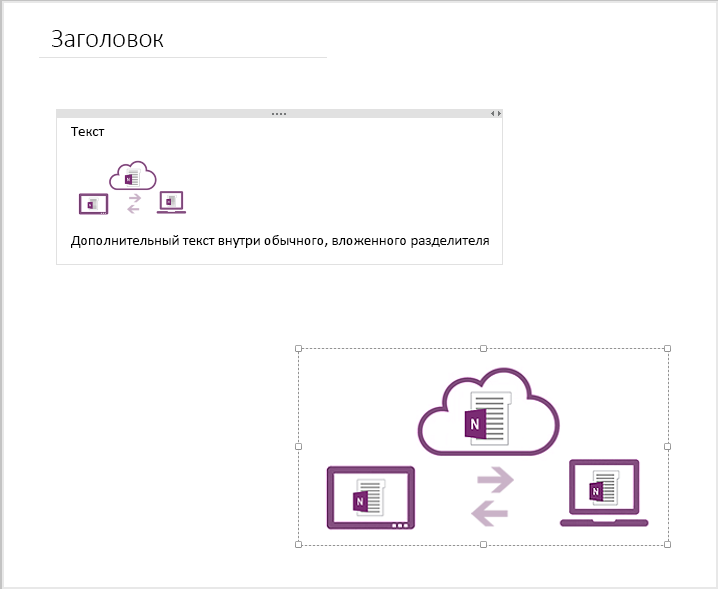

# <a name="create-absolute-positioned-elements-in-onenote-pages"></a><span data-ttu-id="94f0f-101">Создание элементов с абсолютным положением на страницах OneNote</span><span class="sxs-lookup"><span data-stu-id="94f0f-101">Create absolute positioned elements in OneNote pages</span></span>

<span data-ttu-id="94f0f-102">В тексте страницы OneNote может содержаться много прямых (`div`, `img`) и дочерних (`object`) элементов, которые можно разместить независимо друг от друга на странице.</span><span class="sxs-lookup"><span data-stu-id="94f0f-102">The body of a OneNote page can contain multiple direct `div`, `img`, and `object` child elements that can be positioned independently on the page.</span></span>

<a name="attributes"></a>

## <a name="attributes-and-positioning-behavior"></a><span data-ttu-id="94f0f-103">Атрибуты и поведение при расположении</span><span class="sxs-lookup"><span data-stu-id="94f0f-103">Attributes and positioning behavior</span></span>

<span data-ttu-id="94f0f-104">Чтобы создать элементы с абсолютным положением на странице, используйте атрибуты `data-absolute-enabled` и [`style`](#supported-css-style-attributes), как показано ниже.</span><span class="sxs-lookup"><span data-stu-id="94f0f-104">Use the `data-absolute-enabled` and [`style`](#supported-css-style-attributes) attributes to create absolute positioned elements on a page, as follows:</span></span>

- <span data-ttu-id="94f0f-105">Элемент body должен указывать `data-absolute-enabled="true"`.</span><span class="sxs-lookup"><span data-stu-id="94f0f-105">The body element must specify `data-absolute-enabled="true"`.</span></span> <span data-ttu-id="94f0f-106">Если он опущен или имеет значение `false`, весь контент в элементе body отображается в элементе `_default` с абсолютным положением, созданным API, и все параметры положения будут проигнорированы.</span><span class="sxs-lookup"><span data-stu-id="94f0f-106">If omitted or set to `false`, all body content is rendered inside a `_default` absolute positioned div that the API creates, and all position settings are ignored.</span></span>

- <span data-ttu-id="94f0f-107">Только элементы `div`, `img` и `object` могут иметь абсолютное положение.</span><span class="sxs-lookup"><span data-stu-id="94f0f-107">Only `div`, `img`, and `object` elements can be absolute positioned elements.</span></span> 

- <span data-ttu-id="94f0f-108">Для элементов с абсолютным положением должен быть задан параметр `style="position:absolute"`.</span><span class="sxs-lookup"><span data-stu-id="94f0f-108">Absolute positioned elements must specify `style="position:absolute"`.</span></span>

- <span data-ttu-id="94f0f-109">Элементы с абсолютным положением должны быть прямыми дочерними элементами элемента `body`.</span><span class="sxs-lookup"><span data-stu-id="94f0f-109">Absolute positioned elements must be direct children of the `body` element.</span></span> <span data-ttu-id="94f0f-110">Любой прямой дочерний элемент элемента body, не являющийся элементом `div`, `img` или `object` с абсолютным положением, отображается в виде статичного контента внутри элемента div `_default` с абсолютным положением.</span><span class="sxs-lookup"><span data-stu-id="94f0f-110">Any direct children of the body that aren't absolute positioned `div`, `img`, or `object` elements are rendered as static content inside the absolute positioned `_default` div.</span></span>

- <span data-ttu-id="94f0f-111">Элементы с абсолютным положением размещаются согласно указанным для них координатам левого верхнего угла относительно начального положения 0:0, соответствующего левому верхнему углу страницы над областью заголовка.</span><span class="sxs-lookup"><span data-stu-id="94f0f-111">Absolute positioned elements are positioned at their specified top and left coordinates, relative to the 0:0 starting position at the top, left corner of the page above the title area.</span></span>

- <span data-ttu-id="94f0f-112">Если у элемента с абсолютным положением опущена верхняя или левая координата, для этой координаты применяется соответствующее значение, используемое по умолчанию: `top:120px` или `left:48px`.</span><span class="sxs-lookup"><span data-stu-id="94f0f-112">If an absolute positioned element omits the top or left coordinate, the missing coordinate is set to its default value: `top:120px` or `left:48px`.</span></span> <span data-ttu-id="94f0f-113">Эти координаты, используемые по умолчанию, указывают положение непосредственно под областью заголовка.</span><span class="sxs-lookup"><span data-stu-id="94f0f-113">These default coordinates specify a position just below the title area.</span></span> <span data-ttu-id="94f0f-114">Помните, что если не указывать координаты элементов, последние будут накладываться друг на друга.</span><span class="sxs-lookup"><span data-stu-id="94f0f-114">Be aware that omitting coordinates can result in elements that are stacked on top of each other.</span></span>

- <span data-ttu-id="94f0f-115">Элементы с абсолютным положением не должны быть вложенными и не должны содержать элементы с заданными положениями.</span><span class="sxs-lookup"><span data-stu-id="94f0f-115">Absolute positioned elements cannot be nested or contain positioned elements.</span></span> <span data-ttu-id="94f0f-116">API игнорирует все параметры положения, указанные во вложенных элементах внутри элемента div с абсолютным положением, отображает вложенный контент внутри родительского элемента div с абсолютным положением и возвращает предупреждение через свойство **api.diagnostics** в ответе.</span><span class="sxs-lookup"><span data-stu-id="94f0f-116">The API ignores any position settings specified on nested elements inside an absolute positioned div, renders the nested content inside the absolute positioned parent div, and returns a warning in the **api.diagnostics** property in the response.</span></span>


### <a name="example"></a><span data-ttu-id="94f0f-117">Пример</span><span class="sxs-lookup"><span data-stu-id="94f0f-117">Example</span></span>

<span data-ttu-id="94f0f-118">В примере ниже показан прямой дочерний элемент `p`, элемент div с абсолютным положением и элемент div с неабсолютным положением.</span><span class="sxs-lookup"><span data-stu-id="94f0f-118">The following example contains a direct `p` child, an absolute positioned div, and a non-absolute positioned div.</span></span>

#### <a name="input-html"></a><span data-ttu-id="94f0f-119">Входной HTML-код</span><span class="sxs-lookup"><span data-stu-id="94f0f-119">Input HTML</span></span>  

   ```html 
   <body data-absolute-enabled="true">
       <p>This content will appear in the _default div.</p>
       <div style="position:absolute;top:175px;left:100px" data-id="div1">
         <p>This content will appear in an absolute positioned div.</p>
       </div>
       <div>
           <p>This content will also appear in the _default div.</p>
       </div>
   </body>
   ```

<span data-ttu-id="94f0f-120">API отрисовывает элемент div с неабсолютным положением в элементе div, используемом по умолчанию.</span><span class="sxs-lookup"><span data-stu-id="94f0f-120">The API renders the non-absolute positioned div in the default div.</span></span> <span data-ttu-id="94f0f-121">Обратите внимание, что система игнорирует вложенные теги `<div>`, так как в них не определено никакой семантической информации (например, `data-id`).</span><span class="sxs-lookup"><span data-stu-id="94f0f-121">Note that the nested  `<div>` tags are discarded because they do not define any semantic information (such as `data-id`).</span></span>

#### <a name="output-html"></a><span data-ttu-id="94f0f-122">Выходной HTML-код</span><span class="sxs-lookup"><span data-stu-id="94f0f-122">Output HTML</span></span> 

   ```html 
   <body data-absolute-enabled="true" style="font-family:Calibri;font-size:11pt">
       <div data-id="_default" style="position:absolute;left:48px;top:120px;width:624px">
           <p>This content will appear in the _default div.</p>
           <p>This content will also appear in the _default div.</p>
       </div>
       <div data-id="div1" style="position:absolute;left:99px;top:174px;width:624px">
           <p>This content will appear in an absolute positioned div.</p>
       </div>
   </body>
   ```

### <a name="example"></a><span data-ttu-id="94f0f-123">Пример</span><span class="sxs-lookup"><span data-stu-id="94f0f-123">Example</span></span>

<span data-ttu-id="94f0f-124">В примере ниже показано, как создать страницу, которая содержит один элемент div с абсолютным положением и одно изображение с абсолютным положением.</span><span class="sxs-lookup"><span data-stu-id="94f0f-124">The following example creates a page that contains one absolute positioned div and one absolute positioned image.</span></span>


#### <a name="input-html"></a><span data-ttu-id="94f0f-125">Входной HTML-код</span><span class="sxs-lookup"><span data-stu-id="94f0f-125">Input HTML</span></span>  

```html 
<html>
    <head>
        <title>Page Title</title>
    </head>
    <body data-absolute-enabled="true">
        <div style="position:absolute;width:280px;top:120px;left:68px">
            <p>Some text</p>
            
            <div>
                <p>More text inside a regular, nested div</p>
            </div>
        </div>
        
    </body>
</html>
```
 
<span data-ttu-id="94f0f-126">API OneNote оценивает входной HTML-код и сохраняет весь семантический контент и информацию о структуре, которые поддерживает OneNote.</span><span class="sxs-lookup"><span data-stu-id="94f0f-126">The OneNote API evaluates the input HTML and preserves all semantic content and any structural information that is supported by OneNote.</span></span> <span data-ttu-id="94f0f-127">Полученная в результате страница отображается, как показано на рисунке ниже (но без видимых границ для элемента div и изображения).</span><span class="sxs-lookup"><span data-stu-id="94f0f-127">The resulting page renders as shown in the following image (but without the visible borders for the div and image).</span></span> 



<span data-ttu-id="94f0f-129">Обратите внимание на изменение незначимого вложенного элемента div по сравнению со входным HTML-кодом.</span><span class="sxs-lookup"><span data-stu-id="94f0f-129">Notice the changes to the non-contributing, nested div from the input HTML.</span></span> <span data-ttu-id="94f0f-130">API сохраняет контент, содержащийся в элементе div, но игнорирует теги `<div>`, так как в элементе div не определена семантическая информация (например, `data-id`).</span><span class="sxs-lookup"><span data-stu-id="94f0f-130">The API preserves the div's content but discards the `<div>` tags because the div doesn't define semantic information (such as `data-id`).</span></span>

<span data-ttu-id="94f0f-131">Дополнительные сведения о том, как API OneNote обрабатывает входной и выходной HTML-код, см. в статье [Входной и выходной HTML-код на страницах OneNote](onenote_input_output_html.md).</span><span class="sxs-lookup"><span data-stu-id="94f0f-131">For more information about how the OneNote API handles input and output HTML, see [Input and output HTML for OneNote pages](onenote_input_output_html.md).</span></span>

<a name="style-attributes"></a>

## <a name="supported-css-style-attributes"></a><span data-ttu-id="94f0f-132">Поддерживаемые атрибуты стиля CSS</span><span class="sxs-lookup"><span data-stu-id="94f0f-132">Supported CSS style attributes</span></span>

<span data-ttu-id="94f0f-133">Для всех элементов с абсолютными положениями можно указать положения левого верхнего угла.</span><span class="sxs-lookup"><span data-stu-id="94f0f-133">All absolute positioned elements can specify top and left positions.</span></span> <span data-ttu-id="94f0f-134">Для элемента div и изображения можно указать ширину. Кроме того, для изображений можно указать высоту.</span><span class="sxs-lookup"><span data-stu-id="94f0f-134">Divs and images can specify width, and images can also specify height.</span></span> <span data-ttu-id="94f0f-135">Пример:</span><span class="sxs-lookup"><span data-stu-id="94f0f-135">For example:</span></span>

```html

```

| <span data-ttu-id="94f0f-136">Атрибут</span><span class="sxs-lookup"><span data-stu-id="94f0f-136">Attribute</span></span> | <span data-ttu-id="94f0f-137">Поддерживаемый элемент</span><span class="sxs-lookup"><span data-stu-id="94f0f-137">Supported element</span></span> | <span data-ttu-id="94f0f-138">Описание</span><span class="sxs-lookup"><span data-stu-id="94f0f-138">Description</span></span> |  
|:------|:------|:------|  
| <span data-ttu-id="94f0f-139">top</span><span class="sxs-lookup"><span data-stu-id="94f0f-139">top</span></span> | <span data-ttu-id="94f0f-140">div, img, object</span><span class="sxs-lookup"><span data-stu-id="94f0f-140">div, img, object</span></span> | <span data-ttu-id="94f0f-141">Координата верхней границы элемента по оси Y; только в пикселях.</span><span class="sxs-lookup"><span data-stu-id="94f0f-141">The y-axis coordinate of the element's top border, in pixels only.</span></span> <span data-ttu-id="94f0f-142">По умолчанию используется значение 120 пикселей.</span><span class="sxs-lookup"><span data-stu-id="94f0f-142">Default is 120 pixels.</span></span><br/><br/><span data-ttu-id="94f0f-143">Пример: `top:140px`</span><span class="sxs-lookup"><span data-stu-id="94f0f-143">Example: `top:140px`</span></span> |  
| <span data-ttu-id="94f0f-144">left</span><span class="sxs-lookup"><span data-stu-id="94f0f-144">left</span></span> |  <span data-ttu-id="94f0f-145">div, img, object</span><span class="sxs-lookup"><span data-stu-id="94f0f-145">div, img, object</span></span>  | <span data-ttu-id="94f0f-146">Координата левой границы элемента по оси X; только в пикселях.</span><span class="sxs-lookup"><span data-stu-id="94f0f-146">The x-axis coordinate of the element's left border, in pixels only.</span></span> <span data-ttu-id="94f0f-147">По умолчанию используется значение 48 пикселей.</span><span class="sxs-lookup"><span data-stu-id="94f0f-147">Default is 48 pixels.</span></span><br/><br/><span data-ttu-id="94f0f-148">Пример: `left:95px`</span><span class="sxs-lookup"><span data-stu-id="94f0f-148">Example: `left:95px`</span></span> |  
| <span data-ttu-id="94f0f-149">width</span><span class="sxs-lookup"><span data-stu-id="94f0f-149">width</span></span> |  <span data-ttu-id="94f0f-150">div, img</span><span class="sxs-lookup"><span data-stu-id="94f0f-150">div, img</span></span>  | <span data-ttu-id="94f0f-151">Ширина элемента; только в пикселях.</span><span class="sxs-lookup"><span data-stu-id="94f0f-151">The width of the element, in pixels only.</span></span><br/><br/><span data-ttu-id="94f0f-152">Пример: `width:480px`</span><span class="sxs-lookup"><span data-stu-id="94f0f-152">Example: `width:480px`</span></span> |  
| <span data-ttu-id="94f0f-153">height</span><span class="sxs-lookup"><span data-stu-id="94f0f-153">height</span></span> | <span data-ttu-id="94f0f-154">img</span><span class="sxs-lookup"><span data-stu-id="94f0f-154">img</span></span> | <span data-ttu-id="94f0f-155">Высота элемента; только в пикселях.</span><span class="sxs-lookup"><span data-stu-id="94f0f-155">The height of the element, in pixels only.</span></span> <span data-ttu-id="94f0f-156">Для элементов div высота рассчитывается в среде выполнения, и система игнорирует любое заданное значение высоты.</span><span class="sxs-lookup"><span data-stu-id="94f0f-156">For divs, height is calculated at runtime and any specified height value is ignored.</span></span><br/><br/><span data-ttu-id="94f0f-157">Пример: `height:665px`</span><span class="sxs-lookup"><span data-stu-id="94f0f-157">Example: `height:665px`</span></span> |  
 
<span data-ttu-id="94f0f-158">Система игнорирует другие атрибуты положения, например `z-index`.</span><span class="sxs-lookup"><span data-stu-id="94f0f-158">Other position attributes, such as `z-index`, are ignored.</span></span> <span data-ttu-id="94f0f-159">Для изображений с абсолютными положениями можно использовать атрибут `data-render-src` или `src`.</span><span class="sxs-lookup"><span data-stu-id="94f0f-159">Absolute positioned images can use either the `data-render-src` or `src` attribute.</span></span>


<a name="request-response-info"></a>

## <a name="response-information"></a><span data-ttu-id="94f0f-160">Информация в ответе</span><span class="sxs-lookup"><span data-stu-id="94f0f-160">Response information</span></span>

<span data-ttu-id="94f0f-161">API OneNote возвращает указанные ниже сведения в ответе.</span><span class="sxs-lookup"><span data-stu-id="94f0f-161">The OneNote API returns the following information in the response.</span></span>

| <span data-ttu-id="94f0f-162">Данные в ответе</span><span class="sxs-lookup"><span data-stu-id="94f0f-162">Response data</span></span> | <span data-ttu-id="94f0f-163">Описание</span><span class="sxs-lookup"><span data-stu-id="94f0f-163">Description</span></span> |  
|:------|:------|  
| <span data-ttu-id="94f0f-164">код успешного завершения действия;</span><span class="sxs-lookup"><span data-stu-id="94f0f-164">Success code</span></span> | <span data-ttu-id="94f0f-165">Код состояния HTTP 201 при успешном выполнении запроса POST и код состояния HTTP 204 при успешном выполнении запроса PATCH.</span><span class="sxs-lookup"><span data-stu-id="94f0f-165">A 201 HTTP status code for a successful POST request, and a 204 HTTP status code for a successful PATCH request.</span></span> |  
| <span data-ttu-id="94f0f-166">Ошибки</span><span class="sxs-lookup"><span data-stu-id="94f0f-166">Errors</span></span> | <span data-ttu-id="94f0f-167">Дополнительные сведения об ошибках OneNote, которые может возвращать Microsoft Graph, см. в статье [Коды ошибок для API OneNote в Microsoft Graph](onenote_error_codes.md).</span><span class="sxs-lookup"><span data-stu-id="94f0f-167">Read [Error codes for OneNote APIs in Microsoft Graph](onenote_error_codes.md) to learn about OneNote errors that Microsoft Graph can return.</span></span> |  
  


<a name="permissions"></a>

## <a name="permissions"></a><span data-ttu-id="94f0f-168">Разрешения</span><span class="sxs-lookup"><span data-stu-id="94f0f-168">Permissions</span></span>

<span data-ttu-id="94f0f-169">Чтобы можно было создавать или изменять страницы OneNote, вам придется запросить соответствующие разрешения.</span><span class="sxs-lookup"><span data-stu-id="94f0f-169">To create or update OneNote pages, you'll need to request appropriate permissions.</span></span> <span data-ttu-id="94f0f-170">Выберите минимальный уровень разрешений, необходимый для работы вашего приложения.</span><span class="sxs-lookup"><span data-stu-id="94f0f-170">Choose the lowest level of permissions that your app needs to do its work.</span></span>

#### <a name="permissions-for-post-pages"></a><span data-ttu-id="94f0f-171">Разрешения для запросов POST со страницами</span><span class="sxs-lookup"><span data-stu-id="94f0f-171">Permissions for POST pages</span></span> 

- <span data-ttu-id="94f0f-172">Notes.Create</span><span class="sxs-lookup"><span data-stu-id="94f0f-172">Notes.Create</span></span>
- <span data-ttu-id="94f0f-173">Notes.ReadWrite</span><span class="sxs-lookup"><span data-stu-id="94f0f-173">Notes.ReadWrite</span></span>
- <span data-ttu-id="94f0f-174">Notes.ReadWrite.All</span><span class="sxs-lookup"><span data-stu-id="94f0f-174">Notes.ReadWrite.All</span></span>  


#### <a name="permissions-for-patch-pages"></a><span data-ttu-id="94f0f-175">Разрешения для запросов PATCH со страницами</span><span class="sxs-lookup"><span data-stu-id="94f0f-175">Permissions for PATCH pages</span></span> 

- <span data-ttu-id="94f0f-176">Notes.ReadWrite</span><span class="sxs-lookup"><span data-stu-id="94f0f-176">Notes.ReadWrite</span></span>
- <span data-ttu-id="94f0f-177">Notes.ReadWrite.All</span><span class="sxs-lookup"><span data-stu-id="94f0f-177">Notes.ReadWrite.All</span></span>

<span data-ttu-id="94f0f-178">Дополнительные сведения об областях разрешений и принципах их работы см. в разделе, посвященном [областям разрешений OneNote](permissions_reference.md#notes-permissions).</span><span class="sxs-lookup"><span data-stu-id="94f0f-178">For more information about permission scopes and how they work, see [OneNote permission scopes](permissions_reference.md#notes-permissions).</span></span>


<a name="see-also"></a>

## <a name="see-also"></a><span data-ttu-id="94f0f-179">См. также</span><span class="sxs-lookup"><span data-stu-id="94f0f-179">See also</span></span>

- [<span data-ttu-id="94f0f-180">Создание страниц OneNote</span><span class="sxs-lookup"><span data-stu-id="94f0f-180">Create OneNote pages</span></span>](onenote-create-page.md)
- [<span data-ttu-id="94f0f-181">Обновление содержимого страницы OneNote</span><span class="sxs-lookup"><span data-stu-id="94f0f-181">Update OneNote page content</span></span>](onenote_update_page.md)
- [<span data-ttu-id="94f0f-182">Интеграция с OneNote</span><span class="sxs-lookup"><span data-stu-id="94f0f-182">Integrate with OneNote</span></span>](integrate_with_onenote.md)
- [<span data-ttu-id="94f0f-183">Блог разработчиков OneNote</span><span class="sxs-lookup"><span data-stu-id="94f0f-183">OneNote Developer Blog</span></span>](http://go.microsoft.com/fwlink/?LinkID=390183)
- [<span data-ttu-id="94f0f-184">Вопросы разработки OneNote на сайте Stack Overflow</span><span class="sxs-lookup"><span data-stu-id="94f0f-184">OneNote development questions on Stack Overflow</span></span>](http://go.microsoft.com/fwlink/?LinkID=390182)
- [<span data-ttu-id="94f0f-185">Репозитории GitHub OneNote</span><span class="sxs-lookup"><span data-stu-id="94f0f-185">OneNote GitHub repos</span></span>](http://go.microsoft.com/fwlink/?LinkID=390178)  

