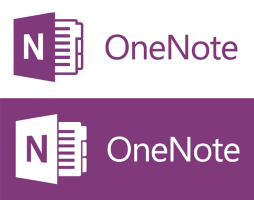
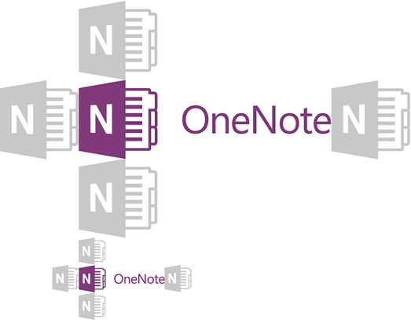
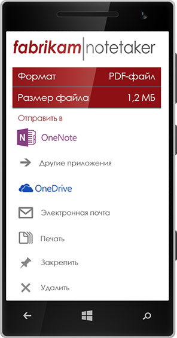
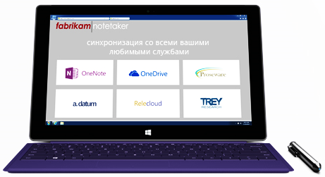
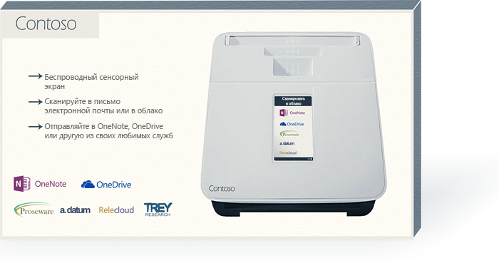

# Правила использования фирменной символики для разработчиков API OneNoteBranding guidelines for OneNote API developers 
 
*__Область применения:__ Пользовательские записные книжки в OneDrive | Корпоративные записные книжек в Office 365**__Applies to:__ Consumer notebooks on OneDrive | Enterprise notebooks on Office 365*

Следуйте инструкциям, приведенным в этой статье, чтобы наилучшим образом интегрировать торговую марку OneNote в ваш продукт, а также соблюсти требования к фирменной символике OneNote.Follow the guidance in this article to best integrate the OneNote brand within your product and satisfy OneNote branding requirements.

## Загружаемые логотипыDownloadable logos
Вы можете скачать логотипы, показанные в этой статье, и PDF-копию этих руководств с нашей страницы скачивания [Правила использования фирменной символики для разработчиков API OneNote](https://www.microsoft.com/download/details.aspx?id=42977)You can download the logos shown in this article and a PDF copy of these guidelines from our [Branding guidelines for OneNote API developers](https://www.microsoft.com/download/details.aspx?id=42977) download page.

## Варианты логотипаLogo variations

**Объединение значка и имени** (предпочтительно)**Icon and name lockup** (Preferred)  
Значок зафиксирован с именем.The icon symbol is locked with the name. Это предпочтительное графическое представление логотипа OneNote.This is the preferred graphic representation of the OneNote logo.

  

**Значок****Icon symbol**  
Некоторые среды, например, на небольших устройствах не имеют достаточно места для всего объединенного логотипа.Certain environments, such as on small devices, don't provide enough room for the entire logo lockup. В таких случаях в приложениях или в интернет-маркетинге может использоваться значок отдельно.In those cases, the icon symbol alone may be used in an app or in digital marketing. В приложении используйте значок отдельно, только если необходимо представить приложение OneNote.The icon symbol alone may be used in an app or in digital marketing. Within an app, use the icon symbol by itself only when you need an icon or favicon to represent onnvshort.

  

## Пустое пространствоClear space 
Чтобы логотип выделялся на странице, необходимо оставить вокруг него определенную часть незаполненного пространства. Минимальный отступ сверху, снизу и по бокам логотипа должен соответствовать его высоте.Treat the logo with respect and give it room to breathe. A minimum clear space equivalent to the height of the symbol must surround the logo.

  

## Минимальный размерMinimum size 
Логотип должен быть не менее 16 пикселей, когда он отображается на экране, и не менее 5 мм (0,2 дюйма) когда он выводится на печать.The logo should be at least 16 pixels high when it appears on-screen and at least 5 mm (0.2 inches) high when it appears in print.

**Экран:**&nbsp;&nbsp;16 пикселей**Screen:**&nbsp;&nbsp;16 pixels  
**Печать:**&nbsp;&nbsp;5 мм (0,2 дюйма)**Print:**&nbsp;&nbsp;5 mm (0.2 inches) 

  

## ЦветColor
Когда логотип OneNote используется на белом или светлом фоне, предпочтительным является его фирменный цвет — сиреневый.When the onnvshort logo is used on white or light backgrounds, the preferred logo color is its brand color, purple: Когда он отображается на сиреневом фоне, логотип должен выводиться белым цветом.When it appears on a purple background, the logo should be knocked out to white.

**Экран:**&nbsp;&nbsp;R128 G57 B123 или Hex #80397B**Screen:**&nbsp;&nbsp;R128 G57 B123 or Hex #80397B  
**Печать:**&nbsp;&nbsp;C75 M100 Y0 K0Print: C75 M100 Y0 K0 

  
 
В средах с цветовыми ограничениями и при одноцветном оформлении логотип может отображаться черным цветом. Тем не менее логотип никогда не должен отображаться серым цветом.In color-limited environments and one-color designs, the logo can appear in black. However, the logo should never appear in gray.
<!--or white?-->

## Запреты в отношении логотипаLogo don’ts

**Не размещайте логотип или значок на цветном фоне****Don’t place the logo or icon on a color background.**  

**Не изменяйте масштаб или пропорции**  Don’t change the scale or the proportions.  

**Не используйте тени****Don’t use a drop shadow.**  

**Не изменяйте цвет, кроме как на черный или белый** (см. раздел [Цвет](#color))Don’t change the color, except to black or white. (See Preferred logo color.)  
 

**Не поворачивайте логотип или значок** Don’t rotate the logo or icon.  

**Не перемещайте элементы логотипа****Don’t rearrange the logo elements.**  

**Не используйте эффекты, такие как выдавливание или багетная рамка****Don’t use an effect such as extrude and bevel.**  

**Не создавайте новый логотип или значок****Don’t create a new logo or icon.**  

 

## Ссылка на имя OneNoteReferencing the OneNote name

**Полное имя:**&nbsp;&nbsp;Microsoft OneNote**Full name:**&nbsp;&nbsp;Microsoft OneNote  
**Короткое имя:**&nbsp;&nbsp;OneNote**Short name:**&nbsp;&nbsp;OneNote
 
В таблице ниже приведена информация о том, как применять имя OneNote в различных контекстах.Refer to the table below for details about how to refer to onnvshort in various contexts.

| КонтекстContext | ПрименениеUsage |
|------|------|
| Имена приложенийApp names | Чтобы не запутать пользователей в магазинах приложений, предпочтительно не включать имя *OneNote* в название вашего приложения.To avoid confusing consumers within the app stores, we prefer that  onnvshort  not be included in the name of your app. If it’s determined that  onnvshort  must be used in the app name,  onnvshort  must be modified by a preposition (for example, for or with): Если определено, что имя OneNote требуется использовать в названии приложения, *OneNote* необходимо изменить путем использования предлога (например, *для OneNote* или *с помощью OneNote*).If it’s determined that OneNote must be used in the app name, *OneNote* must be modified by a preposition (for example, *for OneNote* or *with OneNote*).  Пример:&nbsp;&nbsp;*Proseware для OneNote*Example:&nbsp;&nbsp;*Proseware for OneNote*  Ни при каких условиях название приложения не должно начинаться с OneNote.Under no circumstances can the name of your app begin with onnvshort.
| Имена издателейPublisher names | Имя издателя не может содержать ссылку на OneNote.The publisher’s name may not include a reference to OneNote. Имя издателя на может нарушать авторские права корпорации Майкрософт на любые товарные знаки Майкрософт.The publisher’s name may not include a reference to onnvshort. The publisher’s name may not infringe upon any Microsoft trademarks. |
| Определение взаимодействия с OneNoteIndicating interoperability with onnvshort | **Рекомендуется:**&nbsp;&nbsp;отправка данных в OneNote**Recommended:**&nbsp;&nbsp;Send to OneNote  **Допустимо:**&nbsp;&nbsp;поделиться с OneNote**Acceptable:**&nbsp;&nbsp;Share with OneNote &nbsp;&nbsp;Допустимо, при использовании в контексте «поделиться» с другими приложения, например, *поделиться с OneNote, Facebook или Twitter.*)&nbsp;&nbsp;Acceptable when used in reference to "sharing" with other applications—for example, *Share with OneNote, Facebook, or Twitter.*)  **Никогда:**&nbsp;&nbsp;сохранить в OneNote**Never:**&nbsp;&nbsp;Save to OneNote &nbsp;&nbsp;Это технически неправильно.This is technically incorrect. |
| Общий маркетинг (включая описание приложений)General marketing (including app descriptions) | При первом упоминании приложения в тексте должно использоваться полное наименование: *Microsoft OneNote*.The first mention in a communication should use the full name (onnvlong).  При последующем упоминании может использоваться сокращенное наименование: *OneNote*.Subsequent references in the communication can use the short name (*onnvshort*).
 

## ПримерыExamples

**Приложения****Applications**

**Реклама****Advertising**

**Веб-сайт****website**

**Упаковка****Packaging**

## См. такжеSee also
Если у вас есть вопросы по этому руководству или вы создаете новые средства взаимодействия с использованием фирменной символики, представленной здесь, свяжитесь с нами по адресу [@onenotedev](http://twitter.com/onenotedev).If you have any questions about these guidelines or are creating new communications using the brand assets shown here, please submit a request through the  Microsoft Brand Tools Help Center https://brandtools.microsoft.com/HelpCenter/Pages/HelpCenter.aspx .

- [Правила использования фирменной символики для разработчиков API OneNote](https://www.microsoft.com/download/details.aspx?id=42977) (страница скачивания)Branding guidelines for OneNote API developers
- [Интеграция с OneNoteIntegrate with OneNote](integrate_with_onenote.md)
- [Блог разработчиков OneNoteOneNote Developer Blog](http://go.microsoft.com/fwlink/?LinkID=390183)
- [Вопросы разработки OneNote на сайте Stack OverflowOneNote development questions on Stack Overflow](http://go.microsoft.com/fwlink/?LinkID=390182)
- [Репозитории GitHub OneNoteOneNote GitHub repos](http://go.microsoft.com/fwlink/?LinkID=390178)  

