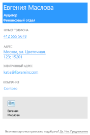
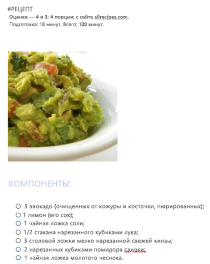

# <a name="use-onenote-api-div-tags-to-extract-data-from-captures"></a><span data-ttu-id="0090f-103">Использование тегов div API OneNote для извлечения данных из записанного содержимого</span><span class="sxs-lookup"><span data-stu-id="0090f-103">Use OneNote API div tags to extract data from captures</span></span> 

<span data-ttu-id="0090f-104">**Область применения:** Пользовательские записные книжки в OneDrive | Корпоративные записные книжки в Microsoft 365.</span><span class="sxs-lookup"><span data-stu-id="0090f-104">**Applies to** Consumer notebooks on OneDrive | Enterprise notebooks on Microsoft 365</span></span>

<span data-ttu-id="0090f-105">Используйте API OneNote, чтобы извлекать данные визитных карточек с изображения или данные из рецептов и описаний товаров по URL-адресу.</span><span class="sxs-lookup"><span data-stu-id="0090f-105">Use the OneNote API to extract business card data from an image, or recipe and product data from a URL.</span></span>

<a name="attributes"></a>

## <a name="extraction-attributes"></a><span data-ttu-id="0090f-106">Атрибуты извлечения</span><span class="sxs-lookup"><span data-stu-id="0090f-106">Extraction attributes</span></span>

<span data-ttu-id="0090f-107">Чтобы извлекать и преобразовывать данные, просто включите элемент div, указывающий исходный контент, метод извлечения и резервное действие в запрос [create-page](onenote-create-page.md) или [update-page](onenote-update-page.md).</span><span class="sxs-lookup"><span data-stu-id="0090f-107">To extract and transform data, simply include a div that specifies the source content, extraction method, and fallback behavior in your [create-page](onenote-create-page.md) or [update-page](onenote-update-page.md) request.</span></span> <span data-ttu-id="0090f-108">API отображает извлеченные данные на странице в простом для чтения формате.</span><span class="sxs-lookup"><span data-stu-id="0090f-108">The API renders extracted data on the page in an easy-to-read format.</span></span> 

```html
<div
  data-render-src="image-or-url"
  data-render-method="extraction-method"
  data-render-fallback="fallback-action">
</div>
```

### <a name="data-render-src"></a><span data-ttu-id="0090f-109">data-render-src</span><span class="sxs-lookup"><span data-stu-id="0090f-109">data-render-src</span></span>

<span data-ttu-id="0090f-110">Источник контента.</span><span class="sxs-lookup"><span data-stu-id="0090f-110">The content source.</span></span> <span data-ttu-id="0090f-111">Это может быть изображение визитной карточки либо абсолютный URL-адрес страницы с рецептом или описанием товара.</span><span class="sxs-lookup"><span data-stu-id="0090f-111">This can be an image of a business card or an absolute URL from many popular recipe or product websites.</span></span> <span data-ttu-id="0090f-112">Обязательный.</span><span class="sxs-lookup"><span data-stu-id="0090f-112">Required.</span></span>

<span data-ttu-id="0090f-113">Для наилучших результатов используйте канонический URL-адрес, указанный в HTML-коде исходной веб-страницы (если он указан).</span><span class="sxs-lookup"><span data-stu-id="0090f-113">For best results when specifying a URL, use the canonical URL defined in the HTML of the source webpage, if one is defined.</span></span> <span data-ttu-id="0090f-114">Например, канонический URL-адрес может быть задан в исходной веб-странице следующим образом:</span><span class="sxs-lookup"><span data-stu-id="0090f-114">For example, a canonical URL might be defined in the source webpage like this:</span></span>

`<link rel="canonical" href="www.domainname.com/page/123/size12/type987" />` 


### <a name="data-render-method"></a><span data-ttu-id="0090f-115">data-render-method</span><span class="sxs-lookup"><span data-stu-id="0090f-115">data-render-method</span></span>

<span data-ttu-id="0090f-116">Метод извлечения, который необходимо запустить.</span><span class="sxs-lookup"><span data-stu-id="0090f-116">The extraction method to run.</span></span> <span data-ttu-id="0090f-117">Обязательный.</span><span class="sxs-lookup"><span data-stu-id="0090f-117">Required.</span></span>

| <span data-ttu-id="0090f-118">Значение</span><span class="sxs-lookup"><span data-stu-id="0090f-118">Value</span></span> | <span data-ttu-id="0090f-119">Описание</span><span class="sxs-lookup"><span data-stu-id="0090f-119">Description</span></span> |
|:------|:------|
| <span data-ttu-id="0090f-120">extract.businesscard</span><span class="sxs-lookup"><span data-stu-id="0090f-120">extract.businesscard</span></span> | <span data-ttu-id="0090f-121">Извлечение данных визитной карточки.</span><span class="sxs-lookup"><span data-stu-id="0090f-121">A business card extraction.</span></span> |
| <span data-ttu-id="0090f-122">extract.recipe</span><span class="sxs-lookup"><span data-stu-id="0090f-122">extract.recipe</span></span> | <span data-ttu-id="0090f-123">Извлечение рецепта.</span><span class="sxs-lookup"><span data-stu-id="0090f-123">A recipe extraction.</span></span> |
| <span data-ttu-id="0090f-124">extract.product</span><span class="sxs-lookup"><span data-stu-id="0090f-124">extract.product</span></span> | <span data-ttu-id="0090f-125">Извлечение описания товара.</span><span class="sxs-lookup"><span data-stu-id="0090f-125">A product listing extraction.</span></span> |
| <span data-ttu-id="0090f-126">extract</span><span class="sxs-lookup"><span data-stu-id="0090f-126">extract</span></span> | <span data-ttu-id="0090f-127">Неизвестный тип извлечения.</span><span class="sxs-lookup"><span data-stu-id="0090f-127">An unknown extraction type.</span></span> |

<span data-ttu-id="0090f-128">Для наилучших результатов укажите тип контента (`extract.businesscard`, `extract.recipe` или `extract.product`), если вы его знаете.</span><span class="sxs-lookup"><span data-stu-id="0090f-128">For best results, specify the content type (`extract.businesscard`, `extract.recipe`, or `extract.product`) if you know it.</span></span> <span data-ttu-id="0090f-129">Если тип контента неизвестен, используйте метод `extract`, и API OneNote попытается автоматически его определить.</span><span class="sxs-lookup"><span data-stu-id="0090f-129">If the type is unknown, use the `extract` method, and the OneNote API will try to auto-detect the type.</span></span>

### <a name="data-render-fallback"></a><span data-ttu-id="0090f-130">data-render-fallback</span><span class="sxs-lookup"><span data-stu-id="0090f-130">data-render-fallback</span></span>

<span data-ttu-id="0090f-131">Резервное действие при неудачном извлечении.</span><span class="sxs-lookup"><span data-stu-id="0090f-131">The fallback behavior if the extraction fails.</span></span> <span data-ttu-id="0090f-132">Если атрибут не указан, по умолчанию используется значение **render**.</span><span class="sxs-lookup"><span data-stu-id="0090f-132">Defaults to **render** if omitted.</span></span> 

| <span data-ttu-id="0090f-133">Значение</span><span class="sxs-lookup"><span data-stu-id="0090f-133">Value</span></span> | <span data-ttu-id="0090f-134">Описание</span><span class="sxs-lookup"><span data-stu-id="0090f-134">Description</span></span> |
|:------|:------|
| <span data-ttu-id="0090f-135">render</span><span class="sxs-lookup"><span data-stu-id="0090f-135">render</span></span> | <span data-ttu-id="0090f-136">Отображает исходное изображение или снимок веб-страницы с рецептом или товаром.</span><span class="sxs-lookup"><span data-stu-id="0090f-136">Renders the source image or a snapshot of the recipe or product webpage.</span></span> |
| <span data-ttu-id="0090f-137">Нет</span><span class="sxs-lookup"><span data-stu-id="0090f-137">none</span></span> | <span data-ttu-id="0090f-138">Не выполняет никаких действий.</span><span class="sxs-lookup"><span data-stu-id="0090f-138">Does nothing.</span></span><br /><br /><span data-ttu-id="0090f-139">Этот параметр удобно использовать, если вы хотите всегда размещать снимок визитной карточки или веб-страницы на странице (в дополнение к извлеченному контенту).</span><span class="sxs-lookup"><span data-stu-id="0090f-139">This option is useful if you want to always include a snapshot of the business card or webpage on the page in addition to any extracted content.</span></span> <span data-ttu-id="0090f-140">Обязательно отправляйте отдельный элемент `img` в запросе, как показано в примерах.</span><span class="sxs-lookup"><span data-stu-id="0090f-140">Be sure to send a separate `img` element in the request, as shown in the examples.</span></span> |

<a name="biz-card"></a>

## <a name="business-card-extractions"></a><span data-ttu-id="0090f-141">Извлечение данных визитной карточки</span><span class="sxs-lookup"><span data-stu-id="0090f-141">Business card extractions</span></span>

<span data-ttu-id="0090f-142">API OneNote пытается найти и отобразить следующую контактную информацию на основе изображения визитной карточки человека или компании.</span><span class="sxs-lookup"><span data-stu-id="0090f-142">The OneNote API tries to find and render the following contact information based on an image of a person's or company's business card.</span></span>

- <span data-ttu-id="0090f-143">Имя</span><span class="sxs-lookup"><span data-stu-id="0090f-143">Name</span></span>
- <span data-ttu-id="0090f-144">Название</span><span class="sxs-lookup"><span data-stu-id="0090f-144">Title</span></span>
- <span data-ttu-id="0090f-145">Организация</span><span class="sxs-lookup"><span data-stu-id="0090f-145">Organization</span></span>
- <span data-ttu-id="0090f-146">Номер телефона/факса</span><span class="sxs-lookup"><span data-stu-id="0090f-146">Phone and fax numbers</span></span>
- <span data-ttu-id="0090f-147">Почтовый и фактический адрес</span><span class="sxs-lookup"><span data-stu-id="0090f-147">Mailing and physical addresses</span></span>
- <span data-ttu-id="0090f-148">Адреса электронной почты</span><span class="sxs-lookup"><span data-stu-id="0090f-148">Email addresses</span></span>
- <span data-ttu-id="0090f-149">Веб-сайты</span><span class="sxs-lookup"><span data-stu-id="0090f-149">Websites</span></span>




<span data-ttu-id="0090f-p108">Извлеченная контактная информация в формате vCard (файл с расширением VCF) также внедряется в страницу. vCard — это удобный способ получить контактную информацию при извлечении HTML-контента страницы.</span><span class="sxs-lookup"><span data-stu-id="0090f-p108">A vCard (.VCF file) with the extracted contact information is also embedded in the page. The vCard is a convenient way to get the contact information when retrieving page HTML content.</span></span>

### <a name="common-scenarios-for-business-card-extractions"></a><span data-ttu-id="0090f-152">Стандартные сценарии извлечения элементов визитных карточек</span><span class="sxs-lookup"><span data-stu-id="0090f-152">Common scenarios for business card extractions</span></span>

#### <a name="extract-business-card-information-and-also-render-the-business-card-image"></a><span data-ttu-id="0090f-153">Извлечение данных визитной карточки и отрисовка ее изображения</span><span class="sxs-lookup"><span data-stu-id="0090f-153">Extract business card information, and also render the business card image</span></span>

<span data-ttu-id="0090f-154">Укажите метод `extract.businesscard` и резервное действие `none`.</span><span class="sxs-lookup"><span data-stu-id="0090f-154">Specify the `extract.businesscard` method and the `none` fallback.</span></span> <span data-ttu-id="0090f-155">Кроме того, отправьте элемент `img` с атрибутом `src`, который также ссылается на изображение.</span><span class="sxs-lookup"><span data-stu-id="0090f-155">Also send an `img` element with the `src` attribute that also references the image.</span></span> <span data-ttu-id="0090f-156">Если API не может извлечь какой-либо контент, он отрисовывает только изображение визитной карточки.</span><span class="sxs-lookup"><span data-stu-id="0090f-156">If the API is unable to extract any content, it renders the business card image only.</span></span>

```html 
<div
    data-render-src="name:scanned-card-image"
    data-render-method="extract.businesscard"
    data-render-fallback="none">
</div>

```


#### <a name="extract-business-card-information-and-render-the-business-card-image-only-if-the-extraction-fails"></a><span data-ttu-id="0090f-157">Извлечение данных визитной карточки и отрисовка ее изображения только при неудачном извлечении</span><span class="sxs-lookup"><span data-stu-id="0090f-157">Extract business card information, and render the business card image only if the extraction fails</span></span>

<span data-ttu-id="0090f-158">Укажите метод `extract.businesscard` и используйте резервное действие по умолчанию `render`.</span><span class="sxs-lookup"><span data-stu-id="0090f-158">Specify the `extract.businesscard` method and use the default `render` fallback.</span></span> <span data-ttu-id="0090f-159">Если API не может извлечь какой-либо контент, он отрисовывает изображение визитной карточки.</span><span class="sxs-lookup"><span data-stu-id="0090f-159">If the API is unable to extract any content, it renders the business card image instead.</span></span>

```html
<div
    data-render-src="name:scanned-card-image"
    data-render-method="extract.businesscard">
</div>
```
 
<span data-ttu-id="0090f-160">При извлечении данных визитной карточки изображение отправляется в виде именованной части в составном запросе.</span><span class="sxs-lookup"><span data-stu-id="0090f-160">For business card extractions, the image is sent as a named part in a multipart request.</span></span> <span data-ttu-id="0090f-161">Примеры отправки изображения в запросе см. в статье [Добавление изображений и файлов](onenote-images-files.md).</span><span class="sxs-lookup"><span data-stu-id="0090f-161">See [Add images and files](onenote-images-files.md) for examples that show how to send an image in a request.</span></span>


<a name="recipe"></a>

## <a name="recipe-extractions"></a><span data-ttu-id="0090f-162">Извлечение рецептов</span><span class="sxs-lookup"><span data-stu-id="0090f-162">Recipe extractions</span></span>

<span data-ttu-id="0090f-163">На основе URL-адреса рецепта API OneNote пытается найти и отобразить указанные ниже сведения.</span><span class="sxs-lookup"><span data-stu-id="0090f-163">The OneNote API tries to find and render the following information based on a recipe's URL.</span></span>

- <span data-ttu-id="0090f-164">Изображение главного имиджевого баннера</span><span class="sxs-lookup"><span data-stu-id="0090f-164">Hero image</span></span>
- <span data-ttu-id="0090f-165">Оценка</span><span class="sxs-lookup"><span data-stu-id="0090f-165">Rating</span></span>
- <span data-ttu-id="0090f-166">ингредиенты;</span><span class="sxs-lookup"><span data-stu-id="0090f-166">Ingredients</span></span>
- <span data-ttu-id="0090f-167">Инструкции</span><span class="sxs-lookup"><span data-stu-id="0090f-167">Instructions</span></span>
- <span data-ttu-id="0090f-168">время подготовки, приготовления и общее;</span><span class="sxs-lookup"><span data-stu-id="0090f-168">Prep, cook, and total times</span></span>
- <span data-ttu-id="0090f-169">Сервировка</span><span class="sxs-lookup"><span data-stu-id="0090f-169">Servings</span></span>




<span data-ttu-id="0090f-170">API оптимизирован для работы с рецептами со многих популярных сайтов, например *Allrecipes.com*, *FoodNetwork.com* и *SeriousEats.com*.</span><span class="sxs-lookup"><span data-stu-id="0090f-170">The API is optimized for recipes from many popular sites such as *Allrecipes.com*, *FoodNetwork.com*, and *SeriousEats.com*.</span></span>

### <a name="common-scenarios-for-recipe-extractions"></a><span data-ttu-id="0090f-171">Стандартные сценарии извлечения рецептов</span><span class="sxs-lookup"><span data-stu-id="0090f-171">Common scenarios for recipe extractions</span></span>

#### <a name="extract-recipe-information-and-also-render-a-snapshot-of-the-recipe-webpage"></a><span data-ttu-id="0090f-172">Извлечение рецепта и отображение снимка веб-страницы с рецептом</span><span class="sxs-lookup"><span data-stu-id="0090f-172">Extract recipe information, and also render a snapshot of the recipe webpage</span></span>

<span data-ttu-id="0090f-173">Укажите метод `extract.recipe` и резервное действие `none`.</span><span class="sxs-lookup"><span data-stu-id="0090f-173">Specify the `extract.recipe` method and the `none` fallback.</span></span> <span data-ttu-id="0090f-174">Кроме того, отправьте элемент `img` с атрибутом `data-render-src`, в качестве значения которого используется URL-адрес рецепта.</span><span class="sxs-lookup"><span data-stu-id="0090f-174">Also send an `img` element with the `data-render-src` attribute set to the recipe URL.</span></span> <span data-ttu-id="0090f-175">Если API не может извлечь какой-либо контент, он отображает только снимок веб-страницы с рецептом.</span><span class="sxs-lookup"><span data-stu-id="0090f-175">If the API is unable to extract any content, it renders a snapshot of the recipe webpage only.</span></span>

<span data-ttu-id="0090f-176">Потенциально этот сценарий дает максимальное количество сведений, так как на веб-странице может быть дополнительная информация, например отзывы и предложения клиентов.</span><span class="sxs-lookup"><span data-stu-id="0090f-176">This scenario potentially provides the most information because the webpage may include additional information, such as customer reviews and suggestions.</span></span>

```html 
<div
    data-render-src="https://allrecipes.com/recipe/guacamole/"
    data-render-method="extract.recipe"
    data-render-fallback="none">
</div>

```
 

#### <a name="extract-recipe-information-and-render-a-snapshot-of-the-recipe-webpage-only-if-the-extraction-fails"></a><span data-ttu-id="0090f-177">Извлечение рецепта и отображение снимка веб-страницы с рецептом только в случае неудачного извлечения</span><span class="sxs-lookup"><span data-stu-id="0090f-177">Extract recipe information, and render a snapshot of the recipe webpage only if the extraction fails</span></span>

<span data-ttu-id="0090f-178">Укажите метод `extract.recipe` и используйте резервное действие по умолчанию.</span><span class="sxs-lookup"><span data-stu-id="0090f-178">Specify the `extract.recipe` method and use the default render fallback.</span></span> <span data-ttu-id="0090f-179">Если API не может извлечь какой-либо контент, он отображает снимок веб-страницы с рецептом.</span><span class="sxs-lookup"><span data-stu-id="0090f-179">If the API is unable to extract any content, it renders a snapshot of the recipe webpage instead.</span></span>

```html  
<div
    data-render-src="https://www.foodnetwork.com/recipes/alton-brown/creme-brulee-recipe.html"
    data-render-method="extract.recipe">
</div>
```


#### <a name="extract-recipe-information-and-also-render-a-link-to-the-recipe"></a><span data-ttu-id="0090f-180">Извлечение рецепта и отображение ссылки на рецепт</span><span class="sxs-lookup"><span data-stu-id="0090f-180">Extract recipe information, and also render a link to the recipe</span></span>

<span data-ttu-id="0090f-181">Укажите метод `extract.recipe` и резервное действие `none`.</span><span class="sxs-lookup"><span data-stu-id="0090f-181">Specify the `extract.recipe` method and the `none` fallback.</span></span> <span data-ttu-id="0090f-182">Кроме того, отправьте элемент `a` с атрибутом `src`, в качестве значения которого задан URL-адрес рецепта (вы также можете отправить любую информацию, которую необходимо добавить на страницу).</span><span class="sxs-lookup"><span data-stu-id="0090f-182">Also send an `a` element with the `src` attribute set to the recipe URL (or you can send any other information you want to add to the page).</span></span> <span data-ttu-id="0090f-183">Если API не может извлечь какой-либо контент, отображается только ссылка на рецепт.</span><span class="sxs-lookup"><span data-stu-id="0090f-183">If the API is unable to extract any content, only the recipe link is rendered.</span></span>

```html  
<div
    data-render-src="https://www.seriouseats.com/recipes/2014/09/diy-spicy-kimchi-beef-instant-noodles-recipe.html"
    data-render-method="extract.recipe"
    data-render-fallback="none">
</div>
<a href="https://www.seriouseats.com/recipes/2014/09/diy-spicy-kimchi-beef-instant-noodles-recipe.html">Recipe URL</a>
``` 


<a name="product"></a>

## <a name="product-listing-extractions"></a><span data-ttu-id="0090f-184">Извлечение описания товара</span><span class="sxs-lookup"><span data-stu-id="0090f-184">Product listing extractions</span></span>

- <span data-ttu-id="0090f-185">Название</span><span class="sxs-lookup"><span data-stu-id="0090f-185">Title</span></span>
- <span data-ttu-id="0090f-186">Оценка</span><span class="sxs-lookup"><span data-stu-id="0090f-186">Rating</span></span>
- <span data-ttu-id="0090f-187">первичное изображение;</span><span class="sxs-lookup"><span data-stu-id="0090f-187">Primary image</span></span>
- <span data-ttu-id="0090f-188">Описание</span><span class="sxs-lookup"><span data-stu-id="0090f-188">Description</span></span>
- <span data-ttu-id="0090f-189">Возможности</span><span class="sxs-lookup"><span data-stu-id="0090f-189">Features</span></span>
- <span data-ttu-id="0090f-190">Спецификации</span><span class="sxs-lookup"><span data-stu-id="0090f-190">Specifications</span></span>


<span data-ttu-id="0090f-191">API оптимизирован для работы с товарами со многих популярных сайтов, например *Amazon.com* и *HomeDepot.com*.</span><span class="sxs-lookup"><span data-stu-id="0090f-191">The API is optimized for products from many popular sites such as *Amazon.com* and *HomeDepot.com*.</span></span>

### <a name="common-scenarios-for-recipe-extractions"></a><span data-ttu-id="0090f-192">Стандартные сценарии извлечения рецептов</span><span class="sxs-lookup"><span data-stu-id="0090f-192">Common scenarios for recipe extractions</span></span>

#### <a name="extract-product-information-and-also-render-a-snapshot-of-the-product-webpage"></a><span data-ttu-id="0090f-193">Извлечение информации о товаре и отображение снимка веб-страницы товара</span><span class="sxs-lookup"><span data-stu-id="0090f-193">Extract product information, and also render a snapshot of the product webpage</span></span>

<span data-ttu-id="0090f-194">Укажите метод `extract.product` и резервное действие `none`.</span><span class="sxs-lookup"><span data-stu-id="0090f-194">Specify the `extract.product` method and the `none` fallback.</span></span> <span data-ttu-id="0090f-195">Кроме того, отправьте элемент `img` с атрибутом `data-render-src`, в качестве значения которого используется URL-адрес страницы товара.</span><span class="sxs-lookup"><span data-stu-id="0090f-195">Also send an `img` element with the `data-render-src` attribute set to the product URL.</span></span> <span data-ttu-id="0090f-196">Если API не может извлечь какой-либо контент, он отображает только снимок веб-страницы товара.</span><span class="sxs-lookup"><span data-stu-id="0090f-196">If the API is unable to extract any content, it renders a snapshot of the product webpage only.</span></span>

<span data-ttu-id="0090f-197">Потенциально этот сценарий дает максимальное количество сведений, так как на веб-странице может быть дополнительная информация, например отзывы и предложения клиентов.</span><span class="sxs-lookup"><span data-stu-id="0090f-197">This scenario potentially provides the most information because the webpage may include additional information, such as customer reviews and suggestions.</span></span>

```html 
<div
    data-render-src="https://www.amazon.com/Microsoft-Band-Small/dp/B00P2T2WVO"
    data-render-method="extract.product"
    data-render-fallback="none">
</div>

```


#### <a name="extract-product-information-and-render-a-snapshot-of-the-product-webpage-only-if-the-extraction-fails"></a><span data-ttu-id="0090f-198">Извлечение информации о товаре и отображение снимка веб-страницы с товаром только в случае неудачного извлечения</span><span class="sxs-lookup"><span data-stu-id="0090f-198">Extract product information, and render a snapshot of the product webpage only if the extraction fails</span></span>

<span data-ttu-id="0090f-199">Укажите метод `extract.product` и используйте резервное действие по умолчанию.</span><span class="sxs-lookup"><span data-stu-id="0090f-199">Specify the `extract.product` method and use the default render fallback.</span></span> <span data-ttu-id="0090f-200">Если API не может извлечь какой-либо контент, он вместо этого отображает снимок веб-страницы товара.</span><span class="sxs-lookup"><span data-stu-id="0090f-200">If the API is unable to extract any content, it renders a snapshot of the product webpage instead.</span></span>

```html 
<div
    data-render-src="https://www.sears.com/craftsman-19hp-42-8221-turn-tight-174-hydrostatic-yard-tractor/p-07120381000P"
    data-render-method="extract.product">
</div>
```
 

#### <a name="extract-product-information-and-also-render-a-link-to-the-product"></a><span data-ttu-id="0090f-201">Извлечение информации о товаре и отображение ссылки на товар</span><span class="sxs-lookup"><span data-stu-id="0090f-201">Extract product information, and also render a link to the product</span></span>

<span data-ttu-id="0090f-202">Укажите метод `extract.product` и резервное действие `none`.</span><span class="sxs-lookup"><span data-stu-id="0090f-202">Specify the `extract.product` method and the `none` fallback.</span></span> <span data-ttu-id="0090f-203">Кроме того, отправьте элемент `a` с атрибутом `src`, в качестве значения которого задан URL-адрес страницы товара (вы также можете отправить любую информацию, которую необходимо добавить на страницу).</span><span class="sxs-lookup"><span data-stu-id="0090f-203">Also send an `a` element with the `src` attribute set to the product URL (or you can send any other information you want to add to the page).</span></span> <span data-ttu-id="0090f-204">Если API не может извлечь какой-либо контент, отображается только ссылка на страницу.</span><span class="sxs-lookup"><span data-stu-id="0090f-204">If the API is unable to extract any content, only the page link is rendered.</span></span>

```html 
<div
    data-render-src="https://www.homedepot.com/p/Active-Ventilation-5-Watt-Solar-Powered-Exhaust-Attic-Fan-RBSF-8-WT/204203001"
    data-render-method="extract.product"
    data-render-fallback="none">
</div>
<a href="https://www.homedepot.com/p/Active-Ventilation-5-Watt-Solar-Powered-Exhaust-Attic-Fan-RBSF-8-WT/204203001">Product URL</a>
```


<a name="unknown"></a> 

## <a name="unknown-content-type-extractions"></a><span data-ttu-id="0090f-205">Извлечение содержимого неизвестного типа</span><span class="sxs-lookup"><span data-stu-id="0090f-205">Unknown content type extractions</span></span>

<span data-ttu-id="0090f-206">Если вы не знаете тип контента (визитная карточка, рецепт или товар), который вы отправляете, вы можете использовать неполный метод `extract` и разрешить API OneNote автоматически определять тип контента.</span><span class="sxs-lookup"><span data-stu-id="0090f-206">If you don't know the content type (business card, recipe, or product) that you're sending, you can use the unqualified `extract` method and let the OneNote API automatically detect the type.</span></span> <span data-ttu-id="0090f-207">Вы можете сделать это, если ваше приложение отправляет изображения различных типов.</span><span class="sxs-lookup"><span data-stu-id="0090f-207">You might want to do this if your app sends different capture types.</span></span>

> <span data-ttu-id="0090f-208">**Примечание.** Если вы не знаете тип контента, который вы отправляете, используйте метод `extract.businesscard`, `extract.recipe` или `extract.product`.</span><span class="sxs-lookup"><span data-stu-id="0090f-208">**Note:** If you do know the content type that you're sending, you should use the `extract.businesscard`, `extract.recipe`, or `extract.product` method.</span></span> <span data-ttu-id="0090f-209">В некоторых случаях это позволяет оптимизировать результаты извлечения.</span><span class="sxs-lookup"><span data-stu-id="0090f-209">In some cases, this can help to optimize the extraction results.</span></span>
 
### <a name="common-scenarios-for-unknown-extractions"></a><span data-ttu-id="0090f-210">Стандартные сценарии извлечения контента неизвестного типа</span><span class="sxs-lookup"><span data-stu-id="0090f-210">Common scenarios for unknown extractions</span></span>

#### <a name="send-an-image-or-a-url-and-render-the-supplied-image-or-a-snapshot-of-the-webpage-if-the-extraction-fails"></a><span data-ttu-id="0090f-211">Отправка изображения или URL-адреса и отображение предоставленного изображения или снимка веб-страницы при неудачном извлечении</span><span class="sxs-lookup"><span data-stu-id="0090f-211">Send an image or a URL, and render the supplied image or a snapshot of the webpage if the extraction fails</span></span>

<span data-ttu-id="0090f-212">Укажите метод `extract`, чтобы API автоматически определял тип контента, и используйте резервное действие по умолчанию.</span><span class="sxs-lookup"><span data-stu-id="0090f-212">Specify the `extract` method so the API automatically detects the content type, and use the default render fallback.</span></span> <span data-ttu-id="0090f-213">Если API не может извлечь какой-либо контент, он отображает предоставленное изображение или снимок веб-страницы.</span><span class="sxs-lookup"><span data-stu-id="0090f-213">If the API is unable to extract any content, it renders the supplied image or snapshot of the webpage instead.</span></span>

```html 
<div
    data-render-src="some image or url"
    data-render-method="extract">
</div>
```


<a name="request-response-info"></a>

## <a name="response-information"></a><span data-ttu-id="0090f-214">Информация в ответе</span><span class="sxs-lookup"><span data-stu-id="0090f-214">Response information</span></span>

| <span data-ttu-id="0090f-215">Данные в ответе</span><span class="sxs-lookup"><span data-stu-id="0090f-215">Response data</span></span> | <span data-ttu-id="0090f-216">Описание</span><span class="sxs-lookup"><span data-stu-id="0090f-216">Description</span></span> |  
|------|------|  
| <span data-ttu-id="0090f-217">Код успешного завершения действия</span><span class="sxs-lookup"><span data-stu-id="0090f-217">Success code</span></span> | <span data-ttu-id="0090f-218">Код состояния HTTP 201 при успешном выполнении запроса POST и код состояния HTTP 204 при успешном выполнении запроса PATCH.</span><span class="sxs-lookup"><span data-stu-id="0090f-218">A 201 HTTP status code for a successful POST request, and a 204 HTTP status code for a successful PATCH request.</span></span> |  
| <span data-ttu-id="0090f-219">Ошибки</span><span class="sxs-lookup"><span data-stu-id="0090f-219">Errors</span></span>| <span data-ttu-id="0090f-220">Дополнительные сведения об ошибках OneNote, которые может возвращать Microsoft Graph, см. в статье [Коды ошибок для API OneNote в Microsoft Graph](onenote-error-codes.md).</span><span class="sxs-lookup"><span data-stu-id="0090f-220">Read [Error codes for OneNote APIs in Microsoft Graph](onenote-error-codes.md) to learn about OneNote errors that Microsoft Graph can return.</span></span> |  


<a name="permissions"></a>

## <a name="permissions"></a><span data-ttu-id="0090f-221">Разрешения</span><span class="sxs-lookup"><span data-stu-id="0090f-221">Permissions</span></span>

<span data-ttu-id="0090f-222">Чтобы можно было создавать или изменять страницы OneNote, вам придется запросить соответствующие разрешения.</span><span class="sxs-lookup"><span data-stu-id="0090f-222">To create or update OneNote pages, you'll need to request appropriate permissions.</span></span> <span data-ttu-id="0090f-223">Выберите минимальный уровень разрешений, необходимый для работы вашего приложения.</span><span class="sxs-lookup"><span data-stu-id="0090f-223">Choose the lowest level of permissions that your app needs to do its work.</span></span>

#### <a name="permissions-for-post-pages"></a><span data-ttu-id="0090f-224">Разрешения для запросов POST со страницами</span><span class="sxs-lookup"><span data-stu-id="0090f-224">Permissions for POST pages</span></span>

- <span data-ttu-id="0090f-225">Notes.Create</span><span class="sxs-lookup"><span data-stu-id="0090f-225">Notes.Create</span></span>
- <span data-ttu-id="0090f-226">Notes.ReadWrite</span><span class="sxs-lookup"><span data-stu-id="0090f-226">Notes.ReadWrite</span></span>
- <span data-ttu-id="0090f-227">Notes.ReadWrite.All</span><span class="sxs-lookup"><span data-stu-id="0090f-227">Notes.ReadWrite.All</span></span>  

#### <a name="permissions-for-patch-pages"></a><span data-ttu-id="0090f-228">Разрешения в случае запросов PATCH для страниц</span><span class="sxs-lookup"><span data-stu-id="0090f-228">Permissions for PATCH pages</span></span>

- <span data-ttu-id="0090f-229">Notes.ReadWrite</span><span class="sxs-lookup"><span data-stu-id="0090f-229">Notes.ReadWrite</span></span>
- <span data-ttu-id="0090f-230">Notes.ReadWrite.All</span><span class="sxs-lookup"><span data-stu-id="0090f-230">Notes.ReadWrite.All</span></span>

<span data-ttu-id="0090f-231">Дополнительные сведения об областях разрешений и принципе их использования см. в [справочнике по разрешениям Microsoft Graph](permissions-reference.md).</span><span class="sxs-lookup"><span data-stu-id="0090f-231">For more information about permission scopes and how they work, see [Microsoft Graph permissions reference](permissions-reference.md).</span></span>


<a name="see-also"></a>

## <a name="see-also"></a><span data-ttu-id="0090f-232">См. также</span><span class="sxs-lookup"><span data-stu-id="0090f-232">See also</span></span>

- [<span data-ttu-id="0090f-233">Создание страниц OneNote</span><span class="sxs-lookup"><span data-stu-id="0090f-233">Create OneNote pages</span></span>](onenote-create-page.md)
- [<span data-ttu-id="0090f-234">Обновление содержимого страницы OneNote</span><span class="sxs-lookup"><span data-stu-id="0090f-234">Update OneNote page content</span></span>](onenote-update-page.md)
- [<span data-ttu-id="0090f-235">Добавление изображений и файлов</span><span class="sxs-lookup"><span data-stu-id="0090f-235">Add images and files</span></span>](onenote-images-files.md)
- [<span data-ttu-id="0090f-236">Интеграция с OneNote</span><span class="sxs-lookup"><span data-stu-id="0090f-236">Integrate with OneNote</span></span>](integrate-with-onenote.md)
- [<span data-ttu-id="0090f-237">Блог разработчиков OneNote</span><span class="sxs-lookup"><span data-stu-id="0090f-237">OneNote Developer Blog</span></span>](https://go.microsoft.com/fwlink/?LinkID=390183)
- [<span data-ttu-id="0090f-238">Вопросы разработки OneNote на сайте Stack Overflow</span><span class="sxs-lookup"><span data-stu-id="0090f-238">OneNote development questions on Stack Overflow</span></span>](https://go.microsoft.com/fwlink/?LinkID=390182)
- [<span data-ttu-id="0090f-239">Репозитории GitHub OneNote</span><span class="sxs-lookup"><span data-stu-id="0090f-239">OneNote GitHub repos</span></span>](https://go.microsoft.com/fwlink/?LinkID=390178)  

